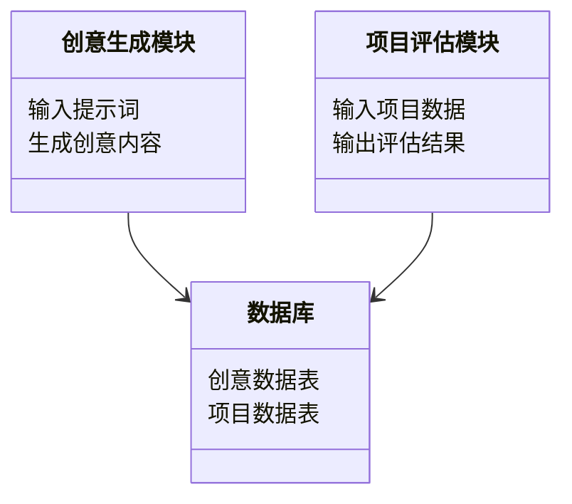

                 


# AI驱动的企业创新管理：从创意生成到项目评估

## 关键词：AI驱动，创新管理，创意生成，项目评估，企业创新，人工智能

## 摘要：  
本文系统地探讨了AI如何驱动企业创新管理的变革，从创意生成到项目评估的完整流程。通过分析AI技术在创新管理中的应用，提出了结合NLP和机器学习的创新管理模式，构建了创意生成和项目评估的AI模型，并通过实际案例展示了系统的实现与优化方法。本文旨在为企业管理者和技术人员提供一套基于AI的创新管理解决方案，助力企业实现更高效、更精准的创新管理。

---

## 第一部分: AI驱动的企业创新管理基础

### 第1章: AI驱动创新管理的核心概念

#### 1.1 企业创新管理的背景与挑战

企业创新管理是企业在竞争激烈的市场环境中保持活力和持续发展的关键。传统的创新管理依赖于人类的创造力和经验判断，但随着市场环境的复杂化和数据的爆炸式增长，传统方法逐渐暴露出效率低、主观性强、难以量化等局限性。

**问题背景：**  
- 创意生成过程缺乏系统性和多样性，难以覆盖所有可能的创新方向。  
- 项目评估过程主观性强，缺乏数据支持，难以确保评估结果的客观性和准确性。  
- 创新管理的复杂性要求企业需要一种更高效、更智能化的管理方式。  

**问题解决：**  
通过引入AI技术，企业可以实现创意生成的自动化和多样化，同时利用数据驱动的方法进行项目评估，从而提高创新管理的效率和准确性。  

**边界与外延：**  
- 创意生成的边界：从初步创意到具体可行的方案。  
- 项目评估的外延：从定量分析到定性判断的结合。  

**概念结构与核心要素：**  
- 创意生成：数据准备、模型选择、生成过程、结果评估。  
- 项目评估：数据采集、模型训练、评估指标、结果分析。  

---

#### 1.2 AI驱动创新管理的定义与特点

**核心概念：**  
AI驱动的创新管理是一种基于人工智能技术的企业创新管理模式，通过算法和数据分析，实现创意生成和项目评估的自动化和智能化。  

**特点：**  
- **数据驱动：** 利用企业内外部数据，支持决策过程。  
- **智能化：** 通过AI算法，实现创意生成和评估的自动化。  
- **高效性：** 提高创新管理的效率，降低人工成本。  
- **可扩展性：** 支持大规模数据处理和多场景应用。  

**与传统创新管理的区别：**  
| **维度**       | **传统创新管理**         | **AI驱动创新管理**         |  
|------------------|--------------------------|-----------------------------|  
| **效率**         | 较低，依赖人工经验       | 较高，自动化处理            |  
| **数据支持**     | 有限，依赖主观判断       | 充分，基于大数据分析        |  
| **结果准确性**   | 受主观因素影响较大       | 更客观，基于数据驱动        |  

---

## 第二部分: 创意生成的AI实现与优化

### 第2章: 创意生成的AI模型

#### 2.1 创意生成模型的分类

**模型分类：**  
1. **基于NLP的创意生成模型**：利用自然语言处理技术生成创意文本。  
2. **基于机器学习的生成模型**：通过训练数据生成创意内容。  
3. **混合模型**：结合NLP和机器学习的技术，提升生成效果。  

#### 2.2 创意生成模型的实现步骤

**背景介绍：**  
创意生成模型的实现需要经过数据准备、模型选择和训练、生成与优化三个阶段。  

**算法流程：**  
1. 数据准备：收集相关领域的创意文本数据。  
2. 模型选择：选择适合的生成模型（如GPT）。  
3. 模型训练：利用训练数据优化模型参数。  
4. 创意生成：通过输入提示词生成创意内容。  
5. 结果优化：对生成结果进行多样性优化和质量评估。  

**数学模型：**  
创意生成模型的训练目标是最小化生成文本与真实数据的差异，常用交叉熵损失函数：  
$$ \text{Loss} = -\frac{1}{N}\sum_{i=1}^{N}\sum_{t=1}^{T} \log p(\text{y}_t|\text{y}_{<t}) $$  

---

#### 2.3 创意生成的案例分析

**案例一：科技领域的创意生成**  
利用GPT模型生成技术创新点，如“基于AI的智能客服系统优化方案”。  

**案例二：市场营销领域的创意生成**  
生成营销策略创意，如“社交媒体互动活动策划”。  

---

## 第三部分: 项目评估的AI实现与优化

### 第3章: 项目评估的AI模型

#### 3.1 项目评估模型的分类

**模型分类：**  
1. **基于机器学习的评估模型**：通过特征工程和模型训练进行评估。  
2. **基于规则的评估模型**：根据预设规则进行评估。  
3. **混合模型**：结合机器学习和规则的评估方法。  

#### 3.2 项目评估模型的实现步骤

**背景介绍：**  
项目评估模型的实现包括数据采集、特征提取、模型训练和结果分析四个阶段。  

**算法流程：**  
1. 数据采集：收集项目的相关数据，如成本、时间、团队能力等。  
2. 特征提取：提取关键特征，如项目复杂度、团队经验等。  
3. 模型训练：利用训练数据优化评估模型参数。  
4. 结果分析：对模型输出进行解释和验证。  

**数学模型：**  
项目评估模型的目标是最小化预测误差，常用均方误差损失函数：  
$$ \text{Loss} = \frac{1}{N}\sum_{i=1}^{N}(y_i - \hat{y}_i)^2 $$  

---

#### 3.3 项目评估的案例分析

**案例一：科技领域的项目评估**  
评估一个AI算法开发项目的可行性，输出评估结果：高潜力、可行性强。  

**案例二：市场营销领域的项目评估**  
评估一个数字营销活动的预期 ROI，输出评估结果： ROI为15%。  

---

## 第四部分: 系统架构与设计

### 第4章: 系统架构与设计

#### 4.1 系统功能设计

**领域模型：**  


#### 4.2 系统架构设计

```mermaid
archi
title 系统架构图
partition 框架 {
    service 创意生成服务
    service 项目评估服务
}
partition 数据层 {
    database 数据库
}
partition 前端 {
    client 界面
}
创意生成服务 --> 数据库
项目评估服务 --> 数据库
client --> 创意生成服务
client --> 项目评估服务
```

#### 4.3 系统接口设计

**接口描述：**  
- 创意生成接口：  
  ```plaintext
  POST /api/generate-ideas  
  {  
    "prompt": "输入提示词"  
  }  
  ```  
- 项目评估接口：  
  ```plaintext
  POST /api/assess-project  
  {  
    "project_data": {  
      "name": "项目名称",  
      "features": ["特征1", "特征2"]  
    }  
  }  
  ```

---

## 第五部分: 项目实战

### 第5章: 项目实战

#### 5.1 环境安装与配置

**Python环境安装：**  
```bash
python -m pip install --upgrade pip
pip install numpy
pip install transformers
pip install scikit-learn
```

#### 5.2 创意生成模块实现

```python
from transformers import AutoTokenizer, AutoModelForCausalLM
import torch

model_name = "gpt2"
tokenizer = AutoTokenizer.from_pretrained(model_name)
model = AutoModelForCausalLM.from_pretrained(model_name)

def generate_ideas(prompt, max_length=50):
    inputs = tokenizer.encode(prompt, return_tensors="pt")
    outputs = model.generate(inputs, max_length=max_length, do_sample=True)
    ideas = tokenizer.decode(outputs[0], skip_special_tokens=True)
    return ideas.split("\n")
```

#### 5.3 项目评估模块实现

```python
from sklearn.metrics import mean_squared_error
import numpy as np

def evaluate_projects(real_values, predicted_values):
    mse = mean_squared_error(real_values, predicted_values)
    rmse = np.sqrt(mse)
    return rmse
```

---

## 第六部分: 总结与展望

### 第6章: 总结与展望

**总结：**  
本文详细探讨了AI驱动的企业创新管理，从创意生成到项目评估的完整流程。通过结合NLP和机器学习技术，提出了创新的管理模式，并通过实际案例展示了系统的实现与优化方法。  

**展望：**  
未来，随着AI技术的不断发展，企业创新管理将更加智能化和数据化。AI驱动的创新管理将在更多领域得到应用，为企业创造更大的价值。  

**最佳实践 tips：**  
- 在实际应用中，建议企业结合自身特点选择合适的AI模型。  
- 数据准备阶段要确保数据的高质量和代表性。  
- 在项目评估中，要注重模型的可解释性和结果的验证。  

---

通过以上步骤，您可以系统地理解并实现基于AI的企业创新管理，从创意生成到项目评估的完整流程。

