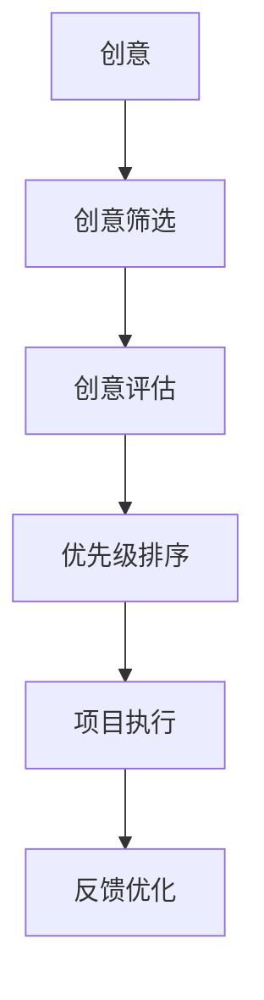
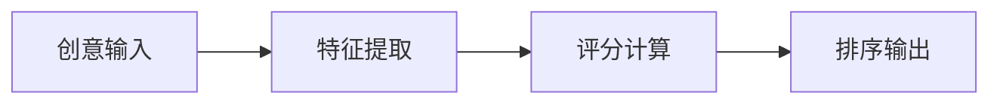
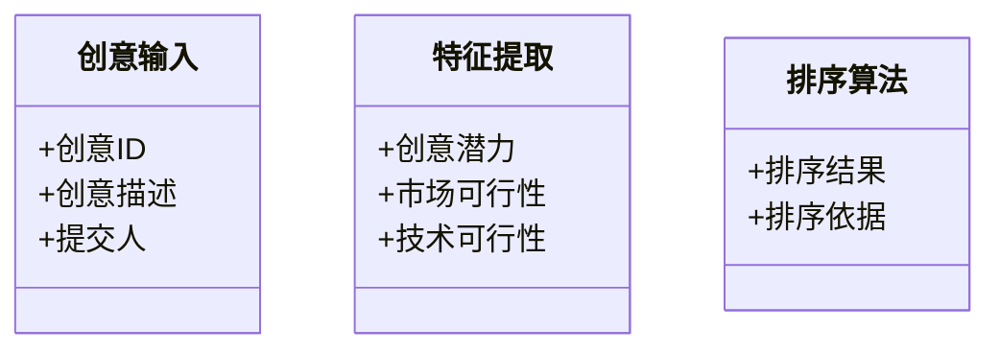
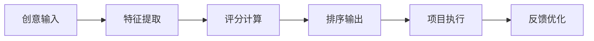

                 


# AI驱动的企业创新管理：从创意筛选到商业化全流程智能化

## 关键词：
AI驱动，企业创新管理，创意筛选，商业化，全流程智能化，算法原理，系统架构

## 摘要：
随着人工智能技术的迅速发展，企业创新管理正在经历一场数字化转型。AI驱动的企业创新管理通过智能化的创意筛选、评估和优先级排序，显著提高了创新效率和成功率。本文将详细探讨从创意筛选到商业化全流程的智能化过程，涵盖AI算法原理、系统架构设计、项目实战案例以及最佳实践。

---

# 第1章: AI驱动的企业创新管理背景

## 1.1 AI驱动的创新管理概念

### 1.1.1 传统企业创新管理的挑战

传统的企业创新管理依赖于人工经验，存在效率低、主观性强、难以量化等问题。创意筛选、评估和优先级排序过程耗时且缺乏系统性，难以满足现代企业快速发展的需求。

### 1.1.2 AI在企业创新管理中的作用

AI通过数据驱动的方法，提供智能化的创意筛选、评估和优先级排序工具，显著提高了创新管理的效率和准确性。AI还可以实时分析市场趋势和内部资源，帮助企业在竞争中占据优势。

### 1.1.3 创新管理的数字化转型

AI驱动的创新管理是企业数字化转型的重要组成部分，通过智能化工具优化创新流程，降低创新成本，提高创新成功的概率。

## 1.2 AI驱动创新管理的核心要素

### 1.2.1 数据驱动的决策支持

AI通过分析历史数据和实时信息，提供数据支持的决策，帮助企业在创新过程中做出更明智的选择。

### 1.2.2 智能化创意筛选机制

AI能够快速筛选出具有潜力的创意，避免了传统方法中的人为主观性，提高了筛选的效率和准确性。

### 1.2.3 商业化过程的智能化支持

AI不仅在创意阶段发挥作用，还贯穿整个商业化过程，从市场分析到项目执行，提供全方位的智能化支持。

## 1.3 本章小结

本章介绍了AI驱动的企业创新管理的背景、核心概念和作用，为后续章节奠定了基础。

---

# 第2章: AI驱动创新管理的核心概念与联系

## 2.1 AI驱动创新管理的模型

### 2.1.1 模型的核心概念

AI驱动创新管理模型包括创意输入、特征提取、评分计算、排序输出等核心概念。

### 2.1.2 模型的属性特征对比

通过对比不同模型的属性特征，选择最适合企业需求的模型。

## 2.2 实体关系图



## 2.3 本章小结

本章通过模型和实体关系图，展示了AI驱动创新管理的系统结构和各部分之间的联系。

---

# 第3章: 创意筛选的AI算法原理

## 3.1 创意筛选的排序算法

### 3.1.1 基于AI的排序模型

AI通过排序算法对创意进行排序，帮助企业筛选出最具潜力的创意。



### 3.1.2 排序算法实现

使用Python代码实现排序算法：

```python
import numpy as np
from sklearn.metrics.pairwise import sigmoid_kernel

def ai_sorting_algorithm(creative_features):
    scores = sigmoid_kernel(creative_features, creative_features).diagonal()
    sorted_creatives = np.argsort(-scores)
    return sorted_creatives
```

## 3.2 数学模型与公式

### 3.2.1 排序模型的数学表达

$$ \text{排序损失函数} = \sum_{i=1}^{n} \log(1 + \exp(-y_i w^T x_i)) $$

### 3.2.2 优化目标

$$ \text{优化目标} = \min_{w} \sum_{i=1}^{n} \log(1 + \exp(-y_i w^T x_i)) + \lambda \|w\|^2 $$

## 3.3 本章小结

本章详细介绍了创意筛选的AI算法原理，包括排序模型和数学公式。

---

# 第4章: 创意评估与优先级排序的系统架构

## 4.1 系统功能设计

### 4.1.1 领域模型



## 4.2 系统架构设计



## 4.3 本章小结

本章通过系统架构设计，展示了AI驱动创新管理的实现方式。

---

# 第5章: 创意筛选与评估的项目实战

## 5.1 项目背景与目标

### 5.1.1 项目背景

介绍项目的背景和目标，例如如何通过AI优化创意筛选过程。

## 5.2 系统核心代码实现

### 5.2.1 环境安装

安装必要的Python库，例如scikit-learn、numpy等。

### 5.2.2 核心代码实现

```python
from sklearn.metrics.pairwise import sigmoid_kernel
import numpy as np

def creative_sorting(creatives):
    # 提取特征
    creative_features = creatives[['feature1', 'feature2', 'feature3']]
    # 计算相似性
    similarity_scores = sigmoid_kernel(creative_features.values, creative_features.values)
    # 生成排序结果
    sorted_indices = np.argsort(-similarity_scores.diagonal())
    return sorted_indices
```

### 5.2.3 代码功能解读

解读代码的功能，包括特征提取、相似性计算和排序输出。

## 5.3 项目案例分析

### 5.3.1 案例背景

介绍案例的背景和目标。

### 5.3.2 案例分析

详细分析案例的实施过程和结果。

## 5.4 项目小结

总结项目的成果和经验，为后续章节提供参考。

---

# 第6章: AI驱动创新管理的最佳实践

## 6.1 数据质量的重要性

强调数据质量对企业创新管理的影响。

## 6.2 模型选择与优化

讨论不同模型的选择和优化策略。

## 6.3 持续优化与反馈

介绍如何通过反馈机制优化创新管理过程。

## 6.4 本章小结

总结最佳实践，为读者提供实用的建议。

---

# 第7章: 总结与未来展望

## 7.1 全书总结

总结全书的核心内容和主要观点。

## 7.2 未来展望

展望AI在企业创新管理中的未来发展方向。

---

# 附录: AI驱动创新管理的资源与工具

## 附录A: 常用工具列表

列出常用的AI工具和资源。

## 附录B: 代码库与框架

介绍常用的代码库和框架，如scikit-learn、TensorFlow等。

---

通过以上目录结构，我们可以系统地探讨AI驱动的企业创新管理从创意筛选到商业化全流程的智能化过程，为企业的创新管理提供理论和实践指导。

