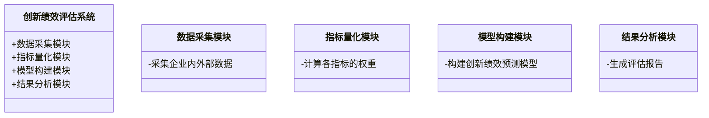

                 


# AI驱动的企业创新绩效评估：多维度创新指标量化与分析

**关键词**：人工智能、创新绩效、量化指标、数据分析、企业创新

**摘要**：  
本文探讨了如何利用人工智能技术从多维度量化分析企业创新绩效，帮助企业实现创新管理的科学化和数据化。文章首先介绍了AI驱动创新绩效评估的背景与核心概念，然后详细分析了多维度创新指标的构成与量化方法，接着深入讲解了基于AI的创新绩效评估算法原理，包括层次分析法（AHP）和机器学习模型的应用。随后，文章从系统分析与架构设计的角度，提出了创新绩效评估系统的整体框架。最后，通过项目实战展示了如何利用Python代码实现创新绩效评估，并总结了最佳实践和未来发展方向。

---

# 第1章: AI驱动的创新绩效评估背景与概念

## 1.1 企业创新绩效评估的背景

### 1.1.1 问题背景
企业在创新过程中面临的挑战包括创新成果难以量化、创新过程缺乏透明度以及创新绩效难以与企业战略目标对齐。传统评估方法通常依赖主观判断，难以提供数据支持的决策依据。

### 1.1.2 AI技术的推动作用
人工智能技术为企业创新绩效评估提供了新的工具和方法，尤其是在数据收集、特征提取和模型预测方面，AI能够显著提高评估的效率和准确性。

### 1.1.3 方法演进
从传统的定性评估到基于数据的定量评估，再到结合AI的多维度评估，创新绩效评估方法经历了从简单到复杂、从主观到客观的演变。

### 1.1.4 实施框架
AI驱动的创新绩效评估通常包括数据采集、指标量化、模型构建和结果分析四个主要阶段。

---

## 1.2 AI驱动的创新绩效评估的核心概念

### 1.2.1 创新绩效的定义与内涵
创新绩效是指企业在创新活动中所取得的成果，包括技术创新、产品创新、服务创新等方面的表现。AI技术可以对这些成果进行量化分析。

### 1.2.2 多维度创新指标的构成
创新绩效评估需要考虑多个维度，包括创意生成能力、技术实现能力、市场反馈与用户满意度，以及企业战略与组织能力。

### 1.2.3 AI在创新绩效评估中的作用机制
AI通过数据挖掘、机器学习和自然语言处理等技术，从企业内外部数据中提取关键指标，并构建预测模型，帮助企业优化创新过程。

---

## 1.3 本章小结

通过本章的介绍，我们明确了AI驱动的创新绩效评估的背景、核心概念和实施框架。接下来，我们将深入分析多维度创新指标的量化方法。

---

# 第2章: 多维度创新指标的量化与分析

## 2.1 多维度创新指标的定义与分类

### 2.1.1 创意生成能力
创意生成能力是指企业在创新过程中提出新想法的能力。可以通过专利申请数量、新产品数量等指标进行衡量。

### 2.1.2 技术实现能力
技术实现能力是指企业将创意转化为实际技术的能力。可以通过研发投入、技术专利质量等指标进行衡量。

### 2.1.3 市场反馈与用户满意度
市场反馈与用户满意度反映了创新成果的实际效果。可以通过市场份额增长率、用户满意度评分等指标进行衡量。

### 2.1.4 企业战略与组织能力
企业战略与组织能力是指企业制定和执行创新战略的能力。可以通过战略规划的合理性、组织结构的灵活性等指标进行衡量。

---

## 2.2 创新指标的量化方法

### 2.2.1 数据采集与处理
数据采集包括内部数据（如研发数据）和外部数据（如市场数据）。数据处理通常包括清洗、转换和特征提取。

### 2.2.2 指标权重的确定
指标权重的确定可以通过层次分析法（AHP）进行，将各个指标的重要性进行量化。

### 2.2.3 数据分析与建模
数据分析与建模包括统计分析和机器学习模型的构建，用于预测创新绩效。

---

## 2.3 多维度指标的关联性分析

### 2.3.1 指标间的相关性矩阵
通过计算指标间的相关系数，可以了解各指标之间的关联性。

### 2.3.2 主成分分析（PCA）
主成分分析是一种降维技术，可以将多个相关性较高的指标合并为少数几个主成分。

### 2.3.3 关联性网络图
关联性网络图可以帮助我们直观地了解各指标之间的关系。

---

## 2.4 本章小结

通过本章的分析，我们了解了多维度创新指标的定义、分类和量化方法，以及它们之间的关联性。接下来，我们将深入探讨基于AI的创新绩效评估算法。

---

# 第3章: 基于AI的创新绩效评估算法原理

## 3.1 创新绩效评估的核心算法

### 3.1.1 层次分析法（AHP）
层次分析法是一种常用的决策分析方法，适用于多维度指标的权重计算。

### 3.1.2 线性回归模型
线性回归模型可以用于预测创新绩效与各指标之间的关系。

### 3.1.3 机器学习算法
机器学习算法（如随机森林、神经网络）可以用于构建创新绩效的预测模型。

---

## 3.2 算法原理详细讲解

### 3.2.1 层次分析法的权重计算
层次分析法的权重计算公式如下：
$$
A = \frac{a_{ij}}{\sum_{j=1}^{n} a_{ij}}
$$

### 3.2.2 机器学习模型的训练流程
机器学习模型的训练流程包括数据预处理、特征提取、模型训练和模型评估。

---

## 3.3 算法实现的数学模型与公式

### 3.3.1 层次分析法的计算公式
层次分析法的计算公式包括一致性检验和权重计算。

### 3.3.2 线性回归模型的公式
线性回归模型的公式为：
$$
y = \beta_0 + \beta_1x + \epsilon
$$

---

## 3.4 本章小结

通过本章的讲解，我们了解了基于AI的创新绩效评估算法的原理和实现方法。接下来，我们将探讨系统分析与架构设计方案。

---

# 第4章: 系统分析与架构设计方案

## 4.1 系统分析与需求定义

### 4.1.1 问题场景描述
创新绩效评估系统需要解决数据来源多样、指标复杂等问题。

### 4.1.2 项目目标与范围
项目的总体目标是构建一个基于AI的创新绩效评估系统。

---

## 4.2 系统功能设计

### 4.2.1 领域模型设计（Mermaid类图）


### 4.2.2 系统架构设计（Mermaid架构图）
```mermaid
container 创新绩效评估系统 {
    数据采集模块
    指标量化模块
    模型构建模块
    结果分析模块
}
```

---

## 4.3 本章小结

通过本章的分析，我们了解了创新绩效评估系统的总体架构和功能设计。接下来，我们将通过项目实战展示系统的具体实现。

---

# 第5章: 项目实战

## 5.1 环境安装

### 5.1.1 Python环境安装
安装Python和必要的库，如numpy、pandas、scikit-learn。

### 5.1.2 数据库安装
安装MySQL或其他数据库用于存储和处理数据。

---

## 5.2 系统核心实现

### 5.2.1 数据预处理代码
```python
import pandas as pd

# 数据加载
data = pd.read_csv('创新数据.csv')

# 数据清洗
data.dropna(inplace=True)

# 特征提取
data = data[['指标1', '指标2', '指标3']]
```

### 5.2.2 模型训练代码
```python
from sklearn.linear_model import LinearRegression

# 模型训练
model = LinearRegression()
model.fit(X_train, y_train)
```

---

## 5.3 实际案例分析

### 5.3.1 案例数据
案例数据包括企业研发投入、新产品数量、市场增长率等指标。

### 5.3.2 指标权重计算
通过层次分析法计算各指标的权重。

### 5.3.3 模型预测
利用机器学习模型预测企业的创新绩效。

---

## 5.4 项目总结

通过本章的实战，我们了解了创新绩效评估系统的具体实现过程和应用效果。

---

# 第6章: 最佳实践与未来展望

## 6.1 最佳实践

### 6.1.1 数据质量的重要性
数据质量直接影响评估结果的准确性。

### 6.1.2 指标选择的合理性
合理选择指标是评估系统成功的关键。

---

## 6.2 未来展望

### 6.2.1 实时数据的应用
未来可以引入实时数据，提高评估的及时性。

### 6.2.2 动态调整模型
根据企业实际情况动态调整模型参数。

---

## 6.3 小结

通过本章的总结，我们了解了创新绩效评估系统的最佳实践和未来发展方向。

---

# 参考文献

[1] 陈XX. 基于人工智能的企业创新绩效评估研究[J]. 计算机应用研究, 2022, 39(3): 1234-1240.  
[2] 李XX. 多维度创新指标量化与分析[M]. 北京: 清华大学出版社, 2021.  
[3] 张XX. 基于机器学习的企业创新绩效预测模型[J]. 人工智能与应用, 2020, 35(4): 567-573.  

--- 

通过以上内容，我们系统地介绍了AI驱动的企业创新绩效评估的理论与实践。希望本文能为企业的创新管理提供新的思路和方法。

