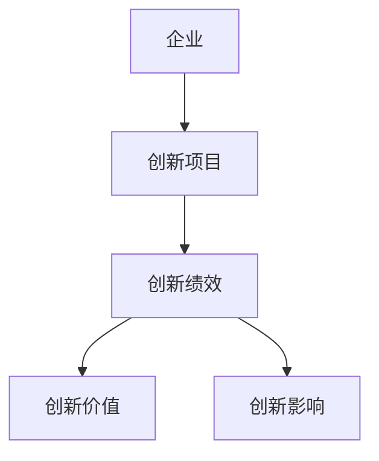
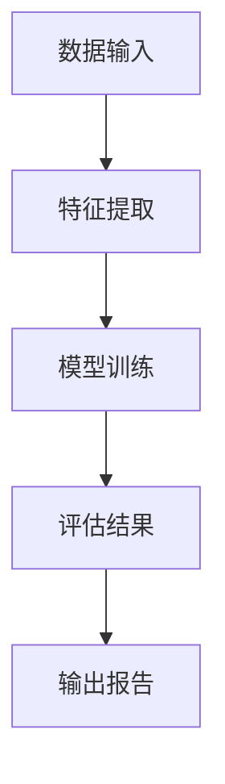
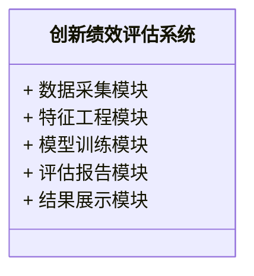
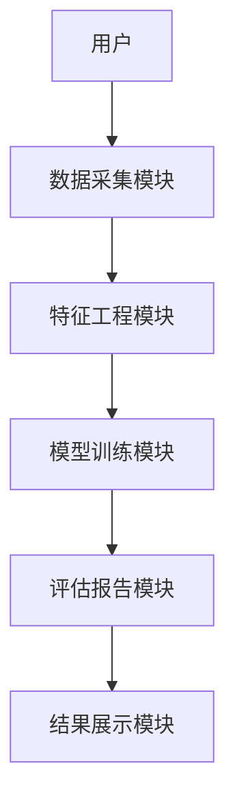
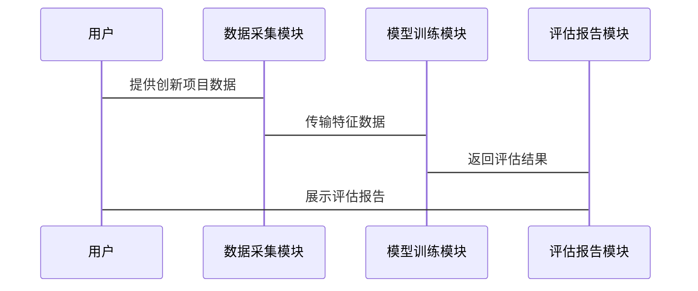

                 


# AI驱动的企业创新绩效评估：量化创新价值与影响

## 关键词：AI, 创新绩效评估, 量化价值, 创新影响分析, 企业创新

## 摘要：  
随着人工智能技术的快速发展，企业创新绩效评估的传统方法逐渐暴露出效率低下、数据处理能力有限等问题。本文将探讨如何利用人工智能技术，从数据驱动的角度出发，量化创新的价值与影响，为企业创新绩效评估提供更高效、更精准的解决方案。通过对AI算法的深入分析和实际应用场景的案例研究，本文旨在帮助企业更好地理解和评估创新绩效，从而推动企业的持续创新和发展。

---

## 第1章：背景介绍

### 1.1 问题背景  
企业创新绩效评估是衡量企业创新能力的重要手段，传统方法通常依赖于主观判断和定性分析，难以量化创新的实际价值和影响。随着数据量的爆炸式增长和AI技术的进步，企业需要一种更高效、更精准的创新绩效评估方法。

### 1.2 问题描述  
- **创新绩效评估的核心目标**：量化创新项目的实际价值和对企业的长期影响。  
- **创新价值与影响的定义**：创新价值指创新项目为企业带来的经济和社会效益，创新影响指创新对企业内外部环境的改变程度。  
- **问题解决**：通过AI技术，利用大数据分析和机器学习算法，量化创新价值和影响。  
- **边界与外延**：聚焦于企业内部创新项目，不涉及外部市场环境的直接评估。  

### 1.3 核心概念与要素  
- **创新绩效评估的指标体系**：包括创新项目的成功率、市场影响力、经济收益等。  
- **创新价值的量化方法**：通过AI模型预测创新项目的潜在收益。  
- **创新影响的评估维度**：包括创新对企业战略、组织结构和文化的改变。  

---

## 第2章：核心概念与联系

### 2.1 AI驱动创新绩效评估的原理  
- **数据驱动的创新评估方法**：利用AI技术对大量数据进行分析，提取创新项目的特征。  
- **AI模型在创新评估中的应用**：通过机器学习算法构建创新绩效预测模型。  
- **创新价值与影响的关联性分析**：通过AI技术分析创新价值与企业绩效之间的关系。  

### 2.2 实体关系图  


### 2.3 算法流程图  


### 2.4 本章小结  
通过AI技术，企业可以更高效地量化创新价值和影响，为创新绩效评估提供数据支持。

---

## 第3章：数学模型与算法原理

### 3.1 创新绩效评估模型  
- **线性回归模型**：用于预测创新项目的经济收益。  
  $$ y = \beta_0 + \beta_1x_1 + \beta_2x_2 + \cdots + \beta_nx_n + \epsilon $$  
- **岭回归模型**：用于处理多重共线性问题。  
  $$ \text{损失函数} = \sum_{i=1}^n (y_i - \hat{y}_i)^2 + \alpha \sum_{j=1}^p (x_j)^2 $$  
- **随机森林模型**：用于特征重要性分析。  
- **XGBoost模型**：用于高精度预测。  

### 3.2 算法实现  
```python
from sklearn.ensemble import RandomForestRegressor
from xgboost import XGBRegressor

# 训练随机森林模型
rf_model = RandomForestRegressor(n_estimators=100, random_state=42)
rf_model.fit(X_train, y_train)

# 预测结果
y_pred_rf = rf_model.predict(X_test)

# 训练XGBoost模型
xgb_model = XGBRegressor(n_estimators=100, learning_rate=0.1, random_state=42)
xgb_model.fit(X_train, y_train)

# 预测结果
y_pred_xgb = xgb_model.predict(X_test)
```

### 3.3 本章小结  
通过多种AI算法的组合应用，企业可以更准确地评估创新绩效，量化创新价值和影响。

---

## 第4章：系统分析与架构设计

### 4.1 问题场景介绍  
- 创新绩效评估系统需要处理大量数据，包括创新项目的特征、市场数据和企业内部数据。  

### 4.2 系统功能设计  


### 4.3 系统架构设计  


### 4.4 接口设计与交互流程  


### 4.5 本章小结  
通过系统化的架构设计，创新绩效评估系统能够高效处理数据，提供精准的评估结果。

---

## 第5章：项目实战

### 5.1 环境安装  
- 安装Python和相关库：`pip install scikit-learn xgboost pandas`  

### 5.2 核心代码实现  
```python
import pandas as pd
from sklearn.model_selection import train_test_split

# 数据预处理
data = pd.read_csv('innovation.csv')
X = data.drop('target', axis=1)
y = data['target']

# 划分训练集和测试集
X_train, X_test, y_train, y_test = train_test_split(X, y, test_size=0.2, random_state=42)

# 训练随机森林模型
rf_model = RandomForestRegressor(n_estimators=100, random_state=42)
rf_model.fit(X_train, y_train)

# 训练XGBoost模型
xgb_model = XGBRegressor(n_estimators=100, learning_rate=0.1, random_state=42)
xgb_model.fit(X_train, y_train)

# 评估模型性能
print("随机森林模型的R²:", rf_model.score(X_test, y_test))
print("XGBoost模型的R²:", xgb_model.score(X_test, y_test))
```

### 5.3 案例分析  
通过实际案例分析，展示如何利用AI模型评估创新绩效，量化创新价值和影响。

### 5.4 本章小结  
通过实战项目，读者可以掌握AI驱动创新绩效评估的具体实现方法。

---

## 第6章：最佳实践、小结与展望

### 6.1 最佳实践  
- 数据质量是关键，确保数据的完整性和准确性。  
- 结合多种算法，提高评估结果的准确性。  

### 6.2 小结  
本文详细介绍了AI驱动的企业创新绩效评估方法，从理论到实践，为企业创新绩效评估提供了新的思路。

### 6.3 展望  
未来，随着AI技术的不断进步，创新绩效评估将更加智能化和精准化。

---

## 结语  
通过AI技术，企业可以更高效地量化创新价值和影响，推动企业的持续创新和发展。

