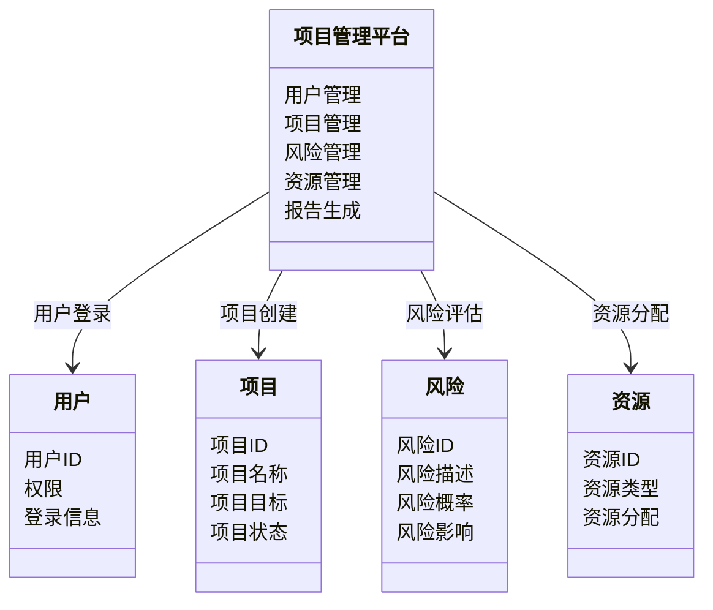
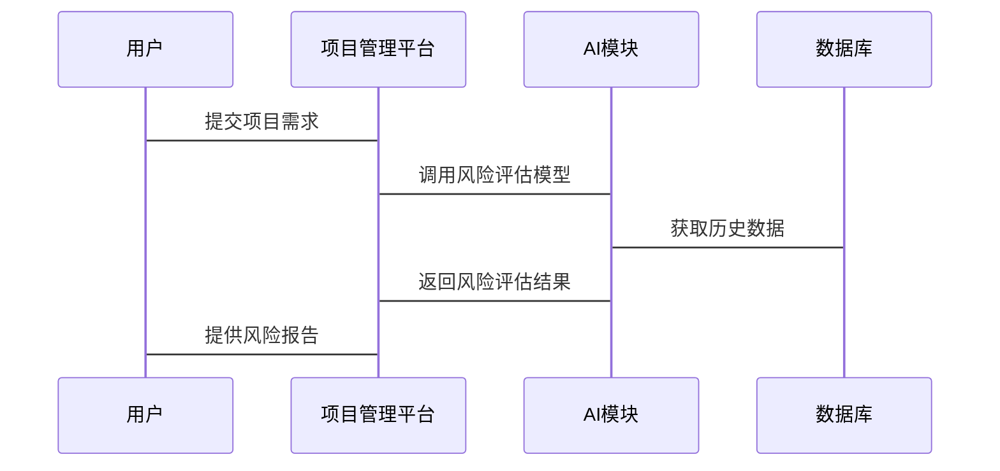

                 


# AI驱动的企业创新项目管理：从立项到商业化

## 关键词：AI驱动，企业创新，项目管理，商业落地，技术创新，风险管理

## 摘要：AI驱动的企业创新项目管理通过智能化工具和方法，从项目立项到商业化落地，优化了项目管理流程，提升了效率和成功率。本文详细探讨了AI在项目管理中的应用，包括算法原理、系统架构、项目实战和最佳实践，为企业创新项目管理提供了全面的解决方案。

---

## 第一部分: AI驱动的企业创新项目管理概述

### 第1章: AI驱动项目管理的核心概念

#### 1.1 项目管理的基本概念

##### 1.1.1 项目管理的定义与特点

项目管理是指在有限资源和时间内，为实现特定目标而进行的计划、组织、执行、监控和收尾的过程。其特点包括目标导向性、资源约束性、过程动态性和团队协作性。

##### 1.1.2 传统项目管理的局限性

传统项目管理依赖人工经验，存在效率低、风险高、反馈慢等问题。尤其是在复杂项目中，人工决策容易受到主观因素影响，难以覆盖所有可能情况。

##### 1.1.3 AI驱动项目管理的定义与优势

AI驱动项目管理是通过AI技术（如机器学习、自然语言处理）辅助项目管理的各个阶段，实现智能化决策和自动化执行。其优势包括提高效率、降低风险、增强预测能力、优化资源分配等。

#### 1.2 AI在企业创新中的作用

##### 1.2.1 AI技术对企业创新的推动

AI通过数据挖掘、模式识别和知识图谱等技术，帮助企业发现新的市场机会、优化创新流程、提升创新能力。

##### 1.2.2 AI在项目管理中的应用场景

AI可以应用于需求分析、风险预测、进度优化、资源分配、团队协作等多个方面。

##### 1.2.3 AI驱动项目管理的必要性

随着企业创新项目的复杂性和不确定性增加，传统方法难以应对，AI技术提供了更高效的解决方案。

#### 1.3 企业创新项目管理的流程

##### 1.3.1 项目立项阶段

包括需求分析、目标设定、可行性评估和资源规划。

##### 1.3.2 项目执行阶段

涉及任务分配、进度跟踪、风险管理等。

##### 1.3.3 项目监控与控制

通过实时数据和反馈优化项目执行。

##### 1.3.4 项目收尾与总结

包括成果评估、经验总结和资源释放。

---

## 第二部分: AI驱动项目管理的核心理论与方法

### 第2章: AI驱动项目管理的核心理论

#### 2.1 项目管理的AI驱动模型

##### 2.1.1 模型的构成与核心要素

AI驱动模型包括数据输入、模型训练、决策支持和执行反馈四个部分。

##### 2.1.2 AI在模型中的作用

AI用于数据处理、模型训练和决策支持，帮助项目管理者做出更优决策。

##### 2.1.3 模型的优缺点分析

优点是高效、精准；缺点是依赖数据质量和模型训练时间。

#### 2.2 AI驱动项目管理的关键技术

##### 2.2.1 机器学习在项目预测中的应用

用于预测项目进度、成本和风险。

##### 2.2.2 自然语言处理在项目文档管理中的应用

用于自动分类、摘要和检索。

##### 2.2.3 数据挖掘在项目风险控制中的应用

通过数据挖掘发现潜在风险因素。

#### 2.3 AI驱动项目管理的方法论

##### 2.3.1 数据驱动的项目管理方法

以数据为基础，结合AI技术进行决策。

##### 2.3.2 智能化项目管理流程

实现项目管理的自动化和智能化。

##### 2.3.3 AI辅助决策的策略

通过AI提供多种方案，辅助项目管理者做出决策。

#### 2.4 核心概念对比表

| 对比维度 | 传统项目管理 | AI驱动项目管理 |
|----------|--------------|----------------|
| 决策依据 | 人工经验       | 数据驱动       |
| 执行效率 | 较低          | 较高           |
| 风险控制 | 事后处理      | 事前预警       |

#### 2.5 本章小结

---

## 第三部分: AI驱动项目管理的算法与数学模型

### 第3章: AI驱动项目管理的算法原理

#### 3.1 项目预测算法

##### 3.1.1 监督学习算法

- **线性回归**：用于预测项目成本或时间。
- **决策树**：用于分类项目风险。

##### 3.1.2 非监督学习算法

- **聚类分析**：用于将项目数据分组。

##### 3.1.3 强化学习算法

- **Q-Learning**：用于优化项目执行策略。

#### 3.2 项目风险评估算法

##### 3.2.1 风险预测模型

- 使用随机森林算法预测项目风险。

##### 3.2.2 风险评估指标

- 包括概率、影响和优先级。

##### 3.2.3 风险缓解策略

- 根据AI模型建议的风险缓解措施。

#### 3.3 项目进度优化算法

##### 3.3.1 基于遗传算法的优化

- 使用遗传算法优化项目进度安排。

##### 3.3.2 基于模拟退火的优化

- 使用模拟退火算法优化项目资源分配。

---

## 第四部分: AI驱动项目管理的系统架构与设计

### 第4章: 系统分析与架构设计方案

#### 4.1 问题场景介绍

企业创新项目管理需要高效、智能的工具支持。

#### 4.2 项目介绍

设计一个基于AI的项目管理平台，涵盖立项、执行、监控和收尾阶段。

#### 4.3 系统功能设计（领域模型）



#### 4.4 系统架构设计


#### 4.5 系统接口设计

- 用户接口：提供项目创建、进度跟踪等功能。
- AI接口：提供风险预测、进度优化等服务。

#### 4.6 系统交互设计



---

## 第五部分: AI驱动项目管理的项目实战

### 第5章: 项目实战

#### 5.1 环境安装

- **Python环境**：安装Python 3.8+
- **依赖库**：安装numpy、pandas、scikit-learn、tensorflow等。

#### 5.2 核心代码实现

##### 5.2.1 风险预测模型

```python
import pandas as pd
from sklearn.ensemble import RandomForestClassifier

# 加载数据
data = pd.read_csv('project_risk.csv')

# 分离特征和目标
X = data.drop('risk', axis=1)
y = data['risk']

# 训练模型
model = RandomForestClassifier()
model.fit(X, y)

# 预测
new_project = pd.DataFrame({'feature1': [value1], 'feature2': [value2]})
prediction = model.predict(new_project)
print(prediction)
```

##### 5.2.2 项目进度优化算法

```python
import numpy as np
from sklearn.metrics import mean_squared_error

# 定义遗传算法
def genetic_algorithm(X, y):
    # 初始化种群
    population = np.random.rand(10, len(X[0]))
    
    # 适应度函数
    def fitness(individual):
        # 训练模型并预测
        model = LinearRegression()
        model.fit(X, y)
        y_pred = model.predict(individual.reshape(-1, 1))
        return -mean_squared_error(y, y_pred)
    
    # 迭代优化
    for _ in range(100):
        # 计算适应度
        fitness_list = [fitness(individual) for individual in population]
        # 选择适应度高的个体
        selected = population[np.argsort(fitness_list)][:5]
        # 交叉重组
        new_population = selected.reshape(5, -1)
    return new_population[0]

# 应用遗传算法优化项目进度
X = np.array([[1,2,3], [4,5,6]])
y = np.array([10, 20])
optimal_schedule = genetic_algorithm(X, y)
print(optimal_schedule)
```

#### 5.3 案例分析与详细解读

分析一个实际项目，展示AI驱动项目管理如何优化项目进度、降低成本、降低风险。

#### 5.4 项目小结

---

## 第六部分: 最佳实践、小结、注意事项、拓展阅读

### 第6章: 最佳实践与总结

#### 6.1 最佳实践

- 数据质量是关键。
- 结合业务场景选择合适的AI技术。
- 定期更新模型以适应变化。

#### 6.2 小结

本文详细探讨了AI驱动的企业创新项目管理，从理论到实践，展示了如何利用AI技术优化项目管理流程。

#### 6.3 注意事项

- 数据隐私和安全问题需重视。
- 需要专业团队进行模型开发和维护。
- 模型的可解释性和透明性需考虑。

#### 6.4 拓展阅读

建议阅读相关书籍和论文，关注AI与项目管理的最新研究进展。

---

## 结语

AI驱动的企业创新项目管理是一个充满潜力的领域，通过智能化工具和方法，企业可以更高效地进行项目管理，从立项到商业化，全面提升项目成功率。希望本文能为企业和项目管理者提供有价值的参考和启示。

