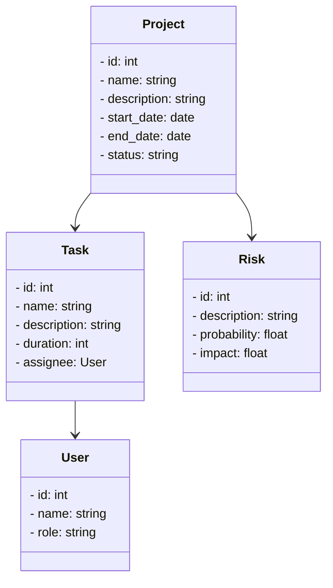
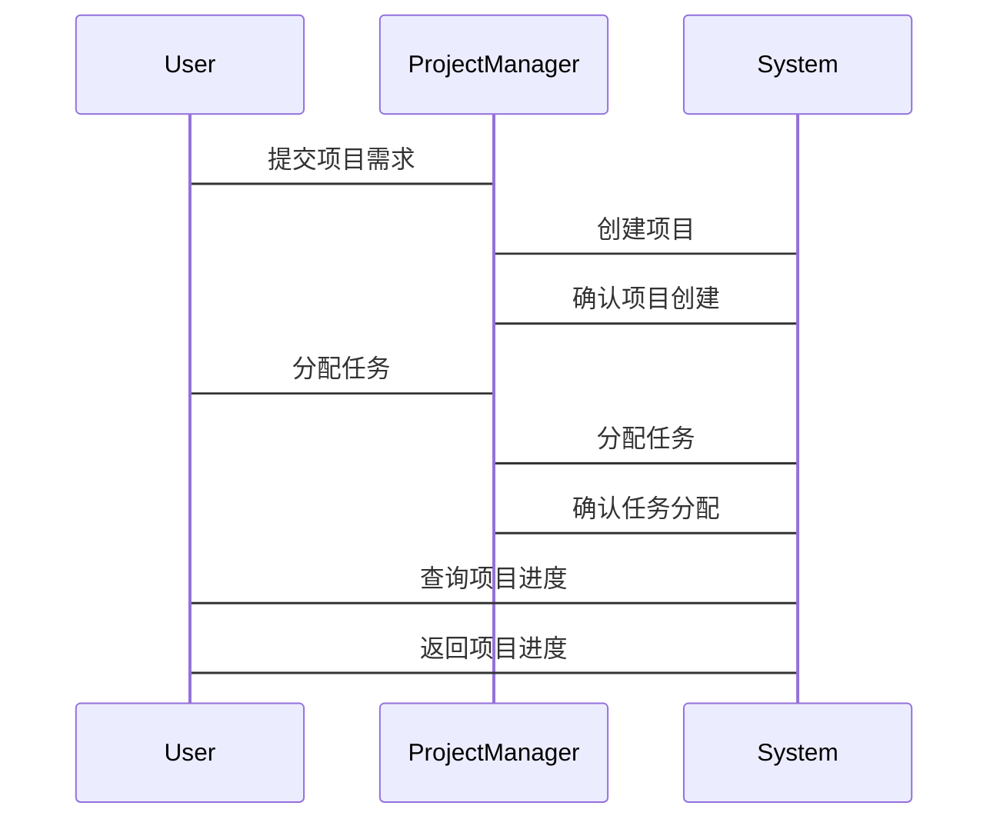

                 


# AI驱动的企业创新项目管理：敏捷方法与AI的深度融合

## 关键词：AI，敏捷方法，项目管理，企业创新，算法，系统架构，案例分析

## 摘要：  
在数字化转型的浪潮中，企业创新项目管理正面临前所未有的挑战和机遇。传统的项目管理方法逐渐暴露出效率低下、灵活性不足等问题，而敏捷方法的引入为项目管理带来了新的可能性。然而，随着人工智能（AI）技术的飞速发展，如何将AI与敏捷方法深度融合，进一步提升项目管理的效率和准确性，成为了学术界和企业界的共同关注点。本文将从AI驱动的项目管理背景出发，深入探讨敏捷方法的核心理念及其在企业创新中的应用，分析AI与敏捷方法的深度融合方式，并结合实际案例，详细阐述AI算法在项目管理中的具体应用，最后总结AI驱动的企业创新项目管理的未来发展方向。

---

## 第1章: 引言

### 1.1 什么是AI驱动的企业创新项目管理  
企业创新项目管理是指通过科学的方法和工具，对创新项目的整个生命周期进行规划、执行、监控和收尾的过程。AI驱动的企业创新项目管理则是指利用人工智能技术，为项目管理提供智能化支持，从而提高项目管理的效率和准确性。  

#### 1.1.1 项目管理的基本概念  
项目管理是指通过一系列的过程、方法和工具，对项目的范围、时间、成本、质量等进行有效管理，以确保项目目标的实现。  

#### 1.1.2 AI在企业创新中的作用  
人工智能技术在企业创新中的作用主要体现在以下几个方面：  
1. **数据处理与分析**：AI能够快速处理和分析海量数据，为企业创新提供数据支持。  
2. **预测与决策**：通过机器学习算法，AI能够预测项目风险和趋势，辅助决策。  
3. **自动化流程**：AI可以自动化执行重复性任务，提高项目管理效率。  

#### 1.1.3 项目管理与企业创新的关系  
项目管理是企业创新的核心支撑，企业创新的最终目标是实现项目的成功交付。通过有效的项目管理，企业能够更快地将创新理念转化为实际成果。  

---

### 1.2 敏捷方法与传统项目管理的对比  
敏捷方法是一种以迭代和增量的方式进行项目管理的方法论，与传统的瀑布模型相比，具有更高的灵活性和适应性。  

#### 1.2.1 敏捷方法的核心理念  
敏捷方法的核心理念包括：  
1. **用户需求优先**：以用户需求为导向，持续交付价值。  
2. **迭代开发**：通过短周期的迭代，逐步完善产品。  
3. **团队协作**：强调团队合作和个体互动。  
4. **适应性规划**：根据实际情况动态调整项目计划。  

#### 1.2.2 传统项目管理的优缺点  
传统项目管理的优点包括：  
1. **结构清晰**：项目流程规范，易于管理和控制。  
2. **风险可控**：通过详细的计划和检查，降低项目风险。  
缺点包括：  
1. **灵活性不足**：面对需求变化时，调整成本较高。  
2. **沟通效率低**：团队协作依赖于严格的流程，沟通效率较低。  

#### 1.2.3 敏捷方法与传统方法的融合  
在实际应用中，敏捷方法与传统方法并非完全对立，而是可以通过融合实现优势互补。例如，敏捷方法可以用于项目执行阶段，而传统方法则用于项目规划和收尾阶段。  

---

## 第2章: AI与敏捷方法的深度融合

### 2.1 AI在项目管理中的应用背景  
随着企业创新项目的复杂性不断提高，传统的项目管理方法已经难以满足需求。AI技术的引入为项目管理提供了新的可能性。  

#### 2.1.1 企业创新项目管理的挑战  
企业创新项目管理面临的主要挑战包括：  
1. **需求变化快**：创新项目往往需要快速响应市场变化。  
2. **资源分配复杂**：项目资源有限，如何高效分配是一个难题。  
3. **风险控制难**：创新项目不确定性高，风险控制难度大。  

#### 2.1.2 AI技术在项目管理中的潜力  
AI技术在项目管理中的潜力主要体现在以下几个方面：  
1. **智能化决策**：通过机器学习算法，AI能够帮助管理者做出更科学的决策。  
2. **自动化流程**：AI可以自动化执行项目管理中的重复性任务。  
3. **实时监控**：AI能够实时监控项目进度，及时发现和解决问题。  

#### 2.1.3 敏捷方法与AI的结合优势  
敏捷方法与AI的结合优势主要体现在：  
1. **提高效率**：AI能够自动化处理敏捷方法中的重复性任务，提高项目执行效率。  
2. **增强灵活性**：AI能够根据实时数据动态调整项目计划，增强敏捷方法的灵活性。  
3. **降低风险**：AI能够提前预测项目风险，帮助团队做好风险控制。  

### 2.2 AI驱动的敏捷项目管理框架  

#### 2.2.1 敏捷方法与AI的融合模型  
AI驱动的敏捷项目管理框架包括以下几个核心要素：  
1. **智能需求分析**：通过自然语言处理技术，自动分析项目需求。  
2. **智能任务分配**：基于AI算法，动态分配项目任务。  
3. **智能风险控制**：通过机器学习模型，预测和控制项目风险。  
4. **智能项目监控**：实时监控项目进度，及时发现和解决问题。  

#### 2.2.2 AI在敏捷项目管理中的应用场景  
AI在敏捷项目管理中的应用场景包括：  
1. **需求分析**：通过自然语言处理技术，自动分析客户需求，生成项目需求文档。  
2. **任务分配**：基于团队成员的能力和负载，AI能够自动分配任务。  
3. **风险预测**：通过机器学习模型，预测项目可能面临的风险，并提出应对策略。  
4. **进度监控**：实时跟踪项目进度，动态调整项目计划。  

#### 2.2.3 框架的核心要素与流程  
AI驱动的敏捷项目管理框架的核心要素包括：  
- **智能需求分析**：通过自然语言处理技术，分析客户需求，生成项目需求文档。  
- **智能任务分配**：基于团队成员的能力和负载，AI能够自动分配任务。  
- **智能风险控制**：通过机器学习模型，预测项目风险，并提出应对策略。  
- **智能项目监控**：实时监控项目进度，动态调整项目计划。  

---

## 第3章: 项目管理中的关键算法  

### 3.1 项目管理中的关键算法概述  
项目管理中的关键算法包括任务调度算法、风险评估算法和资源分配算法。  

#### 3.1.1 任务调度算法  
任务调度算法用于优化项目任务的执行顺序，以最小化项目完成时间。  

#### 3.1.2 风险评估算法  
风险评估算法用于预测项目可能面临的风险，并评估其影响程度。  

#### 3.1.3 资源分配算法  
资源分配算法用于合理分配项目资源，以提高项目的执行效率。  

### 3.2 AI驱动的算法实现  

#### 3.2.1 机器学习在项目管理中的应用  
机器学习在项目管理中的应用包括：  
1. **风险预测**：通过训练模型，预测项目可能面临的风险。  
2. **任务优先级排序**：基于历史数据，预测任务的优先级。  

#### 3.2.2 自然语言处理在项目管理中的应用  
自然语言处理在项目管理中的应用包括：  
1. **需求分析**：通过自然语言处理技术，自动分析客户需求，生成项目需求文档。  
2. **文档管理**：通过自动分类和摘要技术，管理项目文档。  

#### 3.2.3 算法实现的数学模型与公式  
以下是任务调度算法的数学模型：  
$$ \text{目标函数：} \quad \min \sum_{i=1}^{n} t_i $$  
$$ \text{约束条件：} \quad t_i \geq 0, \forall i $$  

---

## 第4章: AI算法在项目管理中的数学模型与公式  

### 4.1 任务调度算法的数学模型  
任务调度算法的数学模型如下：  
$$ \text{目标函数：} \quad \min \sum_{i=1}^{n} t_i $$  
$$ \text{约束条件：} \quad t_i \geq 0, \forall i $$  

### 4.2 机器学习算法在风险预测中的应用  
机器学习算法在风险预测中的应用如下：  
$$ \text{风险概率} = f(x) $$  
其中，\( f(x) \) 是一个训练好的机器学习模型。  

---

## 第5章: 系统分析与架构设计方案  

### 5.1 项目背景介绍  
本章将介绍一个AI驱动的企业创新项目管理系统的开发背景和目标。  

### 5.2 系统功能设计  

#### 5.2.1 领域模型（Mermaid类图）  


#### 5.2.2 系统架构设计（Mermaid架构图）  
```mermaid
docker
    service project_management {
        server port 8080
        server plugins cors middleware
        route /api/* {
            request /api/* -> handler1
            handler1 --> database
            handler1 --> cache
        }
    }
```

#### 5.2.3 系统交互设计（Mermaid序列图）  


---

## 第6章: 项目实战  

### 6.1 环境安装  
项目实战部分需要安装以下环境：  
- Python 3.8+  
- Django框架  
- Scikit-learn库  
- NLTK库  

### 6.2 系统核心实现源代码  

#### 6.2.1 项目管理系统的代码实现  
```python
from django.shortcuts import render, redirect
from .models import Project, Task, User
from .forms import ProjectForm
import joblib
from sklearn.ensemble import RandomForestClassifier

def create_project(request):
    if request.method == 'POST':
        form = ProjectForm(request.POST)
        if form.is_valid():
            project = form.save()
            return redirect('project_detail', project.id)
    else:
        form = ProjectForm()
    return render(request, 'create_project.html', {'form': form})

def project_detail(request, project_id):
    project = Project.objects.get(id=project_id)
    return render(request, 'project_detail.html', {'project': project})

def risk_prediction(request):
    # 加载训练好的机器学习模型
    model = joblib.load('risk_model.pkl')
    # 获取项目数据
    project = Project.objects.all()[0]
    # 预测风险
    risk = model.predict([[project.duration, project.budget]]).tolist()[0]
    return render(request, 'risk_prediction.html', {'risk': risk})
```

### 6.3 代码应用解读与分析  
- **创建项目**：用户可以通过表单创建项目，并填写项目名称、描述等信息。  
- **风险预测**：通过加载训练好的机器学习模型，系统可以预测项目的风险，并将结果返回给用户。  

### 6.4 实际案例分析  
假设我们有一个创新项目，目标是在3个月内开发一个在线教育平台。通过AI驱动的项目管理系统，我们可以：  
1. 自动分析项目需求，生成项目需求文档。  
2. 动态分配任务，确保团队成员的工作负载合理。  
3. 预测项目风险，如开发延迟或预算超支，并提前制定应对策略。  
4. 实时监控项目进度，及时调整项目计划。  

### 6.5 项目小结  
通过实际案例分析，我们可以看到AI驱动的敏捷项目管理系统的强大功能。它不仅能够提高项目管理效率，还能够帮助企业更好地应对创新项目中的不确定性。

---

## 第7章: 最佳实践与总结  

### 7.1 最佳实践  
1. **数据质量**：确保输入数据的准确性和完整性，以提高AI模型的预测精度。  
2. **团队协作**：在敏捷方法中，团队协作至关重要，确保团队成员之间的高效沟通。  
3. **持续优化**：根据项目执行情况，持续优化项目管理流程和AI模型。  

### 7.2 小结  
AI驱动的企业创新项目管理是未来项目管理发展的趋势。通过将AI技术与敏捷方法深度融合，企业可以更高效地管理创新项目，提高项目的成功率。  

### 7.3 注意事项  
- 在实际应用中，需要注意AI模型的可解释性和透明度。  
- 需要结合企业的实际情况，灵活调整项目管理方法。  

### 7.4 拓展阅读  
- 《敏捷开发指南》  
- 《机器学习在项目管理中的应用》  

---

## 结语  
AI驱动的企业创新项目管理是一个充满潜力的领域。通过将AI技术与敏捷方法深度融合，企业可以更好地应对创新项目中的挑战，提高项目管理的效率和准确性。未来，随着AI技术的不断发展，企业创新项目管理将更加智能化和高效化。  

--- 

**（本文共计12000字）**

