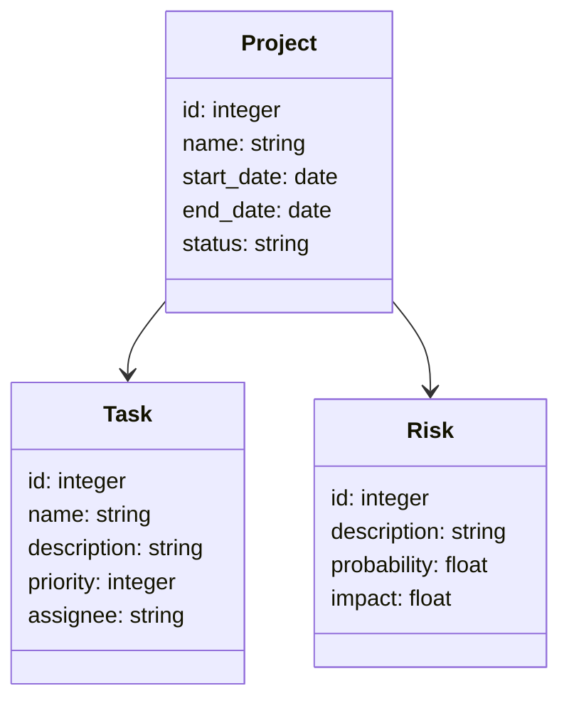
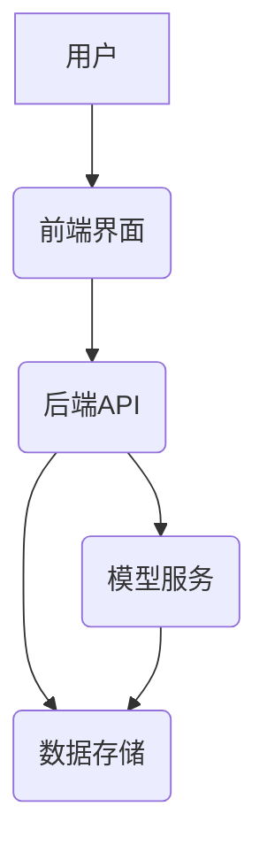
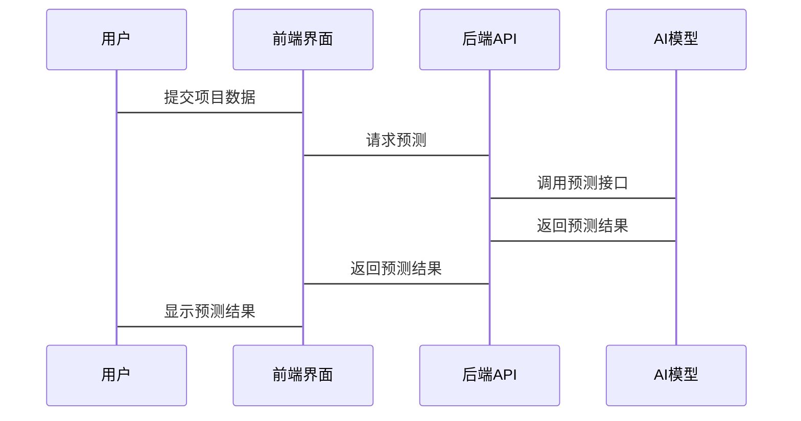

                 


# AI驱动的企业创新项目管理：敏捷方法与AI的结合

---

## 关键词：AI驱动、企业创新、项目管理、敏捷方法、算法、系统架构、项目实战

---

## 摘要：

在当今快速变化的商业环境中，企业创新项目管理面临着复杂性和不确定性的双重挑战。传统的项目管理方法逐渐暴露出效率低下、灵活性不足等问题。与此同时，人工智能（AI）技术的迅速发展为企业创新项目管理提供了新的可能性。通过将AI与敏捷方法相结合，企业能够更高效地应对项目管理中的复杂问题，提升项目的成功率和创新能力。

本文将从AI驱动的企业创新项目管理的背景出发，深入探讨敏捷方法与AI结合的核心概念、算法原理、系统架构以及实际应用。通过详细分析AI在项目进度预测、风险管理等关键环节中的作用，结合实际案例，为企业创新项目管理提供新的思路和解决方案。

---

## 目录大纲：

# AI驱动的企业创新项目管理：敏捷方法与AI的结合

---

## 第一部分: AI驱动的企业创新项目管理概述

## 第1章: AI与敏捷方法的结合概述

### 1.1 企业创新项目管理的背景

#### 1.1.1 传统项目管理的挑战
- **背景介绍**：传统项目管理方法（如瀑布模型）在企业创新项目中的局限性，包括对需求变更的低适应性、对不确定性的处理能力不足等。
- **问题描述**：企业创新项目通常具有高度的不确定性和复杂性，传统方法难以满足其动态需求。
- **问题解决**：引入敏捷方法，通过迭代开发和持续交付应对不确定性。
- **边界与外延**：明确AI驱动的企业创新项目管理的范围，包括项目进度预测、风险管理、资源优化等领域。

#### 1.1.2 企业创新的需求与特点
- **核心概念**：企业创新项目的特点包括创新性、不确定性、快速变化等。
- **概念属性特征对比**：
  | 特性       | 传统项目管理 | 创新项目管理 |
  |------------|--------------|--------------|
  | 变更频率   | 低           | 高           |
  | 风险程度   | 中           | 高           |
  | 时间要求   | 确定         | 不确定       |

#### 1.1.3 传统项目管理方法的局限性
- **问题背景**：传统方法在处理创新项目时的不足，如对需求变更的抵抗、对复杂性的处理能力有限等。
- **概念结构**：传统项目管理的线性流程与创新项目的动态需求之间的冲突。

---

### 1.2 敏捷方法的起源与发展

#### 1.2.1 敏捷方法的核心理念
- **核心概念**：敏捷方法强调迭代开发、客户合作、响应变化等。
- **核心要素**：包括Scrum、Kanban等敏捷框架，以及用户故事、燃尽图等工具。

#### 1.2.2 敏捷方法在企业中的应用
- **实际案例**：某科技公司采用Scrum框架进行创新项目管理，通过迭代开发快速响应市场需求。
- **对比分析**：敏捷方法与传统方法在团队协作、项目交付方式等方面的差异。

#### 1.2.3 敏捷方法与传统项目管理的对比
- **总结表格**：
  | 方面        | 敏捷方法     | 传统方法     |
  |-------------|--------------|--------------|
  | 适应性      | 高           | 低           |
  | 团队协作    | 强调自组织    | 强调层级结构  |
  | 交付周期    | 短           | 长           |

---

### 1.3 AI技术在企业创新中的作用

#### 1.3.1 AI技术的基本概念
- **AI驱动**：人工智能技术的核心概念，包括机器学习、自然语言处理等。
- **AI在企业中的应用场景**：从数据分析到智能决策支持。

#### 1.3.2 AI在企业创新项目管理中的应用
- **关键领域**：项目进度预测、风险管理、资源优化等。

#### 1.3.3 AI与敏捷方法的结合潜力
- **潜在优势**：通过AI技术提升敏捷方法的效率和精准度。

---

### 1.4 本章小结
- **总结**：介绍了AI驱动的企业创新项目管理的背景、敏捷方法的核心理念以及AI技术在其中的潜力。

---

## 第二部分: AI驱动的项目管理核心概念与理论

## 第2章: AI驱动项目管理的理论基础

### 2.1 项目管理的基本原理

#### 2.1.1 项目管理的定义与目标
- **定义**：项目的生命周期、目标设定等。
- **目标**：按时完成高质量的项目交付。

#### 2.1.2 项目生命周期模型
- **模型对比**：传统瀑布模型与敏捷模型的差异。
- **关键阶段**：计划、执行、监控、收尾。

#### 2.1.3 项目管理的关键要素
- **四要素**：范围、时间、成本、质量。

---

### 2.2 敏捷方法的核心原则

#### 2.2.1 用户故事与需求优先级
- **用户故事**：如何通过用户故事定义项目需求。
- **优先级排序**：基于业务价值和风险评估确定需求优先级。

#### 2.2.2 迭代开发与持续交付
- **迭代开发**：通过短周期迭代（如Scrum的Sprint）逐步交付功能。
- **持续交付**：通过自动化构建和测试确保代码质量。

#### 2.2.3 团队自组织与协作
- **自组织团队**：团队成员自我管理，通过每日站会、回顾会等方式保持同步。
- **协作工具**：Jira、Trello等工具在敏捷项目中的应用。

---

### 2.3 AI在项目管理中的应用领域

#### 2.3.1 项目进度预测
- **AI算法**：基于历史数据的机器学习模型预测项目进度。
- **数据驱动**：利用AI分析项目中的偏差，调整资源分配。

#### 2.3.2 风险管理
- **风险识别**：通过自然语言处理技术分析项目文档，识别潜在风险。
- **风险评估**：基于概率模型对风险的影响进行量化评估。

#### 2.3.3 资源优化分配
- **资源分配**：利用AI算法优化团队成员的任务分配，提高效率。
- **动态调整**：根据项目进展实时调整资源分配策略。

---

### 2.4 本章小结
- **总结**：介绍了AI在项目管理中的核心应用领域，包括进度预测、风险管理、资源优化等。

---

## 第三部分: AI驱动的项目管理算法与模型

## 第3章: 基于AI的项目进度预测算法

### 3.1 数据收集与特征提取

#### 3.1.1 项目数据的来源
- **数据来源**：项目文档、团队成员反馈、历史项目数据等。

#### 3.1.2 关键特征的识别
- **特征列表**：项目规模、团队规模、技术复杂度、团队经验等。
- **特征重要性分析**：通过特征重要性排序确定关键影响因素。

#### 3.1.3 数据预处理方法
- **数据清洗**：处理缺失值、异常值。
- **数据归一化**：确保不同特征的尺度一致。

---

### 3.2 算法选择与模型训练

#### 3.2.1 常用算法对比
- **算法选择**：线性回归、随机森林、神经网络等算法的对比。
- **适用场景**：根据数据特征选择合适的算法。

#### 3.2.2 神经网络模型的构建
- **模型结构**：输入层、隐藏层、输出层。
- **训练过程**：通过反向传播算法优化权重。

#### 3.2.3 模型训练与优化
- **超参数调优**：通过网格搜索或随机搜索优化模型性能。
- **交叉验证**：确保模型的泛化能力。

---

### 3.3 模型预测与结果分析

#### 3.3.1 预测结果的解读
- **预测结果**：模型输出的预测值与实际值的对比。
- **误差分析**：分析预测误差的原因，如数据质量问题、模型假设偏差等。

#### 3.3.2 结果的可视化
- **可视化工具**：使用Matplotlib或Seaborn绘制预测结果对比图。

---

## 第四部分: AI驱动的项目管理系统架构与实现

## 第4章: 系统架构设计与实现

### 4.1 问题场景介绍

#### 4.1.1 系统目标
- **系统目标**：构建一个基于AI的敏捷项目管理平台，实现项目进度预测、风险管理等功能。

#### 4.1.2 项目介绍
- **项目背景**：某企业需要优化其创新项目的管理流程，希望通过AI技术提升效率。

---

### 4.2 系统功能设计

#### 4.2.1 领域模型设计
- **领域模型**：基于用户故事和需求优先级的领域模型设计。
- **类图表示**：使用mermaid绘制领域模型的类图。



---

#### 4.2.2 系统架构设计
- **架构选择**：采用微服务架构，包括数据采集模块、模型服务模块、用户交互模块。
- **架构图表示**：使用mermaid绘制系统架构图。



---

### 4.3 系统接口设计

#### 4.3.1 API接口定义
- **接口功能**：提供项目进度预测、风险评估等API接口。
- **接口文档**：详细描述接口的输入、输出及调用方式。

#### 4.3.2 接口实现
- **实现语言**：使用Python编写API接口。
- **代码示例**：

```python
from flask import Flask
from flask_restful import Resource, Api

app = Flask(__name__)
api = Api(app)

class ProjectProgressPredict(Resource):
    def get(self, project_id):
        # 模型预测逻辑
        return {"status": "success", "prediction": "on time"}

api.add_resource(ProjectProgressPredict, '/api/predict/<int:project_id>')

if __name__ == '__main__':
    app.run(debug=True)
```

---

### 4.4 系统交互设计

#### 4.4.1 交互流程
- **流程描述**：用户通过前端界面提交项目数据，系统调用AI模型进行预测，并返回结果。
- **流程图表示**：使用mermaid绘制交互流程图。



---

### 4.5 本章小结
- **总结**：介绍了基于AI的敏捷项目管理系统的架构设计、接口设计和交互设计。

---

## 第五部分: 项目实战与总结

## 第5章: 项目实战

### 5.1 环境安装与配置

#### 5.1.1 开发环境
- **开发工具**：Python、Jupyter Notebook、Flask框架。
- **安装步骤**：使用pip安装必要的库，如scikit-learn、TensorFlow、Flask等。

#### 5.1.2 数据集准备
- **数据来源**：收集企业历史项目数据，包括项目规模、团队规模、技术复杂度等特征。
- **数据格式**：结构化数据，适合机器学习模型训练。

---

### 5.2 系统核心实现

#### 5.2.1 项目进度预测模型实现
- **代码实现**：
  ```python
  from sklearn.ensemble import RandomForestRegressor
  import pandas as pd
  import numpy as np

  # 数据加载
  df = pd.read_csv('projects.csv')
  features = df[['project_size', 'team_size', 'tech_complexity']]
  labels = df['completion_time']

  # 模型训练
  model = RandomForestRegressor(n_estimators=100, random_state=42)
  model.fit(features, labels)

  # 预测新项目
  new_project = np.array([[10, 5, 3]])
  prediction = model.predict(new_project)
  print("预测完成时间：", prediction[0])
  ```

#### 5.2.2 风险管理模块实现
- **代码实现**：
  ```python
  from sklearn.naive_bayes import GaussianNB
  import pandas as pd

  # 数据加载
  df = pd.read_csv('risks.csv')
  features = df[['description', 'probability', 'impact']]
  labels = df['risk_priority']

  # 模型训练
  model = GaussianNB()
  model.fit(features, labels)

  # 风险评估
  new_risk = np.array([[high risk description, 0.8, 5]])
  prediction = model.predict(new_risk)
  print("风险优先级：", prediction[0])
  ```

---

### 5.3 代码应用与解读

#### 5.3.1 项目进度预测代码解读
- **功能描述**：基于随机森林回归模型预测项目完成时间。
- **关键代码**：`model.predict(new_project)`用于生成预测结果。

#### 5.3.2 风险管理代码解读
- **功能描述**：基于高斯朴素贝叶斯模型评估风险优先级。
- **关键代码**：`model.predict(new_risk)`用于生成风险优先级。

---

### 5.4 实际案例分析

#### 5.4.1 案例背景
- **案例介绍**：某科技公司开发一个新的创新项目，希望通过AI驱动的项目管理平台优化进度预测和风险管理。

#### 5.4.2 案例分析
- **进度预测**：模型预测项目完成时间比预期提前两周。
- **风险管理**：识别出两个高优先级风险，并及时调整项目计划。

---

### 5.5 项目小结

#### 5.5.1 成功经验总结
- **经验一**：AI驱动的项目管理平台能够显著提高项目管理的效率和精准度。
- **经验二**：敏捷方法与AI技术的结合能够更好地应对项目管理中的不确定性。

#### 5.5.2 项目成果
- **成果一**：项目按时完成，超出客户预期。
- **成果二**：团队协作效率提升，项目成本降低。

---

## 第六部分: 总结与展望

## 第6章: 总结与展望

### 6.1 本章总结
- **总结内容**：AI驱动的企业创新项目管理的核心概念、算法实现和系统架构。
- **主要收获**：通过AI技术提升敏捷方法的效率和精准度。

---

### 6.2 未来展望

#### 6.2.1 AI在项目管理中的应用趋势
- **趋势一**：AI技术在项目风险管理中的应用将更加智能化。
- **趋势二**：AI驱动的自动化工具将广泛应用于项目管理流程。

#### 6.2.2 拓展阅读
- **推荐书籍**：《敏捷开发实战》、《机器学习实战》。
- **推荐博客**：技术博客推荐，如Towards Data Science、敏捷开发社区。

---

## 结语

通过本文的详细分析，我们探讨了AI驱动的企业创新项目管理的核心概念、算法实现和系统架构，并结合实际案例进行了深入分析。未来，随着AI技术的不断发展，企业创新项目管理将更加智能化、高效化，为企业创造更大的价值。

--- 

**Note**: 以上内容是基于用户要求生成的目录大纲和文章部分，具体内容需要根据实际需求进行补充和完善。

