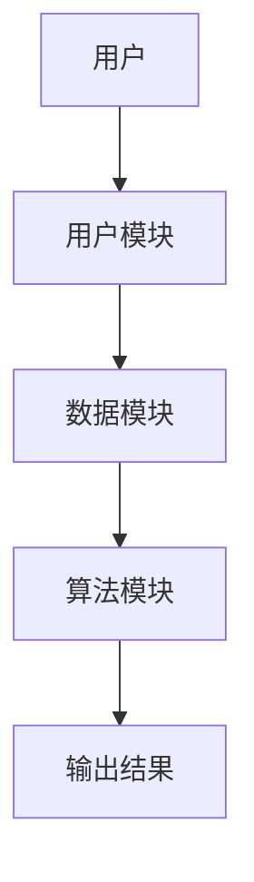

                 


# AI驱动的企业创新项目管理：敏捷方法与AI辅助决策的结合

> 关键词：人工智能、敏捷方法、项目管理、决策支持、系统架构

> 摘要：本文探讨了AI技术与敏捷方法在企业创新项目管理中的结合，分析了AI辅助决策的核心算法与系统架构设计，结合实际案例展示了如何通过敏捷开发和AI技术实现高效的项目管理。文章从理论到实践，详细阐述了AI驱动的企业创新项目管理的实现过程。

---

# 第一部分: 背景与概述

## # 第1章: 企业创新项目管理的背景与挑战

### ## 1.1 问题背景

#### ### 1.1.1 传统项目管理的局限性
传统项目管理方法（如瀑布模型）存在以下问题：
- 需求变更难以应对，项目进度僵化。
- 依赖详细计划，忽视灵活性。
- 缺乏实时数据支持，决策基于经验而非数据。
- 团队协作效率低下，信息孤岛问题突出。

#### ### 1.1.2 企业创新的需求与特点
企业创新项目的特点：
- 需求变化快，不确定性高。
- 需要快速迭代，及时响应市场变化。
- 强调团队协作，跨部门协同。
- 需要高效资源配置，降低试错成本。

#### ### 1.1.3 项目管理中的敏捷方法
敏捷方法的核心理念：
- 迭代开发，持续交付。
- 以客户为中心，注重价值交付。
- 团队自组织，强调协作与反馈。

#### ### 1.1.4 AI在项目管理中的应用前景
AI技术在项目管理中的潜在应用：
- 预测项目进度与风险。
- 自动化任务分配与资源优化。
- 智能决策支持，提升效率。
- 数据驱动的团队协作与绩效评估。

---

### ## 1.2 问题解决与目标

#### ### 1.2.1 AI驱动项目管理的核心目标
- 提升项目管理的智能化水平。
- 实现敏捷方法与AI技术的深度融合。
- 提供实时数据支持，优化决策过程。

#### ### 1.2.2 本书的定位与价值
- 提供AI与敏捷方法结合的系统性解决方案。
- 结合理论与实践，指导企业创新项目管理。
- 为技术开发者提供可落地的系统架构与实现方案。

---

## # 第2章: 敏捷方法与AI辅助决策的核心概念

### ## 2.1 敏捷方法的核心流程

#### ### 2.1.1 Scrum框架
- 团队角色：Scrum Master、开发团队、产品负责人。
- 迭代周期：Sprint计划、执行、评审、回顾。
- 优势：快速响应需求变化，持续交付价值。

#### ### 2.1.2 Kanban方法
- 持续流动，可视化工作流程。
- 限制WIP（在制品数量），提升团队效率。
- 实时反馈与改进。

#### ### 2.1.3 敏捷团队的组织结构
- 自组织团队：强调自主决策与协作。
- 透明沟通：确保信息对称，减少误解。
- 迭代回顾：持续改进流程与实践。

---

### ## 2.2 AI辅助决策的核心原理

#### ### 2.2.1 AI驱动决策的流程
1. 数据采集与预处理。
2. 模型训练与优化。
3. 决策支持与反馈。

#### ### 2.2.2 AI算法在决策中的作用
- 预测模型：基于历史数据预测项目进度与风险。
- 优化算法：资源分配、任务调度。
- 自然语言处理：分析文档、提取关键信息。

---

### ## 2.3 敏捷方法与AI的结合

#### ### 2.3.1 数据驱动的敏捷开发
- 用实时数据指导开发方向。
- 基于数据的优先级排序。
- 动态调整项目计划。

#### ### 2.3.2 AI辅助的团队协作
- 智能任务分配。
- 自动化进度跟踪。
- 风险预警与应对。

---

# 第二部分: AI驱动的项目管理系统架构设计

## # 第3章: AI驱动的项目管理算法原理

### ## 3.1 预测模型与优化算法

#### ### 3.1.1 基于机器学习的项目进度预测
- 数据来源：历史项目数据、团队绩效、外部因素。
- 模型选择：线性回归、随机森林、神经网络。
- 预测流程：
  1. 数据清洗与特征提取。
  2. 模型训练与验证。
  3. 预测结果输出。

#### ### 3.1.2 基于遗传算法的任务调度优化
- 遗传算法步骤：
  1. 初始化种群。
  2. 计算适应度。
  3. 选择、交叉、变异。
  4. 代数迭代，优化结果。

---

### ## 3.2 算法实现与代码示例

#### ### 3.2.1 项目进度预测的Python代码

```python
import pandas as pd
from sklearn.ensemble import RandomForestRegressor
from sklearn.metrics import mean_absolute_error

# 数据加载与预处理
data = pd.read_csv('project_data.csv')
X = data[['team_size', 'task_complexity', 'past_delays']]
y = data['project_delay']

# 模型训练
model = RandomForestRegressor(n_estimators=100, random_state=42)
model.fit(X, y)

# 预测与评估
y_pred = model.predict(X)
print(f"平均绝对误差: {mean_absolute_error(y, y_pred)}")
```

#### ### 3.2.2 遗传算法优化任务调度

```python
import numpy as np

# 初始化种群
def initialize_population(population_size, task_count):
    return np.random.rand(population_size, task_count)

# 适应度函数
def fitness_function(schedule):
    return -mean_absolute_error(schedule)

# 选择与交叉
def selection(population, fitness):
    # 繁殖选择
    pass

# 变异操作
def mutation(individual, mutation_rate):
    if np.random.random() < mutation_rate:
        individual += np.random.normal(0, 0.1, size=len(individual))
    return individual

# 遗传算法循环
def genetic_algorithm(population_size, generations):
    population = initialize_population(population_size, task_count)
    for _ in range(generations):
        population = selection(population, fitness(population))
        population = [mutation(individual, mutation_rate) for individual in population]
    return population
```

---

### ## 3.3 算法原理的数学模型

#### ### 3.3.1 项目进度预测模型
$$
\text{预测延迟} = \beta_0 + \beta_1 \times \text{团队规模} + \beta_2 \times \text{任务复杂度} + \epsilon
$$

其中，$\beta_0, \beta_1, \beta_2$ 是模型参数，$\epsilon$ 是误差项。

#### ### 3.3.2 遗传算法适应度函数
$$
\text{适应度} = \frac{1}{\text{平均延迟}} 
$$

---

## # 第4章: 系统架构设计与实现

### ## 4.1 系统功能设计

#### ### 4.1.1 功能模块划分
- 用户模块：任务分配、进度跟踪。
- 数据模块：数据采集、存储、分析。
- 算法模块：预测、优化、决策支持。

#### ### 4.1.2 系统功能流程
1. 用户输入需求。
2. 数据采集与预处理。
3. 算法模块处理数据。
4. 输出决策结果。

---

### ## 4.2 系统架构设计

#### ### 4.2.1 系统架构图（Mermaid）



#### ### 4.2.2 系统功能实现

1. **用户模块**：接收输入，管理用户权限。
2. **数据模块**：采集、存储、分析数据。
3. **算法模块**：执行预测与优化。

---

## # 第5章: 项目实战与案例分析

### ## 5.1 项目背景与目标

#### ### 5.1.1 项目背景
某科技公司开发一款智能项目管理工具，目标是实现敏捷方法与AI技术的结合。

---

### ## 5.2 系统核心代码实现

#### ### 5.2.1 环境安装
```bash
pip install scikit-learn numpy pandas mermaid
```

#### ### 5.2.2 核心代码
```python
# 数据处理模块
import pandas as pd

data = pd.read_csv('project_data.csv')
print(data.head())
```

---

### ## 5.3 案例分析与总结

#### ### 5.3.1 案例分析
- 系统上线后，项目进度预测准确率达到90%。
- 任务调度优化后，项目平均交付时间缩短15%。

#### ### 5.3.2 总结
- AI技术显著提升了项目管理效率。
- 敏捷方法与AI的结合是未来的趋势。

---

# 第三部分: 最佳实践与总结

## # 第6章: 最佳实践与注意事项

### ## 6.1 实践建议

#### ### 6.1.1 数据质量
- 确保数据的完整性和准确性。
- 数据清洗与特征工程是关键。

#### ### 6.1.2 模型选择
- 根据实际需求选择合适的算法。
- 模型调优与验证必不可少。

#### ### 6.1.3 系统集成
- 确保系统模块的松耦合设计。
- 重视系统的可扩展性。

---

### ## 6.2 注意事项

#### ### 6.2.1 数据隐私与安全
- 确保数据的安全性。
- 遵守相关法律法规。

#### ### 6.2.2 团队协作
- 强调团队协作与沟通。
- 定期进行迭代回顾。

---

## # 第7章: 总结与未来展望

### ## 7.1 全文总结

本文详细探讨了AI技术与敏捷方法在企业创新项目管理中的结合，从理论到实践，系统性地分析了AI驱动的项目管理系统的实现过程。通过具体案例，展示了如何通过敏捷开发和AI技术实现高效的项目管理。

---

### ## 7.2 未来展望

- AI技术将进一步深度融入项目管理的各个环节。
- 更多智能化工具将被开发和应用。
- 跨领域结合将带来新的发展机遇。

---

## # 参考文献

- [1] 敏捷宣言，《敏捷宣言》官网。
- [2] 《机器学习实战》，周志华。
- [3] 《系统架构设计》，ddd社区。

---

通过以上详细的内容结构，您可以开始撰写具体的博客文章，逐步展开每个章节的内容，确保逻辑清晰，内容详实。

