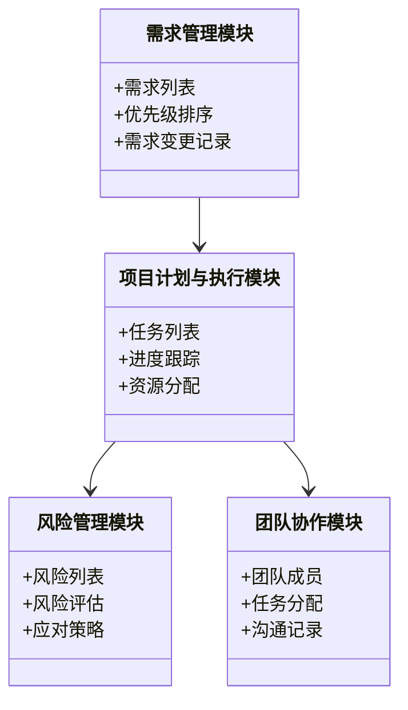
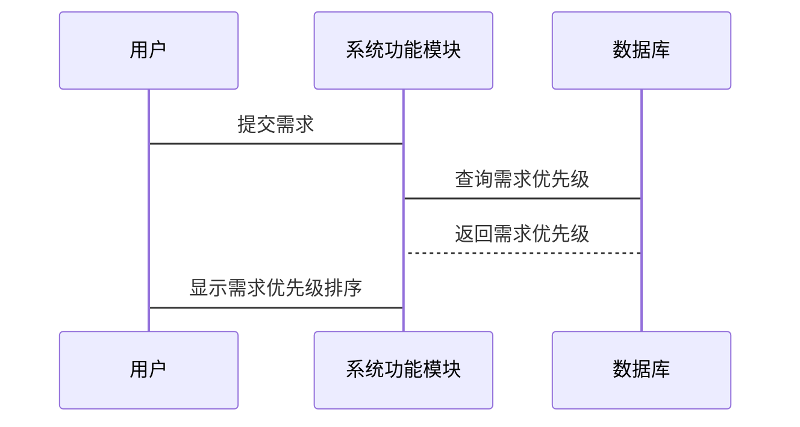

                 


# AI驱动的企业创新项目管理：敏捷方法与AI辅助决策的融合

> **关键词**：AI驱动，企业创新，项目管理，敏捷方法，AI辅助决策，数据驱动，风险管理，团队协作，系统架构，项目实战

> **摘要**：  
> 在企业创新项目管理中，传统的项目管理方法面临着效率低下、不确定性高、复杂性增加等挑战。随着人工智能（AI）技术的快速发展，AI驱动的企业创新项目管理逐渐成为可能。本文将探讨如何将敏捷方法与AI辅助决策相结合，以提升企业创新项目的管理效率和决策质量。通过分析AI在项目管理中的核心应用，结合实际案例，本文将详细阐述如何构建AI驱动的项目管理系统，并提供系统架构设计和实战指导。

---

# 第1章：AI驱动的企业创新项目管理背景

## 1.1 企业创新项目管理的挑战

### 1.1.1 传统项目管理的局限性
传统的项目管理方法（如瀑布模型）在处理复杂性和不确定性时显得力不从心。企业创新项目通常具有高度的不确定性，需求变化频繁，且需要快速响应市场变化。传统的项目管理方法难以适应这种动态变化。

### 1.1.2 企业创新面临的不确定性
企业创新项目往往涉及新兴技术、未知市场和不确定性较高的目标。这些不确定性使得传统的线性项目管理方法难以应对。

### 1.1.3 AI技术在项目管理中的潜力
AI技术能够通过数据分析、预测和自动化决策，帮助企业在复杂环境中做出更高效的决策。AI可以辅助项目管理的各个环节，从需求分析到项目执行，再到风险控制。

---

## 1.2 敏捷方法与AI辅助决策的融合

### 1.2.1 敏捷方法的核心理念
敏捷方法强调迭代开发、客户合作、需求优先级排序和持续交付价值。它适用于复杂性和不确定性较高的项目，能够快速响应变化。

### 1.2.2 AI辅助决策的优势
AI技术可以通过数据分析和机器学习模型，帮助项目管理者预测项目进度、识别风险、优化资源分配。AI辅助决策能够显著提高决策的准确性和效率。

### 1.2.3 两者的结合对企业创新的意义
将敏捷方法与AI辅助决策相结合，能够充分发挥两者的优点。敏捷方法的灵活性与AI的高效性相结合，为企业创新项目管理提供了新的可能性。

---

## 1.3 本书的核心内容与目标

### 1.3.1 本书的研究范围
本书将探讨AI在企业创新项目管理中的应用，重点分析敏捷方法与AI辅助决策的融合。

### 1.3.2 本书的主要目标
通过理论分析、系统设计和实际案例，帮助读者理解如何利用AI技术提升企业创新项目的管理效率。

### 1.3.3 本书的结构安排
本书分为四个主要部分：背景、理论、系统架构与实践。每一部分都将深入探讨相关的内容。

---

# 第2章：AI在项目管理中的核心应用

## 2.1 AI驱动的项目需求分析

### 2.1.1 需求预测的AI模型
通过自然语言处理（NLP）和机器学习模型，可以分析客户需求文档，预测潜在的需求变化。

### 2.1.2 数据驱动的需求优先级排序
基于历史数据和市场反馈，AI可以为需求优先级排序提供科学依据。

### 2.1.3 基于AI的需求分析工具
AI工具可以帮助团队快速识别需求中的关键点，优化需求分析过程。

---

## 2.2 敏捷方法中的AI辅助决策

### 2.2.1 敏捷开发中的迭代与反馈机制
AI可以帮助团队在每次迭代中快速分析反馈数据，优化项目计划。

### 2.2.2 AI在敏捷项目中的应用场景
AI可以用于任务分配、进度预测和风险评估，帮助团队高效管理项目。

### 2.2.3 基于AI的敏捷团队协作工具
AI驱动的协作工具可以实时分析团队成员的工作状态，优化任务分配。

---

## 2.3 项目风险管理的AI解决方案

### 2.3.1 风险识别的AI模型
基于历史数据和实时数据，AI可以识别潜在风险，并提供预警。

### 2.3.2 风险评估与应对策略
AI可以帮助团队评估风险的影响程度，并制定最优的应对策略。

### 2.3.3 基于AI的风险监控工具
AI驱动的监控工具可以实时跟踪项目风险，帮助团队及时应对。

---

# 第3章：敏捷方法与AI辅助决策的融合

## 3.1 敏捷方法与AI的结合模式

### 3.1.1 数据驱动的敏捷开发
通过AI分析数据，敏捷团队可以快速调整项目计划。

### 3.1.2 AI辅助的迭代计划制定
AI可以帮助团队预测迭代目标，并优化任务分配。

### 3.1.3 基于AI的需求变更管理
AI可以实时分析需求变更的影响，并提供调整建议。

---

## 3.2 AI辅助的项目进度优化

### 3.2.1 基于AI的任务优先级排序
AI可以根据项目目标和资源情况，优化任务优先级。

### 3.2.2 进度预测与资源分配
通过AI预测项目进度，团队可以更合理地分配资源。

### 3.2.3 AI驱动的项目里程碑管理
AI可以帮助团队预测里程碑完成时间，并优化里程碑设置。

---

## 3.3 AI在团队协作中的应用

### 3.3.1 基于AI的团队能力评估
AI可以分析团队成员的能力，优化任务分配。

### 3.3.2 AI辅助的任务分配与协作
AI可以帮助团队成员高效协作，减少沟通成本。

### 3.3.3 基于AI的团队绩效分析
AI可以分析团队绩效，帮助管理者优化团队结构。

---

# 第4章：AI驱动的企业创新项目管理系统架构

## 4.1 系统功能设计

### 4.1.1 需求管理模块
负责需求分析、需求优先级排序和需求变更管理。

### 4.1.2 项目计划与执行模块
负责项目计划制定、任务分配和进度监控。

### 4.1.3 风险管理模块
负责风险识别、风险评估和风险应对。

### 4.1.4 团队协作模块
负责团队任务分配、协作沟通和绩效分析。

---

## 4.2 系统架构

### 4.2.1 系统功能设计（领域模型）



---

## 4.3 系统架构设计

```mermaid
rectangle 数据库 {
    +需求数据库
    +项目计划数据库
    +风险管理数据库
    +团队协作数据库
}
actor 用户
actor 管理员
class 系统功能模块 {
    +需求管理模块
    +项目计划与执行模块
    +风险管理模块
    +团队协作模块
}
用户 --> 系统功能模块
管理员 --> 系统功能模块
系统功能模块 --> 数据库
```

---

## 4.4 系统接口设计

### 4.4.1 系统交互设计



---

# 第5章：AI驱动的企业创新项目管理实战

## 5.1 环境安装

```bash
# 安装Python环境
python3 --version
pip install -i https://pypi.tuna.tsinghua.edu.cn/simple requests numpy scikit-learn
```

---

## 5.2 系统核心实现源代码

### 5.2.1 需求预测模型

```python
import numpy as np
from sklearn.linear_model import LinearRegression

# 示例数据
X = np.array([[1], [2], [3], [4], [5]])
y = np.array([2, 4, 5, 4, 6])

# 训练模型
model = LinearRegression()
model.fit(X, y)

# 预测新需求
new_X = np.array([[6]])
print("预测结果:", model.predict(new_X)[0])
```

---

## 5.3 实际案例分析

### 5.3.1 案例背景
某科技公司开发一款创新产品，采用敏捷方法结合AI辅助决策进行项目管理。

### 5.3.2 案例分析
通过AI预测需求优先级和项目进度，优化任务分配，最终项目提前完成。

---

## 5.4 项目小结

通过实际案例，验证了AI驱动的企业创新项目管理的有效性。AI技术能够显著提高项目管理的效率和决策质量。

---

# 第6章：总结与展望

## 6.1 本书的核心内容总结
通过理论分析和实践案例，本书详细介绍了AI驱动的企业创新项目管理方法。

## 6.2 对未来的展望
随着AI技术的不断发展，企业创新项目管理将更加智能化和高效化。

---

# 第7章：附录

## 7.1 项目管理工具列表
- AI驱动的项目管理工具：Jira、Trello、Asana
- 数据分析工具：Python、R、Excel

## 7.2 参考文献
1. 《敏捷宣言》
2. 《项目管理知识体系指南》
3. 《人工智能：一种现代的方法》

---

通过以上章节的内容，您可以系统地了解AI驱动的企业创新项目管理的核心概念、方法和实践。

