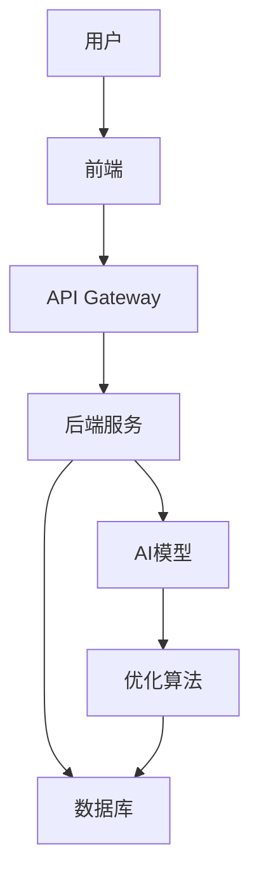

                 


# AI驱动的企业创新项目组合管理

> 关键词：人工智能，项目组合管理，创新，企业战略，优化算法，数据驱动

> 摘要：本文详细探讨了人工智能在企业创新项目组合管理中的应用，从背景介绍、核心概念到算法原理、系统架构，再到项目实战和最佳实践，全面解析了如何利用AI技术优化企业创新项目的组合管理，提升企业战略目标的实现效率和效果。

---

# 第一部分：AI驱动的企业创新项目组合管理概述

## 第1章：AI驱动的企业创新项目组合管理概述

### 1.1 什么是AI驱动的项目组合管理
#### 1.1.1 项目组合管理的基本概念
项目组合管理（Project Portfolio Management，PPM）是指在企业中，为了实现战略目标，对多个项目进行优先级排序、资源分配、风险评估和监控管理的过程。它是企业在创新过程中优化资源配置、提升效率的重要工具。

#### 1.1.2 AI在项目组合管理中的作用
人工智能（AI）通过数据挖掘、机器学习和优化算法等技术，能够从海量数据中提取关键信息，帮助企业在复杂的项目组合中找到最优解。AI不仅提高了决策的效率，还能发现人类难以察觉的模式和趋势，从而提升项目的成功率。

#### 1.1.3 企业创新与项目组合管理的结合
企业创新的核心在于快速响应市场变化，推出有竞争力的产品和服务。AI驱动的项目组合管理通过优化项目选择、资源配置和风险控制，帮助企业更高效地实现创新目标，推动企业战略的落地。

---

### 1.2 项目组合管理的背景与重要性
#### 1.2.1 传统项目组合管理的挑战
传统的项目组合管理依赖于经验和主观判断，存在以下问题：
- **信息不对称**：决策者难以全面掌握所有项目的详细信息。
- **资源分配不均**：在有限资源下，如何选择最优项目组合是一个复杂的优化问题。
- **预测不准**：传统方法难以准确预测项目的成功概率和潜在风险。

#### 1.2.2 AI技术如何解决传统问题
AI通过以下方式解决了传统项目组合管理的难题：
- **数据驱动的决策**：利用机器学习算法分析历史数据，预测项目成功概率和风险。
- **自动化优化**：使用优化算法（如遗传算法、线性规划）快速找到最优项目组合。
- **实时监控与调整**：通过实时数据分析，动态调整项目优先级和资源分配。

#### 1.2.3 企业创新中的项目组合管理
在企业创新中，项目组合管理不仅是优化资源配置的工具，更是企业战略落地的核心机制。通过科学的项目组合管理，企业能够：
- 更快地将创新想法转化为实际产品。
- 提高项目的成功率，降低资源浪费。
- 增强企业的市场竞争力。

---

## 1.3 本章小结
本章介绍了AI驱动的项目组合管理的基本概念和其在企业创新中的重要性。传统项目组合管理依赖经验，存在诸多挑战，而AI技术通过数据驱动的决策和自动化优化，为企业提供了更高效、更准确的解决方案。接下来，我们将深入探讨AI驱动的项目组合管理的核心概念和原理。

---

# 第二部分：核心概念与原理

## 第2章：AI驱动的项目组合管理核心概念

### 2.1 数据驱动的项目组合管理
#### 2.1.1 数据在项目组合管理中的重要性
数据是AI驱动的项目组合管理的核心。企业需要收集和处理以下数据：
- **项目数据**：包括项目成本、时间、目标、关键里程碑等。
- **市场数据**：包括市场需求、竞争分析、客户反馈等。
- **资源数据**：包括人力、资金、技术等资源的可用性。

#### 2.1.2 数据收集与预处理
数据预处理是数据驱动的项目组合管理的关键步骤，主要包括：
- **数据清洗**：去除噪声数据，处理缺失值。
- **数据标准化**：统一数据格式，确保数据一致性。
- **特征提取**：从原始数据中提取有用的特征，如项目成功概率、风险等级等。

#### 2.1.3 数据分析与洞察提取
通过数据分析，企业可以发现数据中的潜在规律，例如：
- **成功项目的特征**：识别哪些项目特征与成功高度相关。
- **风险分布**：分析不同项目的风险水平，制定相应的风险管理策略。

#### 2.1.4 数据可视化
数据可视化是数据驱动决策的重要工具。通过可视化，企业可以更直观地理解数据，发现潜在问题。例如，使用柱状图展示不同项目的成本分布，使用散点图分析项目成功概率与风险之间的关系。

---

### 2.2 优化模型与预测分析
#### 2.2.1 优化模型的基本原理
优化模型是项目组合管理的核心工具。它通过建立数学模型，寻找在给定约束条件下的最优解。例如，目标函数可以是最大化项目收益，约束条件可以是资源限制。

#### 2.2.2 预测分析在项目组合管理中的应用
预测分析是通过机器学习算法对项目未来表现进行预测。例如，使用逻辑回归模型预测项目成功的概率，使用时间序列模型预测项目完成时间。

#### 2.2.3 案例分析：AI如何优化项目优先级
假设某公司有5个项目，每个项目有不同的收益、成本和风险。通过AI算法，企业可以快速找到最优的项目组合，例如：
- 优先选择高收益、低风险的项目。
- 根据资源限制，合理分配资金和人力。

---

### 2.3 项目组合管理的多目标优化
#### 2.3.1 多目标优化的基本概念
多目标优化是指在多个目标之间寻找平衡点。例如，企业在选择项目时，既要考虑收益最大化，又要考虑风险最小化。

#### 2.3.2 AI在多目标优化中的应用
AI通过多目标优化算法（如NSGA-II）可以同时优化多个目标。例如，企业可以在有限的预算下，选择收益高且风险低的项目组合。

#### 2.3.3 案例分析：资源分配的多目标优化
假设某企业有3个项目，分别涉及不同的技术领域。通过多目标优化，企业可以在有限的预算下，选择一个组合，使得技术创新性和市场潜力达到最佳平衡。

---

## 2.4 本章小结
本章详细介绍了数据驱动的项目组合管理的核心概念和优化模型。通过数据预处理、数据分析和优化算法，企业可以更科学地进行项目管理。接下来，我们将深入探讨AI驱动的项目组合管理的算法原理和系统架构设计。

---

# 第三部分：算法原理与数学模型

## 第3章：项目组合管理的数学模型

### 3.1 线性规划模型
#### 3.1.1 线性规划的基本概念
线性规划（Linear Programming，LP）是一种优化方法，用于在约束条件下寻找目标函数的最优解。目标函数和约束条件都是线性函数。

#### 3.1.2 项目组合管理中的线性规划模型
假设企业有n个项目，每个项目需要一定的人力、资金和时间。目标是最大化项目收益，约束条件包括人力、资金和时间的限制。

#### 3.1.3 案例分析：资源分配的线性规划模型
$$
\text{最大化} \quad Z = \sum_{i=1}^{n} r_i x_i
$$
$$
\text{约束} \quad \sum_{i=1}^{n} c_i x_i \leq C
$$
$$
\sum_{i=1}^{n} t_i x_i \leq T
$$
$$
\sum_{i=1}^{n} h_i x_i \leq H
$$
$$
x_i \in \{0,1\}
$$

其中，$r_i$是项目i的收益，$c_i$是项目i的成本，$t_i$是项目i的时间，$H$是人力限制，$T$是时间限制，$C$是资金限制，$x_i$是决策变量（0或1）。

---

### 3.2 遗传算法
#### 3.2.1 遗传算法的基本原理
遗传算法是一种模拟生物进化过程的优化方法，主要包括以下步骤：
1. 初始化种群：随机生成一组候选解。
2. 适应度评估：计算每个候选解的适应度值。
3. 选择：根据适应度值选择优秀的候选解。
4. 交叉：将优秀候选解的特征进行交叉组合，生成新的候选解。
5. 变异：随机改变部分候选解的特征，增加种群的多样性。
6. 重复上述步骤，直到满足终止条件。

#### 3.2.2 项目组合管理中的遗传算法应用
遗传算法特别适合处理复杂的多目标优化问题。例如，在选择项目组合时，可以将每个项目的特征编码成基因，通过交叉和变异操作生成新的组合，最终找到最优解。

#### 3.2.3 案例分析：多目标优化的遗传算法实现
假设某企业有5个项目，目标是最大化收益和最小化风险。通过遗传算法，企业可以在有限的资源下找到收益高且风险低的项目组合。

---

## 3.3 本章小结
本章介绍了线性规划和遗传算法在项目组合管理中的应用。通过数学模型和算法，企业可以更科学地进行项目选择和资源分配。接下来，我们将探讨如何将这些算法集成到企业系统中，实现AI驱动的项目组合管理。

---

# 第四部分：系统架构与实现

## 第4章：AI驱动的项目组合管理平台架构

### 4.1 问题场景介绍
企业在进行创新项目管理时，常常面临以下问题：
- 如何快速筛选出高潜力的项目？
- 如何在有限资源下优化项目组合？
- 如何动态调整项目优先级以应对市场变化？

---

### 4.2 系统功能设计
通过构建一个AI驱动的项目组合管理平台，企业可以实现以下功能：
1. **项目数据管理**：包括项目信息录入、数据清洗和特征提取。
2. **项目预测分析**：包括项目成功概率预测、风险评估。
3. **项目组合优化**：包括多目标优化、资源分配。
4. **实时监控与调整**：包括项目进度跟踪、动态调整优先级。

---

### 4.3 系统架构设计
#### 4.3.1 系统架构图


#### 4.3.2 数据流图
```mermaid
graph LR
    用户 --> 前端
    前端 --> API Gateway
    API Gateway --> 后端服务
    后端服务 --> 数据库
    后端服务 --> AI模型
    AI模型 --> 优化算法
    优化算法 --> 后端服务
    后端服务 --> 用户
```

---

### 4.4 系统接口设计
系统接口设计包括：
1. **数据接口**：用于与企业数据源对接，获取项目数据。
2. **API接口**：用于前端调用后端服务，获取优化结果。
3. **监控接口**：用于实时跟踪项目进度和系统状态。

---

### 4.5 系统交互设计
系统交互设计包括：
1. **用户输入**：用户输入项目数据和参数。
2. **模型计算**：后端服务调用AI模型和优化算法，计算最优项目组合。
3. **结果展示**：前端将优化结果展示给用户，用户可以进行调整和查询。

---

## 4.6 本章小结
本章详细介绍了AI驱动的项目组合管理平台的架构设计和实现方案。通过构建一个高效的系统，企业可以更好地进行项目管理。接下来，我们将通过一个具体的项目实战，展示如何将这些理论应用到实际中。

---

# 第五部分：项目实战

## 第5章：AI驱动的项目组合管理实战

### 5.1 环境安装与配置
要运行AI驱动的项目组合管理平台，需要以下环境：
- **编程语言**：Python 3.8+
- **框架**：Django或Flask（用于后端）
- **AI库**：scikit-learn、TensorFlow（用于机器学习）
- **数据库**：MySQL或MongoDB
- **开发工具**：VS Code或PyCharm

---

### 5.2 核心代码实现
以下是一个简单的AI驱动的项目组合管理系统的Python代码示例：

```python
import numpy as np
from sklearn.linear_model import LinearRegression
from sklearn.metrics import accuracy_score

# 数据准备
X = np.array([[1, 2], [3, 4], [5, 6], [7, 8]])
y = np.array([2, 3, 4, 5])

# 训练模型
model = LinearRegression()
model.fit(X, y)

# 预测
y_pred = model.predict([[9, 10]])
print(y_pred)
```

---

### 5.3 项目小结
通过本章的实战，读者可以了解如何将AI技术应用到项目组合管理中。从环境安装到核心代码实现，再到结果展示，整个过程展示了AI驱动的项目组合管理的实现步骤。

---

# 第六部分：最佳实践与总结

## 第6章：AI驱动的企业创新项目组合管理总结

### 6.1 最佳实践
1. **数据质量**：确保数据的准确性和完整性，数据预处理是关键。
2. **算法选择**：根据具体问题选择合适的算法，如线性规划、遗传算法等。
3. **系统架构**：设计高效的系统架构，确保系统的可扩展性和可维护性。
4. **持续优化**：定期更新模型和数据，适应市场变化。

---

### 6.2 未来展望
随着AI技术的不断发展，AI驱动的项目组合管理将更加智能化和自动化。未来的研究方向包括：
- 更复杂的优化算法。
- 更强大的数据处理能力。
- 更人性化的用户界面。

---

## 6.3 拓展阅读
推荐以下书籍和资源：
1. 《机器学习实战》
2. 《人工智能：一种现代方法》
3. 《项目组合管理指南》

---

## 6.4 注意事项
在实际应用中，需要注意以下问题：
- 数据隐私和安全。
- 算法的可解释性。
- 系统的稳定性和可靠性。

---

## 6.5 本章小结
通过本文的探讨，读者可以全面了解AI驱动的企业创新项目组合管理的应用和实现。从理论到实践，从系统设计到代码实现，本文为读者提供了一个完整的解决方案。希望本文能为企业的创新管理提供新的思路和方法。

---

# 结语

AI驱动的企业创新项目组合管理是企业数字化转型的重要方向。通过AI技术，企业可以更科学地进行项目管理，提升创新效率和成功率。未来，随着AI技术的不断进步，企业创新管理将更加智能化和高效化。

