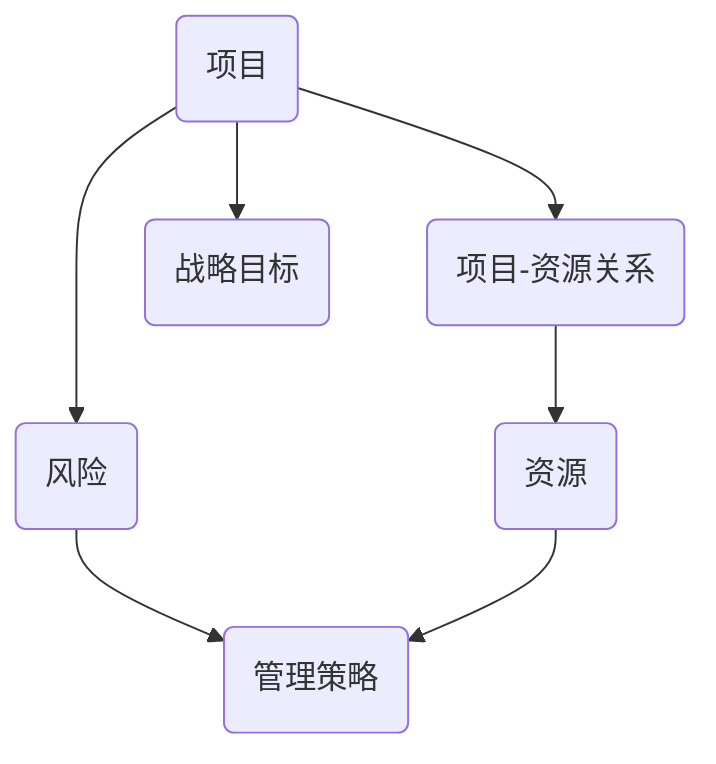

                 


# AI驱动的企业创新项目组合管理：风险平衡与资源优化

> 关键词：人工智能、项目组合管理、风险平衡、资源优化、创新项目、企业战略

> 摘要：  
在数字化转型的浪潮中，企业创新项目组合管理的复杂性日益增加，传统的项目管理方法已难以应对多变的市场环境和复杂的资源分配问题。本文将深入探讨如何利用人工智能技术优化企业创新项目组合管理，重点分析AI在风险平衡与资源优化中的应用，为企业管理者和技术从业者提供理论依据和实践指导。

---

# 第一部分: AI驱动的企业创新项目组合管理概述

## 第1章: 项目组合管理的背景与挑战

### 1.1 项目组合管理的基本概念
#### 1.1.1 项目组合管理的定义
项目组合管理（Portfolio Project Management）是指对企业内部多个项目进行筛选、优先级排序、资源分配和风险管理的过程，旨在实现企业战略目标的最大化。传统的项目组合管理依赖于人工判断和经验，容易受到主观因素和信息不全的影响。

#### 1.1.2 项目组合管理的核心要素
项目组合管理的核心要素包括：  
1. 项目筛选与优先级排序  
2. 资源分配与预算控制  
3. 风险评估与应对策略  
4. 项目执行与监控  

#### 1.1.3 项目组合管理的常见挑战
企业在项目组合管理中面临的主要挑战包括：  
1. 信息不完整或不及时  
2. 多目标冲突（如短期收益与长期战略目标的平衡）  
3. 资源分配的公平性与效率问题  
4. 复杂的市场环境和不确定性  

### 1.2 AI驱动的创新与项目组合管理
#### 1.2.1 AI在企业创新中的作用
人工智能技术的快速发展为企业创新提供了新的工具和方法。AI可以通过数据分析和预测模型，帮助企业在项目组合管理中做出更科学的决策。

#### 1.2.2 项目组合管理的数字化转型
数字化转型不仅是技术的升级，更是管理思维的转变。AI驱动的项目组合管理通过数据驱动的方式，实现从“经验管理”到“智能管理”的转变。

#### 1.2.3 AI如何优化项目组合管理
AI可以通过以下方式优化项目组合管理：  
1. 数据分析与预测，帮助识别高潜力项目  
2. 自动化资源分配，提高效率与公平性  
3. 实时风险评估与预警，降低项目失败风险  
4. 智能监控与调整，动态优化项目组合  

---

## 第2章: 企业创新项目组合管理的核心概念

### 2.1 风险平衡的核心原理
#### 2.1.1 风险的定义与分类
在项目组合管理中，风险可以分为市场风险、技术风险、资源风险和执行风险等。不同类型的风崄需要采取不同的管理策略。

#### 2.1.2 风险平衡的策略
风险平衡的策略包括：  
1. 风险规避：通过调整项目组合避免高风险项目  
2. 风险降低：通过优化资源分配降低项目风险  
3. 风险转移：将部分风险外包或通过保险分担  
4. 风险接受：在可接受范围内承担风险  

#### 2.1.3 风险平衡的数学模型
风险平衡的数学模型可以通过线性规划或非线性优化方法实现。例如，目标函数可以是最小化整体风险值，约束条件可以是资源限制和项目优先级。

### 2.2 资源优化的原理与方法
#### 2.2.1 资源分配的基本原则
资源优化的核心是最大化资源利用率，同时满足项目的优先级和战略目标。资源分配的基本原则包括：  
1. 按优先级分配资源  
2. 考虑资源的稀缺性  
3. 平衡短期与长期目标  

#### 2.2.2 资源优化的数学模型
资源优化的数学模型通常采用线性规划或整数规划方法。例如，目标函数可以是最大化项目组合的净现值（NPV），约束条件可以是资源限制和项目依赖关系。

#### 2.2.3 资源优化的算法框架
资源优化的算法框架包括：  
1. 简单贪心算法：按优先级顺序分配资源  
2. 精确算法：如线性规划求解器  
3. 近似算法：如遗传算法和模拟退火  

### 2.3 项目组合管理的系统性思考
#### 2.3.1 项目组合管理的系统架构
项目组合管理的系统架构包括：  
1. 数据层：数据采集与预处理  
2. 计算层：算法实现与模型训练  
3. 应用层：决策支持与人机交互  

#### 2.3.2 项目组合管理的边界与外延
项目组合管理的边界包括：  
1. 项目范围  
2. 资源限制  
3. 战略目标  

项目的外延包括：  
1. 项目之间的依赖关系  
2. 项目与组织战略的关联  
3. 项目与外部环境的互动  

#### 2.3.3 核心概念的实体关系图
以下是项目组合管理的核心实体关系图：



---

# 第二部分: AI驱动的项目组合管理核心理论

## 第3章: AI在项目组合管理中的应用原理

### 3.1 数据驱动的项目组合管理
#### 3.1.1 数据采集与预处理
数据驱动的项目组合管理需要收集以下数据：  
1. 项目基本信息（如项目名称、类型、预算）  
2. 历史项目数据（如成功概率、收益、风险）  
3. 市场数据（如行业趋势、竞争分析）  

数据预处理包括：  
1. 数据清洗（去除噪声数据）  
2. 数据转换（如标准化、归一化）  
3. 数据特征提取  

#### 3.1.2 数据分析与特征提取
数据分析的目的是识别影响项目成功的关键因素。例如，可以通过机器学习算法（如随机森林）提取特征重要性。

#### 3.1.3 数据驱动的决策支持
数据驱动的决策支持可以通过以下方式实现：  
1. 预测项目成功率  
2. 评估项目风险  
3. 优化资源分配  

### 3.2 AI算法在项目组合管理中的应用
#### 3.2.1 机器学习算法概述
常用的机器学习算法包括：  
1. 监督学习（如线性回归、支持向量机）  
2. 无监督学习（如聚类分析、主成分分析）  
3. 深度学习（如神经网络）  

#### 3.2.2 常见算法在项目组合管理中的应用
例如，可以使用随机森林算法预测项目的成功概率，使用聚类分析发现项目的相似性。

#### 3.2.3 算法选择与优化
算法选择的关键因素包括：  
1. 数据类型与规模  
2. 问题复杂性  
3. 可解释性要求  

### 3.3 AI驱动的项目组合管理模型
#### 3.3.1 模型构建的基本步骤
模型构建的基本步骤包括：  
1. 数据采集与预处理  
2. 特征工程  
3. 模型训练  
4. 模型验证  
5. 模型部署  

#### 3.3.2 模型的训练与验证
模型的训练与验证可以通过交叉验证和网格搜索优化超参数。

#### 3.3.3 模型的应用与优化
模型的应用包括：  
1. 预测项目成功率  
2. 评估项目风险  
3. 优化资源分配  

---

## 第4章: 项目组合管理的数学模型与算法

### 4.1 风险平衡的数学模型
#### 4.1.1 风险平衡的线性规划模型
目标函数：最大化项目组合的净现值（NPV）  
约束条件：资源限制、项目优先级  

#### 4.1.2 风险平衡的非线性优化模型
目标函数：最小化整体风险值  
约束条件：资源限制、项目依赖关系  

#### 4.1.3 风险平衡的动态规划模型
动态规划模型适用于项目有时间依赖关系的情况。

### 4.2 资源优化的数学模型
#### 4.2.1 资源分配的线性规划模型
目标函数：最大化项目组合的收益  
约束条件：资源限制、项目优先级  

#### 4.2.2 资源优化的网络流模型
网络流模型适用于资源分配的路径优化问题。

#### 4.2.3 资源优化的遗传算法
遗传算法是一种常用的启发式优化算法。

---

# 第三部分: 系统分析与架构设计方案

## 第5章: 系统分析与架构设计方案

### 5.1 项目组合管理的系统架构
#### 5.1.1 系统功能设计
系统功能包括：  
1. 项目信息管理  
2. 资源管理  
3. 风险管理  
4. 决策支持  

#### 5.1.2 系统架构设计
系统架构包括：  
1. 前端界面  
2. 后端逻辑  
3. 数据库  

#### 5.1.3 系统交互设计
系统交互包括：  
1. 用户输入  
2. 系统处理  
3. 结果输出  

---

## 第6章: 项目实战

### 6.1 环境安装
需要安装Python、Pandas、Scikit-learn等工具。

### 6.2 系统核心实现
以下是资源优化的Python代码示例：

```python
import numpy as np
import pandas as pd
from sklearn.ensemble import RandomForestRegressor

# 数据预处理
data = pd.read_csv('projects.csv')
X = data.drop('NPV', axis=1)
y = data['NPV']

# 特征工程
from sklearn.preprocessing import StandardScaler
scaler = StandardScaler()
X_scaled = scaler.fit_transform(X)

# 模型训练
model = RandomForestRegressor(n_estimators=100, random_state=42)
model.fit(X_scaled, y)

# 预测与优化
new_project = pd.DataFrame([[...]])  # 新项目数据
new_project_scaled = scaler.transform(new_project)
predicted_npv = model.predict(new_project_scaled)
```

### 6.3 代码应用解读与分析
通过代码实现资源优化和风险评估，帮助企业在实际项目中做出更科学的决策。

### 6.4 实际案例分析
通过实际案例分析，展示AI驱动的项目组合管理在企业中的应用效果。

---

## 第7章: 最佳实践、小结与拓展阅读

### 7.1 最佳实践
1. 数据质量是关键，确保数据的完整性和准确性。  
2. 模型选择要考虑可解释性和实用性。  
3. 定期更新模型，适应市场变化。  

### 7.2 小结
本文深入探讨了AI在企业创新项目组合管理中的应用，重点分析了风险平衡与资源优化的核心理论和实践方法。

### 7.3 注意事项
1. AI模型需要结合企业实际情况进行调整。  
2. 数据隐私和安全问题需要重视。  
3. 模型的可解释性是实际应用的关键。  

### 7.4 拓展阅读
推荐阅读以下书籍和论文：  
1. 《机器学习实战》  
2. 《项目组合管理的理论与实践》  
3. 《人工智能在企业管理中的应用》  

---

通过以上内容，本文为读者提供了一个全面的视角，帮助他们在实际工作中更好地利用AI技术优化企业创新项目组合管理。

