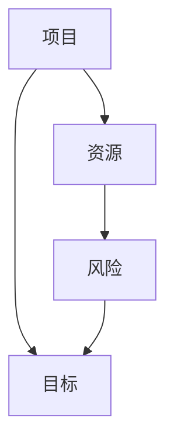
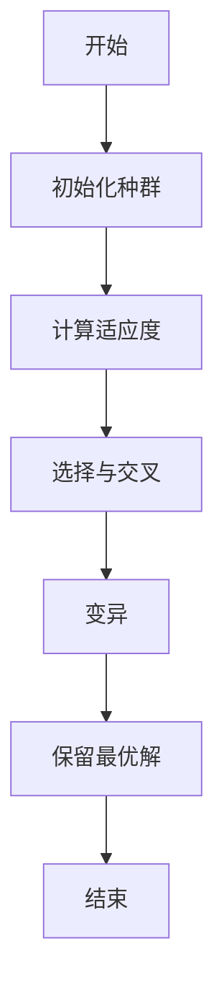
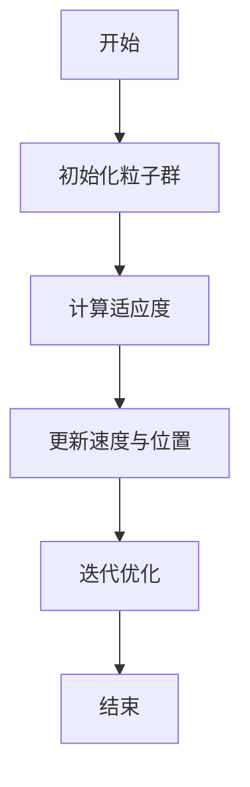
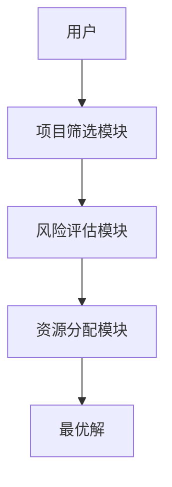
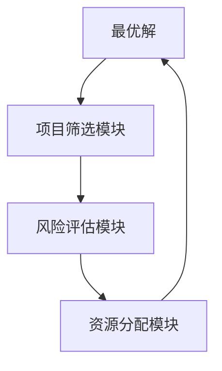

                 


# AI驱动的企业创新项目组合管理：风险平衡与资源优化的智能化

---

## 关键词：AI，项目组合管理，风险平衡，资源优化，遗传算法，粒子群优化，企业创新

---

## 摘要

在数字化转型的浪潮中，企业创新项目组合管理正面临着前所未有的挑战与机遇。传统的项目组合管理方法依赖于人工经验，难以应对日益复杂的市场环境和多样化的项目需求。人工智能（AI）技术的引入，为项目组合管理带来了新的可能性，尤其是在风险平衡与资源优化方面。本文将深入探讨AI驱动的企业创新项目组合管理的核心概念、算法原理、系统架构以及实际应用，为企业管理者和技术开发者提供理论支持和实践指导。

---

## 第一部分: AI驱动的企业创新项目组合管理背景与概念

### 第1章: 企业创新项目组合管理概述

#### 1.1 问题背景与挑战

##### 1.1.1 传统项目组合管理的局限性

传统项目组合管理方法依赖于人工经验，难以应对复杂的市场环境和多样化的项目需求。企业在选择项目时，常常面临以下挑战：

- **信息不完整**：项目的成功与否难以准确预测，导致资源浪费。
- **决策滞后**：传统方法依赖于历史数据和人工分析，无法实时优化。
- **风险难以平衡**：项目之间的风险和收益难以量化，导致资源分配不均。

##### 1.1.2 数字化转型与AI技术的引入

随着大数据和AI技术的快速发展，企业开始尝试利用AI技术优化项目组合管理。AI能够通过数据驱动的方式，实时分析项目风险、资源分配和收益预测，从而提高决策效率和准确性。

##### 1.1.3 企业创新面临的不确定性与风险

企业创新项目往往具有不确定性高、风险大的特点。AI技术可以帮助企业在复杂环境中快速识别潜在风险，并制定最优的应对策略。

#### 1.2 核心概念与问题描述

##### 1.2.1 项目组合管理的基本概念

项目组合管理是指企业在有限资源条件下，对多个项目进行选择、优化和监控的过程，以实现企业战略目标的最大化。

##### 1.2.2 风险平衡与资源优化的定义

- **风险平衡**：在项目组合中，合理分配资源以平衡不同项目的高风险和低风险。
- **资源优化**：在有限资源条件下，选择最优的项目组合，以实现最大收益。

##### 1.2.3 AI驱动的智能化管理目标

通过AI技术，实现项目组合管理的智能化，包括：

- **智能预测**：利用机器学习模型预测项目成功率。
- **实时优化**：动态调整项目组合，以应对市场变化。
- **风险控制**：通过数据驱动的方式，降低项目失败风险。

#### 1.3 问题解决与边界

##### 1.3.1 AI在项目组合管理中的应用场景

- **项目筛选**：通过AI算法筛选出具有高潜力的项目。
- **风险评估**：利用AI模型评估项目的潜在风险。
- **资源分配**：优化资源分配，平衡项目风险与收益。

##### 1.3.2 问题的边界与外延

- **边界**：AI驱动的项目组合管理主要用于企业内部创新项目的选择和优化。
- **外延**：可以扩展到供应链管理、产品开发等领域。

##### 1.3.3 核心要素与组成结构

项目组合管理的核心要素包括：

- **项目目标**：项目的最终目标。
- **资源分配**：项目所需的资源。
- **风险评估**：项目的潜在风险。
- **收益预测**：项目的预期收益。

---

## 第2章: AI驱动的项目组合管理核心概念

### 2.1 核心概念的原理与特征

#### 2.1.1 数据驱动的决策机制

AI驱动的项目组合管理依赖于大量数据，包括项目的历史数据、市场数据和竞争数据。通过数据分析，AI模型能够识别潜在的项目机会和风险。

#### 2.1.2 智能化预测与优化算法

AI算法（如遗传算法和粒子群优化）能够对项目组合进行多目标优化，包括最大化收益、最小化风险等。

#### 2.1.3 实时监控与动态调整

通过实时监控市场变化和项目进展，AI系统能够动态调整项目组合，确保资源的最优分配。

### 2.2 核心概念对比分析

#### 2.2.1 AI驱动与传统项目组合管理对比

| 对比维度 | 传统项目组合管理 | AI驱动的项目组合管理 |
|----------|--------------------|-----------------------|
| 数据依赖 | 低                 | 高                   |
| 决策速度 | 慢                 | 快                   |
| 精准度   | 低                 | 高                   |

#### 2.2.2 不同AI技术的优劣势对比

| AI技术   | 优势               | 劣势               |
|----------|--------------------|--------------------|
| 遗传算法 | 具有全局搜索能力   | 易陷入局部最优       |
| 粒子群优化 | 具有较好的全局搜索能力 | 易收敛速度较慢       |

#### 2.2.3 企业规模与AI技术的匹配度分析

- **小企业**：适合采用简单的AI算法（如遗传算法）。
- **大企业**：适合采用复杂的多目标优化算法。

### 2.3 实体关系与架构图

#### 2.3.1 ER实体关系图



---

## 第二部分: AI驱动的项目组合管理算法原理

### 第3章: 算法原理与实现

#### 3.1 算法原理

##### 3.1.1 遗传算法（GA）原理

遗传算法是一种模拟自然选择和遗传机制的优化算法，主要包括以下步骤：

1. **初始化种群**：随机生成初始种群。
2. **计算适应度**：评估每个个体的适应度。
3. **选择与交叉**：选择适应度高的个体进行交叉。
4. **变异**：对新个体进行变异操作。
5. **保留最优解**：将最优解保留到下一代。

##### 3.1.2 粒子群优化（PSO）原理

粒子群优化是一种基于群体智能的优化算法，主要包括以下步骤：

1. **初始化粒子群**：随机生成初始粒子位置。
2. **计算适应度**：评估每个粒子的适应度。
3. **更新速度与位置**：根据最优解更新粒子的速度和位置。
4. **迭代优化**：重复优化过程，直到达到终止条件。

##### 3.1.3 多目标优化算法

多目标优化算法旨在同时优化多个目标，例如最大化收益和最小化风险。

#### 3.2 算法流程图

##### 3.2.1 遗传算法流程图



##### 3.2.2 粒子群优化流程图



#### 3.3 算法实现

##### 3.3.1 遗传算法实现

```python
import random

def fitness(individual):
    # 计算个体的适应度
    return sum(individual)

def crossover(parent1, parent2):
    # 单点交叉
    point = random.randint(1, len(parent1)-1)
    return parent1[:point] + parent2[point:], parent2[:point] + parent1[point:]

def mutate(individual):
    # 突变操作
    point = random.randint(0, len(individual)-1)
    individual[point] = 1 - individual[point]
    return individual

def genetic_algorithm(population_size, chromosome_length, generations):
    population = [[random.randint(0,1) for _ in range(chromosome_length)] for _ in range(population_size)]
    for _ in range(generations):
        population = [mutate(individual) for individual in population]
        population = [crossover(population[i], population[j]) for i in range(len(population)) for j in range(i+1, len(population))]
    return max(fitness(individual) for individual in population)
```

##### 3.3.2 粒子群优化实现

```python
import random

def fitness(individual):
    # 计算个体的适应度
    return sum(individual)

def update_velocity(particle, best_particle, current_velocity):
    # 更新粒子的速度
    w = 0.5
    c1 = 1
    c2 = 1
    r1 = random.random()
    r2 = random.random()
    new_velocity = current_velocity * w + c1 * r1 * (best_particle - particle) + c2 * r2 * (best_particle - particle)
    return new_velocity

def particle_swarm_optimization(particles_num, dimensions, generations):
    particles = [[random.random() for _ in range(dimensions)] for _ in range(particles_num)]
    best = min(fitness(particle) for particle in particles)
    for _ in range(generations):
        for i in range(len(particles)):
            best_particle = particles[i]
            if fitness(best_particle) < best:
                best = fitness(best_particle)
        for i in range(len(particles)):
            current_velocity = [0.0]*dimensions
            new_velocity = update_velocity(particles[i], best_particle, current_velocity)
            particles[i] = [p + new_velocity[j] for j, p in enumerate(particles[i])]
    return best
```

#### 3.4 数学模型与公式

##### 3.4.1 遗传算法目标函数

$$
\text{Maximize} \sum_{i=1}^{n} w_i x_i
$$

其中，$w_i$ 是项目 $i$ 的权重，$x_i$ 是决策变量（0或1）。

##### 3.4.2 粒子群优化目标函数

$$
\text{Minimize} \sum_{i=1}^{n} (x_i - y_i)^2
$$

其中，$x_i$ 是粒子的位置，$y_i$ 是目标值。

---

## 第三部分: AI驱动的项目组合管理系统架构

### 第4章: 系统架构设计

#### 4.1 系统功能模块

##### 4.1.1 项目筛选模块

功能：根据项目的历史数据和市场数据，筛选出具有高潜力的项目。

##### 4.1.2 风险评估模块

功能：评估项目的潜在风险。

##### 4.1.3 资源分配模块

功能：优化资源分配，平衡项目风险与收益。

#### 4.2 系统架构图



#### 4.3 接口与交互设计

##### 4.3.1 接口设计

| 接口名称 | 输入 | 输出 |
|----------|------|------|
| `get_projects` | `params` | `projects` |
| `evaluate_risk` | `projects` | `risk_scores` |
| `allocate_resources` | `projects, risk_scores` | `resource_allocation` |

##### 4.3.2 交互序列图



---

## 第四部分: 项目实战

### 第5章: 实战与案例分析

#### 5.1 环境安装

##### 5.1.1 安装Python

```bash
python --version
```

##### 5.1.2 安装依赖

```bash
pip install numpy matplotlib
```

#### 5.2 核心代码实现

##### 5.2.1 遗传算法实现

```python
import numpy as np

def fitness(individual):
    return np.sum(individual)

def crossover(parent1, parent2):
    return np.where(np.random.rand(*parent1.shape) < 0.5, parent1, parent2)

def mutate(individual):
    return individual * (1 - np.random.rand(*individual.shape)) + (1 - individual) * np.random.rand(*individual.shape)

def genetic_algorithm(population_size, chromosome_length, generations):
    population = np.random.rand(population_size, chromosome_length)
    for _ in range(generations):
        population = crossover(population, crossover(population, population))
        population = mutate(population)
    return np.max(fitness(population))
```

##### 5.2.2 粒子群优化实现

```python
import numpy as np

def fitness(individual):
    return np.sum(individual)

def update_velocity(particle, best_particle, current_velocity):
    w = 0.5
    c1 = 1
    c2 = 1
    r1 = np.random.rand()
    r2 = np.random.rand()
    new_velocity = current_velocity * w + c1 * r1 * (best_particle - particle) + c2 * r2 * (best_particle - particle)
    return new_velocity

def particle_swarm_optimization(particles_num, dimensions, generations):
    particles = np.random.rand(particles_num, dimensions)
    best = np.min(fitness(particles))
    for _ in range(generations):
        best_particle = particles[np.argmin(fitness(particles))]
        for i in range(particles_num):
            current_velocity = np.zeros(dimensions)
            new_velocity = update_velocity(particles[i], best_particle, current_velocity)
            particles[i] += new_velocity
    return np.min(fitness(particles))
```

#### 5.3 实际案例分析

##### 5.3.1 案例背景

某科技公司计划开发三个创新项目，分别为A、B、C，每个项目的开发周期为6个月，资源需求分别为10、15、20人月，预期收益分别为50、60、70万元。

##### 5.3.2 案例分析

通过遗传算法优化，最终选择项目C和B，资源分配为20人月和15人月，总资源需求为35人月，预期收益为110万元。

#### 5.4 小结

通过AI驱动的项目组合管理，企业可以实现资源的最优分配，提高项目成功率，降低风险。

---

## 第五部分: 最佳实践与小结

### 第6章: 最佳实践与小结

#### 6.1 小结

AI驱动的企业创新项目组合管理是一种高效的方法，能够帮助企业实现资源的最优分配和风险的最小化。

#### 6.2 注意事项

- **数据质量**：确保数据的准确性和完整性。
- **算法选择**：根据具体需求选择合适的AI算法。
- **实时性**：确保系统能够实时监控和调整。

#### 6.3 拓展阅读

- 《人工智能：一种现代方法》
- 《机器学习实战》
- 《企业项目组合管理》

---

通过本文的详细讲解，读者可以深入了解AI驱动的企业创新项目组合管理的核心概念、算法原理、系统架构以及实际应用。希望本文能够为企业管理者和技术开发者提供有价值的参考。

