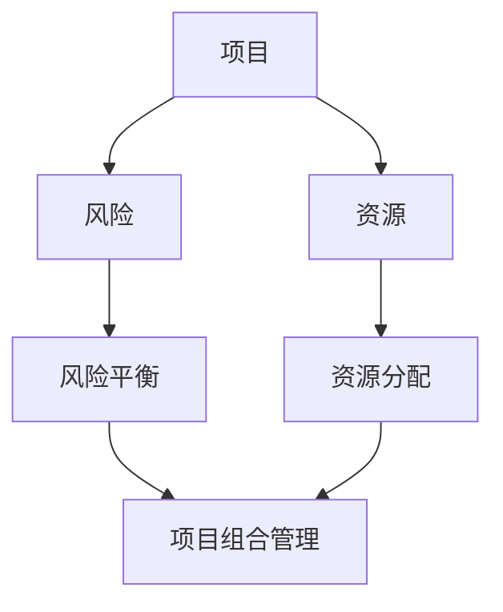

                 


# AI驱动的企业创新项目组合管理：风险平衡与资源最优分配

## 关键词：
- AI驱动
- 企业创新项目
- 项目组合管理
- 风险平衡
- 资源分配
- 优化算法

## 摘要：
本文探讨了如何利用人工智能技术优化企业创新项目的组合管理，特别是在风险平衡和资源分配方面。通过结合AI算法和项目管理理论，文章提出了创新的解决方案，帮助企业在复杂环境中实现项目组合的最优管理，提升创新效率和成功率。

---

# 第一部分：引言

## 第1章：问题背景与目标

### 1.1 问题背景
#### 1.1.1 企业创新项目的复杂性
企业在进行创新项目时，面临着多目标优化、资源有限和不确定性增加的挑战。传统的项目组合管理方法难以应对这些复杂性。

#### 1.1.2 传统项目组合管理的局限性
传统方法在处理复杂性和动态变化时效率低下，容易导致资源浪费和项目失败。

#### 1.1.3 AI技术在项目管理中的潜力
AI技术能够通过数据驱动的方法，提供实时分析和优化建议，显著提升项目组合管理的效率和效果。

### 1.2 问题描述
#### 1.2.1 风险平衡的挑战
创新项目存在高风险，如何在不同项目之间平衡风险是一个关键问题。

#### 1.2.2 资源分配的优化需求
有限的资源需要在多个项目之间合理分配，以实现最大收益。

#### 1.2.3 创新与效率的平衡
如何在追求创新的同时，保持管理效率，是一个需要平衡的问题。

### 1.3 问题解决目标
#### 1.3.1 提高项目组合管理的效率
通过AI技术，实现项目筛选、风险评估和资源分配的自动化。

#### 1.3.2 减少资源浪费
优化资源分配，避免资源在低效项目上的浪费。

#### 1.3.3 提升创新项目的成功率
通过AI驱动的分析，筛选出具有高潜力的项目，提高创新成功的概率。

### 1.4 问题的边界与外延
#### 1.4.1 项目组合管理的范围界定
明确项目组合管理的范围，包括项目筛选、风险评估和资源分配。

#### 1.4.2 AI技术的应用边界
AI技术在项目组合管理中的应用范围，包括数据收集、特征工程和模型训练。

#### 1.4.3 创新项目的特征与分类
根据项目的创新性、风险和资源需求，对项目进行分类和管理。

### 1.5 核心概念与联系
#### 1.5.1 核心概念原理
项目组合管理的核心原理，包括目标设定、资源分配和风险控制。

#### 1.5.2 核心概念属性特征对比表格
对比传统项目组合管理与AI驱动管理在效率、风险控制和资源分配方面的差异。

#### 1.5.3 ER实体关系图架构的 Mermaid 流程图
展示项目、风险、资源、风险平衡和项目组合管理之间的关系。

---

# 第二部分：核心概念与联系

## 第2章：核心概念原理

### 2.1 核心概念原理
#### 2.1.1 项目组合管理的原理
项目组合管理通过筛选、评估和分配资源，优化项目的整体收益。

#### 2.1.2 AI驱动的创新项目筛选机制
利用AI技术对项目进行数据驱动的筛选，识别高潜力项目。

#### 2.1.3 风险平衡与资源分配的数学模型
建立数学模型，量化风险和资源之间的关系，实现最优分配。

### 2.2 核心概念属性特征对比表格
| 特性               | 传统项目组合管理 | AI驱动项目组合管理 |
|--------------------|------------------|---------------------|
| 数据来源           | 主要依赖经验     | 数据驱动           |
| 分析效率           | 较低             | 高                  |
| 精准度             | 有限             | 高                  |
| 灵活性             | 较低             | 高                  |

### 2.3 ER实体关系图架构的 Mermaid 流程图


---

# 第三部分：算法原理讲解

## 第3章：AI驱动的创新项目筛选算法

### 3.1 算法原理
#### 3.1.1 数据预处理
对项目数据进行清洗、标准化和特征提取，为后续分析提供高质量数据。

#### 3.1.2 特征工程
选择关键特征，如项目规模、团队能力、技术复杂度等，构建特征向量。

#### 3.1.3 模型训练与调优
使用机器学习算法（如随机森林、支持向量机）训练模型，优化模型参数，提升预测准确性。

### 3.2 算法的数学模型和公式
创新项目筛选的数学模型如下：

$$
\text{概率} = \frac{\text{项目成功案例数}}{\text{总案例数}} \times 100\%
$$

其中，成功案例数是通过模型筛选出的高潜力项目中实际成功的数量。

---

# 第四部分：系统分析与架构设计方案

## 第4章：系统分析与架构设计

### 4.1 问题场景介绍
企业面临多个创新项目，需要通过AI驱动的系统进行项目组合管理。

### 4.2 系统功能设计
#### 4.2.1 领域模型 Mermaid 类图
展示系统的主要模块和功能关系。

#### 4.2.2 系统架构设计 Mermaid 架构图
展示系统整体架构，包括数据层、服务层和用户层。

#### 4.2.3 系统接口设计
定义系统与外部模块的接口，如数据输入、模型调用和结果输出。

#### 4.2.4 系统交互 Mermaid 序列图
展示用户与系统之间的交互流程，如数据输入、模型调用和结果展示。

---

# 第五部分：项目实战

## 第5章：项目实战

### 5.1 环境安装
安装必要的工具和库，如Python、机器学习库（scikit-learn、XGBoost）和数据处理工具。

### 5.2 系统核心实现源代码
#### 5.2.1 数据预处理代码
```python
import pandas as pd
from sklearn.preprocessing import StandardScaler

# 数据加载
data = pd.read_csv('projects.csv')

# 数据清洗
data = data.dropna()
data = data.drop_duplicates()

# 特征提取
features = data[['项目规模', '团队能力', '技术复杂度']]
scaler = StandardScaler()
scaled_features = scaler.fit_transform(features)
```

#### 5.2.2 模型训练代码
```python
from sklearn.ensemble import RandomForestClassifier
from sklearn.metrics import accuracy_score

model = RandomForestClassifier(n_estimators=100, random_state=42)
model.fit(scaled_features, data['成功标记'])
```

### 5.3 代码应用解读与分析
解释代码的功能，展示如何通过代码实现项目筛选和风险评估。

### 5.4 实际案例分析
通过具体案例，展示AI驱动的项目组合管理如何帮助企业在实际中优化项目组合。

### 5.5 项目小结
总结项目实施的经验和教训，提出改进建议。

---

# 第六部分：总结与展望

## 第6章：总结与展望

### 6.1 核心内容回顾
回顾文章的核心内容，包括AI驱动的项目组合管理方法和算法。

### 6.2 局限性分析
分析当前方法的局限性，如数据依赖性、模型解释性和实时性问题。

### 6.3 未来展望
展望AI在项目组合管理中的未来应用，如更复杂的模型和实时监控。

### 6.4 最佳实践 Tips
给出实际应用中的最佳实践建议，如数据质量管理、模型定期更新和团队协作。

---

通过以上结构，文章系统地介绍了AI驱动的企业创新项目组合管理的方法和实践，帮助读者理解如何在实际中应用这些技术。

