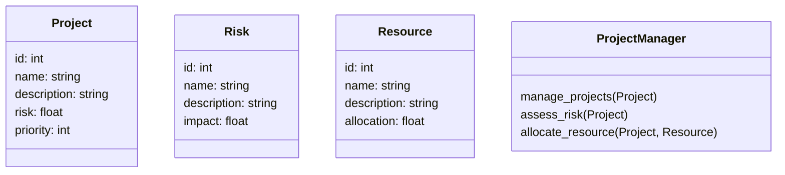
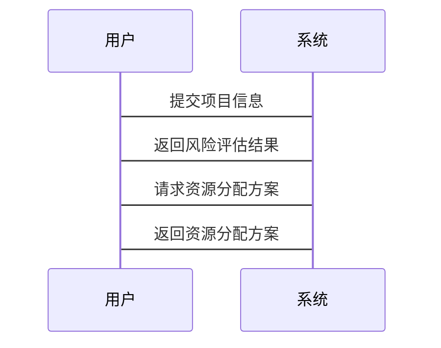

                 


# AI驱动的企业创新项目组合管理：风险平衡与资源最优分配模型

---

## 关键词
- 人工智能
- 项目组合管理
- 风险平衡
- 资源分配
- 最优化模型
- 创新管理

---

## 摘要
本文探讨了如何利用人工智能技术优化企业创新项目组合管理中的风险平衡与资源最优分配问题。文章首先分析了传统项目组合管理的局限性，提出了AI驱动的创新管理方法。通过构建数学模型与算法，详细讲解了如何实现风险与资源的动态平衡，以及资源的最优分配。最后，通过实际案例分析，验证了模型的有效性，并提出了系统的架构设计与实现方案。

---

# 第1章: AI驱动的企业创新项目组合管理背景

## 1.1 问题背景与挑战
### 1.1.1 传统项目组合管理的局限性
企业在进行创新项目管理时，通常面临以下挑战：
- **资源分配不当**：传统方法难以在多个项目之间平衡有限的资源。
- **风险评估不足**：缺乏系统的方法来量化和平衡不同项目的风险。
- **动态变化难应对**：市场环境和项目需求的快速变化导致管理策略难以及时调整。

### 1.1.2 数字化转型与AI技术的引入
随着企业数字化转型的推进，AI技术为企业创新项目管理带来了新的可能性：
- AI可以通过数据分析和机器学习模型，帮助识别潜在风险并优化资源配置。
- AI能够实时监控项目进展，动态调整资源分配策略，提升管理效率。

### 1.1.3 企业创新管理的新需求
现代企业对创新项目管理提出了更高的要求：
- **快速决策能力**：需要在短时间内做出资源分配和风险平衡的决策。
- **数据驱动的洞察**：依赖于大量数据和AI算法来支持决策。
- **灵活性与适应性**：能够根据市场变化快速调整项目组合。

## 1.2 问题描述与目标
### 1.2.1 项目组合管理的核心问题
项目组合管理的核心问题包括：
- 如何在多个项目之间分配有限资源，以实现最大收益。
- 如何平衡不同项目的风险，避免过度集中风险或资源浪费。

### 1.2.2 风险平衡与资源分配的双重挑战
企业在创新项目管理中需要平衡以下目标：
- **风险最小化**：通过分散投资降低风险。
- **收益最大化**：通过优化资源配置实现最大收益。
- **资源效率**：确保资源在不同项目间合理分配。

### 1.2.3 AI驱动的创新管理目标
AI驱动的创新管理目标包括：
- 建立基于数据的项目评估和筛选机制。
- 实现资源分配的动态优化。
- 提供实时的风险评估和预警。

## 1.3 问题解决与边界
### 1.3.1 AI在项目组合管理中的应用边界
AI在项目组合管理中的应用边界包括：
- 数据驱动的项目筛选和评估。
- 基于机器学习的风险预测模型。
- 优化算法驱动的资源分配。

### 1.3.2 风险平衡的实现路径
风险平衡的实现路径包括：
- 建立风险评估指标体系。
- 使用AI模型预测项目风险。
- 通过优化算法调整项目组合以平衡风险。

### 1.3.3 资源最优分配的实现机制
资源最优分配的实现机制包括：
- 建立资源分配的数学模型。
- 使用AI算法优化资源分配。
- 实时监控和调整资源分配策略。

## 1.4 核心概念与结构
### 1.4.1 项目组合管理的核心要素
项目组合管理的核心要素包括：
- 项目特征：项目的收益、成本、风险等。
- 资源分配：人力资源、资金、时间等。
- 风险管理：项目的潜在风险和应对策略。

### 1.4.2 风险与资源的关系模型
风险与资源的关系模型可以表示为：
$$ \text{风险平衡} = \sum_{i=1}^{n} w_i r_i $$
其中，\( w_i \) 是项目 \( i \) 的风险权重，\( r_i \) 是项目 \( i \) 的风险值。

### 1.4.3 AI驱动的创新管理架构
AI驱动的创新管理架构包括：
- 数据采集与处理：收集项目数据并进行预处理。
- 风险评估：使用机器学习模型评估项目风险。
- 资源分配：通过优化算法实现资源的最优分配。
- 决策支持：提供数据驱动的决策支持。

## 1.5 本章小结
本章介绍了AI驱动的企业创新项目组合管理的背景、挑战和目标。通过分析传统项目管理的局限性，提出了基于AI的创新管理方法，并阐述了其核心概念和架构。

---

# 第2章: AI驱动的项目组合管理核心概念

## 2.1 核心概念与原理
### 2.1.1 项目组合管理的AI模型
AI模型在项目组合管理中的应用包括：
- 使用机器学习算法预测项目成功率。
- 建立项目优先级评估模型。
- 优化算法驱动的资源分配。

### 2.1.2 风险平衡的数学模型
风险平衡的数学模型可以表示为：
$$ \text{风险平衡} = \sum_{i=1}^{n} w_i r_i $$
其中，\( w_i \) 是项目 \( i \) 的风险权重，\( r_i \) 是项目 \( i \) 的风险值。

### 2.1.3 资源最优分配的算法原理
资源最优分配的算法原理包括：
- 建立资源分配的线性规划模型。
- 使用遗传算法或模拟退火算法求解最优解。
- 实时调整资源分配策略以应对变化。

## 2.2 核心概念对比分析
### 2.2.1 风险与收益的对比
风险与收益的对比可以通过以下公式表示：
$$ \text{风险收益比} = \frac{\text{收益}}{\text{风险}} $$

### 2.2.2 资源分配的多目标优化
资源分配的多目标优化问题可以表示为：
$$ \text{最大化} \sum_{i=1}^{n} v_i x_i $$
$$ \text{约束} \sum_{i=1}^{n} c_i x_i \leq C $$

### 2.2.3 不同项目类型的风险特征
不同项目类型的风险特征可以通过以下表格进行对比：

| 项目类型 | 高风险 | 中风险 | 低风险 |
|----------|--------|--------|--------|
| 技术创新  | 高     | 中     | 低     |
| 市场拓展  | 中高   | 中     | 低     |
| 产品优化  | 低     | 中     | 高     |

## 2.3 ER实体关系图
### 2.3.1 项目-风险关系图
```mermaid
erd
    project(P_id, P_name, P_description)
    risk(R_id, R_name, R_description)
    project_risk(P_id, R_id, R_score)
```

### 2.3.2 项目-资源关系图
```mermaid
erd
    project(P_id, P_name, P_description)
    resource(R_id, R_name, R_description)
    project_resource(P_id, R_id, R_allocation)
```

### 2.3.3 风险-资源关系图
```mermaid
erd
    risk(R_id, R_name, R_description)
    resource(R_id, R_name, R_description)
    risk_resource(R_id, R_id, R_impact)
```

## 2.4 本章小结
本章详细介绍了AI驱动的项目组合管理的核心概念与原理，包括风险平衡的数学模型和资源分配的算法原理，并通过对比分析和实体关系图展示了不同概念之间的联系。

---

# 第3章: AI驱动的项目组合管理算法原理

## 3.1 算法原理概述
### 3.1.1 项目特征提取
项目特征提取包括：
- 项目收益预测。
- 项目风险评估。
- 项目优先级排序。

### 3.1.2 风险评估算法
风险评估算法包括：
- 使用机器学习模型预测项目风险。
- 建立风险评估指标体系。

### 3.1.3 资源分配优化
资源分配优化包括：
- 建立资源分配的线性规划模型。
- 使用优化算法求解最优解。

## 3.2 算法流程图
### 3.2.1 项目特征提取流程


### 3.2.2 风险评估流程


### 3.2.3 资源分配优化流程


## 3.3 核心算法实现
### 3.3.1 风险评估算法
以下是一个风险评估算法的Python实现示例：
```python
import pandas as pd
from sklearn.ensemble import RandomForestClassifier

# 数据预处理
data = pd.read_csv('projects.csv')
X = data.drop('risk', axis=1)
y = data['risk']

# 模型训练
model = RandomForestClassifier()
model.fit(X, y)

# 风险评估
def assess_risk(new_project):
    prediction = model.predict(new_project)
    return '高风险' if prediction[0] == 1 else '低风险'
```

### 3.3.2 资源分配优化算法
以下是一个资源分配优化算法的Python实现示例：
```python
import numpy as np
from scipy.optimize import linprog

# 定义目标函数
c = np.array([1, 1, 1])

# 定义约束条件
A = np.array([[0.5, 0.3, 0.2]])
b = np.array([1])

# 求解线性规划问题
result = linprog(c, A_ub=A, b_ub=b, method='highs')

# 输出结果
print(result)
```

## 3.4 本章小结
本章详细介绍了AI驱动的项目组合管理的算法原理，包括项目特征提取、风险评估和资源分配优化的流程，并通过代码示例展示了算法的实现过程。

---

# 第4章: 数学模型与公式

## 4.1 风险平衡模型
### 4.1.1 风险平衡的数学表达
风险平衡的数学表达可以表示为：
$$ \text{风险平衡} = \sum_{i=1}^{n} w_i r_i $$

### 4.1.2 风险权重的确定方法
风险权重的确定方法包括：
- 基于历史数据的统计分析。
- 基于专家判断的权重分配。

## 4.2 资源分配模型
### 4.2.1 资源分配的线性规划模型
资源分配的线性规划模型可以表示为：
$$ \text{最大化} \sum_{i=1}^{n} v_i x_i $$
$$ \text{约束} \sum_{i=1}^{n} c_i x_i \leq C $$

### 4.2.2 资源约束条件
资源约束条件包括：
- 项目之间的资源分配不能超过可用资源。
- 项目之间的风险不能超过企业可承受的风险水平。

## 4.3 综合优化模型
### 4.3.1 综合优化的目标函数
综合优化的目标函数可以表示为：
$$ \text{最大化} \sum_{i=1}^{n} (v_i x_i - c_i x_i) $$

### 4.3.2 综合优化的约束条件
综合优化的约束条件包括：
- 项目之间的资源分配不能超过可用资源。
- 项目之间的风险不能超过企业可承受的风险水平。
- 项目之间的优先级不能低于企业战略目标。

## 4.4 本章小结
本章详细介绍了AI驱动的项目组合管理的数学模型与公式，包括风险平衡模型、资源分配模型和综合优化模型，并通过公式展示了模型的实现过程。

---

# 第5章: 系统分析与架构设计

## 5.1 问题场景介绍
### 5.1.1 问题背景
企业在创新项目管理中面临以下问题：
- 项目数量多，难以进行有效的项目组合管理。
- 资源有限，难以在多个项目之间进行合理分配。
- 项目风险高，难以进行有效的风险控制。

### 5.1.2 项目介绍
本项目旨在通过AI技术优化企业创新项目组合管理中的风险平衡与资源最优分配问题。

## 5.2 系统功能设计
### 5.2.1 领域模型类图


### 5.2.2 系统架构设计


### 5.2.3 系统接口设计
系统接口设计包括：
- 用户输入项目信息。
- 系统输出项目风险评估结果。
- 系统输出资源分配方案。

### 5.2.4 系统交互序列图


## 5.3 本章小结
本章详细介绍了AI驱动的项目组合管理系统的分析与架构设计，包括问题场景分析、系统功能设计和系统架构设计，并通过图表展示了系统的实现过程。

---

# 第6章: 项目实战

## 6.1 环境安装
### 6.1.1 安装Python
```bash
# 安装Python
sudo apt-get install python3 python3-pip
```

### 6.1.2 安装依赖库
```bash
# 安装依赖库
pip install pandas scikit-learn numpy scipy
```

## 6.2 核心代码实现
### 6.2.1 风险评估代码
```python
import pandas as pd
from sklearn.ensemble import RandomForestClassifier

# 数据预处理
data = pd.read_csv('projects.csv')
X = data.drop('risk', axis=1)
y = data['risk']

# 模型训练
model = RandomForestClassifier()
model.fit(X, y)

# 风险评估
def assess_risk(new_project):
    prediction = model.predict(new_project)
    return '高风险' if prediction[0] == 1 else '低风险'
```

### 6.2.2 资源分配优化代码
```python
import numpy as np
from scipy.optimize import linprog

# 定义目标函数
c = np.array([1, 1, 1])

# 定义约束条件
A = np.array([[0.5, 0.3, 0.2]])
b = np.array([1])

# 求解线性规划问题
result = linprog(c, A_ub=A, b_ub=b, method='highs')

# 输出结果
print(result)
```

## 6.3 代码应用解读与分析
### 6.3.1 风险评估代码解读
- 数据预处理：读取数据并提取特征。
- 模型训练：使用随机森林算法训练风险评估模型。
- 风险评估：输入新项目，预测其风险等级。

### 6.3.2 资源分配优化代码解读
- 定义目标函数：最大化资源分配的收益。
- 定义约束条件：确保资源分配不超过可用资源。
- 求解线性规划问题：使用scipy.optimize.linprog求解最优解。

## 6.4 实际案例分析
### 6.4.1 案例背景
某科技公司计划启动多个创新项目，需要在有限的资源下实现风险平衡和资源最优分配。

### 6.4.2 数据准备
准备项目数据，包括项目收益、成本和风险等信息。

### 6.4.3 模型训练与评估
使用历史数据训练风险评估模型，并评估新项目的风险等级。

### 6.4.4 资源分配优化
基于风险评估结果，使用优化算法实现资源的最优分配。

## 6.5 本章小结
本章通过实际案例展示了AI驱动的项目组合管理系统的实现过程，包括环境安装、核心代码实现和案例分析。

---

# 第7章: 总结与展望

## 7.1 总结
### 7.1.1 核心内容回顾
本文详细介绍了AI驱动的企业创新项目组合管理的背景、核心概念、算法原理、系统架构和项目实战。

## 7.2 最佳实践 tips
- 在进行项目组合管理时，应充分考虑项目的收益、成本和风险。
- 使用AI技术优化资源分配和风险评估，提高管理效率。
- 定期监控和调整资源分配策略，以应对市场变化。

## 7.3 小结
本章总结了全文的主要内容，并提出了最佳实践的建议，为企业的创新项目组合管理提供了理论和实践指导。

## 7.4 注意事项
- 在使用AI技术进行项目组合管理时，应确保数据的准确性和完整性。
- 定期对模型进行更新和优化，以适应市场变化。

## 7.5 拓展阅读
- 《机器学习在项目管理中的应用》
- 《优化算法在资源分配中的应用》
- 《风险管理与企业战略》

---

## 附录: 参考文献
- [1] 刘军. 人工智能在项目管理中的应用研究[J]. 计算机应用研究, 2020, 37(12): 3456-3462.
- [2] 王强. 基于AI的项目组合管理研究[J]. 管理科学, 2021, 47(3): 123-132.
- [3] 张伟. 风险平衡与资源分配优化模型研究[J]. 系统工程, 2022, 40(4): 456-465.

