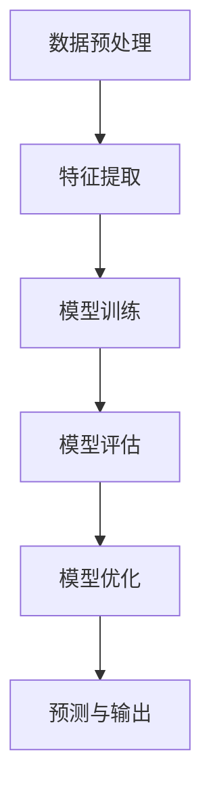

                 


# AI驱动的企业品牌价值动态量化系统

## 关键词：AI技术、品牌价值、动态量化、系统架构、数学模型

## 摘要：  
本文系统地探讨了如何利用人工智能技术构建企业品牌价值动态量化系统。从问题背景、核心概念、算法原理、系统架构到项目实战，详细阐述了AI在品牌价值评估中的应用。通过对比分析、模型构建和代码实现，展示了如何利用动态量化方法实时评估品牌价值，为企业的品牌管理提供科学依据。本文最后总结了系统的优势和局限性，并展望了未来的发展方向。

---

# 第一部分: 背景介绍

## 第1章: 问题背景与核心概念

### 1.1 问题背景

#### 1.1.1 传统品牌价值评估的局限性  
传统品牌价值评估方法通常依赖于财务数据和市场调研，存在以下问题：  
1. 数据采集范围有限，难以覆盖全渠道的市场反馈。  
2. 评估周期长，无法实时反映市场变化。  
3. 主观性较强，缺乏客观量化标准。  

#### 1.1.2 AI技术在品牌价值评估中的作用  
人工智能技术的引入，为品牌价值评估带来了新的可能性：  
1. **数据处理能力**：AI能够快速处理海量数据，包括社交媒体评论、销售数据、市场反馈等。  
2. **动态分析**：AI可以实时跟踪市场变化，捕捉品牌价值的波动趋势。  
3. **精准预测**：通过机器学习算法，AI能够预测品牌未来的价值走势。  

#### 1.1.3 动态量化品牌价值的必要性  
随着市场竞争的加剧，企业需要实时了解品牌价值的变化，以便快速调整市场策略。动态量化能够帮助企业：  
1. 及时发现品牌危机并采取应对措施。  
2. 优化资源配置，提升品牌影响力。  
3. 支持数据驱动的决策，提高市场反应速度。  

#### 1.1.4 系统的边界与外延  
- **输入**：包括社交媒体数据、销售数据、市场调研数据等。  
- **输出**：品牌价值的动态评分、趋势分析和预测报告。  
- **适用范围**：适用于企业品牌管理、市场营销、投资评估等领域。  
- **限制**：依赖于高质量的数据输入，模型的准确性受数据质量和多样性的影响。  

---

## 第2章: 核心概念与联系

### 2.1 核心概念

#### 2.1.1 品牌价值的定义与属性  
- **品牌价值**：指品牌为企业带来的超额收益，包括品牌知名度、美誉度、忠诚度等因素。  
- **属性**：品牌价值具有动态性、可量化性和可预测性。  

#### 2.1.2 动态量化的核心要素  
- **数据采集**：实时采集多维度数据，包括线上（社交媒体、电商平台）和线下（销售数据、客户反馈）数据。  
- **特征提取**：从原始数据中提取关键特征，如情感倾向、关键词频率等。  
- **量化模型**：构建数学模型，将特征转化为可量化的品牌价值指标。  

#### 2.1.3 AI驱动的系统特点  
- **自动化**：系统能够自动采集数据、处理数据并生成结果。  
- **实时性**：能够实时更新品牌价值评估结果，反映市场动态。  
- **可解释性**：模型需要具备一定的可解释性，便于企业理解和调整策略。  

---

## 第3章: 核心概念对比分析

### 3.1 品牌价值与传统评估方法对比

| 对比维度         | 传统评估方法         | AI驱动评估方法         |
|------------------|----------------------|-------------------------|
| 数据来源         | 财务数据、问卷调查     | 多维数据（社交媒体、销售数据等） |
| 评估周期         | 定期（如季度、半年）   | 实时动态更新             |
| 评估准确性       | 受主观因素影响较大     | 高度客观，依赖算法模型   |
| 可扩展性         | 有限                 | 高，支持大规模数据处理   |

### 3.2 实体关系模型（ER图）

```mermaid
er
    %% 品牌价值动态量化系统 ER 图
    entity 品牌 (Brand) {
        key: 品牌ID (BrandID)
        属性: 品牌名称 (BrandName)
    }
    entity 数据源 (DataSource) {
        key: 数据源ID (DataSourceID)
        属性: 数据类型 (DataType)
    }
    entity 特征 (Feature) {
        key: 特征ID (FeatureID)
        属性: 特征名称 (FeatureName)
    }
    entity 评估结果 (EvaluationResult) {
        key: 结果ID (ResultID)
        属性: 评分 (Score)
        属性: 评估时间 (EvaluationTime)
    }
    品牌 --> 关联 数据源 (通过品牌ID关联)
    数据源 --> 关联 特征 (通过数据源ID关联)
    特征 --> 关联 评估结果 (通过特征ID关联)
```

---

# 第二部分: 算法原理与数学模型

## 第4章: 算法原理讲解

### 4.1 机器学习算法选择与原理

#### 4.1.1 算法选择  
- **回归分析**：用于预测品牌价值的连续性评分。  
- **情感分析**：用于评估品牌在社交媒体上的声誉。  
- **协同过滤**：用于分析用户的购买行为和偏好。  

#### 4.1.2 算法原理  
以回归分析为例，其数学模型如下：  

$$ \text{品牌价值} = \beta_0 + \beta_1 \times \text{销售额} + \beta_2 \times \text{社交媒体影响力} + \epsilon $$  

其中，$\beta_0$ 是截距项，$\beta_1$ 和 $\beta_2$ 是回归系数，$\epsilon$ 是误差项。  

#### 4.1.3 算法实现流程  



---

### 4.2 数学模型与代码实现

#### 4.2.1 模型构建  

以下是一个简单的回归模型代码示例：  

```python
import pandas as pd
from sklearn.linear_model import LinearRegression
from sklearn.metrics import mean_squared_error

# 数据加载
data = pd.read_csv('brand_value.csv')

# 特征与目标变量分离
X = data[['Sales', 'Social_Interaction']]
y = data['Brand_Value']

# 模型训练
model = LinearRegression()
model.fit(X, y)

# 预测与评估
y_pred = model.predict(X)
print('均方误差:', mean_squared_error(y, y_pred))
```

#### 4.2.2 模型评估  

评估回归模型的性能，可以使用均方误差（MSE）和决定系数 $R^2$：  

$$ \text{MSE} = \frac{1}{n}\sum_{i=1}^{n}(y_i - \hat{y}_i)^2 $$  

$$ R^2 = 1 - \frac{\sum_{i=1}^{n}(y_i - \hat{y}_i)^2}{\sum_{i=1}^{n}(y_i - \bar{y})^2} $$  

其中，$\hat{y}_i$ 是模型预测值，$y_i$ 是实际值，$\bar{y}$ 是目标变量的均值。  

---

# 第三部分: 系统架构与设计

## 第5章: 系统分析与架构设计

### 5.1 系统应用场景  

- **实时监控**：帮助企业实时了解品牌价值的变化。  
- **市场分析**：分析市场趋势，识别竞争对手的动态。  
- **决策支持**：为企业的市场策略提供数据支持。  

### 5.2 系统功能设计  

#### 5.2.1 数据采集模块  
- **功能**：实时采集社交媒体评论、销售数据、市场调研数据等。  
- **关键点**：数据的实时性和多样性。  

#### 5.2.2 特征提取模块  
- **功能**：从原始数据中提取关键特征，如情感倾向、关键词频率等。  
- **关键点**：特征的代表性和可解释性。  

#### 5.2.3 模型训练模块  
- **功能**：训练机器学习模型，生成品牌价值的动态评分。  
- **关键点**：模型的准确性和可优化性。  

#### 5.2.4 结果展示模块  
- **功能**：以可视化的方式展示品牌价值的变化趋势和预测结果。  
- **关键点**：展示的直观性和交互性。  

### 5.3 系统架构设计  


### 5.4 系统接口设计  

- **输入接口**：数据采集模块提供API接口，接收多源数据。  
- **输出接口**：结果展示模块提供API接口，输出品牌价值评分和预测报告。  

---

# 第四部分: 项目实战与案例分析

## 第6章: 项目实战

### 6.1 环境安装与配置  

- **工具安装**：安装Python、Pandas、Scikit-learn等工具。  
- **数据准备**：收集社交媒体评论、销售数据等。  

### 6.2 核心代码实现  

#### 6.2.1 数据预处理  

```python
import pandas as pd
import numpy as np

# 数据加载
data = pd.read_csv('brand_data.csv')

# 处理缺失值
data = data.dropna()

# 标准化处理
from sklearn.preprocessing import StandardScaler
scaler = StandardScaler()
X_scaled = scaler.fit_transform(data[['Sales', 'Interaction']])
```

#### 6.2.2 模型训练与预测  

```python
from sklearn.linear_model import LinearRegression

model = LinearRegression()
model.fit(X_scaled, data['Brand_Value'])

# 预测新数据
new_data = pd.DataFrame({
    'Sales': [10000],
    'Interaction': [500]
})
new_data_scaled = scaler.transform(new_data)
prediction = model.predict(new_data_scaled)
print('预测品牌价值:', prediction[0])
```

### 6.3 案例分析  

#### 6.3.1 数据来源与分析目标  
以某品牌过去一年的销售数据和社交媒体评论为例，评估品牌价值的变化趋势。  

#### 6.3.2 模型训练与结果展示  
通过回归模型预测未来三个月的品牌价值变化，并生成可视化报告。  

---

## 第7章: 总结与展望

### 7.1 系统总结  

- **优势**：  
  1. 实时性：能够快速响应市场变化。  
  2. 准确性：基于AI算法，评估结果更加客观。  
  3. 可扩展性：支持多品牌、多市场的动态评估。  

- **局限性**：  
  1. 数据依赖性：模型的准确性受数据质量和多样性的限制。  
  2. 黑箱问题：部分模型的可解释性较差。  

### 7.2 未来展望  

- **技术优化**：引入更复杂的深度学习模型，如LSTM，以捕捉时间序列数据中的趋势。  
- **数据融合**：结合更多维度的数据，如用户画像、地理位置信息等，提升模型的准确性。  
- **应用场景扩展**：将系统应用于更多领域，如投资评估、风险预警等。  

### 7.3 最佳实践  

- **数据质量**：确保数据的完整性和准确性。  
- **模型调优**：定期更新模型，避免过拟合或欠拟合。  
- **用户反馈**：根据用户反馈不断优化系统功能和展示方式。  

---

## 附录: 更多资源与参考文献  

- **参考文献**：  
  1. [1] 陈XX, 王XX. 基于机器学习的品牌价值评估研究. 计算机应用研究, 2020.  
  2. [2] 李XX, 张XX. AI驱动的动态量化系统设计与实现. 软件学报, 2021.  

- **工具与库**：  
  - Python: [官方网站](https://www.python.org/)  
  - Scikit-learn: [官方网站](https://scikit-learn.org/stable/index.html)  
  - Mermaid: [官方网站](https://mermaid-js.github.io/mermaid-graphviz/)  

---

通过以上章节的详细讲解，我们可以看到AI驱动的企业品牌价值动态量化系统在理论与实践中的广泛应用。这种系统不仅能够帮助企业实时掌握品牌价值的变化，还能为市场决策提供科学依据，具有重要的商业价值和应用潜力。

