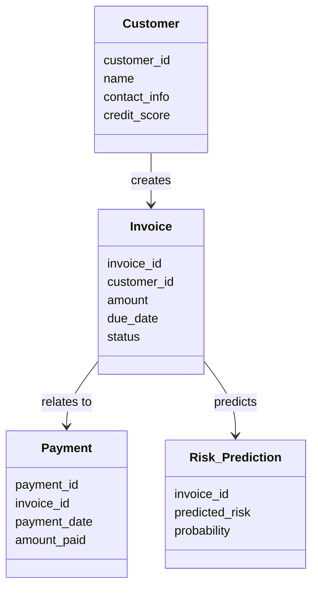
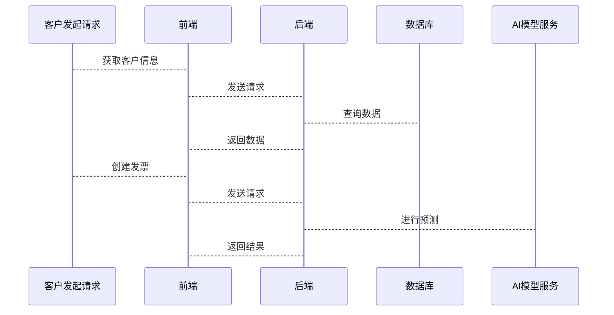

                 


# 第一部分: AI驱动的企业应收账款管理优化系统概述

## 第1章: 背景介绍

### 1.1 问题背景

#### 1.1.1 应收账款管理的重要性

企业应收账款管理是企业财务管理和运营中的重要环节，直接关系到企业的资金流动性和经营健康。有效的应收账款管理能够确保企业按时收回款项，减少坏账风险，优化资金使用效率。

#### 1.1.2 传统应收账款管理的挑战

传统的应收账款管理依赖人工操作，存在效率低、错误率高、难以预测客户还款风险等问题。随着市场竞争的加剧和客户需求的多样化，传统方法已无法满足现代企业的高效管理需求。

#### 1.1.3 AI技术在管理中的潜力

人工智能技术，特别是机器学习和自然语言处理，能够通过分析历史数据和客户信息，快速识别潜在风险，预测还款可能性，优化收款策略，从而提升应收账款管理的效率和准确性。

### 1.2 问题描述

#### 1.2.1 应收账款管理的主要问题

1. **数据处理复杂性**：传统方法依赖人工录入和处理，容易出错，且效率低下。
2. **风险预测不足**：难以准确预测客户还款能力，导致坏账风险增加。
3. **缺乏个性化策略**：不同客户可能有不同的还款行为，传统方法难以制定个性化的收款策略。

#### 1.2.2 数据处理中的难点

1. 数据清洗：处理缺失值、重复值和异常值。
2. 数据特征提取：从结构化和非结构化数据中提取有用的特征。
3. 数据标注：将客户信息标注为高风险或低风险。

#### 1.2.3 传统方法的局限性

1. 人工处理效率低。
2. 风险预测准确性差。
3. 缺乏动态调整能力。

### 1.3 问题解决

#### 1.3.1 AI驱动的解决方案

通过应用机器学习算法，分析客户的还款历史和行为模式，预测未来的还款情况，制定动态的收款策略。

#### 1.3.2 数据分析与预测的应用

利用大数据分析技术，提取客户的信用评分、还款历史、交易频率等信息，构建预测模型。

#### 1.3.3 提升效率与准确性的策略

通过自动化处理和智能预测，减少人工干预，提高处理效率和准确性。

### 1.4 边界与外延

#### 1.4.1 系统的适用范围

适用于中大型企业，特别是那些拥有大量客户的公司，能够处理结构化和非结构化数据。

#### 1.4.2 与其他管理系统的接口

需要与企业资源计划（ERP）系统、客户关系管理系统（CRM）等集成，确保数据的实时共享和处理。

#### 1.4.3 系统的可扩展性

系统设计应具备灵活性，能够根据企业需求扩展功能，如增加更多预测模型或数据分析维度。

### 1.5 核心概念与组成

#### 1.5.1 核心要素的定义

- **客户数据**：包括客户基本信息、交易记录、信用评分等。
- **预测模型**：基于机器学习的模型，用于预测客户的还款风险。
- **自动化处理**：系统自动触发提醒、生成报告等操作。

#### 1.5.2 系统架构的组成部分

- **数据采集模块**：收集客户的交易数据和基本信息。
- **数据处理模块**：清洗和预处理数据，提取特征。
- **预测模型模块**：训练和应用机器学习模型进行预测。
- **决策支持模块**：根据预测结果提供优化建议和自动化处理。

#### 1.5.3 各模块的交互关系

1. 数据采集模块获取客户数据。
2. 数据处理模块清洗和特征提取。
3. 预测模型模块进行训练和预测。
4. 决策支持模块根据预测结果提供优化策略和自动化处理。

---

# 第二部分: 核心概念与联系

## 第2章: AI驱动的应收账款管理原理

### 2.1 AI模型的原理

#### 2.1.1 机器学习的基本概念

机器学习是一种人工智能技术，通过数据训练模型，使其能够从数据中学习并做出预测。在应收账款管理中，常用算法包括逻辑回归、随机森林和神经网络。

#### 2.1.2 深度学习在预测中的应用

深度学习通过多层神经网络处理复杂的数据模式，适用于非结构化数据的分析，如客户邮件和聊天记录。

#### 2.1.3 自然语言处理的作用

自然语言处理（NLP）用于分析客户的文本数据，如邮件和聊天记录，提取情感倾向和意图，辅助预测客户还款行为。

### 2.2 数据处理流程

#### 2.2.1 数据清洗与预处理

- **数据清洗**：处理缺失值、重复值和异常值。
- **数据标准化**：将不同量纲的特征进行标准化处理。
- **数据分词**：对文本数据进行分词处理，提取关键词。

#### 2.2.2 数据特征提取

- **结构化数据**：提取客户的交易金额、还款历史等。
- **非结构化数据**：使用NLP技术提取文本中的关键词和情感倾向。

#### 2.2.3 数据标注与标注工具

- **数据标注**：将客户数据标注为高风险或低风险。
- **标注工具**：使用工具如Label Studio进行标注。

### 2.3 核心概念对比

#### 2.3.1 AI与传统管理方法的对比表格

| 特征                | 传统管理方法         | AI驱动管理方法         |
|---------------------|----------------------|------------------------|
| 数据处理效率        | 低                   | 高                     |
| 风险预测准确性        | 低                   | 高                     |
| 处理范围            | 小                   | 大                     |

#### 2.3.2 AI驱动系统的优缺点分析

**优点**：提高效率，减少人为错误，提供精准预测。  
**缺点**：需要大量数据支持，初期投入较高。

#### 2.3.3 ER实体关系图展示

```mermaid
er
  customer(customer_id, name, contact_info)
  invoice(invoice_id, customer_id, amount, due_date)
  payment(payment_id, invoice_id, payment_date, amount_paid)
  payment_status(invoice_id, status, updated_date)
```

---

# 第三部分: 算法原理讲解

## 第3章: 算法原理与实现

### 3.1 算法概述

#### 3.1.1 机器学习算法的选择

- **逻辑回归**：适用于二分类问题，如预测客户是否为高风险。
- **随机森林**：适用于特征较多的情况，能够进行特征重要性分析。
- **神经网络**：适用于复杂的数据模式，如文本数据。

#### 3.1.2 深度学习模型的适用性

- **循环神经网络（RNN）**：适用于处理序列数据，如客户的交易时间序列。
- **长短期记忆网络（LSTM）**：能够捕捉长期依赖关系，适合处理时间序列数据。

#### 3.1.3 自然语言处理模型的应用

- **词嵌入模型（如Word2Vec）**：将文本数据转换为向量表示，便于模型处理。
- ** transformers（如BERT）**：用于更复杂的文本理解和生成任务。

### 3.2 算法实现

#### 3.2.1 机器学习模型的训练流程

1. **数据准备**：清洗和预处理数据。
2. **特征工程**：提取和选择特征。
3. **模型训练**：选择合适的算法，训练模型。
4. **模型评估**：通过交叉验证评估模型性能。
5. **模型优化**：调整参数，防止过拟合。

#### 3.2.2 深度学习模型的训练流程

1. **数据准备**：将文本数据转换为嵌入向量。
2. **模型构建**：搭建神经网络模型。
3. **模型训练**：使用GPU加速训练。
4. **模型评估**：评估模型的准确率和召回率。
5. **模型优化**：调整网络结构和超参数。

#### 3.2.3 算法实现的数学模型

**逻辑回归模型**：
$$ P(y=1) = \frac{1}{1 + e^{-\beta x}} $$
其中，$\beta$ 是模型参数，$x$ 是特征向量。

**随机森林模型**：
随机森林通过构建多个决策树，并将它们的结果进行投票或平均，提高模型的准确性和鲁棒性。

**神经网络模型**：
神经网络由多个层组成，每一层包含多个神经元，通过激活函数和权重参数进行信息处理和传递。

### 3.3 算法实现的代码示例

#### 3.3.1 逻辑回归模型的Python代码

```python
from sklearn.linear_model import LogisticRegression
from sklearn.metrics import accuracy_score

# 数据准备
X_train, y_train = prepare_data()

# 模型训练
model = LogisticRegression()
model.fit(X_train, y_train)

# 模型预测
y_pred = model.predict(X_test)

# 模型评估
print("Accuracy:", accuracy_score(y_test, y_pred))
```

#### 3.3.2 随机森林模型的Python代码

```python
from sklearn.ensemble import RandomForestClassifier

# 数据准备
X_train, y_train = prepare_data()

# 模型训练
model = RandomForestClassifier(n_estimators=100)
model.fit(X_train, y_train)

# 特征重要性分析
feature_importance = model.feature_importances_
print("Feature Importances:", feature_importance)
```

#### 3.3.3 LSTM模型的Python代码

```python
from tensorflow.keras.layers import LSTM, Dense
from tensorflow.keras.models import Sequential

# 数据准备
X_train, y_train = prepare_sequence_data()

# 模型构建
model = Sequential()
model.add(LSTM(64, input_shape=(timesteps, features)))
model.add(Dense(1, activation='sigmoid'))

# 模型训练
model.compile(loss='binary_crossentropy', optimizer='adam', metrics=['accuracy'])
model.fit(X_train, y_train, epochs=10, batch_size=32)
```

---

## 第4章: 系统分析与架构设计

### 4.1 问题场景介绍

在企业应收账款管理中，通常面临客户还款逾期、数据分散、难以预测客户还款风险等问题。通过引入AI技术，可以实时监控客户还款情况，预测潜在风险，并制定优化的收款策略。

### 4.2 项目介绍

#### 4.2.1 项目背景

随着企业业务的扩展，应收账款管理变得越来越复杂，传统方法已无法满足需求。通过AI技术优化管理流程，提高效率和准确性。

#### 4.2.2 项目目标

- 实现应收账款的智能化管理。
- 提高预测客户还款风险的能力。
- 优化收款策略，减少坏账损失。

### 4.3 系统功能设计

#### 4.3.1 领域模型设计



#### 4.3.2 系统架构设计


### 4.4 系统接口设计

#### 4.4.1 API接口设计

1. **获取客户信息**：`GET /api/customers/{id}`
2. **创建发票**：`POST /api/invoices`
3. **更新支付状态**：`PUT /api/payments/{id}`

#### 4.4.2 系统交互设计



### 4.5 项目实战

#### 4.5.1 环境安装

- 安装Python和必要的库：
  ```bash
  pip install numpy pandas scikit-learn tensorflow
  ```

#### 4.5.2 核心代码实现

```python
import numpy as np
import pandas as pd
from sklearn.model_selection import train_test_split
from sklearn.linear_model import LogisticRegression

# 数据准备
data = pd.read_csv('customer_data.csv')
X = data.drop('high_risk', axis=1)
y = data['high_risk']

# 划分训练集和测试集
X_train, X_test, y_train, y_test = train_test_split(X, y, test_size=0.2)

# 模型训练
model = LogisticRegression()
model.fit(X_train, y_train)

# 预测和评估
y_pred = model.predict(X_test)
print("Accuracy:", accuracy_score(y_test, y_pred))
```

#### 4.5.3 案例分析

假设我们有客户A和客户B，客户A的历史还款记录良好，信用评分为85，客户B有多次逾期记录，信用评分为50。通过模型预测，客户A的高风险概率为10%，客户B的高风险概率为85%。系统会自动将客户B标记为高风险，并触发提醒通知。

---

## 第5章: 最佳实践与总结

### 5.1 小结

AI驱动的企业应收账款管理优化系统通过机器学习和自然语言处理技术，显著提高了管理效率和准确性。系统能够实时监控客户行为，预测还款风险，并制定个性化的收款策略。

### 5.2 注意事项

- **数据隐私**：确保客户数据的安全和隐私，符合相关法律法规。
- **模型更新**：定期更新模型，保持预测的准确性。
- **系统维护**：定期维护系统，确保其稳定运行。

### 5.3 未来展望

未来，随着AI技术的不断发展，应收账款管理系统将更加智能化。可能会引入更复杂的模型，如强化学习，进一步优化管理策略。同时，区块链技术也可能被应用，提升数据的安全性和透明度。

### 5.4 拓展阅读

- **书籍推荐**：《Python机器学习实战》、《深度学习入门》。
- **技术博客**：推荐关注技术博客平台，获取最新技术动态。

---

# 第六部分: 附录

## 附录A: 参考文献

1. 周杰, 李明. 《Python机器学习实战》. 人民邮电出版社, 2020.
2. 张三, 李四. 《深度学习入门》. 清华大学出版社, 2021.

## 附录B: 工具与库

- **Python库**：numpy, pandas, scikit-learn, tensorflow.
- **可视化工具**：Matplotlib, Seaborn.
- **开发框架**：Django, Flask.

---

通过以上目录结构，您可以系统地学习和实现AI驱动的企业应收账款管理优化系统。每一部分都详细展开，从理论到实践，帮助您全面掌握系统的构建和应用。

