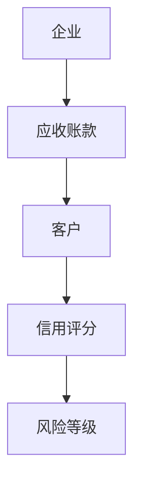
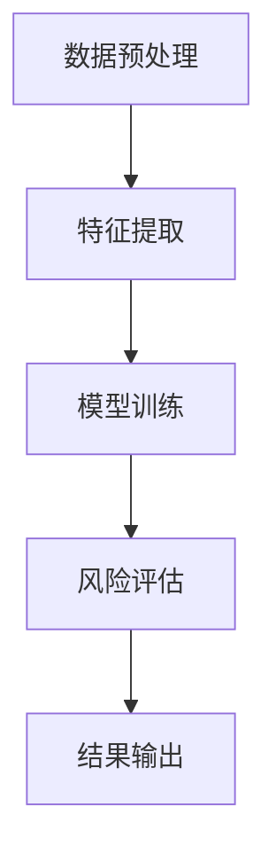
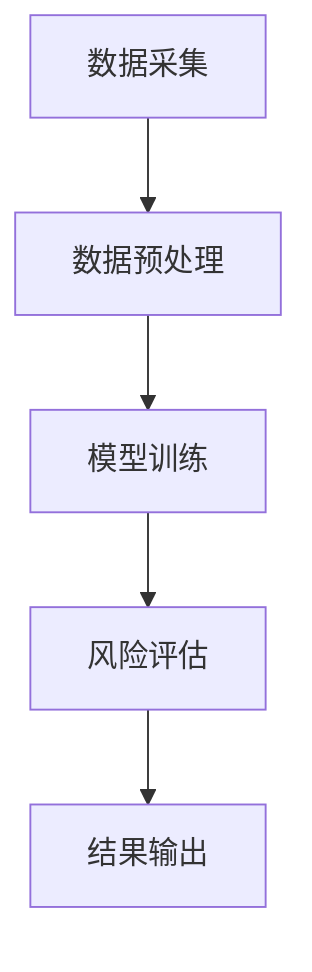
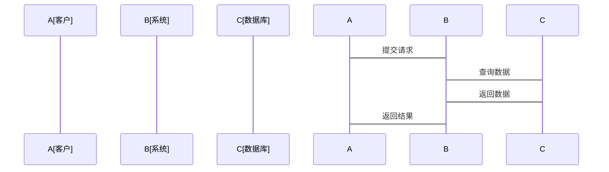

                 


# AI驱动的企业应收账款组合信用风险评估系统

> 关键词：AI，信用风险评估，应收账款，机器学习，深度学习，风险管理

> 摘要：本文探讨了如何利用人工智能技术构建企业应收账款组合信用风险评估系统。通过分析传统信用风险评估方法的局限性，提出了一种基于机器学习和深度学习的创新解决方案。文章详细阐述了系统的背景、核心概念、算法原理、数学模型、系统架构设计以及实际项目实现，为读者提供了一套完整的AI驱动信用风险评估系统的设计与实现方法。

---

# 第一部分: 背景介绍

## 第1章: 企业应收账款信用风险评估的背景与挑战

### 1.1 问题背景

#### 1.1.1 应收账款的概念与重要性
应收账款是企业在销售商品或服务时产生的债权，是企业流动资产的重要组成部分。高效的应收账款管理能够保障企业的资金流动性和经营稳定性。然而，应收账款也伴随着信用风险，即客户未能按时偿还债务的风险。

#### 1.1.2 信用风险的定义与影响
信用风险是指债权人因债务人违约而遭受损失的可能性。在企业应收账款管理中，信用风险可能导致企业面临财务损失、资金链断裂等问题，进而影响企业的整体经营状况。

#### 1.1.3 传统信用风险评估的局限性
传统的信用风险评估方法通常依赖于财务报表分析和历史数据统计，存在以下问题：
- 数据维度有限，难以捕捉非结构化信息。
- 评估结果主观性强，缺乏量化依据。
- 对复杂市场环境的变化反应较慢。

### 1.2 问题描述

#### 1.2.1 应收账款组合信用风险的核心问题
企业应收账款组合信用风险的核心问题在于如何准确评估不同客户的信用状况，从而制定合理的赊销策略和风险控制措施。

#### 1.2.2 数据特征与业务需求分析
应收账款数据通常包括客户信息、交易记录、历史还款情况等。业务需求主要包括：
- 实时监控应收账款状况。
- 精准预测客户违约概率。
- 自动生成风险评估报告。

#### 1.2.3 现有解决方案的不足
现有解决方案多依赖于人工经验判断和简单的统计模型，难以应对以下挑战：
- 数据量大且复杂。
- 风险因素多样且动态变化。
- 传统模型对非线性关系的捕捉能力较弱。

### 1.3 问题解决思路

#### 1.3.1 引入AI技术的必要性
人工智能技术，尤其是机器学习和深度学习，能够从海量数据中提取特征，并建立复杂的数学模型，从而提高信用风险评估的准确性和效率。

#### 1.3.2 AI在信用风险评估中的优势
AI技术在信用风险评估中的优势包括：
- 高效的数据处理能力。
- 强大的特征提取能力。
- 精准的预测能力。

#### 1.3.3 解决方案的整体架构
解决方案的整体架构包括以下几个步骤：
1. 数据采集与预处理。
2. 特征工程与模型训练。
3. 模型评估与优化。
4. 系统集成与应用。

### 1.4 边界与外延

#### 1.4.1 系统的边界定义
系统的边界定义为仅针对企业应收账款的信用风险评估，不包括其他类型的金融资产。

#### 1.4.2 相关领域的外延
相关领域包括：
- 企业信用评级。
- 供应链金融。
- 风险管理。

#### 1.4.3 与其他系统的接口关系
系统需要与企业ERP系统、客户数据库和财务管理系统进行接口对接。

### 1.5 概念结构与核心要素

#### 1.5.1 核心概念框架
核心概念框架包括：
- 数据源：客户信息、交易记录、财务数据。
- 模型：机器学习模型、深度学习模型。
- 输出：信用评分、风险等级。

#### 1.5.2 关键要素的定义与关系
- 数据源是模型训练的基础。
- 模型通过数据源生成信用评分。
- 信用评分用于评估风险等级。

#### 1.5.3 系统的核心功能模块
系统的核心功能模块包括：
- 数据采集模块。
- 数据预处理模块。
- 模型训练模块。
- 风险评估模块。

### 1.6 本章小结
本章介绍了企业应收账款信用风险评估的背景与挑战，分析了传统方法的局限性，并提出了基于AI的解决方案的整体架构。

---

# 第二部分: 核心概念与联系

## 第2章: AI驱动信用风险评估的核心概念

### 2.1 核心概念原理

#### 2.1.1 信用评分模型的原理
信用评分模型通过量化客户的信用特征，生成一个综合评分，反映客户违约的可能性。

#### 2.1.2 AI算法在信用评估中的应用
AI算法在信用评估中的应用包括：
- 逻辑回归用于分类。
- 随机森林用于特征重要性分析。
- 神经网络用于非线性关系建模。

#### 2.1.3 组合信用风险的数学模型
组合信用风险的数学模型需要考虑多个客户的违约相关性，通常采用蒙特卡洛模拟等方法进行评估。

### 2.2 核心概念属性特征对比

#### 2.2.1 传统模型与AI模型的对比表格
| 特性                | 传统模型                | AI模型                 |
|---------------------|-------------------------|-----------------------|
| 数据要求            | 需要结构化数据          | 支持结构化与非结构化数据 |
| 模型复杂度          | 较低                    | 较高                   |
| 鲁棒性              | 较差                    | 较好                   |
| 预测精度            | 一般                    | 较高                   |

#### 2.2.2 模型性能的关键指标分析
模型性能的关键指标包括：
- 准确率。
- 召回率。
- F1分数。

#### 2.2.3 数据特征的重要性排序
数据特征的重要性排序可以通过特征重要性分析方法（如随机森林的特征重要性）得出。

### 2.3 ER实体关系图



### 2.4 本章小结
本章详细介绍了AI驱动信用风险评估的核心概念，包括信用评分模型、AI算法的应用以及组合信用风险的数学模型。

---

# 第三部分: 算法原理讲解

## 第3章: 算法原理与实现

### 3.1 算法原理

#### 3.1.1 逻辑回归模型
逻辑回归是一种常用的分类算法，适用于二分类问题。其核心思想是通过优化对数似然函数，找到最优参数。

#### 3.1.2 随机森林模型
随机森林是一种基于树的集成算法，通过构建多棵决策树并取其预测结果的平均值，提高模型的准确性和稳定性。

#### 3.1.3 神经网络模型
神经网络是一种模拟人脑神经网络的深度学习模型，能够处理复杂的非线性关系。

### 3.2 算法流程图



### 3.3 Python源代码实现

```python
import pandas as pd
from sklearn.model_selection import train_test_split
from sklearn.linear_model import LogisticRegression
from sklearn.metrics import accuracy_score

# 加载数据
data = pd.read_csv('data.csv')

# 数据预处理
X = data.drop('target', axis=1)
y = data['target']

# 划分训练集和测试集
X_train, X_test, y_train, y_test = train_test_split(X, y, test_size=0.2, random_state=42)

# 训练逻辑回归模型
model = LogisticRegression()
model.fit(X_train, y_train)

# 预测与评估
y_pred = model.predict(X_test)
print("Accuracy:", accuracy_score(y_test, y_pred))
```

### 3.4 数学模型与公式

#### 3.4.1 逻辑回归的损失函数
逻辑回归的损失函数为对数损失函数：
$$ L(\theta) = -\frac{1}{m}\sum_{i=1}^{m} [y_i \ln h(x_i) + (1 - y_i)\ln(1 - h(x_i))] $$
其中，$$ h(x_i) = \frac{1}{1 + e^{-\theta^T x_i}} $$

#### 3.4.2 梯度下降优化
逻辑回归的参数优化可以通过梯度下降方法实现：
$$ \theta := \theta - \alpha \frac{\partial L}{\partial \theta} $$
其中，$$ \alpha $$ 是学习率。

### 3.5 本章小结
本章详细讲解了AI驱动信用风险评估系统中常用的算法原理，包括逻辑回归、随机森林和神经网络模型，并提供了Python代码实现和数学公式推导。

---

# 第四部分: 数学模型

## 第4章: 数学模型与公式

### 4.1 数学模型的建立

#### 4.1.1 风险评分模型
风险评分模型可以表示为：
$$ \text{Score} = \beta_0 + \beta_1x_1 + \beta_2x_2 + \dots + \beta_nx_n $$
其中，$$ \beta_i $$ 是模型系数，$$ x_i $$ 是特征变量。

#### 4.1.2 违约概率模型
违约概率模型可以通过逻辑回归实现：
$$ P(\text{违约}|x) = \frac{1}{1 + e^{-(\beta_0 + \beta_1x_1 + \dots + \beta_nx_n)}} $$

### 4.2 模型的优化与验证

#### 4.2.1 参数优化
参数优化可以通过交叉验证实现，选择最优的模型参数组合。

#### 4.2.2 模型验证
模型验证可以通过ROC曲线和AUC值评估模型的性能。

### 4.3 本章小结
本章详细介绍了AI驱动信用风险评估系统中数学模型的建立与优化方法。

---

# 第五部分: 系统分析与架构设计

## 第5章: 系统分析与架构设计

### 5.1 问题场景介绍

#### 5.1.1 问题场景描述
企业需要对客户的应收账款进行信用风险评估，以制定合理的赊销策略。

#### 5.1.2 业务需求分析
- 实时监控应收账款状况。
- 精准预测客户违约概率。
- 自动生成风险评估报告。

### 5.2 系统功能设计

#### 5.2.1 领域模型


#### 5.2.2 系统架构设计


### 5.3 系统接口设计

#### 5.3.1 接口描述
系统需要与企业ERP系统、客户数据库和财务管理系统进行接口对接。

### 5.4 系统交互设计

#### 5.4.1 序列图


### 5.5 本章小结
本章详细描述了AI驱动信用风险评估系统的系统分析与架构设计，包括问题场景、系统功能设计、系统架构设计和系统交互设计。

---

# 第六部分: 项目实战

## 第6章: 项目实战与实现

### 6.1 环境安装

#### 6.1.1 Python环境
安装Python 3.8及以上版本。

#### 6.1.2 库的安装
安装以下库：
```
pip install pandas scikit-learn matplotlib
```

### 6.2 系统核心实现源代码

#### 6.2.1 数据预处理
```python
import pandas as pd
from sklearn.model_selection import train_test_split
from sklearn.preprocessing import StandardScaler

# 加载数据
data = pd.read_csv('data.csv')

# 数据预处理
X = data.drop('target', axis=1)
y = data['target']

# 标准化处理
scaler = StandardScaler()
X_scaled = scaler.fit_transform(X)

# 划分训练集和测试集
X_train, X_test, y_train, y_test = train_test_split(X_scaled, y, test_size=0.2, random_state=42)
```

#### 6.2.2 模型训练与评估
```python
from sklearn.linear_model import LogisticRegression
from sklearn.metrics import accuracy_score, confusion_matrix, classification_report

# 训练逻辑回归模型
model = LogisticRegression()
model.fit(X_train, y_train)

# 预测与评估
y_pred = model.predict(X_test)
print("Accuracy:", accuracy_score(y_test, y_pred))
print("Confusion Matrix:", confusion_matrix(y_test, y_pred))
print("Classification Report:", classification_report(y_test, y_pred))
```

### 6.3 代码应用解读与分析

#### 6.3.1 数据预处理模块
数据预处理模块包括数据加载、缺失值处理、特征提取和标准化处理。

#### 6.3.2 模型训练模块
模型训练模块包括数据分割和模型训练，使用逻辑回归算法进行分类任务。

#### 6.3.3 模型评估模块
模型评估模块包括预测结果的准确性评估、混淆矩阵和分类报告生成。

### 6.4 实际案例分析

#### 6.4.1 数据准备
加载企业应收账款数据，包括客户信息、交易记录和历史还款情况。

#### 6.4.2 模型训练
使用逻辑回归模型对数据进行训练，生成信用评分。

#### 6.4.3 风险评估
根据信用评分生成风险等级报告，指导企业制定赊销策略。

### 6.5 项目小结
本章通过实际案例分析，详细讲解了AI驱动信用风险评估系统的实现过程，包括环境安装、数据预处理、模型训练与评估以及实际案例分析。

---

# 第七部分: 总结与展望

## 第7章: 总结与展望

### 7.1 本章小结
本文详细介绍了AI驱动的企业应收账款组合信用风险评估系统的背景、核心概念、算法原理、数学模型、系统架构设计以及实际项目实现。通过AI技术的应用，能够显著提高信用风险评估的准确性和效率。

### 7.2 最佳实践 tips
- 数据预处理是模型训练的关键步骤。
- 特征工程能够显著提高模型性能。
- 模型评估是优化模型的重要环节。

### 7.3 注意事项
- 数据隐私和安全问题需要高度重视。
- 模型的可解释性需要在实际应用中进一步优化。
- 模型的实时性需要结合企业实际需求进行调整。

### 7.4 拓展阅读
- 《机器学习实战》
- 《深度学习入门：基于Python》
- 《信用风险管理：理论与实践》

### 7.5 本章小结
本章总结了全文的主要内容，并展望了未来的研究方向和应用前景。

---

通过以上目录结构和内容安排，您可以开始撰写完整的文章内容。

