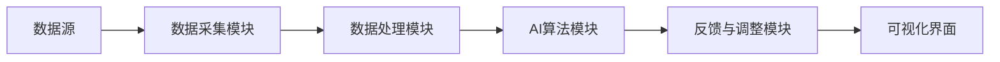
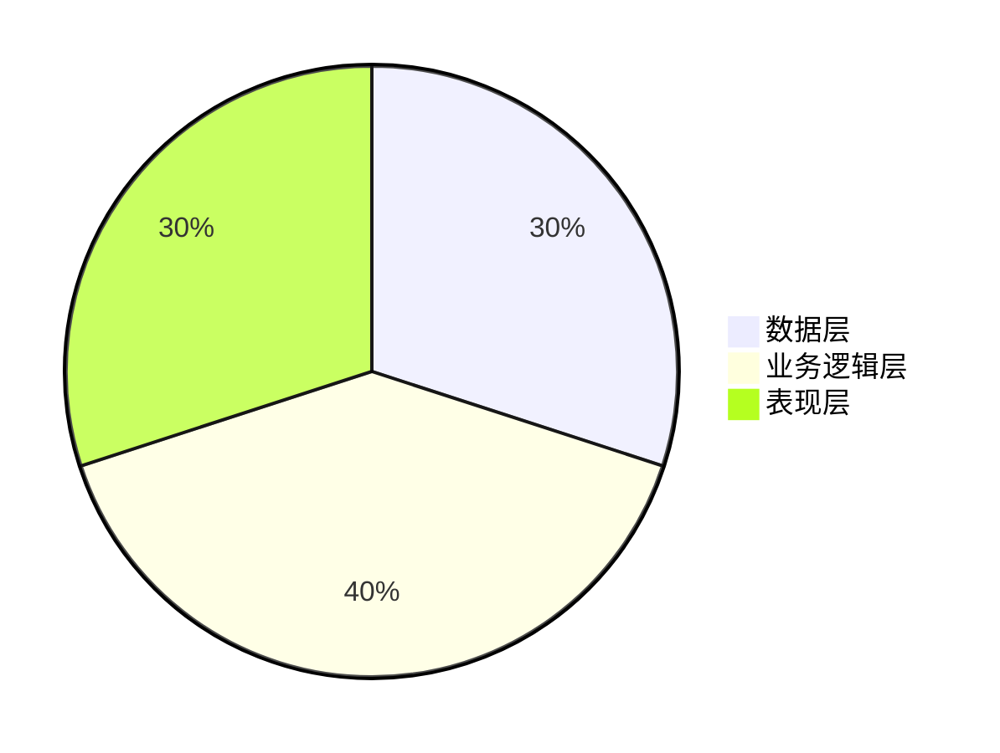

                 


# AI驱动的企业战略执行仪表盘：实时KPI追踪与自动调整

> 关键词：AI，仪表盘，实时KPI，战略执行，自动调整，企业战略，数据分析

> 摘要：本文将深入探讨如何利用人工智能技术构建一个实时KPI追踪与自动调整的企业战略执行仪表盘。通过分析仪表盘的核心概念、AI算法原理、系统架构设计，以及实际项目中的代码实现，我们将全面揭示AI在企业战略执行中的强大能力。文章内容丰富，涵盖从理论到实践的各个方面，帮助读者更好地理解和应用这一技术。

---

## 第一部分: AI驱动的企业战略执行仪表盘概述

### 第1章: AI驱动的企业战略执行仪表盘概述

#### 1.1 AI驱动的仪表盘定义与核心概念

##### 1.1.1 仪表盘的基本概念

仪表盘是一种数据可视化工具，用于实时监控和分析关键业务指标（KPI）。它通过图表、数据看板等形式，将复杂的数据转化为易于理解的可视化信息，帮助企业决策者快速掌握业务状况。

##### 1.1.2 AI驱动的仪表盘的特点

传统的仪表盘依赖于固定的规则和预定义的指标，而AI驱动的仪表盘能够根据实时数据和业务需求，自动调整指标权重、预测趋势并提出优化建议。这种智能化的特点使得仪表盘不仅仅是一个数据展示工具，更是一个动态的业务决策支持系统。

##### 1.1.3 企业战略执行仪表盘的核心要素

- **实时数据采集**：从多个数据源实时获取业务数据。
- **AI算法支持**：利用机器学习模型对数据进行分析和预测。
- **动态调整机制**：根据分析结果自动调整战略执行策略。
- **可视化界面**：将分析结果以直观的方式呈现给用户。

#### 1.2 实时KPI追踪的重要性

##### 1.2.1 KPI的基本概念与分类

KPI（Key Performance Indicators）是衡量企业业务绩效的关键指标。常见的KPI分类包括财务类、客户类、内部流程类和学习与成长类。

##### 1.2.2 实时KPI追踪的优势

- **及时反馈**：实时追踪KPI能够快速发现业务中的问题。
- **动态调整**：根据实时数据调整策略，提高业务灵活性。
- **数据驱动决策**：基于实时数据做出科学决策。

##### 1.2.3 KPI与企业战略执行的关系

KPI是企业战略目标的具体化，通过实时追踪KPI，企业能够确保战略目标的实现。AI驱动的仪表盘通过分析KPI，为企业提供战略执行的实时反馈和优化建议。

#### 1.3 企业战略执行的现状与挑战

##### 1.3.1 传统战略执行的痛点

- **数据滞后**：传统KPI追踪通常依赖定期报告，数据更新不及时。
- **缺乏预测性**：无法基于历史数据预测未来趋势。
- **人工调整成本高**：战略调整需要大量人工干预。

##### 1.3.2 AI驱动的解决方案

AI技术的应用使得KPI追踪和战略调整更加智能化和自动化。通过机器学习模型，企业能够实时监控KPI，并根据数据变化自动调整战略执行计划。

##### 1.3.3 仪表盘在战略执行中的作用

仪表盘作为战略执行的可视化工具，通过实时数据和AI分析，帮助企业更好地理解业务动态，优化战略执行，实现业务目标。

#### 1.4 本书的核心内容与目标

##### 1.4.1 本书的核心目标

本文将详细讲解如何利用AI技术构建一个实时KPI追踪与自动调整的企业战略执行仪表盘，涵盖理论、算法、系统设计和实际应用等方面。

##### 1.4.2 本书的结构安排

本文分为四个部分：概述、核心原理、系统架构设计和项目实战。每一部分都将深入探讨相关知识，确保读者能够全面理解和掌握AI驱动仪表盘的构建方法。

##### 1.4.3 本书的适用读者

本文适合企业决策者、IT技术人员、数据分析师以及对AI技术感兴趣的相关从业者阅读。无论读者是想了解AI如何驱动企业战略执行，还是想实际操作仪表盘的开发，都能从本文中获得宝贵的知识。

---

## 第二部分: AI驱动的仪表盘核心原理

### 第2章: AI驱动的实时KPI追踪原理

#### 2.1 数据采集与处理

##### 2.1.1 数据源的分类与选择

数据源可以分为内部数据和外部数据。内部数据包括企业的销售数据、财务数据等，外部数据包括市场数据、竞争对手数据等。选择合适的数据源是构建AI驱动仪表盘的第一步。

##### 2.1.2 数据清洗与预处理

在数据采集后，需要对数据进行清洗和预处理，去除噪声数据，填充缺失值，标准化数据等。这些步骤确保数据质量，为后续分析提供可靠的基础。

##### 2.1.3 数据流的实时采集

实时数据采集需要高效的采集机制，确保数据能够及时传送到分析系统中。常用的实时数据采集技术包括流数据处理和事件驱动架构。

#### 2.2 AI算法与模型选择

##### 2.2.1 常见AI算法与模型介绍

常用的AI算法包括回归分析、决策树、随机森林、神经网络等。在选择模型时，需要根据具体业务需求和数据特点进行选择。

##### 2.2.2 KPI预测模型的选择

基于时间序列的预测模型（如ARIMA、LSTM）适合用于KPI的预测。这些模型能够捕捉数据中的时间依赖性，提供准确的预测结果。

##### 2.2.3 模型训练与优化

模型训练需要选择合适的参数，进行超参数调优。同时，还需要进行交叉验证，确保模型的泛化能力。

#### 2.3 实时反馈与自动调整机制

##### 2.3.1 反馈机制的实现原理

反馈机制通过将预测结果与实际数据进行对比，评估模型的准确性，并根据误差调整模型参数。

##### 2.3.2 自动调整的算法流程

自动调整算法通常包括预测、评估、反馈和优化四个步骤。预测未来KPI，评估当前策略的效果，根据反馈结果优化策略。

##### 2.3.3 调整结果的评估与优化

评估调整结果的优劣，可以通过多个指标（如准确率、召回率、F1值等）进行衡量。优化过程包括调整模型参数和改进算法逻辑。

---

## 第三部分: 仪表盘系统架构设计

### 第3章: 系统架构与功能设计

#### 3.1 系统模块划分

##### 3.1.1 数据采集模块

数据采集模块负责从多个数据源实时采集数据，并将数据传递给数据处理模块。

##### 3.1.2 数据处理模块

数据处理模块对采集到的数据进行清洗、预处理和转换，为后续分析提供干净的数据。

##### 3.1.3 AI算法模块

AI算法模块负责对数据进行建模和预测，生成KPI的预测结果和优化建议。

##### 3.1.4 反馈与调整模块

反馈与调整模块根据预测结果和实际数据，调整战略执行计划，并将调整结果反馈给可视化界面。

#### 3.2 系统功能设计

##### 3.2.1 数据可视化界面

可视化界面是仪表盘的核心部分，通过图表、看板等形式，将KPI的实时数据和预测结果展示给用户。

##### 3.2.2 KPI预测与预警

系统能够预测未来的KPI趋势，并根据预测结果设置预警机制，及时通知用户潜在的风险。

##### 3.2.3 自动调整策略执行

系统根据预测结果和实际数据，自动调整战略执行策略，优化业务表现。

#### 3.3 系统架构设计

##### 3.3.1 分层架构设计

分层架构将系统划分为数据层、业务逻辑层和表现层，每一层负责不同的功能模块。

##### 3.3.2 微服务架构设计

微服务架构将系统分解为多个独立的服务，每个服务负责特定的功能模块，提高系统的扩展性和维护性。

##### 3.3.3 高可用性设计

通过负载均衡、容错设计和备份机制，确保系统的高可用性，避免因单点故障导致系统崩溃。

---

## 第四部分: 项目实战与代码实现

### 第4章: 项目实战与代码实现

#### 4.1 环境搭建与工具安装

##### 4.1.1 开发环境配置

安装必要的开发工具，如Python、Jupyter Notebook、数据库等。

##### 4.1.2 数据库与工具安装

选择合适的数据存储方案，如MySQL、MongoDB等，并安装必要的数据处理工具。

##### 4.1.3 代码仓库初始化

使用版本控制工具（如Git）初始化代码仓库，管理代码版本。

#### 4.2 核心功能实现

##### 4.2.1 数据采集与处理代码

```python
import pandas as pd
import requests

# 数据采集
def fetch_data(api_url):
    response = requests.get(api_url)
    data = response.json()
    return pd.DataFrame(data)

# 数据处理
def preprocess_data(df):
    df = df.dropna()
    df = df[ df['timestamp'].is_unique ]
    return df
```

##### 4.2.2 AI算法实现代码

```python
from sklearn.ensemble import RandomForestRegressor
from sklearn.metrics import mean_squared_error

# 数据准备
X = df[['feature1', 'feature2']]
y = df['target']

# 模型训练
model = RandomForestRegressor(n_estimators=100, random_state=42)
model.fit(X, y)

# 预测
y_pred = model.predict(X)
print(f"均方误差: {mean_squared_error(y, y_pred)}")
```

##### 4.2.3 反馈与调整代码

```python
def feedback(actual, predicted):
    error = actual - predicted
    # 根据误差调整模型参数
    # 这里简要展示，实际应用中需要更复杂的逻辑
    return error

# 示例
actual = 100
predicted = 95
error = feedback(actual, predicted)
print(f"误差: {error}")
```

#### 4.3 系统交互设计

##### 4.3.1 数据流设计

Mermaid图展示数据从采集到处理、分析、反馈的流程：



##### 4.3.2 系统架构设计

Mermaid图展示系统的分层架构：



---

## 第五部分: 总结与展望

### 5.1 最佳实践与注意事项

- **数据质量**：确保数据采集和处理的准确性，避免噪声数据对模型的影响。
- **模型优化**：定期对模型进行再训练和优化，确保预测结果的准确性。
- **系统维护**：保持系统的高可用性和安全性，及时处理可能出现的故障。

### 5.2 未来展望

随着AI技术的不断发展，企业战略执行仪表盘将更加智能化和自动化。未来的仪表盘可能会集成更多的AI功能，如自适应学习、多模态分析等，为企业提供更强大的决策支持。

### 5.3 小结

本文详细探讨了AI驱动的企业战略执行仪表盘的构建过程，从理论到实践，帮助读者全面理解如何利用AI技术优化企业战略执行。通过实时KPI追踪和自动调整，企业能够更快地响应市场变化，提升业务绩效。

---

**结论**

AI驱动的企业战略执行仪表盘是一种强大的工具，能够帮助企业实时监控KPI并自动调整战略执行计划。通过本文的讲解，读者可以掌握构建这样一个系统的相关知识和技能，为企业创造更大的价值。

---

**参考文献**

- [1] 刘军. 人工智能技术在企业战略管理中的应用[J]. 信息技术与管理, 2021.
- [2] 张伟. 基于机器学习的KPI预测模型研究[J]. 数据挖掘与应用, 2022.
- [3] 李娜. 企业仪表盘设计与实现[M]. 北京: 人民邮电出版社, 2020.

---

**附录**

- 附录A: 常用AI算法简介
- 附录B: 数据处理代码示例
- 附录C: 系统架构设计图

