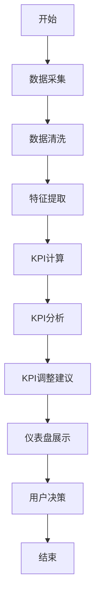
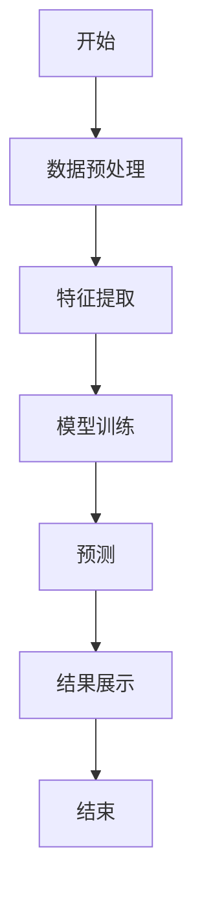

                 


# AI驱动的企业战略执行仪表盘：实时KPI追踪与调整

## 关键词：AI驱动，战略执行，仪表盘，KPI，实时追踪，数据可视化

## 摘要：  
在现代企业中，战略执行的效率和效果直接关系到企业的成功与否。然而，传统的KPI（关键绩效指标）追踪方法往往依赖于静态数据和事后分析，难以满足企业对实时调整和优化的需求。随着人工智能（AI）技术的迅速发展，AI驱动的企业战略执行仪表盘应运而生。这种仪表盘能够实时追踪和分析KPI，为企业提供动态的洞察和调整建议，从而显著提升战略执行的效率和效果。本文将深入探讨AI驱动的企业战略执行仪表盘的核心概念、算法原理、系统架构以及实际应用，为企业管理者和技术开发者提供有价值的参考。

---

# 第一部分: 问题背景与核心概念

## 第1章: 问题背景与核心概念

### 1.1 问题背景  
企业在执行战略目标时，常常面临以下挑战：  
1. **数据孤岛问题**：企业的各个部门和系统之间可能存在数据孤岛，导致KPI数据难以实时整合和分析。  
2. **滞后性问题**：传统的KPI追踪方法通常依赖于定期报告，无法实现实时监控和动态调整。  
3. **复杂性问题**：现代企业的业务模式日益复杂，KPI之间的关联性增强，传统的分析方法难以捕捉复杂的动态变化。  
4. **决策延迟问题**：由于缺乏实时数据支持，企业决策者往往需要等待定期报告才能做出调整，导致机会成本增加。  

### 1.2 问题描述  
企业战略执行的关键在于实时监控和调整KPI。传统的KPI追踪方法依赖于定期数据汇总和人工分析，存在以下问题：  
- 数据更新滞后，无法及时反映业务变化。  
- 分析结果依赖人工判断，缺乏客观性和科学性。  
- 缺乏动态调整机制，难以应对快速变化的市场环境。  

### 1.3 问题解决与边界  
AI驱动的企业战略执行仪表盘通过实时数据采集、智能分析和动态调整，解决了传统方法的上述问题。其边界包括：  
- 数据来源：企业内部系统的实时数据（如销售、生产、财务等数据）。  
- 数据处理：对实时数据进行清洗、整合和分析。  
- 系统输出：动态更新的KPI指标、趋势预测和优化建议。  

### 1.4 核心概念  
AI驱动的企业战略执行仪表盘的核心概念包括：  
1. **实时数据采集**：通过API或数据集成工具，实时采集企业各系统的数据。  
2. **智能分析引擎**：利用机器学习算法，对实时数据进行预测和优化。  
3. **动态KPI调整**：根据实时分析结果，动态调整KPI目标和执行策略。  
4. **可视化界面**：通过仪表盘提供直观的可视化展示，帮助决策者快速理解数据和做出决策。  

---

# 第二部分: 核心概念与联系

## 第2章: 核心概念与联系

### 2.1 核心概念的ER实体关系图  
以下是一个简单的ER图，展示了企业战略执行仪表盘的核心实体及其关系：  

```mermaid
er
  actor: 用户
  dashboard: 仪表盘
  kpi_metric: KPI指标
  data_source: 数据源
  relation: 关联关系
  actor --> dashboard: 查看仪表盘
  dashboard --> kpi_metric: 展示KPI指标
  kpi_metric --> data_source: 数据来源
```

### 2.2 核心概念的属性与特征  
以下是核心概念的属性对比表：  

| 概念       | 属性                       | 特征描述                                                                 |
|------------|----------------------------|--------------------------------------------------------------------------|
| 用户（Actor） | 数据提供者与消费者         | 可以是企业高管、部门经理或业务分析师，负责数据输入和仪表盘的使用。                                           |
| 仪表盘（Dashboard） | 数据展示工具             | 提供直观的可视化界面，动态展示KPI指标的变化趋势和预测结果。                                                   |
| KPI指标（KPI Metric） | 业务衡量标准           | 由企业战略目标决定，用于衡量部门或整体的业务表现。                                                           |
| 数据源（Data Source） | 数据输入来源           | 包括企业内部系统（如ERP、CRM）和外部数据源（如市场数据）。                                                   |

### 2.3 核心概念的流程图  
以下是一个展示KPI追踪与调整流程的流程图：  



---

# 第三部分: 算法原理与数学模型

## 第3章: 算法原理

### 3.1 实时KPI预测算法  
实时KPI预测通常采用时间序列分析和机器学习模型。以下是常见的算法选择：  

1. **时间序列预测**：  
   使用ARIMA（自回归积分滑动平均模型）或LSTM（长短期记忆网络）进行时间序列预测。  
2. **机器学习模型**：  
   使用随机森林、XGBoost等模型进行分类或回归预测。  

#### 示例：时间序列预测的Python代码  
以下是一个使用LSTM进行时间序列预测的示例代码：  

```python
import numpy as np
import pandas as pd
from keras.models import Sequential
from keras.layers import LSTM, Dense

# 示例数据：模拟KPI指标
data = pd.DataFrame({'time': range(100), 'value': np.random.rand(100) * 10 + 5})
X = data[['time']].values.reshape(-1, 1, 1)
y = data['value'].values.reshape(-1, 1)

# LSTM模型
model = Sequential()
model.add(LSTM(50, input_shape=(1, 1)))
model.add(Dense(1))
model.compile(optimizer='adam', loss='mean_squared_error')
model.fit(X, y, epochs=10, batch_size=1)

# 预测
predicted = model.predict(X)
print(predicted)
```

---

### 3.2 算法流程图  
以下是算法实现的流程图：  



### 3.3 数学模型与公式  
以下是时间序列预测的数学模型示例：  

$$ y_t = \alpha y_{t-1} + \beta \epsilon_t $$  

其中，  
- $y_t$ 表示当前时刻的预测值，  
- $\alpha$ 表示自回归系数，  
- $\epsilon_t$ 表示随机误差项。  

---

# 第四部分: 系统分析与架构设计

## 第4章: 系统分析与架构设计

### 4.1 系统功能设计  
以下是仪表盘的核心功能模块：  
1. **数据采集模块**：实时采集企业各系统数据。  
2. **数据处理模块**：清洗和整合数据。  
3. **KPI计算模块**：根据数据计算实时KPI。  
4. **预测与优化模块**：基于机器学习模型进行预测和优化。  
5. **可视化模块**：动态展示KPI指标和预测结果。  

### 4.2 系统架构设计  
以下是系统的架构图：  


### 4.3 系统接口设计  
以下是系统的接口设计：  

1. **数据采集接口**：  
   ```json
   {
     "type": "GET",
     "endpoint": "/api/data",
     "parameters": {
       "source": "string"
     }
   }
   ```  
2. **预测结果接口**：  
   ```json
   {
     "type": "POST",
     "endpoint": "/api/predict",
     "body": {
       "data": "array"
     }
   }
   ```

### 4.4 系统交互流程图  
以下是系统的交互流程图：  

```mermaid
sequenceDiagram
    actor -> dashboard: 请求数据
    dashboard -> data_processing: 数据处理请求
    data_processing -> model_engine: 模型调用
    model_engine -> data_source: 数据查询
    model_engine -> dashboard: 返回预测结果
    dashboard -> actor: 更新仪表盘
```

---

# 第五部分: 项目实战

## 第5章: 项目实战

### 5.1 环境安装  
以下是项目所需的环境和工具：  
- **Python**: 3.8+  
- **机器学习库**: scikit-learn, Keras, TensorFlow  
- **数据可视化库**: Matplotlib, Seaborn  
- **数据处理库**: Pandas, NumPy  

### 5.2 核心代码实现  
以下是核心代码实现：  

```python
# 数据采集与处理
import pandas as pd
import requests

# 从API获取数据
def get_data(source):
    response = requests.get(f"http://localhost:8000/api/data?source={source}")
    return response.json()

# 数据清洗与转换
def preprocess(data):
    df = pd.DataFrame(data)
    df['timestamp'] = pd.to_datetime(df['timestamp'])
    return df

# 模型训练
from sklearn.ensemble import RandomForestRegressor

def train_model(X, y):
    model = RandomForestRegressor()
    model.fit(X, y)
    return model

# 模型预测
def predict(model, X_test):
    return model.predict(X_test)

# 主函数
def main():
    data = get_data("sales")
    df = preprocess(data)
    X = df[['feature1', 'feature2']]
    y = df['target']
    model = train_model(X, y)
    predicted = predict(model, X)
    print(predicted)

if __name__ == "__main__":
    main()
```

### 5.3 代码解读与分析  
1. **数据采集**：通过API获取实时数据。  
2. **数据预处理**：清洗数据并转换为时间戳格式。  
3. **模型训练**：使用随机森林模型进行训练。  
4. **模型预测**：基于训练好的模型进行预测。  

### 5.4 实际案例分析  
以下是实际案例分析：  
假设某企业希望实时监控销售KPI，可以通过以下步骤实现：  
1. **数据采集**：从销售系统获取实时销售数据。  
2. **数据处理**：清洗和整合数据。  
3. **模型训练**：使用随机森林模型预测未来销售趋势。  
4. **预测结果展示**：在仪表盘上动态展示预测结果和优化建议。  

---

# 第六部分: 总结与展望

## 第6章: 总结与展望

### 6.1 本章总结  
本文详细探讨了AI驱动的企业战略执行仪表盘的核心概念、算法原理、系统架构以及实际应用。通过实时KPI追踪和动态调整，企业可以显著提升战略执行的效率和效果。  

### 6.2 未来展望  
随着AI技术的不断发展，企业战略执行仪表盘将更加智能化和自动化。未来的研究方向包括：  
1. **多模态数据融合**：结合文本、图像等多种数据源进行分析。  
2. **自适应模型优化**：根据实时数据动态优化模型参数。  
3. **边缘计算应用**：将AI计算推向边缘设备，实现更低延迟和更高效率。  

---

## 最佳实践 Tips  

1. **数据质量**：确保实时数据的准确性和完整性，避免数据偏差。  
2. **模型选择**：根据业务需求选择合适的机器学习模型，避免盲目追求复杂性。  
3. **可视化设计**：仪表盘的设计应以用户为中心，确保直观易用。  
4. **持续优化**：定期评估模型性能，并根据业务变化进行优化。  

---

## 参考文献  

1. Deep Learning, Ian Goodfellow, Yoshua Bengio, Aaron Courville  
2. Time Series Analysis, James D. Hamilton  
3. Python机器学习实战，唐宇迪  

---

通过以上内容，您可以系统地了解AI驱动的企业战略执行仪表盘的设计与实现，并将其应用于实际业务中。

