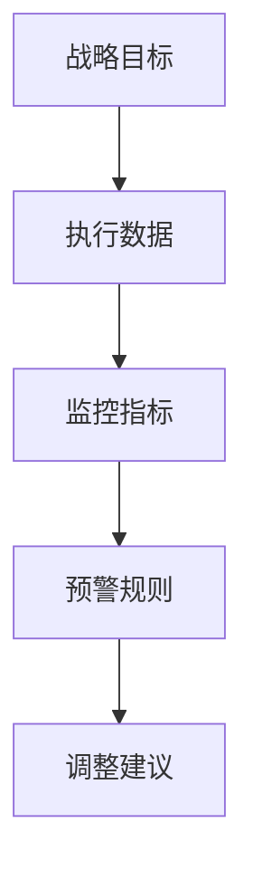
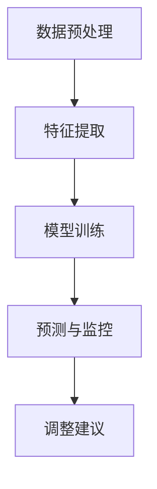
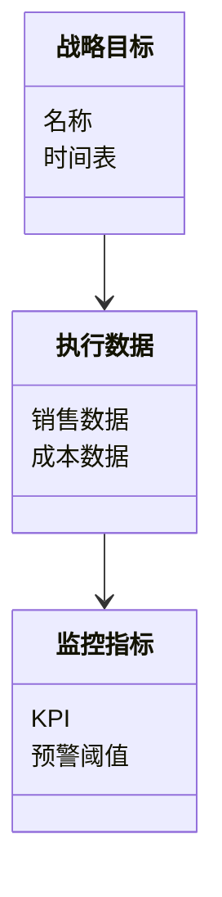
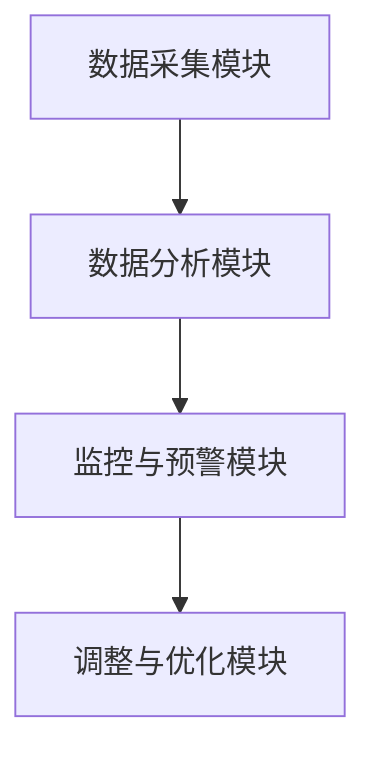
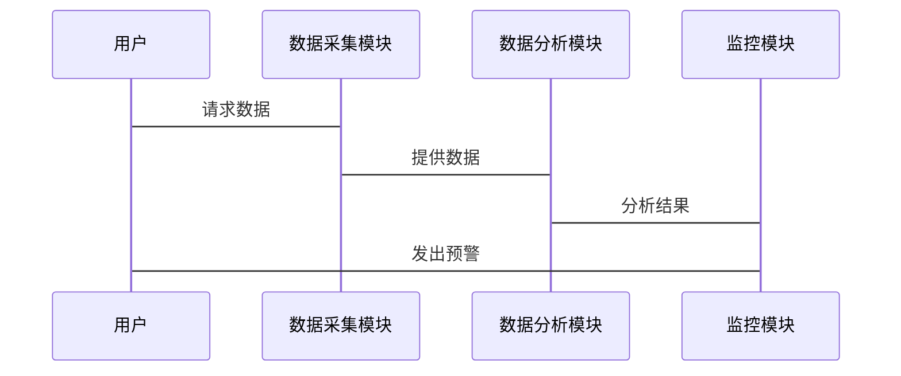

                 


# AI驱动的企业战略执行监控与调整系统

**关键词：** AI，战略执行，监控系统，机器学习，系统架构

**摘要：**  
本文详细探讨了AI驱动的企业战略执行监控与调整系统的构建与应用。通过分析企业战略执行中的常见问题，提出了基于AI的解决方案，涵盖了系统架构设计、核心算法实现、项目实战以及最佳实践等多个方面。文章以清晰的逻辑和丰富的技术细节，展示了如何利用AI技术优化企业战略执行过程，为企业的高效运营提供有力支持。

---

# 第一部分: 问题背景与核心概念

## 第1章: 问题背景与核心概念

### 1.1 问题背景

#### 1.1.1 传统企业战略执行的挑战
企业在制定战略目标后，往往面临执行过程中的诸多挑战。例如，战略目标与实际执行结果之间的偏差、执行过程中的信息孤岛、缺乏实时反馈和动态调整机制等。这些问题可能导致战略执行效率低下，甚至失败。

#### 1.1.2 AI技术在战略执行中的应用潜力
AI技术，尤其是机器学习和自然语言处理，能够帮助企业从海量数据中提取有价值的信息，实时监控战略执行情况，并提供动态调整的建议。通过AI的辅助，企业能够更高效地进行战略执行监控与调整。

#### 1.1.3 当前企业战略执行监控的痛点
- 数据分散，难以统一管理。
- 缺乏实时监控机制，无法快速响应问题。
- 手动调整效率低，难以应对复杂多变的市场环境。

### 1.2 核心概念与定义

#### 1.2.1 战略执行监控的定义
战略执行监控是指通过收集、分析和评估战略执行过程中的数据，确保战略目标的实现，并在必要时进行调整的过程。

#### 1.2.2 AI驱动的定义与特征
AI驱动的系统通过使用机器学习、自然语言处理等技术，自动化地收集、分析数据，并提供实时反馈和建议。

#### 1.2.3 系统架构的核心要素
- 数据采集模块：负责从企业内外部数据源中获取数据。
- 数据分析模块：对数据进行清洗、特征提取和建模分析。
- 监控与预警模块：实时监控战略执行情况，并在发现问题时发出预警。
- 调整与优化模块：根据监控结果，提供调整建议并优化执行策略。

### 1.3 系统的核心目标与价值

#### 1.3.1 系统的核心目标
- 实时监控战略执行情况。
- 提供动态调整建议。
- 最大化战略执行效率和效果。

#### 1.3.2 系统对企业战略执行的价值
- 提高战略执行的透明度和效率。
- 降低执行过程中的不确定性。
- 增强企业的灵活性和应对能力。

#### 1.3.3 系统的边界与外延
系统主要关注战略执行的监控与调整，不涉及战略制定阶段。其外延包括数据源的选择、预警规则的制定以及调整建议的实施。

### 1.4 系统的组成与功能模块

#### 1.4.1 数据采集模块
- 从企业ERP、CRM等系统中获取数据。
- 从外部市场数据源（如竞争对手信息、行业趋势）中获取数据。

#### 1.4.2 数据分析模块
- 对数据进行清洗和预处理。
- 通过机器学习模型进行预测和分析。

#### 1.4.3 监控与预警模块
- 实时监控战略执行指标。
- 根据预设的阈值发出预警。

#### 1.4.4 调整与优化模块
- 根据监控结果优化执行策略。
- 提供动态调整建议。

---

# 第二部分: 核心概念与系统架构

## 第2章: 核心概念与联系

### 2.1 核心概念原理

#### 2.1.1 数据驱动的监控原理
通过收集和分析数据，实时监控战略执行的各个环节，发现问题并及时调整。

#### 2.1.2 AI算法在战略执行中的应用
- 机器学习用于预测和分类。
- 自然语言处理用于分析文本数据。

#### 2.1.3 系统反馈与优化机制
系统根据执行结果反馈，不断优化监控和调整策略。

### 2.2 核心概念对比分析

#### 2.2.1 不同AI算法的对比
| 算法类型         | 适用场景         | 优缺点                   |
|------------------|------------------|--------------------------|
| 机器学习         | 预测和分类       | 高准确性，但需要大量数据 |
| 时间序列分析     | 预测趋势         | 适合时间相关数据         |
| 自然语言处理     | 分析文本数据     | 需要大量计算资源         |

#### 2.2.2 数据源与数据质量的对比
| 数据源类型       | 数据质量         | 数据量                   |
|------------------|------------------|--------------------------|
| 结构化数据       | 高               | 大                       |
| 非结构化数据     | 中               | 中                       |

#### 2.2.3 监控指标与预警机制的对比
| 监控指标         | 预警机制         | 适用场景                 |
|------------------|------------------|--------------------------|
| KPI指标         | 基于阈值的预警   | 适用于定量指标           |
| 文本数据         | 基于情感分析的预警 | 适用于定性指标           |

### 2.3 系统架构的ER实体关系图


---

# 第三部分: 算法原理与数学模型

## 第3章: 算法原理与实现

### 3.1 算法原理

#### 3.1.1 机器学习模型的选择与优化
- **模型选择：** 根据数据类型和任务选择合适的模型，例如使用线性回归进行预测。
- **优化方法：** 使用梯度下降等优化算法提升模型性能。

#### 3.1.2 时间序列分析与预测
- **ARIMA模型：** 用于时间序列预测。
- **LSTM网络：** 适用于长序列预测。

#### 3.1.3 自然语言处理在战略调整中的应用
- **情感分析：** 分析文本数据的情感倾向。
- **主题建模：** 识别文本中的主要主题。

### 3.2 算法实现流程


### 3.3 算法实现的数学模型

#### 3.3.1 机器学习模型的数学表达
$$
y = \theta x + \beta
$$
其中，$\theta$是模型参数，$\beta$是截距，$x$是输入特征，$y$是输出目标。

#### 3.3.2 时间序列模型的数学表达
$$
\Delta y_t = \alpha + \beta t + \epsilon_t
$$
其中，$\Delta y_t$是变化率，$\alpha$是截距，$\beta$是时间系数，$\epsilon_t$是误差项。

---

# 第四部分: 系统分析与架构设计

## 第4章: 系统分析与架构设计

### 4.1 问题场景介绍
企业战略执行监控系统需要实时监控多个指标，并根据数据变化动态调整执行策略。

### 4.2 系统功能设计

#### 4.2.1 领域模型类图


#### 4.2.2 系统架构设计


#### 4.2.3 系统接口设计
- 数据采集模块提供API接口，接收数据。
- 监控模块提供API接口，发送预警通知。

#### 4.2.4 系统交互序列图


---

# 第五部分: 项目实战

## 第5章: 项目实战

### 5.1 环境安装

#### 5.1.1 安装Python环境
使用Anaconda安装Python 3.8及以上版本。

#### 5.1.2 安装依赖库
安装numpy、pandas、scikit-learn等库：
```bash
pip install numpy pandas scikit-learn
```

### 5.2 核心代码实现

#### 5.2.1 数据采集模块
```python
import pandas as pd

def collect_data():
    # 示例：从CSV文件中读取数据
    data = pd.read_csv('执行数据.csv')
    return data
```

#### 5.2.2 数据分析模块
```python
from sklearn.linear_model import LinearRegression

def train_model(data):
    X = data[['特征1', '特征2']]
    y = data['目标']
    model = LinearRegression()
    model.fit(X, y)
    return model
```

#### 5.2.3 监控与预警模块
```python
def monitor(data, model):
    prediction = model.predict(data[['特征1', '特征2']])
    if prediction[0] < data['目标'].values[0]:
        print("预警：预测值低于目标值")
```

### 5.3 代码解读与分析
- 数据采集模块：从CSV文件中读取数据。
- 数据分析模块：使用线性回归模型进行训练。
- 监控模块：根据模型预测结果发出预警。

### 5.4 实际案例分析
通过一个实际案例，展示系统如何从数据采集、分析到监控和调整的全过程。

### 5.5 项目小结
总结项目实施的关键步骤和注意事项。

---

# 第六部分: 最佳实践与总结

## 第6章: 最佳实践与总结

### 6.1 小结
AI驱动的企业战略执行监控与调整系统能够显著提升企业的执行效率和应对能力。

### 6.2 注意事项
- 数据质量对系统性能影响重大。
- 需要定期优化模型和调整预警规则。

### 6.3 拓展阅读
推荐相关书籍和论文，供读者深入学习。

---

通过以上结构和内容，本文系统地介绍了AI驱动的企业战略执行监控与调整系统的构建与应用，为企业的高效运营提供了有力的技术支持。

