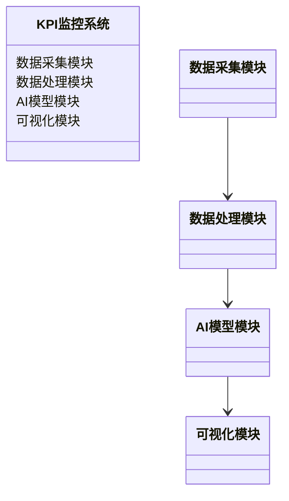
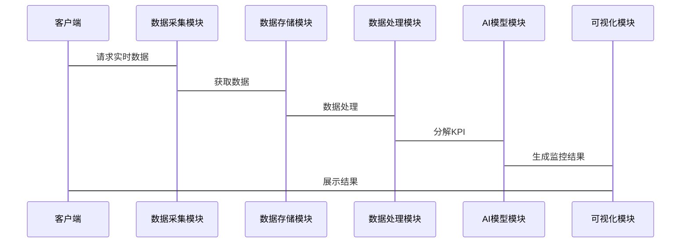

                 


# AI驱动的企业战略执行监控：KPI智能分解与实时追踪

> 关键词：AI, KPI分解, 实时追踪, 企业战略, 战略执行监控

> 摘要：随着数字化转型的推进，企业战略执行监控的重要性日益凸显。传统方法在KPI分解和实时追踪方面存在诸多局限性，而人工智能技术的引入为解决这些问题提供了新的可能性。本文详细探讨了如何利用AI技术实现KPI的智能分解与实时追踪，介绍了核心算法、系统架构设计以及项目实战，为企业提升战略执行效率提供了切实可行的解决方案。

---

## 第1章：企业战略执行监控的背景与挑战

### 1.1 企业战略执行监控的背景

#### 1.1.1 企业战略执行的传统模式
传统的战略执行模式依赖于人工分解KPI，这种方法效率低下且容易出错。企业需要实时监控KPI，以确保战略目标的实现。

#### 1.1.2 数字化转型对企业战略执行的新要求
在数字化转型的背景下，企业需要更高效、更精准的工具来监控战略执行。AI技术的应用为企业提供了新的可能性。

#### 1.1.3 人工智能在企业监控中的应用潜力
AI技术能够快速处理大量数据，提供实时反馈，帮助企业优化战略执行过程。

### 1.2 问题背景与挑战

#### 1.2.1 战略执行中的主要问题
- 数据量大，难以实时处理。
- KPI分解复杂，难以自动化。
- 传统方法效率低下，难以满足实时需求。

#### 1.2.2 KPI分解与追踪的复杂性
- KPI分解涉及多个业务部门，协调复杂。
- 数据来源多样，处理难度大。

#### 1.2.3 传统方法的效率瓶颈
- 人工分解KPI耗时长，容易出错。
- 实时监控能力不足，难以快速响应问题。

### 1.3 问题解决与AI的引入

#### 1.3.1 AI技术在企业监控中的应用潜力
- 提供实时数据处理能力。
- 自动化KPI分解，提高效率。
- 智能异常检测，快速响应问题。

#### 1.3.2 AI驱动KPI分解的优势
- 提高分解效率，减少人为错误。
- 支持实时数据处理，提供及时反馈。
- 通过机器学习优化分解模型，提高准确性。

#### 1.3.3 实时追踪的必要性与可行性
- 必要性：实时数据处理能够快速响应问题，确保战略目标的实现。
- 可行性：通过AI技术实现高效的数据处理和实时反馈。

---

## 第2章：AI驱动的企业战略执行监控的核心概念

### 2.1 KPI智能分解的定义与特点

#### 2.1.1 KPI分解的定义
KPI分解是将企业战略目标分解为可量化、可执行的指标，以便监控和评估战略执行的效果。

#### 2.1.2 智能分解的核心特征
- 数据驱动：基于大量数据进行分解，提高准确性。
- 自动化：利用AI技术自动分解KPI，减少人工干预。
- 可视化：提供直观的分解结果，便于理解和分析。

#### 2.1.3 智能分解与传统分解的对比
| 对比维度 | 智能分解 | 传统分解 |
|----------|----------|----------|
| 效率     | 高       | 低       |
| 准确性   | 高       | 中       |
| 人工干预 | 少       | 多       |

### 2.2 实时追踪的实现原理

#### 2.2.1 数据采集与处理
- 数据采集：从各个业务系统中获取实时数据。
- 数据清洗：对数据进行预处理，确保数据质量。

#### 2.2.2 实时分析的技术基础
- 数据流处理：利用流处理技术对实时数据进行分析。
- 机器学习模型：基于机器学习算法进行实时预测和异常检测。

#### 2.2.3 结果可视化与反馈机制
- 数据可视化：通过图表等形式展示实时数据。
- 反馈机制：将结果反馈给相关部门，指导后续行动。

### 2.3 AI在KPI监控中的应用架构

#### 2.3.1 数据流与处理流程
数据从各个业务系统中采集，经过清洗、转换后，进入AI模型进行处理，最后生成监控结果。

#### 2.3.2 AI模型的作用机制
AI模型通过学习历史数据，优化KPI分解和预测模型，提高监控的准确性。

#### 2.3.3 系统的可扩展性与灵活性
系统设计模块化，便于扩展和调整，能够适应不同企业的具体需求。

---

## 第3章：KPI智能分解与实时追踪的核心算法

### 3.1 基于机器学习的KPI预测模型

#### 3.1.1 线性回归模型
线性回归是一种简单而有效的预测模型，适用于线性关系的KPI预测。

数学公式：
$$ y = \beta_0 + \beta_1x + \epsilon $$

#### 3.1.2 支持向量机（SVM）
SVM适用于非线性关系的预测，能够处理高维数据。

#### 3.1.3 随机森林与梯度提升树
随机森林和梯度提升树是基于树的集成方法，适用于复杂的KPI预测场景。

### 3.2 时间序列分析与预测

#### 3.2.1 ARIMA模型
ARIMA模型适用于具有趋势和季节性的数据。

数学公式：
$$ ARIMA(p, d, q) $$

#### 3.2.2 LSTM网络
LSTM网络能够捕捉时间序列中的长期依赖关系。

#### 3.2.3 Prophet模型
Prophet模型是Facebook开源的时间序列预测模型，简单易用。

### 3.3 基于深度学习的异常检测

#### 3.3.1 卷积神经网络（CNN）
CNN适用于图像和序列数据的异常检测。

#### 3.3.2 循环神经网络（RNN）
RNN适用于时间序列数据的异常检测。

#### 3.3.3 图神经网络（GNN）
GNN适用于复杂关系网络的异常检测。

### 3.4 算法实现与优化

#### 3.4.1 算法选择的依据
根据数据特征和业务需求选择合适的算法。

#### 3.4.2 模型训练与调优
通过交叉验证和超参数优化提高模型性能。

#### 3.4.3 实时预测的优化策略
优化算法复杂度，确保实时预测的效率。

---

## 第4章：系统分析与架构设计

### 4.1 问题场景介绍

企业需要实时监控KPI，确保战略目标的实现。传统方法效率低下，难以满足实时需求。

### 4.2 系统功能设计

#### 4.2.1 领域模型图（Mermaid）



### 4.3 系统架构设计（Mermaid）


### 4.4 系统接口设计

- 数据采集接口：从各个业务系统中获取实时数据。
- 数据处理接口：对数据进行清洗和转换。
- AI模型接口：进行KPI分解和预测。
- 可视化接口：展示监控结果。

### 4.5 系统交互流程图（Mermaid）



---

## 第5章：项目实战

### 5.1 环境安装

安装必要的工具和库：
- Python 3.8+
- Pandas, NumPy
- Scikit-learn, TensorFlow
- Matplotlib, Seaborn

### 5.2 系统核心实现源代码

#### 5.2.1 数据采集模块

```python
import pandas as pd
import requests

def fetch_data(api_url):
    response = requests.get(api_url)
    data = response.json()
    df = pd.DataFrame(data)
    return df
```

#### 5.2.2 数据处理模块

```python
from sklearn.preprocessing import StandardScaler

def preprocess_data(df, target_column):
    X = df.drop(target_column, axis=1)
    y = df[target_column]
    scaler = StandardScaler()
    X_scaled = scaler.fit_transform(X)
    return X_scaled, y
```

#### 5.2.3 AI模型模块

```python
from sklearn.ensemble import RandomForestRegressor

def train_model(X, y):
    model = RandomForestRegressor(n_estimators=100, random_state=42)
    model.fit(X, y)
    return model
```

### 5.3 实际案例分析

通过一个实际案例，展示AI如何优化KPI分解和实时追踪。

### 5.4 项目小结

总结项目的实现过程，反思经验与教训，提出改进建议。

---

## 第6章：最佳实践与小结

### 6.1 最佳实践

- 数据质量是关键，确保数据清洗和预处理。
- 选择合适的算法，根据数据特征和业务需求。
- 定期优化模型，保持模型性能。

### 6.2 小结

AI技术为企业战略执行监控提供了新的可能性，通过智能分解和实时追踪，帮助企业提高执行效率。未来，随着技术的发展，AI在企业监控中的应用将更加广泛和深入。

---

## 注意事项

- 本文内容基于假设和示例，具体实施需根据实际情况调整。
- 数据和代码均为示例，实际应用需谨慎处理。
- 系统设计和实现需结合企业具体需求，确保安全性和稳定性。

