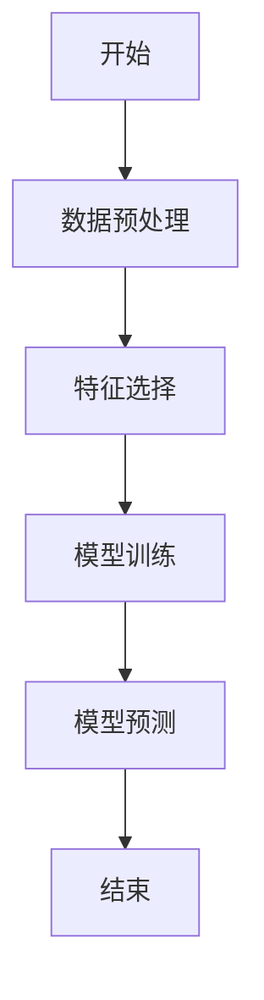
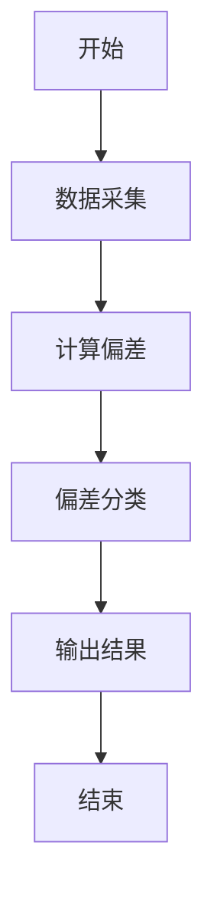
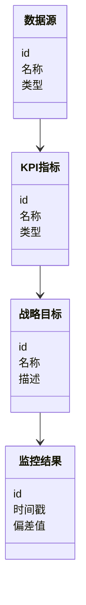
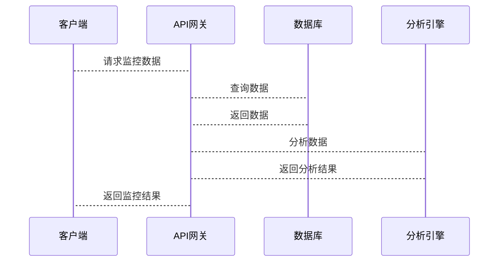

                 


# AI驱动的企业战略执行监控：KPI智能跟踪与偏差分析

**关键词**：AI驱动，企业战略，KPI监控，偏差分析，机器学习

**摘要**：随着企业竞争的加剧，战略执行效率和效果的提升变得至关重要。传统的KPI监控方法存在效率低、准确度低、响应速度慢等问题。本文探讨了如何利用人工智能技术，构建智能化的KPI监控系统，实现企业战略执行的智能跟踪与偏差分析，为企业提供高效、精准的战略执行监控解决方案。

---

## 第1章: 企业战略执行监控的背景与挑战

### 1.1 问题背景

#### 1.1.1 企业战略执行监控的重要性
企业战略执行监控是确保企业战略目标实现的关键环节。通过监控KPI（关键绩效指标），企业可以及时发现执行偏差，调整策略，确保战略目标的顺利达成。

#### 1.1.2 KPI在企业战略执行中的作用
KPI是衡量企业战略执行效果的核心指标。通过监控KPI，企业可以量化战略执行的进展，评估策略的有效性，并为决策提供数据支持。

#### 1.1.3 传统KPI监控的局限性
传统KPI监控方法依赖人工数据录入和分析，存在以下问题：
- 数据采集效率低，容易出错。
- 数据分析耗时长，难以实时响应。
- 偏差分析缺乏深度，难以提供有效的改进建议。

### 1.2 问题描述

#### 1.2.1 战略执行监控的核心问题
- 如何实现KPI的实时监控？
- 如何快速识别偏差并提供解决方案？
- 如何提高监控的准确性和效率？

#### 1.2.2 KPI监控中的常见挑战
- 数据来源多样，整合复杂。
- KPI指标体系复杂，难以统一管理。
- 数据分析需要深度学习和预测能力。

#### 1.2.3 企业战略执行监控的边界与外延
企业战略执行监控的边界包括KPI的选择、数据采集、分析和反馈。外延则涉及战略调整、团队协作和资源分配。

### 1.3 问题解决

#### 1.3.1 引入AI技术的必要性
AI技术可以提高数据处理和分析的效率，实现KPI的实时监控和预测。

#### 1.3.2 AI驱动KPI监控的优势
- 提高数据处理效率。
- 实现KPI的智能预测和偏差分析。
- 提供实时反馈和改进建议。

#### 1.3.3 企业战略执行监控的解决方案框架
解决方案包括数据采集、KPI预测、偏差分析和反馈优化四个步骤。

### 1.4 核心概念与联系

#### 1.4.1 AI驱动的KPI监控系统组成部分
系统包括数据采集模块、KPI预测模块、偏差分析模块和反馈优化模块。

#### 1.4.2 系统核心要素及其关系
数据、算法、KPI指标和反馈机制是系统的核心要素，它们相互关联，共同实现监控目标。

#### 1.4.3 KPI监控与企业战略执行的关系
KPI监控是企业战略执行的重要工具，通过监控KPI，企业可以评估战略执行效果，并进行必要的调整。

---

## 第2章: AI驱动的KPI监控系统核心概念

### 2.1 核心概念原理

#### 2.1.1 数据采集与处理
AI系统通过API、数据库等方式采集数据，并进行清洗和预处理。

#### 2.1.2 KPI预测与偏差分析
利用机器学习模型预测KPI值，并与实际值进行对比，识别偏差。

#### 2.1.3 AI算法在KPI监控中的应用
常用的算法包括线性回归、决策树和随机森林，用于KPI预测和偏差分类。

### 2.2 核心概念属性特征对比

| 特征      | 传统KPI监控 | AI驱动KPI监控 |
|-----------|--------------|----------------|
| 数据处理  | 人工处理      | 自动化处理      |
| 分析效率  | 低效          | 高效            |
| 偏差识别  | 粗放          | 精准            |

### 2.3 ER实体关系图

```mermaid
er
    %% ER图展示KPI监控系统的核心实体关系
    %% 定义实体
    entity(战略目标) {
        id
        名称
        描述
    }
    entity(KPI指标) {
        id
        名称
        类型
    }
    entity(数据源) {
        id
        名称
        类型
    }
    entity(监控结果) {
        id
        时间戳
        偏差值
    }
    
    %% 关系定义
    关系(战略目标 --> KPI指标)
    关系(KPI指标 --> 数据源)
    关系(数据源 --> 监控结果)
```

---

## 第3章: 算法原理讲解

### 3.1 算法原理

#### 3.1.1 机器学习模型选择
- 线性回归：用于KPI预测。
- 决策树：用于分类偏差类型。

#### 3.1.2 KPI预测与偏差分析
- 线性回归模型：
  $$ y = \beta_0 + \beta_1x + \epsilon $$
  其中，y为预测值，x为自变量，$\beta_0$和$\beta_1$为系数。

- 决策树模型：
  使用ID3算法，根据信息增益选择特征。

### 3.2 算法实现

#### 3.2.1 KPI预测流程图



#### 3.2.2 偏差分析流程图



#### 3.2.3 代码实现

```python
import pandas as pd
from sklearn.linear_model import LinearRegression

# 数据预处理
data = pd.read_csv('kpi_data.csv')
X = data[['sales', 'profit']]
y = data['target']

# 模型训练
model = LinearRegression()
model.fit(X, y)

# 预测
new_data = pd.DataFrame({'sales': [100], 'profit': [20]})
predicted = model.predict(new_data)
print(predicted)
```

---

## 第4章: 系统分析与架构设计

### 4.1 问题场景介绍

#### 4.1.1 项目背景
企业需要实时监控KPI，确保战略执行的顺利进行。

#### 4.1.2 系统功能设计
- 数据采集模块：负责数据的采集和预处理。
- KPI预测模块：基于机器学习模型预测KPI值。
- 偏差分析模块：识别偏差并分类。
- 反馈优化模块：提供改进建议。

### 4.2 系统架构设计

#### 4.2.1 领域模型类图



#### 4.2.2 系统架构图


---

## 第5章: 项目实战

### 5.1 环境安装

#### 5.1.1 安装Python和相关库
安装Python 3.8及以上版本，并安装pandas、scikit-learn等库。

### 5.2 系统核心实现

#### 5.2.1 数据预处理

```python
import pandas as pd
data = pd.read_csv('kpi_data.csv')
data.dropna(inplace=True)
data['date'] = pd.to_datetime(data['date'])
```

#### 5.2.2 模型训练与预测

```python
from sklearn.linear_model import LinearRegression
model = LinearRegression()
model.fit(X_train, y_train)
predictions = model.predict(X_test)
```

#### 5.2.3 偏差分析

```python
from sklearn.metrics import mean_absolute_error
mae = mean_absolute_error(y_test, predictions)
print(f"MAE: {mae}")
```

### 5.3 实际案例分析

#### 5.3.1 案例背景
某公司销售KPI未达标，需要分析原因。

#### 5.3.2 数据分析
通过模型预测，发现销售团队培训不足是主要原因。

#### 5.3.3 结果解读
模型预测偏差为15%，建议加强培训和优化销售策略。

---

## 第6章: 系统实现

### 6.1 系统实现细节

#### 6.1.1 数据采集模块
通过API接口实时采集KPI数据，并存储到数据库中。

#### 6.1.2 数据分析模块
使用机器学习模型分析数据，识别偏差，并分类。

#### 6.1.3 系统接口设计
定义API接口，供其他系统调用监控结果。

### 6.2 系统交互流程图



---

## 第7章: 总结与展望

### 7.1 总结

#### 7.1.1 核心观点回顾
AI技术可以显著提升企业战略执行监控的效率和准确性。

#### 7.1.2 系统设计亮点
- 数据采集自动化。
- KPI预测智能化。
- 偏差分析精准化。

### 7.2 最佳实践

#### 7.2.1 数据质量管理
确保数据准确性和完整性，是系统运行的基础。

#### 7.2.2 模型优化
定期更新模型，提升预测准确率。

#### 7.2.3 团队协作
跨部门协作是确保系统有效运行的关键。

### 7.3 小结

通过AI技术实现KPI智能监控，企业可以实时掌握战略执行情况，快速识别和解决偏差，提升整体执行效率。

### 7.4 注意事项

- 数据隐私和安全需要严格保护。
- 系统维护和更新需要持续投入。
- 团队能力提升是系统成功的关键。

### 7.5 拓展阅读

- 《机器学习实战》
- 《企业战略管理》
- 《数据分析与决策支持》

---

通过本文的详细讲解，读者可以系统地了解AI驱动的企业战略执行监控的实现方法，并能够将其应用到实际的企业管理中，提升战略执行效率和效果。

