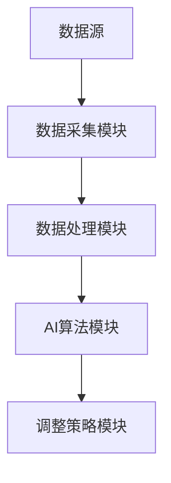
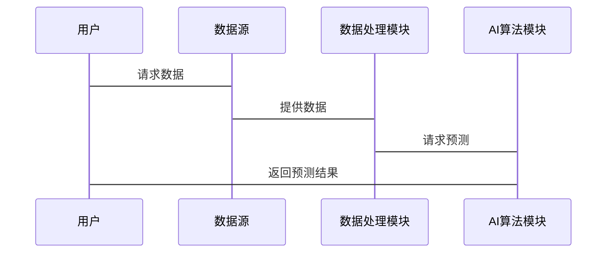

                 


# AI驱动的企业战略执行监控：KPI追踪与调整

---

## 关键词
AI, KPI, 战略执行, 监控系统, 算法实现, 系统架构

---

## 摘要
在当今快速变化的商业环境中，企业战略执行的监控变得至关重要。传统的KPI（关键绩效指标）管理方法逐渐显现出效率低下、实时性差等问题。随着人工智能技术的飞速发展，AI驱动的企业战略执行监控为企业提供了更加智能化、高效化的解决方案。本文将深入探讨AI如何赋能KPI的追踪与调整，从算法原理、系统架构到项目实战，全面解析如何利用AI技术优化企业战略执行监控。

---

## 目录大纲
1. [背景介绍](#背景介绍)
2. [核心概念与联系](#核心概念与联系)
3. [算法原理讲解](#算法原理讲解)
4. [系统分析与架构设计方案](#系统分析与架构设计方案)
5. [项目实战](#项目实战)
6. [最佳实践与小结](#最佳实践与小结)

---

## 第一部分: 背景介绍

### 1.1 问题背景
企业战略的执行是将战略目标转化为具体行动的过程。在这个过程中，KPI作为衡量战略执行效果的重要工具，通常包括销售额、利润、客户满意度等指标。然而，传统的KPI管理方法存在以下问题：
- 数据采集依赖人工，效率低且易出错。
- 数据分析滞后，无法实时调整战略执行。
- KPI调整缺乏数据支持，主观性较强。

### 1.2 问题描述
企业战略执行监控的核心在于实时追踪KPI的变化，并根据数据反馈进行调整。然而，传统方法在以下方面存在不足：
- 数据采集范围有限，难以覆盖全业务流程。
- 数据分析依赖人工经验，缺乏科学性。
- KPI调整缺乏动态优化，难以应对复杂多变的市场环境。

### 1.3 问题解决
引入AI技术可以显著提升KPI追踪与调整的效率和准确性。AI可以通过机器学习模型实时分析数据，预测KPI变化趋势，并提供数据驱动的调整建议。

### 1.4 边界与外延
AI驱动的KPI监控系统主要应用于企业内部的业务流程监控，不包括外部市场环境的直接干预。其外延可以扩展到供应链管理、客户行为分析等领域。

---

## 第二部分: 核心概念与联系

### 2.1 核心概念术语说明
- **KPI（关键绩效指标）**：衡量企业战略执行效果的核心指标。
- **AI驱动**：利用人工智能技术提升KPI监控的智能化水平。
- **战略执行监控**：通过KPI追踪和调整，确保战略目标的实现。

### 2.2 问题背景与解决方法
通过AI技术实现KPI的实时监控和动态调整，可以有效解决传统方法的效率低下问题。

### 2.3 概念结构与核心要素
- 数据源：企业业务系统、客户反馈等。
- 数据处理：数据清洗、特征提取。
- AI算法：预测模型、异常检测。
- 调整策略：动态优化、反馈机制。

### 2.4 实体关系图
```mermaid
er
    %% 实体关系图
    actor 用户
    entity KPI指标
    entity 数据源
    entity 调整策略
    用户 --> 数据源: 采集数据
    数据源 --> KPI指标: 计算指标
    KPI指标 --> 调整策略: 生成策略
```

---

## 第三部分: 算法原理讲解

### 3.1 算法实现步骤
1. 数据预处理：清洗数据，处理缺失值和异常值。
2. 特征提取：从数据中提取关键特征。
3. 模型训练：使用机器学习算法训练KPI预测模型。
4. 模型评估：验证模型的准确性和稳定性。
5. 预测与调整：根据模型预测结果，动态调整KPI目标。

### 3.2 算法实现代码
```python
import pandas as pd
from sklearn.model_selection import train_test_split
from sklearn.linear_model import LinearRegression
from sklearn.metrics import mean_squared_error

# 数据加载与预处理
data = pd.read_csv('kp_data.csv')
data.dropna(inplace=True)
X = data.drop(columns=['target'])
y = data['target']

# 数据划分
X_train, X_test, y_train, y_test = train_test_split(X, y, test_size=0.2)

# 模型训练
model = LinearRegression()
model.fit(X_train, y_train)

# 模型预测
y_pred = model.predict(X_test)
print(mean_squared_error(y_test, y_pred))
```

### 3.3 算法原理数学模型
线性回归模型的数学公式为：
$$ y = \beta_0 + \beta_1 x_1 + \beta_2 x_2 + \ldots + \beta_n x_n + \epsilon $$
其中，$\beta$为回归系数，$\epsilon$为误差项。

---

## 第四部分: 系统分析与架构设计方案

### 4.1 问题场景介绍
企业需要实时监控KPI，并根据数据反馈动态调整战略执行计划。

### 4.2 项目介绍
构建一个基于AI的KPI监控系统，实现KPI的实时预测和异常检测。

### 4.3 系统功能设计
- 数据采集模块：从企业系统中获取数据。
- 数据处理模块：清洗和转换数据。
- AI算法模块：训练和预测模型。
- 调整策略模块：根据预测结果调整KPI目标。

### 4.4 系统架构设计


### 4.5 系统接口设计
- 数据接口：从数据库获取原始数据。
- 模型接口：调用训练好的AI模型进行预测。
- 调整接口：根据预测结果调整KPI目标。

### 4.6 系统交互流程


---

## 第五部分: 项目实战

### 5.1 环境安装
安装必要的库：
```bash
pip install pandas scikit-learn matplotlib
```

### 5.2 系统核心实现源代码
```python
import pandas as pd
from sklearn.linear_model import LinearRegression
import matplotlib.pyplot as plt

# 数据加载
data = pd.read_csv('kp_data.csv')

# 数据可视化
data.plot(kind='scatter', x='feature', y='target')
plt.show()

# 数据处理
data.dropna(inplace=True)

# 模型训练
model = LinearRegression()
model.fit(data[['feature']], data['target'])

# 预测与可视化
predictions = model.predict(data[['feature']])
plt.scatter(data['feature'], data['target'], color='blue')
plt.scatter(data['feature'], predictions, color='red')
plt.show()
```

### 5.3 实际案例分析
以某电商企业的销售数据为例，通过AI算法预测销售额，并根据预测结果调整KPI目标。

### 5.4 案例分析与解读
AI算法能够准确预测销售额趋势，并根据预测结果提供动态调整建议，帮助企业优化战略执行。

---

## 第六部分: 最佳实践与小结

### 6.1 小结
本文详细介绍了AI驱动的企业战略执行监控，从背景、核心概念到算法实现和系统架构，全面解析了如何利用AI技术优化KPI追踪与调整。

### 6.2 注意事项
- 数据质量直接影响模型效果，需重视数据清洗和特征工程。
- 模型调优和实时反馈是提升系统性能的关键。
- 在实际应用中，需结合企业实际情况进行定制化开发。

### 6.3 拓展阅读
- 推荐阅读《机器学习实战》深入理解AI算法。
- 关注行业动态，了解最新的AI技术应用。

---

## 总结
通过AI技术赋能企业战略执行监控，KPI的追踪与调整变得更加高效和精准。未来，随着AI技术的不断发展，企业战略执行监控将更加智能化，为企业创造更大的价值。

