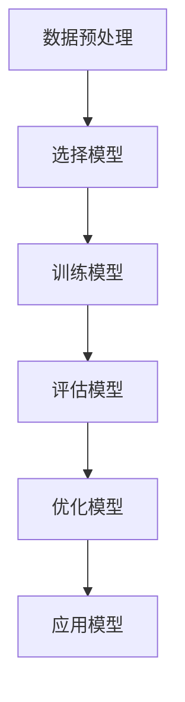
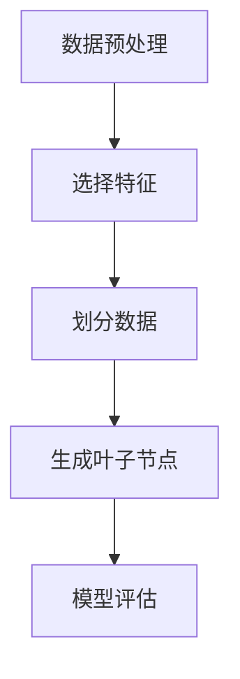
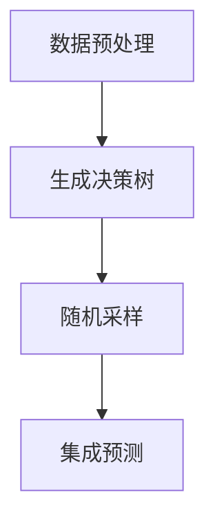
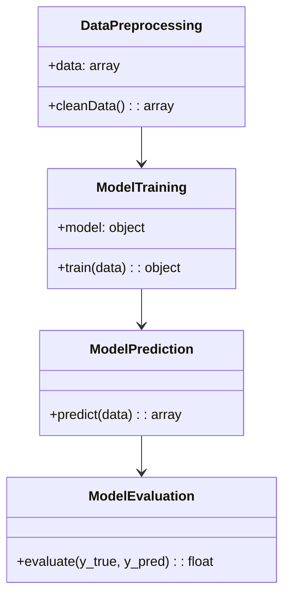
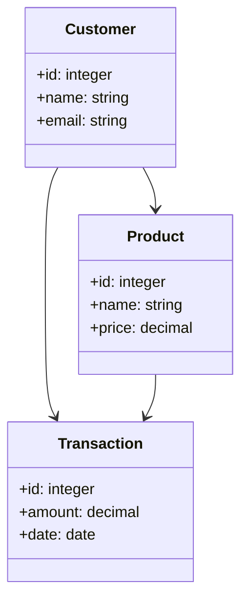
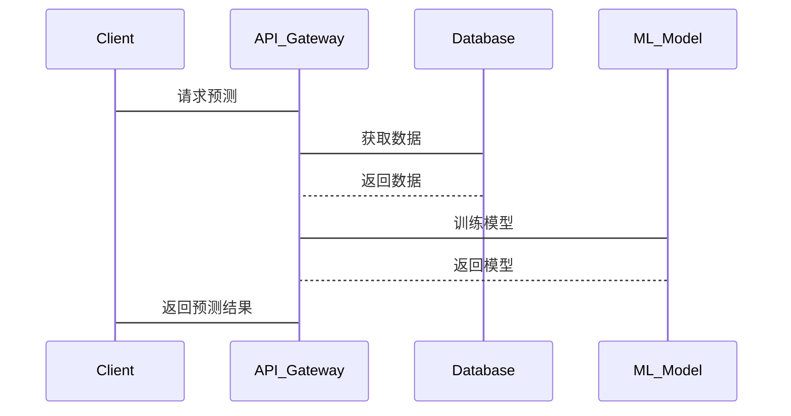

                 


```markdown
# AI驱动的企业战略规划：大数据分析与预测性建模

> 关键词：AI，企业战略规划，大数据分析，预测性建模，机器学习，数据分析

> 摘要：本文将探讨如何利用人工智能（AI）和大数据分析技术来驱动企业战略规划，通过预测性建模优化决策过程。文章首先介绍AI和大数据分析在企业战略规划中的重要性，然后详细阐述相关的核心概念、算法原理、系统架构设计，最后通过实际案例分析和项目实战，展示如何将这些技术应用于实际的企业战略规划中。

---

## 第一部分：引言

### 1.1 问题背景
#### 1.1.1 企业战略规划的重要性
企业战略规划是企业在复杂市场环境中制定长期目标和行动计划的关键过程。有效的战略规划能够帮助企业应对不确定性，抓住市场机会，提高竞争力。

#### 1.1.2 当前企业战略规划的挑战
- 数据量大且复杂，难以有效利用
- 传统方法依赖经验，缺乏数据支持
- 市场变化快，需要实时调整策略

#### 1.1.3 AI与大数据技术的引入
- 利用AI和大数据分析技术，企业可以更高效地处理和分析海量数据
- 预测性建模能够提供数据驱动的决策支持，提升战略规划的科学性和准确性

### 1.2 问题描述
#### 1.2.1 传统企业战略规划的局限性
- 主观性较强，缺乏数据支持
- 预测准确性不足，难以应对快速变化的市场环境
- 资源分配不合理，可能导致战略执行效果不佳

#### 1.2.2 数据驱动决策的必要性
- 数据是现代企业决策的核心资产
- 通过数据分析，企业能够识别趋势和模式，优化决策过程

#### 1.2.3 预测性建模在战略规划中的作用
- 帮助企业预测市场趋势、客户行为和内部绩效
- 提供基于数据的决策支持，提高战略规划的科学性

### 1.3 问题解决
#### 1.3.1 AI驱动的战略规划方法
- 利用机器学习算法进行数据分析和预测
- 构建预测性模型，辅助战略决策

#### 1.3.2 大数据分析与预测性建模的技术路线
1. 数据收集与预处理
2. 模型选择与训练
3. 模型验证与优化
4. 结果分析与应用

#### 1.3.3 企业战略规划的AI化转型
- 将AI技术整合到企业战略规划流程中
- 建立数据驱动的决策文化，提升企业竞争力

### 1.4 边界与外延
#### 1.4.1 AI驱动战略规划的适用范围
- 适用于数据量大、变化速度快的行业
- 适合需要精确预测和优化决策的企业

#### 1.4.2 与其他企业管理方法的区别
- 数据驱动 vs. 经验驱动
- 预测性 vs. 回顾性

#### 1.4.3 技术边界与实施限制
- 数据质量要求高
- 模型解释性可能不足
- 实施成本较高

---

## 第二部分：AI与企业战略规划的核心概念

### 2.1 AI的基本概念与原理
- 人工智能（AI）的定义
- 机器学习（ML）与深度学习（DL）的区别
- AI在企业应用中的主要技术

### 2.2 大数据分析的原理与方法
- 数据采集、存储与处理技术
- 数据分析的常用方法（描述性分析、诊断性分析、预测性分析、规范性分析）

### 2.3 预测性建模的定义与应用
- 预测性建模的定义
- 常见的预测模型类型（回归模型、分类模型、时间序列模型等）

### 2.4 核心概念的对比分析
#### 2.4.1 AI与大数据分析的对比
| 特性         | AI                     | 大数据分析               |
|--------------|------------------------|--------------------------|
| 核心技术     | 机器学习、深度学习     | 数据清洗、统计分析       |
| 应用场景     | 智能决策、自动化系统     | 数据可视化、趋势分析     |

#### 2.4.2 预测性建模与其他数据分析方法的对比
| 方法         | 描述性分析             | 诊断性分析               | 预测性分析               | 规范性分析               |
|--------------|------------------------|--------------------------|--------------------------|--------------------------|
| 目标         | 描述数据特征           | 分析数据背后的原因       | 预测未来趋势             | 提供最优决策建议         |

### 2.5 ER实体关系图
```mermaid
erDiagram
    customer[CUSTOMER] {
        code       : string
        name       : string
        email      : string
        phone      : string
    }
    transaction[TRANSACTION] {
        id          : integer
        date        : date
        amount      : decimal
        customer_code : string
    }
    product[PRODUCT] {
        id          : integer
        name        : string
        price       : decimal
        category    : string
    }
    CUSTOMER o-- TRANSACTIONS : "makes"
    CUSTOMER o-- PRODUCT     : "buys"
    PRODUCT --> TRANSACTIONS : "sold_in"
```

---

## 第三部分：算法原理

### 3.1 线性回归
#### 3.1.1 算法原理
线性回归是一种简单的预测性建模方法，适用于连续型目标变量的预测。

数学公式：
$$ y = \beta_0 + \beta_1 x + \epsilon $$

其中，$\beta_0$是截距，$\beta_1$是回归系数，$\epsilon$是误差项。

#### 3.1.2 算法流程


#### 3.1.3 Python代码实现
```python
import numpy as np
import matplotlib.pyplot as plt

# 示例数据
X = np.array([1, 2, 3, 4, 5])
y = np.array([2, 4, 5, 4, 6])

# 计算回归系数
beta_1 = np.cov(X, y)[0, 1] / np.var(X)
beta_0 = np.mean(y) - beta_1 * np.mean(X)

# 绘制回归线
plt.scatter(X, y)
plt.plot(X, beta_0 + beta_1 * X, color='red')
plt.show()
```

---

### 3.2 决策树
#### 3.2.1 算法原理
决策树是一种基于树结构的预测模型，适用于分类和回归问题。

数学公式：
$$ f(x) = \text{sign}(\sum_{i=1}^n \lambda_i (x \geq t_i)) $$

其中，$\lambda_i$是权重，$t_i$是划分点。

#### 3.2.2 算法流程


#### 3.2.3 Python代码实现
```python
from sklearn.tree import DecisionTreeClassifier
from sklearn.datasets import make_classification

# 示例数据
X, y = make_classification(n_samples=100, n_features=2, n_classes=2)

# 训练模型
model = DecisionTreeClassifier()
model.fit(X, y)

# 预测
print(model.predict([[0, 0]]))
```

---

### 3.3 随机森林
#### 3.3.1 算法原理
随机森林是一种基于决策树的集成学习方法，通过投票或平均的方式提高模型的准确性和稳定性。

数学公式：
$$ y = \text{mode}(\{h_i(x)\}) $$

其中，$h_i$是基模型。

#### 3.3.2 算法流程


#### 3.3.3 Python代码实现
```python
from sklearn.ensemble import RandomForestClassifier
from sklearn.datasets import make_classification

# 示例数据
X, y = make_classification(n_samples=100, n_features=2, n_classes=2)

# 训练模型
model = RandomForestClassifier(n_estimators=10)
model.fit(X, y)

# 预测
print(model.predict([[0, 0]]))
```

---

## 第四部分：系统架构设计

### 4.1 系统功能设计
#### 4.1.1 功能模块划分


#### 4.1.2 领域模型（Mermaid 类图）


### 4.2 系统架构设计
#### 4.2.1 系统架构（Mermaid 架构图）
```mermaid
archiDiagram
    client --> api_gateway
    api_gateway --> database
    api_gateway --> ml_model
    ml_model --> database
```

#### 4.2.2 系统接口设计
- 数据接口：数据预处理和存储
- 模型接口：模型训练和预测
- 用户接口：结果展示与交互

#### 4.2.3 系统交互（Mermaid 序列图）


---

## 第五部分：项目实战

### 5.1 环境安装
- 安装Python和必要的库（numpy、pandas、scikit-learn）
- 安装Jupyter Notebook或其他 IDE

### 5.2 核心代码实现
#### 5.2.1 数据预处理
```python
import pandas as pd
import numpy as np

# 示例数据
data = {
    'A': [1, 2, 3, 4, 5],
    'B': [2, 4, 5, 4, 6]
}
df = pd.DataFrame(data)

# 删除缺失值
df.dropna()
```

#### 5.2.2 模型训练
```python
from sklearn.linear_model import LinearRegression

model = LinearRegression()
model.fit(df[['A']], df['B'])
```

#### 5.2.3 模型预测
```python
print(model.predict([[6]]))
```

### 5.3 案例分析
#### 5.3.1 数据来源与问题描述
- 数据来源：企业销售数据
- 问题描述：预测未来季度的销售量

#### 5.3.2 数据分析与建模
```python
import matplotlib.pyplot as plt

# 数据可视化
plt.scatter(df['A'], df['B'])
plt.show()
```

#### 5.3.3 模型评估与优化
```python
from sklearn.metrics import r2_score

print(r2_score(df['B'], model.predict(df[['A']])))

# 调参优化
from sklearn.model_selection import GridSearchCV

param_grid = {'fit_intercept': [True, False]}
grid = GridSearchCV(LinearRegression(), param_grid)
grid.fit(df[['A']], df['B'])
print(grid.best_params_)
```

---

## 第六部分：总结与最佳实践

### 6.1 总结
- AI和大数据分析技术能够显著提升企业战略规划的科学性和准确性
- 预测性建模是实现数据驱动决策的核心技术之一
- 通过系统的架构设计和项目实战，企业可以更好地应用这些技术

### 6.2 最佳实践
1. 确保数据质量，进行充分的数据预处理
2. 根据问题选择合适的模型，避免过度复杂化
3. 注重模型的解释性和可维护性
4. 定期更新模型，适应数据和业务的变化

### 6.3 小结
通过本文的探讨，读者可以了解到如何利用AI和大数据分析技术优化企业战略规划。从核心概念到算法实现，再到系统设计和项目实战，本文提供了全面的指导和实用的建议。

---

## 参考文献
- [1] Hastie, T., Tibshirani, R., & Friedman, J. (2009). The Elements of Statistical Learning.
- [2] Bishop, C. M. (2006). Pattern Recognition and Machine Learning.
- [3] 吴恩达. (2016). 机器学习入门实战。
```

