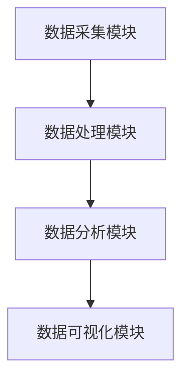

                 


# AI驱动的企业战略规划：大数据分析与预测性情景模拟

---

## 关键词  
AI, 大数据分析, 预测性情景模拟, 企业战略规划, 机器学习, 数据可视化

---

## 摘要  
随着人工智能（AI）技术的飞速发展，企业战略规划的传统模式正面临巨大变革。通过大数据分析与预测性情景模拟，企业能够更精准地洞察市场趋势、优化资源配置、制定灵活的战略决策。本文将深入探讨AI驱动的企业战略规划的核心概念、算法原理、系统架构及实际应用，为企业提供理论与实践相结合的指导。

---

## 目录  
1. [AI驱动的企业战略规划背景](#ai驱动的企业战略规划背景)  
   1.1 [企业战略规划的传统模式](#企业战略规划的传统模式)  
   1.2 [AI驱动的战略规划的优势](#ai驱动的战略规划的优势)  
   1.3 [大数据分析与预测性情景模拟的结合](#大数据分析与预测性情景模拟的结合)  

2. [AI驱动的战略规划核心概念](#ai驱动的战略规划核心概念)  
   2.1 [大数据分析的基本原理](#大数据分析的基本原理)  
   2.2 [预测性情景模拟的实现机制](#预测性情景模拟的实现机制)  
   2.3 [AI在战略规划中的应用案例](#ai在战略规划中的应用案例)  

3. [AI驱动的战略规划算法原理](#ai驱动的战略规划算法原理)  
   3.1 [预测模型的构建](#预测模型的构建)  
   3.2 [时间序列预测模型](#时间序列预测模型)  
   3.3 [聚类分析与分类模型](#聚类分析与分类模型)  

4. [AI驱动的战略规划系统架构](#ai驱动的战略规划系统架构)  
   4.1 [系统整体架构设计](#系统整体架构设计)  
   4.2 [系统功能设计](#系统功能设计)  
   4.3 [系统接口设计](#系统接口设计)  

5. [AI驱动的战略规划项目实战](#ai驱动的战略规划项目实战)  
   5.1 [项目背景与目标](#项目背景与目标)  
   5.2 [环境配置与数据准备](#环境配置与数据准备)  
   5.3 [核心算法实现](#核心算法实现)  
   5.4 [系统实现与测试](#系统实现与测试)  
   5.5 [项目小结](#项目小结)  

6. [参考文献](#参考文献)  

---

## 1. AI驱动的企业战略规划背景

### 1.1 企业战略规划的传统模式  
企业战略规划的传统模式依赖于经验和专家判断，具有一定的局限性：  
1. 数据量有限，难以覆盖全市场。  
2. 分析结果主观性强，缺乏数据支持。  
3. 预测精度低，难以应对复杂多变的市场环境。  

通过引入AI技术，企业能够利用大数据分析和预测性情景模拟，提高战略规划的科学性和精准性。

---

### 1.2 AI驱动的战略规划的优势  
AI驱动的战略规划具有以下显著优势：  
1. **数据驱动的决策**：基于海量数据，提供客观、精准的决策支持。  
2. **预测性分析**：利用机器学习模型，预测市场趋势和潜在风险。  
3. **灵活性与精准度**：通过实时数据更新，快速调整战略方向。  

---

### 1.3 大数据分析与预测性情景模拟的结合  
大数据分析与预测性情景模拟的结合，能够帮助企业更好地应对不确定性。  
1. **大数据分析**：通过对结构化和非结构化数据的处理，提取有价值的信息。  
2. **预测性情景模拟**：基于历史数据和模型，模拟不同情景下的战略结果。  
3. **协同效应**：通过数据驱动的模拟，优化战略决策的执行效果。  

---

## 2. AI驱动的战略规划核心概念  

### 2.1 大数据分析的基本原理  
大数据分析包括数据采集、处理、分析和可视化的四个阶段。  
1. **数据采集**：通过传感器、数据库等渠道获取数据。  
2. **数据处理**：清洗、转换和集成数据，确保数据质量。  
3. **数据分析**：利用统计方法和机器学习算法，提取数据中的规律。  
4. **数据可视化**：将分析结果以图表形式呈现，便于决策者理解。  

---

### 2.2 预测性情景模拟的实现机制  
预测性情景模拟是基于历史数据和模型，模拟未来可能的结果。  
1. **模拟模型构建**：选择合适的机器学习模型，如线性回归、随机森林等。  
2. **模型训练**：利用历史数据训练模型，优化参数。  
3. **情景模拟**：输入不同的假设条件，模拟多种情景下的结果。  
4. **结果验证**：通过实际数据验证模拟结果的准确性。  

---

### 2.3 AI在战略规划中的应用案例  
以下是几个AI在战略规划中的实际应用案例：  
1. **零售行业的市场预测**：通过分析销售数据和市场趋势，预测未来销售额。  
2. **制造业的生产优化**：利用AI预测设备故障，优化生产计划。  
3. **金融行业的风险评估**：通过机器学习模型，评估投资组合的风险。  

---

## 3. AI驱动的战略规划算法原理  

### 3.1 预测模型的构建  
预测模型的构建包括以下几个步骤：  
1. **数据预处理**：清洗数据，处理缺失值和异常值。  
2. **特征选择**：提取对预测目标有影响的关键特征。  
3. **模型训练**：选择合适的算法，训练预测模型。  
4. **模型评估**：通过交叉验证评估模型的性能。  

#### 3.1.1 线性回归模型  
线性回归是一种简单且常用的预测模型，适用于线性关系的场景。  
$$ y = \beta_0 + \beta_1x + \epsilon $$  
其中，$y$ 是目标变量，$x$ 是特征变量，$\beta_0$ 和 $\beta_1$ 是模型参数，$\epsilon$ 是误差项。  

#### 3.1.2 随机森林模型  
随机森林是一种基于决策树的集成学习算法，具有高准确性和鲁棒性。  

---

### 3.2 时间序列预测模型  
时间序列预测模型适用于具有时间依赖性的数据。  

#### 3.2.1 ARIMA模型  
ARIMA（自回归积分滑动平均模型）是一种常用的时间序列预测模型。  
$$ ARIMA(p, d, q) $$  
其中，$p$ 是自回归阶数，$d$ 是差分阶数，$q$ 是滑动平均阶数。  

#### 3.2.2 LSTM网络  
长短期记忆网络（LSTM）是一种深度学习模型，适用于时间序列数据的预测。  

---

### 3.3 聚类分析与分类模型  
聚类分析用于将数据分成相似的群体，分类模型用于预测类别标签。  

#### 3.3.1 K-means聚类  
K-means是一种常用的聚类算法，适用于无监督学习场景。  

#### 3.3.2 K-近邻算法（KNN）  
KNN是一种简单的分类算法，适用于小规模数据集。  

---

## 4. AI驱动的战略规划系统架构  

### 4.1 系统整体架构设计  
系统架构包括数据采集、处理、分析和可视化四个模块。  

#### 数据采集模块  
- 数据来源：数据库、API接口、文件等。  
- 功能：实时采集企业内外部数据。  

#### 数据处理模块  
- 功能：清洗、转换和集成数据，确保数据质量。  

#### 数据分析模块  
- 功能：利用机器学习算法，生成预测结果和分析报告。  

#### 数据可视化模块  
- 功能：将分析结果以图表形式展示，便于用户理解。  

#### 系统架构图  


---

### 4.2 系统功能设计  

#### 4.2.1 数据采集与预处理  
- 数据采集：通过API接口获取市场数据。  
- 数据清洗：处理缺失值和异常值。  

#### 4.2.2 数据分析与建模  
- 数据分析：利用随机森林算法进行预测建模。  
- 模型优化：通过网格搜索优化模型参数。  

#### 4.2.3 数据可视化  
- 可视化工具：使用Matplotlib或Tableau展示分析结果。  

---

## 5. AI驱动的战略规划项目实战  

### 5.1 项目背景与目标  
以某零售企业的市场预测为例，目标是通过AI技术预测未来销售额。  

### 5.2 环境配置与数据准备  
- 环境配置：安装Python、Pandas、Scikit-learn等工具。  
- 数据准备：获取过去三年的销售数据和市场指标。  

### 5.3 核心算法实现  

#### 5.3.1 数据预处理  
```python
import pandas as pd
data = pd.read_csv('sales_data.csv')
data.dropna(inplace=True)
```

#### 5.3.2 特征选择与模型训练  
```python
from sklearn.ensemble import RandomForestRegressor
model = RandomForestRegressor(n_estimators=100)
model.fit(X_train, y_train)
```

#### 5.3.3 模型预测与评估  
```python
y_pred = model.predict(X_test)
print('预测结果:', y_pred)
```

---

## 6. 参考文献  
1. 周志华. 《机器学习》. 清华大学出版社, 2016.  
2. 张成林. 《Python机器学习实战》. 人民邮电出版社, 2018.  
3. McKinsey & Company. 《AI in Business Strategy》. 2020.  

---

## 总结  
通过AI技术，企业能够更高效地进行战略规划，利用大数据分析和预测性情景模拟，提升决策的精准性和灵活性。未来，随着AI技术的不断发展，企业战略规划将更加智能化和数据驱动。

