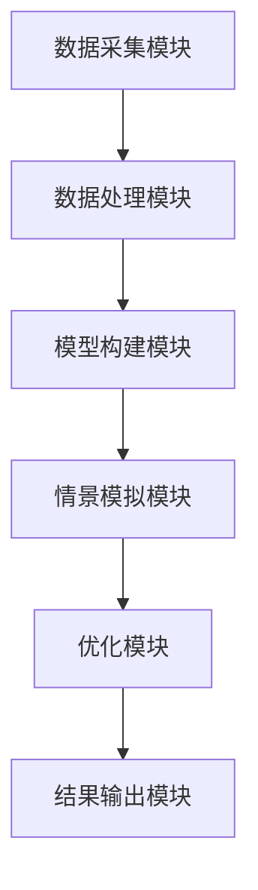
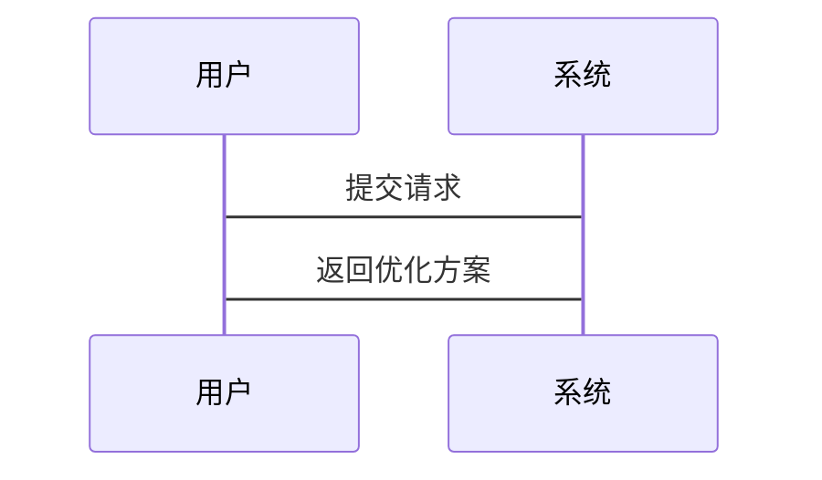

                 


# AI驱动的企业战略规划：情景模拟与优化

---

## 关键词：
AI驱动、企业战略规划、情景模拟、优化、机器学习、系统架构

---

## 摘要：
随着AI技术的快速发展，企业战略规划的制定和优化正面临前所未有的变革。本文将探讨如何利用AI技术，通过情景模拟与优化的方法，帮助企业制定更加科学、高效的战略规划。文章将从AI在企业战略规划中的作用、情景模拟的基本方法、优化算法的选择与实现，以及系统架构的设计等方面展开，最后通过一个实际案例展示AI驱动的战略规划在企业中的应用。通过本文的分析，读者将能够理解AI在企业战略规划中的核心作用，并掌握如何利用AI技术进行情景模拟与优化。

---

## 第1章 AI驱动的企业战略规划概述

### 1.1 企业战略规划的背景与意义

#### 1.1.1 企业战略规划的定义与目标
企业战略规划是指企业在一定时期内，为实现长期发展目标而制定的一系列战略目标、行动方案和资源分配计划。其核心目标是通过科学的规划，最大化企业资源的利用效率，降低风险，抓住市场机会。

#### 1.1.2 当前商业环境的变化与挑战
在数字化转型和全球化的背景下，企业面临的环境日益复杂。市场变化快、竞争加剧、客户需求多样化等因素使得传统的人工规划方式难以适应现代企业的需求。

#### 1.1.3 AI技术对企业战略规划的影响
AI技术的引入为企业战略规划带来了革命性的变化。通过机器学习、大数据分析等技术，企业可以快速处理海量数据，预测市场趋势，优化决策，从而提升战略规划的准确性和效率。

### 1.2 AI驱动的战略规划的优势

#### 1.2.1 提高决策的准确性和效率
AI技术可以通过分析历史数据和市场趋势，提供数据支持的决策，从而提高规划的准确性。

#### 1.2.2 个性化与动态调整能力
AI可以根据企业的实时数据和市场反馈，动态调整战略规划，实现个性化和灵活的规划方案。

#### 1.2.3 数据驱动的洞察与预测
通过AI技术，企业可以从大量数据中提取有价值的洞察，预测未来趋势，从而制定更具前瞻性的战略。

### 1.3 情景模拟与优化的核心作用

#### 1.3.1 情景模拟的定义与特点
情景模拟是一种通过构建不同场景，模拟企业在未来可能面临的各种情况，从而评估不同战略方案的可行性和效果的方法。

#### 1.3.2 情景模拟在战略规划中的应用
情景模拟可以帮助企业在制定战略规划时，提前考虑各种可能的风险和机会，从而制定更加全面和有效的应对策略。

#### 1.3.3 优化方法在情景模拟中的重要性
优化方法用于在情景模拟中找到最优的解决方案，通过算法优化，可以最大化企业资源的利用效率，提高战略规划的效果。

---

## 第2章 AI驱动的战略规划基础

### 2.1 企业战略规划的关键要素

#### 2.1.1 企业目标与愿景
企业的目标和愿景是战略规划的核心，决定了企业的长期发展方向。

#### 2.1.2 业务模式与资源分配
企业的业务模式和资源分配直接影响战略的实施效果，需要通过数据和AI技术进行优化。

#### 2.1.3 风险管理与机会捕捉
通过AI技术，企业可以更好地识别和管理风险，抓住市场机会。

### 2.2 AI在战略规划中的核心作用

#### 2.2.1 数据分析与预测
AI技术可以对海量数据进行分析和预测，为战略规划提供数据支持。

#### 2.2.2 自动化决策支持
通过机器学习模型，AI可以自动生成决策建议，提高规划的效率和准确性。

#### 2.2.3 智能化调整与优化
AI可以通过实时数据反馈，动态调整战略规划，实现智能化的优化。

### 2.3 情景模拟的基本方法

#### 2.3.1 定性分析与定量分析
定性分析用于理解问题的本质，定量分析用于量化问题的影响。

#### 2.3.2 不同场景的模拟构建
通过构建不同的场景，模拟企业在未来可能面临的各种情况，评估不同战略方案的效果。

#### 2.3.3 优化算法的选择与应用
选择合适的优化算法，如遗传算法、模拟退火等，用于在情景模拟中找到最优的解决方案。

---

## 第3章 数据驱动的情景模拟构建

### 3.1 数据收集与处理

#### 3.1.1 数据来源与类型
数据来源包括企业内部数据、市场数据、竞争对手数据等，数据类型包括结构化数据和非结构化数据。

#### 3.1.2 数据清洗与预处理
数据清洗包括去除噪声数据、填补缺失值等，预处理包括数据标准化、特征提取等。

#### 3.1.3 数据存储与管理
使用数据库或大数据平台进行数据的存储和管理，确保数据的安全性和可访问性。

### 3.2 模型构建与训练

#### 3.2.1 选择合适的机器学习模型
根据具体问题选择适合的模型，如线性回归、决策树、随机森林等。

#### 3.2.2 数据特征选择与工程
通过特征选择和工程，提取对模型最有影响力的特征，提高模型的性能。

#### 3.2.3 模型训练与评估
使用训练数据训练模型，通过验证集评估模型的性能，调整模型参数以优化效果。

### 3.3 情景模拟与优化

#### 3.3.1 模型的应用与测试
将训练好的模型应用于情景模拟，测试模型的预测能力。

#### 3.3.2 优化算法的实现
通过优化算法对情景模拟的结果进行优化，找到最优的解决方案。

#### 3.3.3 模型的迭代与改进
根据测试结果，不断迭代模型，改进模型的性能和效果。

---

## 第4章 系统架构与实现

### 4.1 系统架构设计

#### 4.1.1 系统功能模块
系统功能模块包括数据采集模块、模型构建模块、情景模拟模块、优化模块等。

#### 4.1.2 模块之间的关系
使用Mermaid图展示系统架构，明确各个模块之间的交互和数据流。

#### 4.1.3 系统数据流图
通过Mermaid图展示系统数据流，明确数据从输入到输出的流程。

### 4.2 系统实现细节

#### 4.2.1 数据采集与处理
详细描述数据采集的流程和方法，数据预处理的步骤和工具。

#### 4.2.2 模型构建与训练
详细描述模型构建的过程，包括数据特征工程、模型选择、训练参数设置等。

#### 4.2.3 情景模拟与优化
详细描述情景模拟的实现步骤，优化算法的具体实现和应用。

### 4.3 系统接口设计

#### 4.3.1 系统输入接口
描述系统输入的格式和接口，包括数据输入格式、参数设置等。

#### 4.3.2 系统输出接口
描述系统输出的结果格式和接口，包括预测结果、优化方案等。

#### 4.3.3 系统交互流程
通过Mermaid图展示系统交互流程，明确用户与系统之间的交互步骤。

---

## 第5章 项目实战：AI驱动的情景模拟系统

### 5.1 项目背景与目标

#### 5.1.1 项目背景
介绍项目的背景和目标，说明为什么要开发AI驱动的情景模拟系统。

#### 5.1.2 项目目标
明确项目的具体目标，包括实现情景模拟、优化算法、系统功能等。

### 5.2 系统核心实现

#### 5.2.1 环境安装与配置
详细描述开发环境的安装和配置，包括Python版本、依赖库安装等。

#### 5.2.2 核心代码实现
提供系统核心代码的实现，包括数据处理、模型训练、情景模拟、优化算法等。

#### 5.2.3 代码解读与分析
对核心代码进行详细解读，说明代码的功能和实现逻辑。

### 5.3 系统功能设计

#### 5.3.1 系统功能模块
详细描述系统功能模块，包括数据管理、模型构建、情景模拟、优化建议等。

#### 5.3.2 系统功能流程
通过Mermaid图展示系统功能流程，明确各个功能模块之间的交互关系。

#### 5.3.3 系统功能实现
详细描述系统功能的实现步骤，包括模块的开发、功能的测试等。

### 5.4 系统测试与优化

#### 5.4.1 系统测试
描述系统的测试方法，包括单元测试、集成测试、性能测试等。

#### 5.4.2 测试结果分析
分析测试结果，找出系统中的问题和瓶颈，提出优化建议。

#### 5.4.3 系统优化
根据测试结果，对系统进行优化，提高系统的性能和用户体验。

### 5.5 项目小结

#### 5.5.1 项目成果
总结项目的成果，包括系统功能的实现、性能的提升等。

#### 5.5.2 经验与教训
总结项目中的经验和教训，为后续项目的开发提供参考。

#### 5.5.3 项目展望
展望项目的未来发展方向，包括功能扩展、技术升级等。

---

## 第6章 总结与未来展望

### 6.1 总结

#### 6.1.1 文章核心内容回顾
总结本文的核心内容，回顾AI在企业战略规划中的应用。

#### 6.1.2 AI驱动的情景模拟与优化的关键点
总结情景模拟与优化的关键点，包括数据处理、模型构建、优化算法等。

### 6.2 未来展望

#### 6.2.1 AI技术的进一步发展
展望AI技术的未来发展方向，包括更强大的模型、更高效的学习算法等。

#### 6.2.2 企业战略规划的智能化升级
预测企业战略规划的智能化发展趋势，包括更广泛的应用、更深入的优化等。

#### 6.2.3 情景模拟与优化的创新应用
探讨情景模拟与优化技术的创新应用，包括跨行业的应用、实时动态调整等。

### 6.3 最佳实践Tips

#### 6.3.1 数据质量的重要性
强调数据质量在AI驱动的战略规划中的重要性，建议企业重视数据的收集和处理。

#### 6.3.2 模型选择与调优
建议企业在模型选择和调优过程中，结合具体问题和数据特点，选择合适的模型和参数。

#### 6.3.3 优化算法的应用
建议企业在优化算法的应用中，根据问题的特点选择合适的算法，并进行参数调优。

---

## 参考文献

### 6.4.1 经典书籍
1. 《机器学习实战》
2. 《数据挖掘导论》
3. 《战略管理》

### 6.4.2 技术文档
1. TensorFlow官方文档
2. PyTorch官方文档
3. Scikit-learn官方文档

---

## 附录

### A. 代码示例

```python
# 数据处理
import pandas as pd
import numpy as np

data = pd.read_csv('input.csv')
data = data.dropna()
data = (data - data.mean()) / data.std()

# 模型训练
from sklearn.model import LinearRegression

model = LinearRegression()
model.fit(X_train, y_train)

# 情景模拟
import numpy as np

def simulate_scenario(data, model):
    scenarios = generate_scenarios(data)
    results = []
    for scenario in scenarios:
        prediction = model.predict(scenario)
        results.append((scenario, prediction))
    return results

# 优化算法
from scipy.optimize import minimize

def optimize_solution(results):
    best = None
    for scenario, result in results:
        if result > best:
            best = result
    return best

# 系统接口
from flask import Flask, request, jsonify

app = Flask(__name__)

@app.route('/plan', methods=['POST'])
def plan():
    data = request.json
    result = simulate_scenario(data, model)
    return jsonify(result)
```

---

## 图表附录

### 图1: 系统架构图



### 图2: 系统交互流程图



---

## 结语

AI驱动的企业战略规划：情景模拟与优化，不仅是技术的进步，更是企业智能化转型的重要里程碑。通过AI技术，企业可以更高效地制定和优化战略规划，抓住市场机会，降低风险，实现可持续发展。未来，随着AI技术的不断发展，企业战略规划将更加智能化、个性化，为企业创造更大的价值。

---

通过本文的详细讲解，读者可以全面了解AI在企业战略规划中的应用，并掌握如何利用AI技术进行情景模拟与优化，为企业的发展提供有力支持。

