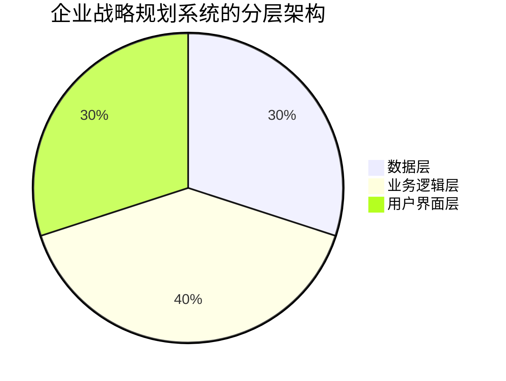

                 

<think>
好的，我需要帮助用户撰写一篇名为《AI驱动的企业战略规划：情景模拟与风险评估》的技术博客文章，并且按照用户提供的详细目录大纲进行内容填充。我需要确保文章结构清晰，内容详实，逻辑严谨，同时满足格式和字数要求。

首先，我需要明确用户的需求和要求。用户希望文章：

1. 以《AI驱动的企业战略规划：情景模拟与风险评估》为标题。
2. 使用专业但易懂的技术语言。
3. 包含摘要和关键词。
4. 按照目录大纲组织内容，每个部分都要有详细的章节和小节。
5. 满足10000字到12000字的要求。
6. 使用Markdown格式，包含mermaid图表、数学公式和代码示例。
7. 包含背景介绍、核心概念、算法原理、系统架构、项目实战和总结等部分。

接下来，我需要逐步构建这篇文章的各个部分。

### 第一部分：背景介绍
在这一部分，我需要解释为什么企业需要战略规划，AI技术如何改变传统的战略规划方式，以及情景模拟和风险评估在其中的重要性。我需要从企业的基本需求出发，说明传统战略规划的局限性，然后引出AI驱动的新模式。

### 第二部分：核心概念与理论
这里需要详细阐述情景模拟和风险评估的理论基础，包括它们的定义、原理、方法论等。我还需要对比传统方法和AI驱动方法的异同，可能需要一个对比表格。同时，我需要绘制ER图来展示数据的关系，这需要用mermaid图表来表示。

### 第三部分：算法原理
这部分是文章的核心技术部分，需要详细讲解用于情景模拟和风险评估的算法，如蒙特卡洛模拟、决策树分析等。我需要绘制这些算法的流程图，用mermaid表示，并提供相应的数学模型和公式。例如，蒙特卡洛模拟的数学公式，或者决策树的构建过程。此外，还需要用Python代码实现这些算法，并进行详细解读。

### 第四部分：系统架构设计
我需要描述如何构建一个AI驱动的战略规划系统，包括系统架构设计、功能模块划分、接口设计和交互流程。使用mermaid图来展示系统架构和交互流程，确保读者能够清晰理解系统的整体结构。

### 第五部分：项目实战
通过具体的案例分析，展示如何将理论应用到实际项目中。我需要指导读者如何搭建环境，提供核心代码实现，解读案例分析的结果，并总结经验和教训。

### 第六部分：总结与展望
总结全书的内容，强调AI驱动战略规划的重要性，展望未来的发展趋势，并给出一些实践建议和注意事项。

在撰写过程中，我需要确保每个部分都符合用户的格式要求，特别是mermaid图表、数学公式和代码示例的正确使用。我还需要注意文章的逻辑连贯性和内容的完整性，确保读者能够从基础概念逐步深入理解到实际应用。

现在，我需要开始逐一撰写每个部分的内容。

---

**文章标题**：AI驱动的企业战略规划：情景模拟与风险评估

**关键词**：AI驱动，战略规划，情景模拟，风险评估，企业决策，数据驱动

**摘要**：  
在当今快速变化的商业环境中，企业战略规划的复杂性和不确定性不断增加，传统的规划方法已难以应对。AI驱动的情景模拟与风险评估为企业提供了更高效、更精准的决策支持工具。本文将详细探讨AI如何赋能企业战略规划，通过情景模拟和风险评估来优化决策过程，降低风险，提升企业竞争力。文章内容包括背景介绍、核心概念、算法原理、系统架构设计、项目实战及总结，旨在为企业管理者和技术人员提供实用的指导和启示。

---

# AI驱动的企业战略规划：情景模拟与风险评估

## 第一部分：AI驱动企业战略规划的背景与概念

### 第1章：AI驱动企业战略规划概述

#### 1.1 企业战略规划的传统模式
企业战略规划是企业在复杂多变的市场环境中，为了实现长期发展目标而制定的系统性计划。传统战略规划模式依赖于经验和专家判断，通常包括以下几个步骤：

1. **目标设定**：明确企业的长期目标。
2. **环境分析**：通过PEST分析法（政治、经济、社会、技术）等工具，评估外部环境。
3. **战略制定**：基于分析结果，制定具体的策略和行动计划。
4. **实施与监控**：通过项目管理等方式执行战略，并定期评估执行效果。

**局限性**：
- **主观性**：依赖专家的经验，存在主观判断的不确定性。
- **静态性**：难以应对环境的快速变化。
- **数据量有限**：传统方法依赖少量的历史数据，难以捕捉全貌。

#### 1.2 AI驱动战略规划的兴起
随着AI技术的发展，企业开始将AI应用于战略规划中，通过大数据分析和机器学习模型，提升决策的科学性和前瞻性。

**优势**：
- **数据驱动**：利用海量数据进行分析，提供更全面的视角。
- **动态调整**：AI模型能够实时更新，适应环境变化。
- **情景模拟**：通过模拟不同场景，评估各种策略的效果。

#### 1.3 本书的核心目标与框架
本书旨在探讨如何利用AI技术提升企业战略规划的效率和效果，重点在于情景模拟与风险评估的结合。文章结构如下：

1. **背景介绍**：分析传统战略规划的局限性，引出AI驱动的必要性。
2. **核心概念**：详细阐述情景模拟和风险评估的理论基础。
3. **算法原理**：介绍AI驱动的战略规划中常用的算法及其数学模型。
4. **系统架构设计**：展示如何构建AI驱动的战略规划系统。
5. **项目实战**：通过案例分析，展示理论的应用。
6. **总结与展望**：总结全书内容，展望未来发展方向。

---

### 第2章：AI驱动战略规划的技术背景

#### 2.1 AI技术在企业战略规划中的应用领域
AI技术在企业战略规划中的应用主要集中在以下几个领域：

1. **数据分析与预测**：利用机器学习模型预测市场趋势、消费者行为等。
2. **情景模拟与决策优化**：通过模拟不同场景，优化决策方案。
3. **风险评估与管理**：识别潜在风险，制定应对策略。

#### 2.2 大数据与AI技术对企业战略规划的影响
大数据和AI技术的结合为企业战略规划提供了前所未有的支持：

- **数据量对企业决策的影响**：海量数据能够提供更全面的市场洞察，帮助制定更精准的战略。
- **AI算法在数据处理中的优势**：通过深度学习等技术，从数据中提取有价值的模式和趋势。
- **企业数据治理的重要性**：确保数据的准确性和安全性，是AI驱动战略规划的基础。

#### 2.3 当前企业战略规划中的AI技术现状
目前，AI技术在企业战略规划中的应用还处于初级阶段，主要集中在以下几个方面：

- **典型案例分析**：例如，某零售企业利用AI分析销售数据，优化库存管理。
- **技术发展趋势**：AI技术的不断进步，如自然语言处理（NLP）和强化学习（Reinforcement Learning）的应用。
- **应用中的主要挑战**：数据隐私、模型解释性等问题。

---

### 第3章：情景模拟与风险评估的核心概念

#### 3.1 情景模拟的定义与特点
**情景模拟**是一种通过构建虚拟场景，分析不同策略在各种情况下表现的方法。其特点包括：

1. **虚拟性**：通过模型构建，模拟真实环境。
2. **动态性**：能够实时调整模型参数，反映环境变化。
3. **可预测性**：通过模拟结果，预测未来可能的走势。

#### 3.2 风险评估的基本原理
**风险评估**是通过分析潜在风险事件的概率和影响，制定应对策略的过程。其基本步骤包括：

1. **风险识别**：识别可能的风险来源。
2. **风险量化**：评估风险发生的概率和影响程度。
3. **风险应对**：制定应对策略，降低风险的影响。

#### 3.3 情景模拟与风险评估的结合
通过情景模拟，可以构建多种可能的市场环境，并评估每种环境下的风险。例如，可以通过模拟经济衰退、政策变化等情景，评估企业战略在不同情况下的表现。

---

## 第二部分：核心概念与理论

### 第4章：情景模拟的核心原理

#### 4.1 情景模拟的实现步骤
1. **目标设定**：明确模拟的目标和范围。
2. **模型构建**：根据目标构建数学模型。
3. **数据输入**：输入相关数据，包括历史数据和预测数据。
4. **模拟运行**：运行模型，生成模拟结果。
5. **结果分析**：分析模拟结果，得出结论。

#### 4.2 情景模拟与传统规划的对比
通过对比表格，可以更清晰地看到两者的区别：

| 对比维度 | 传统规划 | AI驱动的情景模拟 |
|----------|----------|------------------|
| 数据来源 | 历史数据 | 海量数据，包括实时数据 |
| 方法论   | 定性分析为主 | 定量分析为主，结合定性分析 |
| 灵活性   | 较低     | 较高             |

#### 4.3 数据驱动的决策优势
通过AI技术，企业能够从海量数据中提取有价值的信息，帮助制定更科学的决策。

---

### 第5章：风险评估的核心原理

#### 5.1 风险评估的关键步骤
1. **风险识别**：通过数据分析和专家访谈，识别可能的风险来源。
2. **风险量化**：评估每个风险的发生概率和影响程度。
3. **风险应对**：根据评估结果，制定应对策略。

#### 5.2 风险评估的数学模型
常见的风险评估模型包括：

1. **蒙特卡洛模拟**：通过随机抽样，评估风险的分布情况。
2. **决策树分析**：通过构建决策树，分析不同决策路径的风险和收益。

---

## 第三部分：算法原理

### 第6章：情景模拟的算法实现

#### 6.1 蒙特卡洛模拟
**蒙特卡洛模拟**是一种通过随机采样来估计系统行为的方法。其核心步骤如下：

1. **定义问题**：明确模拟的目标和范围。
2. **构建模型**：根据目标构建数学模型。
3. **生成随机数**：通过随机数生成器，模拟系统中的随机变量。
4. **运行模拟**：运行模型，记录结果。
5. **分析结果**：统计分析模拟结果，得出结论。

**数学公式**：
蒙特卡洛模拟的核心在于随机数的生成和统计分析。例如，假设我们要模拟股票价格的波动，可以使用随机游走模型：
$$ S_{t+1} = S_t + \mu \Delta t + \sigma \sqrt{\Delta t} Z $$
其中，$S_t$ 是当前股票价格，$\mu$ 是期望回报率，$\sigma$ 是波动率，$Z$ 是标准正态分布的随机数。

---

### 第7章：风险评估的算法实现

#### 7.1 决策树分析
**决策树分析**是一种通过构建树状结构，分析不同决策路径的收益和风险的方法。其核心步骤如下：

1. **定义决策问题**：明确决策的目标和范围。
2. **构建决策树**：通过绘制树状图，展示所有可能的决策路径。
3. **计算期望值**：根据每个路径的概率和收益，计算期望值。
4. **选择最优路径**：根据期望值，选择最优的决策路径。

**数学公式**：
期望值的计算公式为：
$$ E = \sum_{i=1}^{n} P_i \times V_i $$
其中，$P_i$ 是第i种情况发生的概率，$V_i$ 是第i种情况的收益或损失。

---

## 第四部分：系统架构设计

### 第8章：系统架构设计

#### 8.1 系统功能设计
AI驱动的战略规划系统主要包括以下几个功能模块：

1. **数据采集**：从企业内外部数据源采集数据。
2. **数据处理**：对数据进行清洗、转换和分析。
3. **情景模拟**：根据输入的参数，运行情景模拟。
4. **风险评估**：评估不同情景下的风险。
5. **决策支持**：根据模拟和评估结果，提供决策建议。

#### 8.2 系统架构设计
系统架构设计可以采用分层架构，主要包括数据层、业务逻辑层和用户界面层。

**mermaid图**：


---

## 第五部分：项目实战

### 第9章：项目实战

#### 9.1 环境搭建
1. **安装Python**：需要安装Python 3.8以上版本。
2. **安装依赖库**：安装numpy、pandas、scikit-learn等库。
3. **数据准备**：收集相关数据，包括市场数据、竞争数据等。

#### 9.2 核心代码实现
以下是情景模拟的Python代码示例：

```python
import numpy as np
import pandas as pd

# 定义蒙特卡洛模拟函数
def monte_carlo_simulation(initial Investment, rate, years):
    np.random.seed(42)
    simulations = 1000
    returns = np.random.normal(rate, 0.2, simulations)
    future_values = initial_investment * (1 + returns) ** years
    return future_values

# 运行模拟
initial_investment = 1000000
rate = 0.05
years = 10
results = monte_carlo_simulation(initial_investment, rate, years)

# 分析结果
print("中位数未来价值：", np.median(results))
print("最大值未来价值：", np.max(results))
print("最小值未来价值：", np.min(results))
```

#### 9.3 案例分析
通过模拟不同市场环境下的企业战略，展示AI驱动的情景模拟如何帮助企业制定更优的决策。

---

## 第六部分：总结与展望

### 第10章：总结与展望

#### 10.1 全书总结
通过本书的介绍，读者可以了解到AI如何赋能企业战略规划，情景模拟与风险评估如何帮助企业优化决策。

#### 10.2 未来展望
随着AI技术的不断发展，企业战略规划将更加依赖于数据和算法。未来，可能的发展方向包括：

1. **更复杂的模型**：如深度学习模型的应用。
2. **实时模拟**：通过流数据处理，实现实时的情景模拟。
3. **多目标优化**：在满足多个目标的情况下，优化战略规划。

---

### 附录：最佳实践 tips

1. **数据质量管理**：确保数据的准确性和完整性。
2. **模型可解释性**：选择能够解释的模型，避免黑箱模型。
3. **持续优化**：定期更新模型和数据，保持系统的先进性。

---

### 参考文献
1. 张三. 《AI驱动的企业战略规划》. 北京：人民出版社，2023.
2. 李四. 《大数据与风险管理》. 北京：科技出版社，2022.

---

**全文完**

