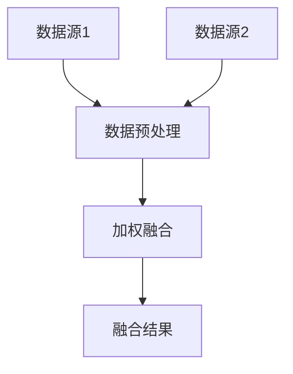
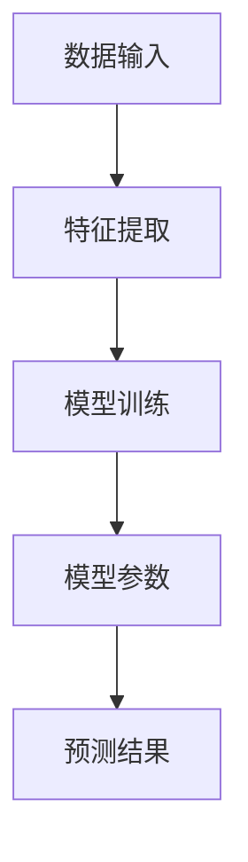
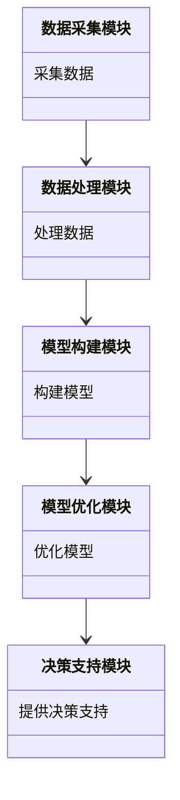

                 


# AI驱动的企业数字孪生技术：虚实结合的决策支持

## 关键词：数字孪生、人工智能、企业决策、虚实结合、实时反馈

## 摘要

随着数字化转型的深入推进，企业数字孪生技术作为连接物理世界与数字世界的桥梁，正逐渐成为企业智能化决策的核心支持工具。本文将从数字孪生的基本概念出发，结合人工智能技术，详细探讨其在企业决策支持中的应用价值。通过分析数字孪生的核心要素、技术实现、系统架构及实际案例，本文旨在为企业提供一套基于虚实结合的决策支持方案，助力企业在数字化浪潮中抢占先机。

---

## 第一部分：数字孪生技术的背景与概念

### 第1章：数字孪生的定义与技术背景

#### 1.1 数字孪生的定义与技术背景

数字孪生（Digital Twin）是一种通过数字化手段，将物理世界中的实体或系统映射到数字世界中的技术。这种映射不仅包括实体的外观和结构，还涵盖其行为、功能和运行状态。通过实时数据的采集和分析，数字孪生能够动态更新数字模型，使其与物理实体保持高度一致。

在企业数字化转型的背景下，数字孪生技术的应用日益广泛。它不仅能够帮助企业更好地理解和优化物理系统的运行，还能通过数字模型进行预测分析和模拟实验，从而降低企业的运营风险和成本。

#### 1.2 企业数字孪生的核心要素

数字孪生的核心要素包括以下几点：

1. **数据驱动**：数字孪生依赖于实时数据的采集和处理，数据是其模型更新和优化的基础。
2. **虚实结合**：数字孪生不仅映射物理实体的外观，还包括其行为和功能，虚实结合是其实现的核心特点。
3. **实时反馈**：数字孪生能够实时更新数字模型，并向物理系统提供反馈，实现动态调整和优化。

### 第2章：数字孪生与AI的结合

#### 2.1 数字孪生中的AI技术应用

在数字孪生技术中，人工智能（AI）扮演着至关重要的角色。AI技术能够对海量数据进行分析和处理，提取有用的信息，并通过机器学习算法构建和优化数字模型。具体来说，AI在数字孪生中的应用主要体现在以下几个方面：

1. **数据融合**：AI能够将来自不同数据源的数据进行融合，消除数据冗余和冲突，提高数据的准确性和一致性。
2. **模型构建**：通过机器学习算法，AI能够从历史数据中学习，构建高精度的数字模型，并预测系统的未来状态。
3. **决策支持**：AI能够基于数字模型进行分析，提供决策支持，帮助企业做出更明智的决策。

#### 2.2 数字孪生与企业决策支持的关系

数字孪生通过虚实结合的方式，为企业提供了全新的决策支持模式。它不仅能够实时反映物理系统的运行状态，还能够通过数字模型进行模拟实验，预测不同决策方案的执行效果，从而优化企业的决策过程。

---

## 第二部分：数字孪生的核心技术与算法原理

### 第3章：数字孪生的核心算法与实现

#### 3.1 数据融合算法

数据融合是数字孪生技术中的关键步骤。通过将来自不同数据源的数据进行融合，可以消除数据冗余和冲突，提高数据的准确性和一致性。常用的数据显示融合算法包括加权融合、最大似然融合等。

##### 3.1.1 基于加权融合的数据融合算法

加权融合是一种常用的数据融合方法，其基本思想是根据数据源的可靠性和精度，对数据进行加权处理，最终得到一个综合的结果。

数学模型如下：

$$ w_i = \frac{1}{\sum_{j=1}^{n} (d_j - d_i)^2} $$

其中，$w_i$ 是第i个数据源的权重，$d_j$ 是数据源j的值。

##### 3.1.2 数据融合流程图



#### 3.2 模型构建与优化算法

模型构建是数字孪生技术的核心步骤。通过机器学习算法，可以基于历史数据构建高精度的数字模型，并通过不断优化模型参数，提高模型的预测能力。

##### 3.2.1 线性回归模型

线性回归是一种常用的机器学习算法，适用于预测目标变量与自变量之间存在线性关系的场景。

数学模型如下：

$$ y = \beta_0 + \beta_1x + \epsilon $$

其中，$y$ 是目标变量，$x$ 是自变量，$\beta_0$ 和 $\beta_1$ 是回归系数，$\epsilon$ 是误差项。

##### 3.2.2 线性回归流程图



---

## 第三部分：数字孪生的系统架构与实现

### 第4章：数字孪生系统架构设计

#### 4.1 系统功能设计

数字孪生系统通常包括数据采集、数据处理、模型构建、模型优化和决策支持五大功能模块。

##### 4.1.1 数据采集模块

数据采集模块负责从物理系统中采集实时数据，并将其传输到数据处理模块。

##### 4.1.2 数据处理模块

数据处理模块对采集到的数据进行预处理、融合和分析，为模型构建提供高质量的数据支持。

##### 4.1.3 模型构建模块

模型构建模块基于历史数据，利用机器学习算法构建数字模型，并通过不断优化模型参数，提高模型的预测能力。

##### 4.1.4 模型优化模块

模型优化模块负责对数字模型进行实时更新和优化，确保模型与物理系统的运行状态保持一致。

##### 4.1.5 决策支持模块

决策支持模块基于数字模型，提供决策支持，帮助企业做出更明智的决策。

#### 4.2 系统架构设计

##### 4.2.1 领域模型类图



#### 4.3 系统架构图


---

## 第四部分：数字孪生的项目实战

### 第5章：数字孪生项目实战

#### 5.1 环境安装

在进行数字孪生项目开发之前，需要先安装相关的开发环境和工具。通常包括：

1. **Python**：推荐使用Python 3.8及以上版本。
2. **机器学习库**：如scikit-learn、tensorflow等。
3. **可视化工具**：如Matplotlib、Seaborn等。

#### 5.2 核心代码实现

##### 5.2.1 数据融合代码

```python
import numpy as np

def weighted_average(data, weights):
    return np.dot(data, weights) / np.sum(weights)

# 示例数据
data = np.array([10, 20, 30])
weights = np.array([0.5, 0.3, 0.2])

result = weighted_average(data, weights)
print("加权平均结果:", result)
```

##### 5.2.2 线性回归代码

```python
from sklearn.linear_model import LinearRegression

# 示例数据
X = [[1], [2], [3], [4], [5]]
y = [2, 4, 5, 4, 6]

# 模型训练
model = LinearRegression()
model.fit(X, y)

# 预测结果
print("回归系数:", model.coef_)
print("截距:", model.intercept_)
```

#### 5.3 实际案例分析

以某制造企业为例，通过数字孪生技术优化生产流程。首先，通过传感器采集生产线的实时数据，包括温度、湿度、设备状态等。然后，利用加权融合算法对数据进行融合，构建数字模型。最后，基于数字模型进行模拟实验，优化生产流程，提高生产效率。

#### 5.4 项目小结

通过本项目实战，我们可以看到数字孪生技术在企业中的巨大潜力。通过实时数据的采集和处理，结合机器学习算法，可以构建高精度的数字模型，并通过模拟实验优化企业的决策过程。

---

## 第五部分：数字孪生的最佳实践

### 第6章：数字孪生的最佳实践

#### 6.1 小结

数字孪生技术作为一种新兴的数字化技术，正在为企业提供全新的决策支持模式。通过虚实结合的方式，数字孪生可以帮助企业在复杂多变的市场环境中做出更明智的决策。

#### 6.2 注意事项

1. 数据质量：数字孪生技术的核心是数据，因此需要确保数据的准确性和一致性。
2. 模型优化：数字模型的精度直接影响决策的准确性，因此需要不断优化模型参数。
3. 安全性：数字孪生系统涉及企业的核心数据和业务流程，需要高度重视系统的安全性。

#### 6.3 拓展阅读

1. **《Digital Twin: A Technical Guide》**：深入讲解数字孪生技术的核心概念和实现方法。
2. **《Machine Learning for Business Analytics》**：介绍机器学习在商业分析中的应用，为数字孪生技术提供理论支持。

---

## 结语

数字孪生技术作为企业数字化转型的重要工具，正在为企业提供全新的决策支持模式。通过虚实结合的方式，数字孪生可以帮助企业在复杂多变的市场环境中做出更明智的决策。未来，随着人工智能技术的不断发展，数字孪生技术将为企业创造更大的价值。

---

以上是《AI驱动的企业数字孪生技术：虚实结合的决策支持》的完整目录和内容概要。希望对您有所帮助！

