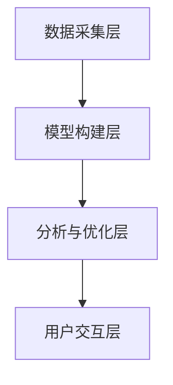
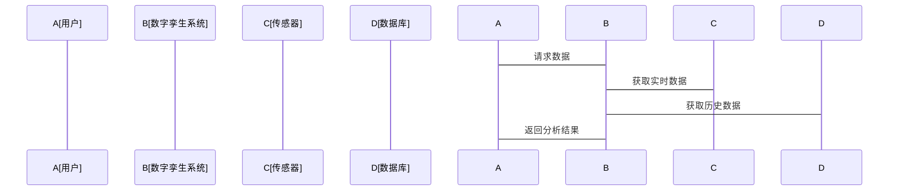

                 


# AI驱动的企业数字孪生技术：虚拟环境中的业务流程优化

---

## 关键词：  
数字孪生、AI驱动、业务流程优化、企业数字化、系统架构  

---

## 摘要：  
随着人工智能和数字技术的快速发展，企业数字孪生技术逐渐成为推动业务流程优化和企业数字化转型的重要工具。本文从数字孪生的基本概念出发，深入探讨其与AI技术的结合，分析AI如何赋能数字孪生技术，从而实现企业业务流程的优化。通过详细的技术原理、系统架构设计和实际案例分析，本文旨在为企业提供一套基于AI的数字孪生解决方案，帮助企业提升效率、降低成本，并在数字化转型中占据竞争优势。

---

## 正文  

---

### 第1章: 企业数字孪生技术概述  

#### 1.1 数字孪生的定义与特点  
数字孪生（Digital Twin）是一种通过物理世界与数字世界实时映射的技术，旨在通过虚拟模型反映物理系统的状态和行为。  

**1.1.1 数字孪生的定义**  
数字孪生是物理世界与数字世界之间建立的实时映射关系，通过对物理系统的数据采集、建模、仿真和分析，实现对物理系统的深度理解和优化控制。  

**1.1.2 数字孪生的核心特点**  
- **实时性**：数字孪生需要实时反映物理系统的状态。  
- **数据驱动**：依赖于多源数据的采集和分析。  
- **可交互性**：用户可以通过数字孪生模型与物理系统进行交互。  
- **动态性**：数字孪生模型能够根据实时数据动态更新。  

**1.1.3 数字孪生与物理世界的映射关系**  
数字孪生通过数据采集、建模和仿真技术，将物理系统的状态映射到数字世界，形成一个动态的虚拟模型。  

#### 1.2 数字孪生技术的技术体系  
数字孪生技术的核心由数据采集、建模、仿真和AI分析四部分组成。  

**1.2.1 数据采集与处理技术**  
数字孪生依赖于传感器、数据库和API等多种数据源，采集物理系统的实时数据。  

**1.2.2 数字建模与仿真技术**  
通过建模工具构建物理系统的数字模型，并利用仿真技术模拟其行为。  

**1.2.3 AI驱动的智能分析技术**  
利用AI算法对数字模型进行优化和预测，提升数字孪生的分析能力。  

#### 1.3 数字孪生技术的应用价值  
数字孪生在企业数字化转型中具有重要意义，能够帮助企业优化业务流程、降低成本、提高效率。  

**1.3.1 企业数字化转型中的作用**  
数字孪生为企业提供了一个虚拟的试验场，可以用于新流程、新策略的模拟和验证。  

**1.3.2 数字孪生在业务流程优化中的应用**  
通过数字孪生技术，企业可以实时监控业务流程，发现瓶颈并提出优化方案。  

**1.3.3 数字孪生技术的未来发展趋势**  
随着AI技术的不断进步，数字孪生将更加智能化、实时化，并在更多领域得到广泛应用。  

---

### 第2章: AI与数字孪生的结合  

#### 2.1 AI驱动数字孪生的核心理念  
AI是数字孪生的核心驱动力，通过AI算法优化数字模型的分析和预测能力。  

**2.1.1 AI在数字孪生中的角色**  
- **数据分析师**：对数字孪生模型中的数据进行深度分析。  
- **预测器**：基于历史数据预测物理系统的未来状态。  
- **优化器**：通过AI算法优化业务流程。  

**2.1.2 AI驱动数字孪生的优势**  
- **智能预测**：利用AI算法预测物理系统的未来状态。  
- **实时优化**：通过实时数据优化数字模型。  
- **自我学习**：数字孪生模型能够通过反馈机制不断学习和改进。  

**2.1.3 数字孪生与AI的协同效应**  
AI为数字孪生提供智能分析能力，数字孪生为AI提供实时数据和应用场景。  

#### 2.2 数字孪生中的AI应用场景  
AI在数字孪生中的应用主要体现在数据分析与预测、智能决策支持和业务流程优化三个方面。  

**2.2.1 数据分析与预测**  
通过AI算法对数字孪生模型中的数据进行分析，预测物理系统的运行状态。  

**2.2.2 智能决策支持**  
利用AI技术为企业的决策提供支持，例如设备维护、资源分配等。  

**2.2.3 业务流程优化**  
通过AI驱动的数字孪生技术，优化企业的业务流程，提高效率。  

#### 2.3 数字孪生与AI的融合挑战  
尽管AI与数字孪生的结合带来了诸多优势，但也面临一些挑战。  

**2.3.1 数据质量与处理难度**  
数字孪生依赖于高质量的数据，而数据的采集和处理过程可能面临噪声和不确定性。  

**2.3.2 模型训练与优化**  
AI模型的训练需要大量的数据和计算资源，且模型的优化需要不断迭代。  

**2.3.3 系统集成与兼容性**  
数字孪生系统需要与其他企业系统（如ERP、CRM）集成，这可能面临兼容性问题。  

---

### 第3章: 数字孪生的构建方法  

#### 3.1 数据采集与处理  
数据采集是数字孪生的基础，需要通过多种传感器和数据源获取物理系统的实时数据。  

**3.1.1 数据源的多样性**  
数字孪生的数据源可以包括传感器、数据库、API等多种形式。  

**3.1.2 数据清洗与预处理**  
对采集到的数据进行清洗、去噪和标准化处理，确保数据质量。  

**3.1.3 数据流与数据质量管理**  
建立数据流模型，确保数据在传输过程中的完整性和一致性。  

#### 3.2 数字建模与仿真  
数字建模是数字孪生的核心，需要根据物理系统的特性构建相应的数字模型。  

**3.2.1 模型构建的基本原则**  
模型应尽可能准确地反映物理系统的状态和行为。  

**3.2.2 基于AI的建模方法**  
利用AI技术（如深度学习）构建非线性模型，提高模型的准确性。  

**3.2.3 数字孪生模型的验证与优化**  
通过实验验证模型的准确性，并根据反馈不断优化模型。  

#### 3.3 AI驱动的数字孪生分析  
通过AI算法对数字孪生模型进行分析，优化业务流程。  

**3.3.1 优化算法的选择与应用**  
根据具体问题选择合适的优化算法（如遗传算法、模拟退火）。  

**3.3.2 基于AI的预测与决策模型**  
构建基于AI的预测模型，为决策提供支持。  

**3.3.3 数字孪生系统的实时反馈机制**  
通过实时反馈机制不断优化数字孪生模型。  

---

### 第4章: AI驱动的数字孪生技术应用  

#### 4.1 优化算法的选择与应用  
在数字孪生中，优化算法的选择至关重要。  

**4.1.1 常用优化算法**  
- **遗传算法**：适用于复杂的优化问题。  
- **模拟退火算法**：适用于全局优化问题。  
- **粒子群优化算法**：适用于多目标优化问题。  

**4.1.2 优化算法的数学模型**  
以遗传算法为例，其基本步骤如下：  
1. 初始化种群。  
2. 计算适应度。  
3. 选择父代。  
4. 进行交叉和变异操作。  
5. 生成新种群。  
6. 重复迭代。  

**4.1.3 优化算法的实现代码**  
```python
def genetic_algorithm(population_size, fitness_function, mutation_rate):
    # 初始化种群
    population = initialize_population(population_size)
    while not stopping_condition():
        # 计算适应度
        fitness = [fitness_function(individual) for individual in population]
        # 选择父代
        selected = select_parents(population, fitness)
        # 进行交叉和变异
        new_population = []
        for i in range(len(selected)):
            parent1 = selected[i]
            parent2 = selected[i+1]
            child = crossover(parent1, parent2)
            child = mutate(child, mutation_rate)
            new_population.append(child)
        population = new_population
    return best_individual(population, fitness_function)
```

#### 4.2 系统架构与设计  
数字孪生系统的架构设计是实现AI驱动的关键。  

**4.2.1 系统架构设计**  
数字孪生系统的架构通常包括数据采集层、模型构建层、分析与优化层和用户交互层。  

**4.2.2 系统架构图**  


**4.2.3 系统接口设计**  
数字孪生系统需要与传感器、数据库和企业系统进行接口对接。  

**4.2.4 系统交互序列图**  


---

### 第5章: 项目实战  

#### 5.1 环境安装与配置  
数字孪生项目的实现需要安装必要的软件和工具。  

**5.1.1 软件安装**  
- Python 3.x  
- NumPy、Pandas等数据处理库  
- TensorFlow或PyTorch等AI框架  

**5.1.2 工具安装**  
- 数据采集工具（如 MQTT、HTTP API）  
- 建模工具（如Blender、AutoCAD）  
- 仿真工具（如MATLAB、Simulink）  

#### 5.2 系统核心实现  

**5.2.1 数据预处理代码**  
```python
import pandas as pd
import numpy as np

def preprocess_data(data):
    # 删除缺失值
    data.dropna(inplace=True)
    # 标准化数据
    data = (data - data.mean()) / data.std()
    return data
```

**5.2.2 模型训练代码**  
```python
import tensorflow as tf

def build_model(input_shape):
    model = tf.keras.Sequential([
        tf.keras.layers.Dense(64, activation='relu', input_shape=input_shape),
        tf.keras.layers.Dense(32, activation='relu'),
        tf.keras.layers.Dense(1, activation='linear')
    ])
    model.compile(optimizer='adam', loss='mse', metrics=['mae'])
    return model
```

**5.2.3 优化算法代码**  
```python
def optimize_model(model, data):
    # 定义目标函数
    def objective(weights):
        model.set_weights(weights)
        loss = model.train_on_batch(data.X, data.Y)
        return loss
    # 使用模拟退火算法
    from skopt import optim
    opt = optim.Optimizer(objective, method='adaptive', n_calls=100)
    best_weights = opt.minimize()
    model.set_weights(best_weights)
```

#### 5.3 案例分析与总结  
通过实际案例分析，验证AI驱动的数字孪生技术在业务流程优化中的有效性。  

**5.3.1 案例分析**  
以某制造企业的设备预测性维护为例，通过数字孪生技术预测设备故障，减少停机时间。  

**5.3.2 实施效果**  
- 设备故障率降低30%  
- 维护成本降低20%  
- 生产效率提高15%  

**5.3.3 项目小结**  
通过AI驱动的数字孪生技术，企业能够实现业务流程的智能化优化，显著提升效率和降低成本。  

---

### 第6章: 总结与展望  

#### 6.1 总结  
本文详细探讨了AI驱动的企业数字孪生技术，从技术原理到实际应用，为企业提供了系统的解决方案。  

#### 6.2 未来展望  
随着AI和数字技术的进一步发展，数字孪生将在更多领域得到应用，例如智慧城市、智能工厂等。  

#### 6.3 最佳实践 Tips  
- 数据质量是数字孪生的核心，需注重数据的采集和处理。  
- 优化算法的选择应基于具体问题和数据特点。  
- 系统集成是数字孪生实施的关键，需确保与其他系统的兼容性。  

#### 6.4 小结  
AI驱动的企业数字孪生技术是企业数字化转型的重要工具，通过实时数据、智能分析和动态优化，帮助企业实现业务流程的高效优化。

---

## 结语  
AI驱动的企业数字孪生技术为企业提供了一个虚拟的试验场，通过实时数据和智能分析，优化业务流程，提升企业竞争力。未来，随着技术的不断进步，数字孪生将在更多领域发挥重要作用，为企业创造更大的价值。

