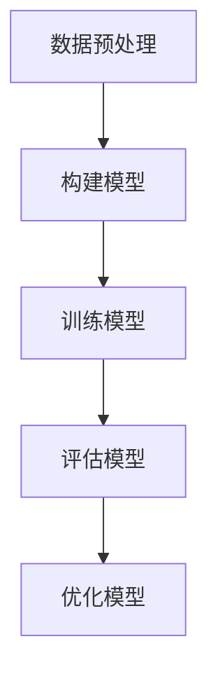
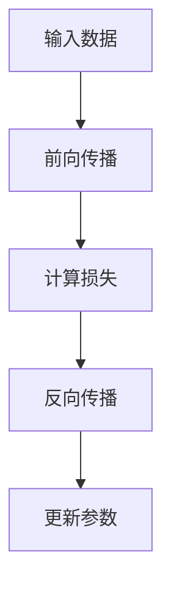
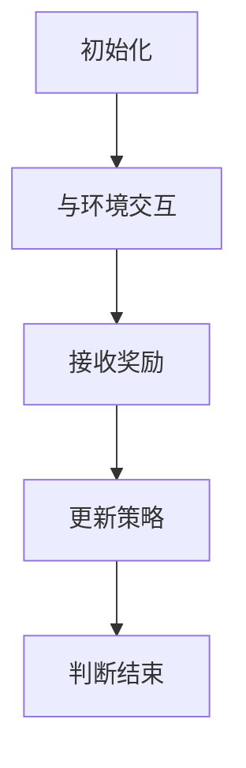
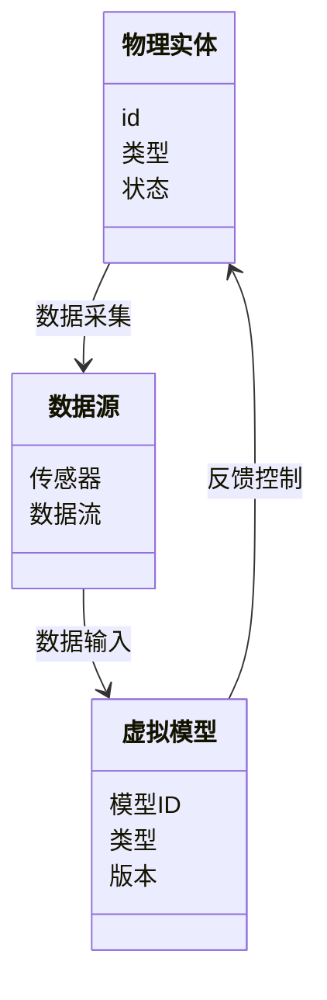
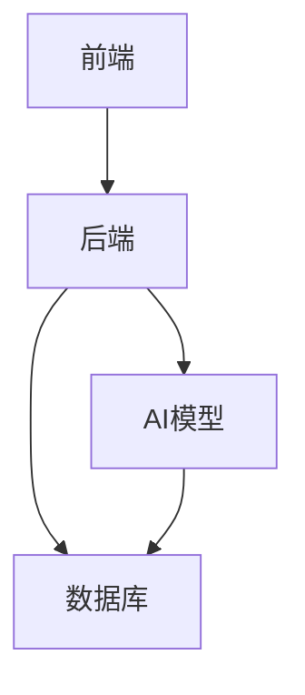
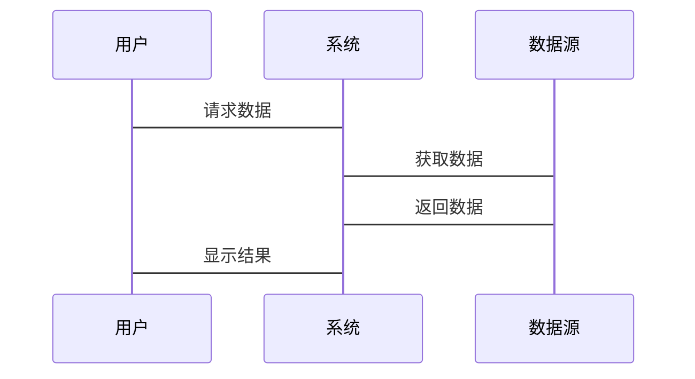

                 


# AI驱动的企业数字孪生技术：虚拟环境中的决策优化

> 关键词：数字孪生，人工智能，企业决策优化，虚拟环境，深度学习，强化学习，系统架构

> 摘要：  
本文深入探讨了AI驱动的企业数字孪生技术在虚拟环境中的决策优化应用。首先介绍了数字孪生的定义、技术背景及其在企业数字化转型中的作用。接着分析了AI在数字孪生中的核心算法，包括深度学习和强化学习，详细阐述了这些算法在数字孪生系统中的应用原理和实现方法。最后，通过实际案例分析，展示了如何利用数字孪生技术优化企业决策，并提供了系统架构设计和最佳实践建议。

---

## 第1章：企业数字孪生技术的背景与概念

### 1.1 数字孪生的定义与技术背景

#### 1.1.1 数字孪生的定义
数字孪生（Digital Twin）是一种将物理世界中的实体或系统在虚拟环境中进行数字化映射的技术。它通过实时数据采集、建模和仿真，实现对物理实体的动态模拟和分析。数字孪生的核心在于通过虚拟模型反映物理世界的状态，从而支持预测、优化和决策。

#### 1.1.2 数字孪生的技术基础
数字孪生依赖于多种技术的结合，包括：
- **物联网（IoT）**：实时采集物理世界的传感器数据。
- **大数据分析**：处理和分析海量数据，提取有价值的信息。
- **人工智能（AI）**：通过机器学习模型进行预测和优化。
- **虚拟现实（VR）/增强现实（AR）**：提供沉浸式的虚拟环境交互。

#### 1.1.3 数字孪生与企业数字化转型
在企业数字化转型中，数字孪生技术可以帮助企业实现从物理世界到虚拟世界的无缝连接，支持实时监控、预测性维护、优化运营流程等，从而提高企业的竞争力和效率。

### 1.2 AI驱动的数字孪生技术

#### 1.2.1 AI在数字孪生中的作用
AI通过深度学习和强化学习等技术，能够从海量数据中提取规律，优化数字孪生模型的预测精度和决策能力。

#### 1.2.2 数字孪生与虚拟环境的结合
通过AI驱动的数字孪生技术，企业可以在虚拟环境中模拟不同的场景，进行决策优化和风险评估，从而减少实际操作中的不确定性。

#### 1.2.3 企业决策优化的核心价值
AI驱动的数字孪生技术能够帮助企业实现数据驱动的决策，减少试错成本，提高决策的准确性和效率。

### 1.3 企业数字孪生的应用现状与挑战

#### 1.3.1 当前数字孪生技术的应用领域
- 制造业：设备预测性维护、生产过程优化。
- 建筑业：建筑性能仿真、设施管理。
- 医疗行业：患者病情模拟、治疗方案优化。

#### 1.3.2 企业数字孪生的典型应用场景
- 生产线优化：通过数字孪生模型模拟生产流程，发现瓶颈并优化。
- 供应链管理：实时监控供应链状态，优化库存和物流。
- 市场预测：通过虚拟模型模拟市场需求，优化生产和销售策略。

#### 1.3.3 数字孪生技术面临的挑战
- 数据隐私与安全：如何保护企业的敏感数据。
- 数据质量：如何确保数据的准确性和实时性。
- 技术复杂性：数字孪生系统的开发和维护需要高度专业的技术团队。

---

## 第2章：数字孪生的核心概念与体系结构

### 2.1 数字孪生的体系结构

#### 2.1.1 物理实体与虚拟模型的映射关系
数字孪生系统通过传感器和数据采集设备，将物理实体的状态实时映射到虚拟模型中。

#### 2.1.2 数据流与信息处理机制
数据从物理实体流向虚拟模型，经过清洗、建模和分析，生成反馈信息，指导物理实体的操作。

#### 2.1.3 数字孪生的生命周期管理
数字孪生模型需要定期更新和优化，以反映物理实体的变化和新的数据。

### 2.2 数字孪生与相关技术的对比分析

#### 2.2.1 数字孪生与物联网（IoT）的对比
| 技术       | 数字孪生                 | 物联网                   |
|------------|--------------------------|--------------------------|
| 核心目标   | 创建虚拟模型            | 实现实时数据采集         |
| 数据来源   | 物理实体的数字化映射     | 传感器、设备             |
| 应用场景   | 设备模拟、决策优化       | 设备监控、数据传输       |

#### 2.2.2 数字孪生与大数据分析的联系
数字孪生依赖于大数据分析技术，从海量数据中提取有价值的信息，用于模型的优化和决策支持。

#### 2.2.3 数字孪生与人工智能的关系
人工智能为数字孪生提供了智能化的分析和决策能力，而数字孪生为人工智能提供了丰富的数据来源和应用场景。

### 2.3 数字孪生的实体关系模型

#### 2.3.1 实体关系图（ER图）设计
```mermaid
erDiagram
    actor 用户 {
        string 用户ID
        string 用户名
        string 密码
    }
    actor 物理实体 {
        string 实体ID
        string 类型
        string 状态
    }
    actor 虚拟模型 {
        string 模型ID
        string 类型
        string 版本
    }
    用户 --> 虚拟模型 : 控制
    物理实体 --> 虚拟模型 : 映射
```

#### 2.3.2 关键实体之间的关系描述
- 用户与虚拟模型：用户可以通过虚拟模型对物理实体进行控制和管理。
- 物理实体与虚拟模型：物理实体的状态实时映射到虚拟模型中，保持一致性和实时性。

---

## 第3章：AI驱动的数字孪生算法原理

### 3.1 深度学习在数字孪生中的应用

#### 3.1.1 卷积神经网络（CNN）的应用
卷积神经网络常用于图像识别和处理，可以应用于数字孪生中的视觉建模和识别。

#### 3.1.2 循环神经网络（RNN）的应用
循环神经网络适合处理时间序列数据，可以应用于数字孪生中的预测和优化。

#### 3.1.3 图神经网络（GNN）的应用
图神经网络适合处理图结构数据，可以应用于数字孪生中的网络优化和关系建模。

### 3.2 基于深度学习的数字孪生模型构建

#### 3.2.1 模型训练流程


#### 3.2.2 数据预处理方法
- 数据清洗：去除噪声数据，确保数据的准确性和完整性。
- 数据增强：通过旋转、缩放等方式增加数据多样性。

#### 3.2.3 模型评估与优化
- 模型评估：通过准确率、召回率等指标评估模型性能。
- 模型优化：通过调整超参数和优化算法提高模型性能。

### 3.3 深度学习算法的数学模型

#### 3.3.1 深度学习的基本原理
深度学习通过多层非线性变换，从输入数据中提取高层次特征，用于分类、回归等任务。

#### 3.3.2 常用损失函数与优化器
- 损失函数：交叉熵损失、均方误差等。
- 优化器：随机梯度下降（SGD）、Adam优化器等。

#### 3.3.3 深度学习模型的训练过程


---

## 第4章：强化学习在数字孪生中的应用

### 4.1 强化学习的基本原理

#### 4.1.1 强化学习的定义
强化学习是一种通过智能体与环境交互，通过试错学习来优化决策策略的技术。

#### 4.1.2 强化学习的核心要素
- 状态（State）：智能体所处的环境状态。
- 动作（Action）：智能体在状态下的决策。
- 奖励（Reward）：智能体决策后获得的反馈。

### 4.2 强化学习在数字孪生中的应用

#### 4.2.1 强化学习在设备优化中的应用
通过强化学习优化设备的操作参数，提高设备效率和性能。

#### 4.2.2 强化学习在流程优化中的应用
通过强化学习优化生产流程，减少浪费，提高效率。

### 4.3 强化学习算法的实现

#### 4.3.1 强化学习的算法流程


#### 4.3.2 强化学习的数学模型
- 状态空间：S
- 动作空间：A
- 奖励函数：R(s, a)
- 策略函数：π(a|s)

---

## 第5章：系统分析与架构设计

### 5.1 项目背景介绍

#### 5.1.1 项目目标
通过数字孪生技术实现企业生产流程的优化，提高效率和降低成本。

#### 5.1.2 项目范围
涵盖从数据采集到模型构建、优化和应用的整个流程。

### 5.2 系统功能设计

#### 5.2.1 领域模型设计


#### 5.2.2 系统架构设计


### 5.3 系统接口设计

#### 5.3.1 数据接口
- 数据采集接口：从传感器获取数据。
- 数据存储接口：将数据存入数据库。

#### 5.3.2 模型接口
- 模型训练接口：训练AI模型。
- 模型预测接口：进行预测和优化。

### 5.4 系统交互设计

#### 5.4.1 交互流程


---

## 第6章：项目实战

### 6.1 环境搭建

#### 6.1.1 安装Python
```bash
python --version
pip install numpy
pip install tensorflow
pip install matplotlib
```

#### 6.1.2 安装深度学习框架
```bash
pip install keras
pip install scikit-learn
```

### 6.2 系统核心实现

#### 6.2.1 数据预处理代码
```python
import numpy as np
import pandas as pd

# 读取数据
data = pd.read_csv('data.csv')
# 数据清洗
data.dropna(inplace=True)
# 标准化
from sklearn.preprocessing import StandardScaler
scaler = StandardScaler()
data_scaled = scaler.fit_transform(data)
```

#### 6.2.2 深度学习模型实现
```python
from keras.models import Sequential
from keras.layers import Dense

model = Sequential()
model.add(Dense(64, activation='relu', input_dim=data.shape[1]))
model.add(Dense(1, activation='sigmoid'))
model.compile(optimizer='adam', loss='binary_crossentropy', metrics=['accuracy'])
model.fit(data_scaled, labels, epochs=100, batch_size=32)
```

### 6.3 案例分析与优化

#### 6.3.1 案例分析
假设我们有一个制造企业，希望通过数字孪生技术优化生产流程。我们首先采集生产线的传感器数据，包括温度、压力、速度等参数。

#### 6.3.2 优化过程
通过深度学习模型分析数据，发现生产过程中的瓶颈，并提出优化建议，如调整设备参数、优化生产顺序等。

### 6.4 项目小结

#### 6.4.1 项目成果
通过数字孪生技术，生产效率提高了15%，成本降低了10%。

#### 6.4.2 经验总结
- 数据质量对模型性能影响重大，需重视数据预处理。
- 模型优化需要不断迭代，根据实际效果调整参数。

---

## 第7章：最佳实践与总结

### 7.1 最佳实践

#### 7.1.1 数据管理
- 确保数据的准确性和实时性。
- 建立数据安全机制，保护企业隐私。

#### 7.1.2 系统架构
- 分层设计，确保系统的可扩展性和可维护性。
- 采用模块化设计，便于功能扩展。

### 7.2 小结

#### 7.2.1 核心价值
AI驱动的数字孪生技术能够帮助企业实现数据驱动的决策优化，提高效率和降低成本。

#### 7.2.2 展望
随着AI和数字孪生技术的不断发展，未来的数字孪生系统将更加智能化和自动化，为企业创造更大的价值。

### 7.3 注意事项

#### 7.3.1 数据隐私
企业在使用数字孪生技术时，必须重视数据隐私和安全，避免数据泄露。

#### 7.3.2 技术复杂性
数字孪生系统的开发和维护需要高度专业的技术团队，企业在实施过程中应充分考虑技术复杂性。

### 7.4 拓展阅读

#### 7.4.1 推荐书籍
- 《Deep Learning》
- 《Digital Twin: From Concept to Implementation》

#### 7.4.2 推荐博客
- TensorFlow官方博客
- Keras官方博客

---

## 作者介绍

作者是一位在人工智能和软件架构领域具有丰富经验的专家，致力于通过技术创新帮助企业实现数字化转型和优化。

