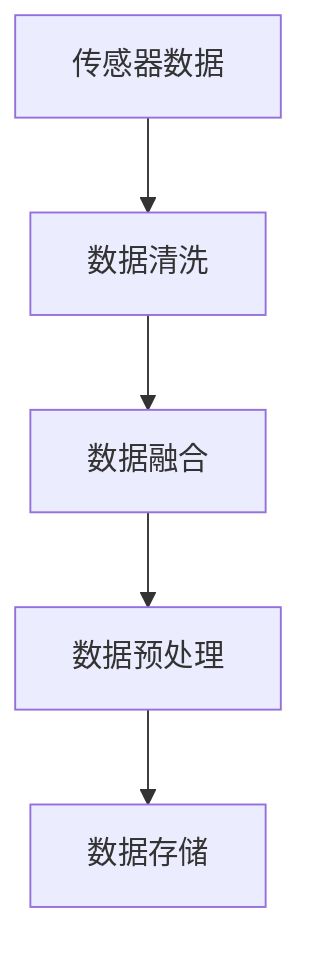
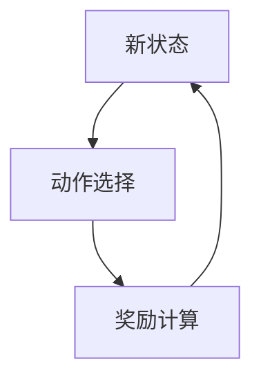

                 

# AI驱动的企业数字孪生技术：虚拟环境中的决策优化与验证

## 关键词：
- 人工智能（AI）
- 数字孪生
- 决策优化
- 虚拟环境
- 仿真建模
- 数据分析

## 摘要：
随着企业数字化转型的加速，数字孪生技术作为一种虚拟与现实结合的创新方法，正在成为企业优化运营和决策的重要工具。本文深入探讨AI如何驱动数字孪生技术，在虚拟环境中实现决策优化与验证。文章首先介绍数字孪生的基本概念和背景，然后分析AI在数字孪生中的应用，包括数据处理、模型构建、决策优化等环节。通过具体的技术实现和项目案例，展示AI驱动的数字孪生在企业中的实际应用价值，并总结其优势与挑战。

---

# 目录

1. [背景与概念](#背景与概念)
   1.1 数字孪生的定义与背景
   1.2 AI在数字孪生中的作用

2. [体系架构](#体系架构)
   2.1 数字孪生的基本架构
   2.2 基于AI的数字孪生架构优化

3. [数据处理与建模](#数据处理与建模)
   3.1 数据采集与预处理
   3.2 基于深度学习的数字孪生建模

4. [决策优化与验证](#决策优化与验证)
   4.1 基于AI的决策优化算法
   4.2 决策优化的验证与评估

5. [系统架构与项目实战](#系统架构与项目实战)
   5.1 系统架构设计
   5.2 项目实战与案例分析

6. [总结与展望](#总结与展望)
   6.1 总结
   6.2 未来展望

---

## 背景与概念

### 1.1 数字孪生的定义与背景

数字孪生（Digital Twin）是一种虚拟与现实世界实时对应的技术，通过数字化模型和实时数据，实现对物理世界的动态仿真与分析。其核心在于构建一个与现实世界完全一致的虚拟副本，用于模拟、分析和优化现实世界中的各种场景。

#### 数字孪生的核心概念与特征
- **实时性**：数字孪生能够实时反映物理世界的状态，确保虚拟模型与现实世界同步。
- **交互性**：用户可以通过虚拟模型与物理世界进行交互，进行操作和测试。
- **可扩展性**：数字孪生可以应用于多个领域，如制造业、医疗、交通等，具有广泛的适用性。

#### 数字孪生与企业数字化转型
数字孪生技术为企业提供了优化运营、降低成本、提高效率的机会。例如，在制造业中，数字孪生可以用于设备故障预测、生产优化；在城市规划中，数字孪生可以用于交通管理、资源分配。

### 1.2 AI在数字孪生中的作用

AI技术的引入，使得数字孪生更加智能和高效。AI能够处理大量数据，构建复杂的模型，并提供实时的决策支持。

#### AI驱动的数字孪生优势
- **数据处理能力**：AI能够快速处理和分析海量数据，提取有价值的信息。
- **智能建模**：通过深度学习等技术，AI可以自动构建高精度的数字孪生模型。
- **动态优化**：AI算法能够实时优化决策，提升系统的响应速度和准确性。

---

## 体系架构

### 2.1 数字孪生的基本架构

数字孪生的架构通常包括以下几个层次：

1. **数据采集层**：通过传感器、摄像头等设备采集物理世界的数据。
2. **数据处理层**：对采集的数据进行清洗、融合和预处理。
3. **模型构建与仿真层**：基于处理后的数据，构建数字孪生模型，并进行仿真分析。
4. **应用与展示层**：将仿真结果以可视化的方式展示给用户，支持决策。

#### 数据流图

### 2.2 基于AI的数字孪生架构优化

通过引入AI技术，数字孪生架构可以进一步优化，提升数据处理效率和模型精度。

#### 基于AI的数字孪生架构

---

## 数据处理与建模

### 3.1 数据采集与预处理

数据采集是数字孪生的第一步，需要确保数据的准确性和完整性。

#### 数据采集流程图

#### 数据预处理步骤
1. **数据清洗**：去除噪声和异常值。
2. **数据融合**：将来自不同源的数据进行整合，确保一致性和完整性。
3. **数据标准化**：将数据转换为统一的格式，方便后续处理。

### 3.2 基于深度学习的数字孪生建模

深度学习技术在数字孪生建模中发挥着重要作用，能够自动学习数据中的特征，构建高精度的模型。

#### 深度学习模型
常用的深度学习模型包括卷积神经网络（CNN）和图神经网络（GNN）。以下是图神经网络的结构示意图：

#### 深度学习在数字孪生中的应用
- **图像识别**：使用CNN对图像数据进行处理，识别设备状态。
- **时间序列分析**：使用LSTM对时间序列数据进行建模，预测设备运行状态。

---

## 决策优化与验证

### 4.1 基于AI的决策优化算法

AI算法在决策优化中具有显著优势，能够快速找到最优解。

#### 强化学习算法
强化学习是一种通过试错机制优化决策的算法。以下是强化学习的基本流程图：

#### 迁移学习
迁移学习是一种将已有的知识应用到新场景的技术。例如，将已训练好的图像识别模型应用于新的设备检测任务。

### 4.2 决策优化的验证与评估

验证和评估是确保决策优化效果的重要步骤。

#### 优化算法的性能评估指标
- **准确率**：模型预测的准确程度。
- **响应时间**：模型的决策速度。
- **收益比**：优化后的收益与成本的比值。

---

## 系统架构与项目实战

### 5.1 系统架构设计

系统架构设计是数字孪生项目成功的关键。

#### 系统功能模块划分
- **数据采集模块**：负责采集物理世界的数据。
- **数据处理模块**：对数据进行预处理和分析。
- **模型构建模块**：基于数据构建数字孪生模型。
- **仿真与优化模块**：进行仿真分析和决策优化。
- **应用展示模块**：将结果以可视化的方式展示给用户。

#### 系统架构图

### 5.2 项目实战与案例分析

#### 项目环境搭建
1. **安装必要的工具**：如Python、TensorFlow、Kafka等。
2. **数据采集与存储**：使用传感器采集数据，并存储到数据库中。

#### 核心模块实现
- **数据预处理**：编写Python代码对数据进行清洗和融合。
- **模型训练**：使用深度学习模型进行训练，并保存模型。
- **决策优化**：基于训练好的模型进行决策优化。

#### 案例分析
以制造业设备故障预测为例：
1. 数据采集：通过传感器采集设备运行数据。
2. 数据处理：清洗和预处理数据。
3. 模型训练：使用LSTM模型进行训练，预测设备故障。
4. 决策优化：根据预测结果优化设备维护计划。

---

## 总结与展望

### 6.1 总结

本文详细探讨了AI驱动的企业数字孪生技术，从概念、架构、数据处理、建模到决策优化，全面介绍了数字孪生的实现过程。AI技术的引入，使得数字孪生更加智能化和高效，为企业提供了强大的决策支持工具。

### 6.2 未来展望

未来，随着AI和大数据技术的进一步发展，数字孪生将在更多领域得到应用，如智慧城市、智能家居等。同时，如何提升模型的实时性和准确性，优化系统的响应速度，将是数字孪生技术进一步发展的关键。

---

通过本文的介绍，读者可以全面了解AI驱动的数字孪生技术，并能够在实际项目中应用这些知识，为企业创造更大的价值。

