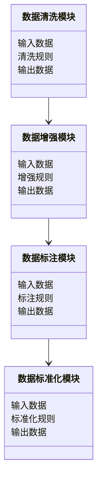
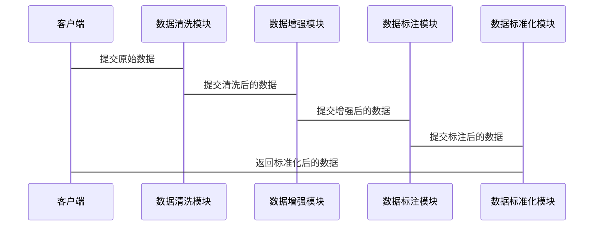

                 


# 第四部分: 数据质量管理的数学模型与算法实现

## 第4章: 数据清洗的数学模型

### 4.1 数据清洗的数学模型
#### 4.1.1 数据清洗的目标函数
$$
\text{目标函数} = \min_{x} \sum_{i=1}^{n} (y_i - f(x))^2
$$
其中，$x$ 是输入数据，$y_i$ 是目标值，$f(x)$ 是模型预测值。

#### 4.1.2 数据清洗的约束条件
$$
\begin{cases}
x \in \mathbb{R}^d \\
\sum_{i=1}^{n} w_i x_i = 1 \\
w_i \geq 0 \quad \forall i
\end{cases}
$$

#### 4.1.3 数据清洗的优化算法
##### 4.1.3.1 基于梯度下降的优化方法
$$
x^{(t+1)} = x^{(t)} - \eta \nabla f(x^{(t)})
$$

##### 4.1.3.2 基于聚类的优化方法
使用K-means算法对数据进行聚类，然后去除噪声点：
$$
\text{损失函数} = \sum_{i=1}^{k} \sum_{j=1}^{n_i} (x_j - c_i)^2
$$
其中，$k$ 是聚类数，$n_i$ 是第 $i$ 个聚类中的数据点数，$c_i$ 是第 $i$ 个聚类的中心。

### 4.2 数据增强的数学模型
#### 4.2.1 数据增强的基本原理
通过对原始数据进行变换，生成新的数据点，以增加数据的多样性。常见的变换包括旋转、缩放、翻转等。

#### 4.2.2 数据增强的数学表示
对于图像数据，可以使用以下变换矩阵进行增强：
$$
\begin{pmatrix}
\cos\theta & -\sin\theta \\
\sin\theta & \cos\theta
\end{pmatrix}
$$
其中，$\theta$ 是旋转角度。

#### 4.2.3 数据增强的优化方法
使用对抗训练，生成与真实数据难以区分的增强数据：
$$
\min_{G} \max_{D} \mathbb{E}_{x \sim p_{\text{data}}}[ \log D(x)] + \mathbb{E}_{z \sim p_z}[ \log (1 - D(G(z)))]
$$
其中，$G$ 是生成器，$D$ 是判别器，$z$ 是随机噪声。

### 4.3 数据标注的数学模型
#### 4.3.1 数据标注的自动化方法
使用分类模型对数据进行自动标注，损失函数为：
$$
\mathcal{L} = -\sum_{i=1}^{n} y_i \log p(y_i | x_i) - (1 - y_i) \log (1 - p(y_i | x_i))
$$

#### 4.3.2 基于模型的自动标注技术
使用预训练的模型对数据进行概率预测，然后根据置信度阈值进行标注：
$$
\text{阈值} = \max_{\theta} \sum_{i=1}^{n} \mathbb{I}(p(y_i | x_i) > \theta)
$$

#### 4.3.3 数据标注的评估指标
使用准确率、召回率、F1分数等指标对标注结果进行评估：
$$
\text{准确率} = \frac{\text{正确标注数}}{\text{总标注数}}
$$
$$
\text{召回率} = \frac{\text{正确标注数}}{\text{实际属于该类别的数据数}}
$$
$$
\text{F1分数} = \frac{2 \times \text{准确率} \times \text{召回率}}{\text{准确率} + \text{召回率}}
$$

## 第5章: 数据质量管理的系统分析与架构设计

### 5.1 问题场景介绍
企业数据质量管理的核心问题是如何确保数据的准确性、一致性和完整性。由于企业数据来源多样、数据格式复杂，传统的数据质量管理方法往往效率低下，难以应对海量数据的挑战。因此，引入AI技术，通过自动化和智能化的方法，提高数据质量管理的效率和准确性，成为企业数字化转型的重要方向。

### 5.2 系统功能设计
系统功能设计需要涵盖数据清洗、数据增强、数据标注、数据标准化等多个方面。为了更好地理解系统功能，我们可以通过领域模型类图来展示系统的各个模块及其关系。

#### 5.2.1 领域模型类图


### 5.3 系统架构设计
系统架构设计需要考虑数据的输入、处理、存储和输出等环节。为了确保系统的高效性和可扩展性，采用分层架构是一个不错的选择。

#### 5.3.1 系统架构图


### 5.4 系统接口设计
系统接口设计需要明确各个模块之间的交互方式和数据格式。以下是一个简要的接口设计示例：

- 数据清洗模块接口：
  - 输入：原始数据
  - 输出：清洗后的数据
- 数据增强模块接口：
  - 输入：清洗后的数据
  - 输出：增强后的数据
- 数据标注模块接口：
  - 输入：增强后的数据
  - 输出：标注后的数据
- 数据标准化模块接口：
  - 输入：标注后的数据
  - 输出：标准化后的数据

### 5.5 系统交互序列图
为了更好地理解系统的交互过程，我们可以用序列图来展示各个模块之间的调用关系。

#### 5.5.1 系统交互序列图


## 第6章: 项目实战

### 6.1 环境安装
为了进行项目实战，首先需要安装必要的工具和库。以下是一个基本的环境配置示例：

#### 6.1.1 安装Python
```bash
python --version
# 如果需要安装，使用以下命令：
# python get-pip.py
# pip install --upgrade pip
```

#### 6.1.2 安装必要的库
```bash
pip install numpy pandas scikit-learn tensorflow matplotlib
```

### 6.2 核心代码实现
以下是实现AI驱动数据质量管理的核心代码示例：

#### 6.2.1 数据清洗模块代码
```python
import numpy as np
from sklearn.impute import SimpleImputer

def data_cleaning(data):
    # 处理缺失值
    imputer = SimpleImputer(strategy='mean')
    cleaned_data = imputer.fit_transform(data)
    return cleaned_data
```

#### 6.2.2 数据增强模块代码
```python
import tensorflow as tf
from tensorflow.keras.preprocessing.image import ImageDataGenerator

def data_augmentation(images):
    datagen = ImageDataGenerator(rotation_range=20, horizontal_flip=True)
    augmented_images = datagen.flow(images, batch_size=1).next()[0]
    return augmented_images
```

#### 6.2.3 数据标注模块代码
```python
import numpy as np
from sklearn.linear_model import LogisticRegression

def data_annotation(features, labels):
    model = LogisticRegression()
    model.fit(features, labels)
    predicted_labels = model.predict(features)
    return predicted_labels
```

#### 6.2.4 数据标准化模块代码
```python
import pandas as pd
from sklearn.preprocessing import StandardScaler

def data_normalization(data):
    scaler = StandardScaler()
    normalized_data = scaler.fit_transform(data)
    return normalized_data
```

### 6.3 代码应用解读与分析
以上代码实现了数据清洗、数据增强、数据标注和数据标准化的核心功能。数据清洗模块使用了SimpleImputer来处理缺失值；数据增强模块使用了ImageDataGenerator来生成增强数据；数据标注模块使用了LogisticRegression进行自动标注；数据标准化模块使用了StandardScaler进行标准化处理。

### 6.4 实际案例分析
假设我们有一个包含客户信息的数据集，其中包括年龄、收入、职业等字段。为了提高数据质量，我们可以按照以下步骤进行处理：

1. **数据清洗**：处理缺失值和异常值。
2. **数据增强**：对图像数据进行旋转和翻转，增加数据的多样性。
3. **数据标注**：使用分类模型对数据进行自动标注，识别出关键字段。
4. **数据标准化**：对数据进行标准化处理，使其适合机器学习模型的输入。

### 6.5 项目小结
通过以上步骤，我们可以看到AI在企业数据质量管理中的巨大潜力。通过自动化和智能化的方法，我们可以显著提高数据处理的效率和准确性，为企业决策提供更可靠的数据支持。

## 第7章: 最佳实践

### 7.1 小结
AI驱动的企业数据质量管理与治理是一项复杂但极具价值的工程。通过合理运用AI技术，我们可以显著提高数据处理的效率和准确性，为企业决策提供更可靠的数据支持。

### 7.2 注意事项
- 在进行数据质量管理时，需要注意数据的隐私和安全问题。
- 数据清洗和增强需要根据具体场景选择合适的算法。
- 数据标注和标准化需要结合业务需求进行定制化处理。

### 7.3 拓展阅读
- 《Data Quality: The Accuracy Challenge in Machine Learning》
- 《Data Augmentation Methods in Deep Learning》
- 《Data Governance and Data Quality in Enterprises》

---

通过以上章节的详细讲解，我们系统地探讨了AI驱动的企业数据质量管理与治理的核心概念、算法原理、系统架构以及实际应用。希望本文能够为企业在数据质量管理与治理方面提供有价值的参考和指导。

