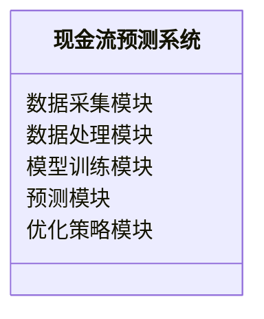
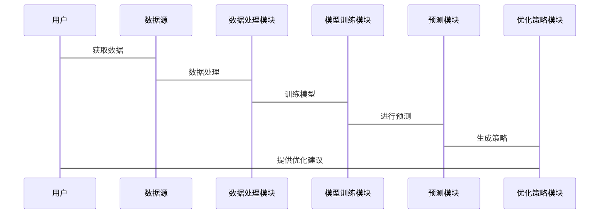

                 


# AI驱动的企业现金流优化与预测系统

## 关键词
AI技术、现金流预测、机器学习、深度学习、企业优化

## 摘要
随着人工智能技术的迅速发展，企业对现金流的优化与预测需求日益增长。传统的现金流管理方法已难以应对复杂多变的市场环境。本书将详细介绍如何利用AI技术，特别是机器学习和深度学习算法，来构建企业现金流预测与优化系统。通过系统的架构设计和实际案例分析，我们将展示如何利用AI技术提升企业的现金流管理效率和准确性，为企业创造更大的价值。

---

## 第1章: 企业现金流优化与预测的背景与意义

### 1.1 企业现金流管理的重要性
现金流是企业的生命线，直接关系到企业的生存与发展。良好的现金流管理能够确保企业偿债能力、投资能力和运营能力。然而，传统的方法在面对复杂市场变化时显得力不从心。

#### 1.1.1 现金流在企业运营中的核心地位
现金流管理是企业财务管理的核心内容之一。企业的日常运营、投资决策、债务偿还都离不开现金流的支持。

#### 1.1.2 现金流管理的常见挑战
- 数据的复杂性：现金流受多种内外部因素影响，如市场波动、政策变化等。
- 预测的准确性：传统方法依赖于历史数据和经验判断，难以捕捉未来的变化。
- 实时性需求：企业需要实时监控现金流状况，以便快速调整策略。

#### 1.1.3 AI技术在现金流优化中的作用
AI技术能够通过大数据分析和机器学习算法，捕捉隐藏在数据中的模式和趋势，从而提高现金流预测的准确性。

---

### 1.2 AI驱动现金流优化的必要性
传统方法在应对复杂市场环境时存在诸多局限性，而AI技术的应用能够显著提升现金流管理的效率和效果。

#### 1.2.1 传统现金流管理的局限性
- 数据分析能力有限：传统方法难以处理海量数据，且缺乏对复杂关系的洞察。
- 预测误差较大：基于经验的预测方法难以应对突发情况。
- 缺乏实时性：传统方法通常依赖于定期报告，无法实时调整策略。

#### 1.2.2 AI技术的优势与潜力
- 数据处理能力强大：AI能够快速处理海量数据，提取关键特征。
- 预测精度高：通过机器学习算法，AI能够发现数据中的非线性关系，提高预测准确性。
- 实时性：AI系统可以实时更新数据，提供动态预测和优化建议。

#### 1.2.3 企业现金流优化的未来趋势
随着AI技术的不断进步，现金流管理将更加智能化、自动化。企业将能够利用AI系统实现精准预测和优化，从而在复杂多变的市场中保持竞争优势。

---

### 1.3 本书的核心内容与目标
本书旨在为企业提供一套基于AI技术的现金流优化与预测解决方案。

#### 1.3.1 本书的研究范围
本书将涵盖现金流预测的核心概念、AI算法的实现、系统的架构设计以及实际案例分析。

#### 1.3.2 本书的主要目标
- 提供现金流预测的理论基础和方法。
- 展示AI技术在现金流预测中的应用。
- 提供系统的架构设计和实现方案。
- 通过实际案例分析，验证系统的有效性和实用性。

#### 1.3.3 本书的结构安排
本书将分为五个章节，从背景与概念、AI算法、系统架构、项目实战到最佳实践，全面讲解AI驱动的企业现金流优化与预测系统。

---

## 第2章: AI驱动现金流优化的核心概念与框架

### 2.1 现金流预测的基本原理
现金流预测是企业现金流管理的重要环节，其准确性直接影响企业的决策效率。

#### 2.1.1 现金流预测的定义与分类
现金流预测是对未来一定时期内企业现金流的预测。根据预测的时间范围，可以分为短期预测和长期预测。

#### 2.1.2 现金流预测的关键因素
现金流预测的关键因素包括收入、支出、应收账款、应付账款等。

#### 2.1.3 现金流预测的数学模型
现金流预测的数学模型包括时间序列模型、回归模型等。

---

### 2.2 AI在现金流预测中的应用
AI技术的引入极大地提升了现金流预测的准确性和效率。

#### 2.2.1 机器学习在时间序列预测中的应用
机器学习算法，如LSTM和GRU，能够有效捕捉时间序列中的模式。

#### 2.2.2 深度学习在现金流预测中的优势
深度学习模型能够处理复杂的数据关系，提高预测精度。

#### 2.2.3 基于AI的现金流预测框架
基于AI的现金流预测框架包括数据采集、特征工程、模型训练、预测与优化等步骤。

---

### 2.3 现金流优化系统的整体架构
现金流优化系统的整体架构包括数据采集与处理、模型训练与预测、优化策略生成等模块。

#### 2.3.1 数据采集与处理模块
数据采集与处理模块负责从企业系统中获取相关数据，并进行清洗和预处理。

#### 2.3.2 模型训练与预测模块
模型训练与预测模块利用机器学习和深度学习算法，对数据进行建模和预测。

#### 2.3.3 优化策略生成模块
优化策略生成模块根据预测结果，生成最优的现金流管理策略。

---

## 第3章: 现金流预测的数学模型与算法

### 3.1 时间序列预测的常见模型
时间序列预测是现金流预测的核心内容之一。

#### 3.1.1 ARIMA模型
ARIMA模型是一种经典的统计学模型，适用于线性时间序列数据。

#### 3.1.2 LSTM模型
LSTM模型是一种基于循环神经网络的深度学习模型，能够捕捉时间序列中的长程依赖关系。

#### 3.1.3 Prophet模型
Prophet模型是一种基于弹性可处理的模型，适用于非平稳时间序列数据。

---

### 3.2 基于机器学习的现金流预测
基于机器学习的现金流预测方法包括回归模型和支持向量机等。

#### 3.2.1 线性回归模型
线性回归模型是一种简单的时间序列预测方法，适用于线性关系。

#### 3.2.2 支持向量回归模型
支持向量回归模型能够处理非线性关系，提高预测精度。

#### 3.2.3 随机森林模型
随机森林模型是一种基于决策树的集成学习方法，能够处理复杂的数据关系。

---

### 3.3 深度学习模型在现金流预测中的应用
深度学习模型在现金流预测中的应用越来越广泛。

#### 3.3.1 LSTM网络的结构与原理
LSTM网络通过记忆单元和门控机制，能够有效捕捉时间序列中的模式。

#### 3.3.2 Transformer模型的创新与应用
Transformer模型通过自注意力机制，能够处理长序列数据。

#### 3.3.3 混合模型的优势与挑战
混合模型结合了传统模型和深度学习模型的优势，但同时也面临训练时间和计算资源的挑战。

---

## 第4章: 现金流预测系统的数据处理与特征工程

### 4.1 数据清洗与预处理
数据清洗与预处理是现金流预测系统的重要步骤。

#### 4.1.1 数据缺失值的处理方法
数据缺失值的处理方法包括删除、插值和预测。

#### 4.1.2 异常值的检测与处理
异常值的检测与处理方法包括基于统计的方法和基于深度学习的方法。

#### 4.1.3 数据标准化与归一化
数据标准化与归一化方法包括Z-score标准化和Min-Max归一化。

---

### 4.2 特征选择与特征工程
特征选择与特征工程是提高预测精度的关键步骤。

#### 4.2.1 时间序列特征的提取
时间序列特征的提取方法包括均值、标准差、自相关系数等。

#### 4.2.2 业务特征的构建
业务特征的构建包括收入增长率、支出增长率等。

#### 4.2.3 综合特征的优化
综合特征的优化方法包括主成分分析和特征选择算法。

---

### 4.3 数据集的划分与评估指标
数据集的划分与评估指标是模型训练与验证的重要内容。

#### 4.3.1 数据集的划分方法
数据集的划分方法包括时间序列划分和随机划分。

#### 4.3.2 评估指标的选择
评估指标的选择包括均方误差、平均绝对误差等。

---

## 第5章: 系统分析与架构设计方案

### 5.1 系统功能设计
系统功能设计包括数据采集与处理、模型训练与预测、优化策略生成等模块。

#### 5.1.1 领域模型（Mermaid 类图）


#### 5.1.2 系统架构设计（Mermaid 架构图）


---

### 5.2 系统接口设计
系统接口设计包括数据接口、模型接口和优化策略接口。

#### 5.2.1 系统交互（Mermaid 序列图）


---

## 第6章: 项目实战

### 6.1 环境安装
项目实战需要安装以下环境：
- Python 3.8+
- TensorFlow 2.0+
- scikit-learn
- pandas
- numpy

### 6.2 核心实现源代码
以下是现金流预测系统的实现代码：

#### 6.2.1 数据处理模块
```python
import pandas as pd
import numpy as np

# 数据加载
data = pd.read_csv('cash_flow.csv')

# 数据清洗
data = data.dropna()
data = data[~data.isin([np.nan, np.inf, -np.inf]).any(axis=1)]

# 数据标准化
from sklearn.preprocessing import StandardScaler
scaler = StandardScaler()
data_scaled = scaler.fit_transform(data)
```

#### 6.2.2 模型训练模块
```python
from sklearn.ensemble import RandomForestRegressor
from sklearn.metrics import mean_squared_error

# 模型训练
model = RandomForestRegressor()
model.fit(X_train, y_train)

# 模型预测
y_pred = model.predict(X_test)

# 模型评估
 mse = mean_squared_error(y_test, y_pred)
 print(f'MSE: {mse}')
```

#### 6.2.3 优化策略生成模块
```python
from optimization_module import CashFlowOptimizer

optimizer = CashFlowOptimizer()
optimized_strategy = optimizer.generate_strategy(predicted_flows)
```

---

### 6.3 实际案例分析
通过实际案例分析，验证系统的有效性和实用性。

#### 6.3.1 案例背景
某制造企业希望通过现金流预测系统优化其资金管理。

#### 6.3.2 数据准备
数据包括过去三年的现金流数据、收入数据、支出数据等。

#### 6.3.3 系统实现
按照上述代码实现现金流预测系统。

#### 6.3.4 结果分析
预测结果与实际现金流进行对比，验证系统的准确性。

---

## 第7章: 最佳实践与小结

### 7.1 最佳实践 tips
- 数据预处理是关键：确保数据的完整性和准确性。
- 特征工程是核心：选择合适的特征能够显著提高预测精度。
- 模型选择是重点：根据数据特点选择合适的模型。

### 7.2 小结
通过AI技术，企业能够实现现金流的精准预测和优化，从而提升企业的财务管理和运营效率。

### 7.3 注意事项
- 数据隐私与安全：在处理企业数据时，需要注意数据的安全和隐私保护。
- 模型的可解释性：在实际应用中，模型的可解释性非常重要。
- 系统的实时性：现金流预测系统需要具备实时性，以便企业能够快速调整策略。

### 7.4 拓展阅读
- 《机器学习实战》
- 《深度学习》
- 《时间序列分析》

---

## 结语
通过本书的学习，读者能够掌握AI驱动的企业现金流优化与预测系统的实现方法，并将其应用于实际的企业管理中，从而为企业创造更大的价值。

