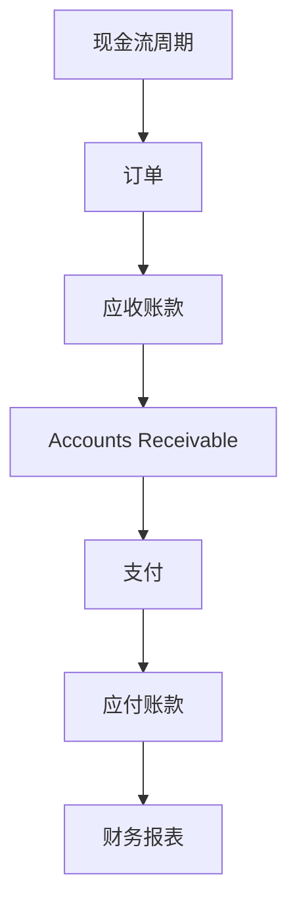
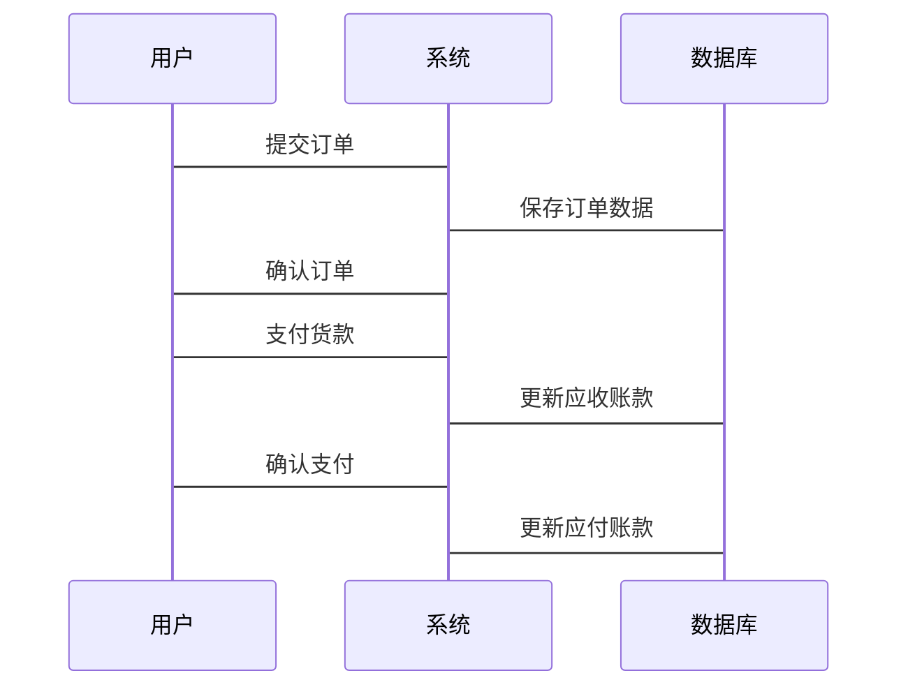

                 


# AI驱动的企业现金流周期优化

## 关键词：
- 人工智能（AI）
- 企业现金流周期
- 现金流优化
- 时间序列预测
- 系统架构设计
- 机器学习模型

## 摘要：
本文将详细探讨如何利用人工智能技术优化企业现金流周期。现金流周期是指从企业收到订单到最终支付给供应商的时间段，是企业运营中至关重要的一环。通过AI技术，企业可以实现现金流的智能化预测、自动化管理与风险控制。本文将从现金流周期的基本概念出发，分析AI在其中的应用原理，详细讲解时间序列预测模型，并通过系统架构设计与实际案例，展示如何利用AI技术实现企业现金流周期的优化。

---

## 第一章: 企业现金流周期优化的背景与意义

### 1.1 企业现金流周期的基本概念
现金流周期（Cash-to-Cash Cycle）是指从企业收到客户订单开始，到最终支付给供应商的整个过程。这个周期包括以下几个关键阶段：
1. **订单生成**：客户下单并支付定金。
2. **生产与交付**：企业根据订单安排生产和交付产品或服务。
3. **应收账款**：客户收到产品或服务后，企业需要等待客户支付剩余款项。
4. **应付账款**：企业需要向供应商支付货款或服务费用。

现金流周期的长短直接影响企业的流动资金和财务健康。周期过长可能导致企业资金链紧张，而周期过短可能影响企业的生产能力。

### 1.2 AI技术在现金流周期优化中的应用背景
随着企业数字化转型的推进，AI技术逐渐被应用于财务管理和现金流预测。传统现金流管理方法依赖人工操作，容易受到人为误差和时间滞后性的影响。AI技术可以通过以下方式优化现金流管理：
- **数据驱动的预测**：利用历史数据和机器学习模型预测未来的现金流。
- **自动化处理**：通过自动化账单处理和支付流程减少人工干预。
- **风险管理**：实时监控现金流波动，预测潜在风险并提出应对策略。

### 1.3 现金流周期优化的目标与价值
现金流周期优化的目标是缩短现金流周期，提高资金周转效率，降低财务风险。具体表现为：
- **提高资金使用效率**：通过优化现金流预测，企业可以更好地规划资金使用，避免资金闲置或短缺。
- **降低运营成本**：自动化处理流程可以减少人工成本和时间成本。
- **增强风险控制能力**：实时监控和预测可以帮助企业及时应对潜在的财务风险。

---

## 第二章: 现金流周期优化的核心概念与联系

### 2.1 现金流周期优化的核心概念
现金流周期优化的核心在于缩短订单到现金（Order-to-Cash）流程，具体包括以下几个方面：
1. **订单处理**：从客户下单到订单确认的时间。
2. **应收账款管理**：从订单确认到收到客户付款的时间。
3. **应付账款管理**：从收到供应商货物到支付货款的时间。

### 2.2 AI驱动现金流优化的核心原理
AI技术通过以下方式优化现金流周期：
1. **数据驱动的预测**：利用机器学习模型预测未来的现金流，帮助企业在资金短缺前做好准备。
2. **自动化处理**：通过自动化系统处理账单和支付流程，减少人工干预。
3. **风险管理**：通过实时监控现金流波动，预测潜在风险并提出应对策略。

### 2.3 现金流周期优化的实体关系图


---

## 第三章: 现金流周期优化的算法原理

### 3.1 现金流预测的机器学习模型
现金流预测的核心是时间序列分析，常用模型包括ARIMA（自回归积分滑动平均模型）和LSTM（长短期记忆网络）。

#### 3.1.1 时间序列预测模型
时间序列预测模型通过分析历史数据的模式，预测未来的现金流。ARIMA模型是一种经典的时序预测方法，适用于平稳时间序列数据。

**ARIMA模型的数学公式**：
$$ ARIMA(p, d, q) $$
其中：
- \( p \) 表示自回归（AR）的阶数。
- \( d \) 表示差分的阶数。
- \( q \) 表示移动平均（MA）的阶数。

**ARIMA模型的实现步骤**：
1. **数据预处理**：对原始数据进行平稳处理，如差分。
2. **模型参数选择**：通过网格搜索选择最优的 \( p \) 和 \( q \)。
3. **模型训练**：使用训练数据拟合ARIMA模型。
4. **预测与评估**：使用测试数据验证模型的预测能力。

#### 3.1.2 LSTM模型
LSTM是一种基于深度学习的时间序列预测模型，适用于非平稳时间序列数据。其核心思想是通过记忆门控机制捕捉时间序列中的长期依赖关系。

**LSTM模型的数学公式**：
$$ f(t) = \sigma(w_f \cdot [h(t-1), x(t)] + b_f) $$
其中：
- \( f(t) \) 表示忘记门。
- \( h(t-1) \) 表示前一时刻的隐藏状态。
- \( x(t) \) 表示当前时刻的输入。
- \( \sigma \) 表示sigmoid函数。

### 3.2 现金流预测的代码实现
以下是一个基于ARIMA模型的现金流预测代码示例：

```python
from statsmodels.tsa.arima.model import ARIMA
import pandas as pd

# 加载数据
data = pd.read_csv('cash_flow.csv')

# 数据预处理
diff_data = data['cash_flow'].diff().dropna()

# 网格搜索选择最优参数
from sklearn.model_selection import TimeSeriesSplit
import numpy as np

def optimize_arima(data):
    best_aic = float('inf')
    best_order = (1, 0, 1)
    for p in range(0, 5):
        for d in range(0, 2):
            for q in range(0, 5):
                try:
                    model = ARIMA(data, order=(p, d, q))
                    model_fit = model.fit()
                    if model_fit.aic < best_aic:
                        best_aic = model_fit.aic
                        best_order = (p, d, q)
                except:
                    continue
    return best_order

best_order = optimize_arima(data['cash_flow'])
print(f'最优参数组合为：{best_order}')

# 模型训练
model = ARIMA(data['cash_flow'], order=best_order)
model_fit = model.fit()

# 预测未来现金流
future_periods = 10
forecast = model_fit.forecast(steps=future_periods)
print(f'未来{future_periods}期的现金流预测值为：{forecast}')
```

### 3.3 算法模型对比与优化
以下是ARIMA模型与LSTM模型在现金流预测中的对比：

| 模型 | 优点 | 缺点 |
|------|------|------|
| ARIMA | 简单易用，适合平稳数据 | 不适合非平稳数据，需要手动选择参数 |
| LSTM  | 能捕捉长期依赖关系，适合复杂时间序列 | 训练时间长，需要大量数据 |

通过实验对比，LSTM模型在预测准确性上优于ARIMA模型，但在实际应用中，ARIMA模型的计算效率更高。

---

## 第四章: 系统分析与架构设计

### 4.1 问题场景介绍
现金流周期优化系统需要解决以下问题：
- 如何实时监控现金流波动？
- 如何预测未来的现金流？
- 如何实现自动化账单处理？

### 4.2 系统功能设计
系统的功能模块包括：
1. **数据采集模块**：从ERP系统中获取订单、应收账款和应付账款数据。
2. **预测模块**：基于机器学习模型预测未来的现金流。
3. **监控模块**：实时监控现金流波动，触发警报。
4. **决策模块**：根据预测结果和实时数据，提出优化建议。

### 4.3 系统架构设计


### 4.4 系统接口设计
系统的接口设计包括：
1. 数据接口：与ERP系统对接，获取订单和财务数据。
2. 预测接口：提供现金流预测结果。
3. 监控接口：实时更新现金流数据，触发警报。

### 4.5 系统交互流程图


---

## 第五章: 项目实战

### 5.1 项目背景
本项目旨在优化某零售企业的现金流周期，提升资金周转效率。

### 5.2 项目环境安装
需要安装以下工具和库：
- Python 3.8+
- Jupyter Notebook
- Pandas、NumPy、Scikit-learn、Statsmodels

### 5.3 系统核心实现
以下是现金流预测系统的实现代码：

```python
import pandas as pd
import numpy as np
from sklearn.metrics import mean_squared_error
from statsmodels.tsa.arima.model import ARIMA

# 加载数据
data = pd.read_csv('cash_flow.csv')

# 数据预处理
train_data = data.iloc[:-10]
test_data = data.iloc[-10:]

# 模型训练
model = ARIMA(train_data, order=(1, 1, 1))
model_fit = model.fit()

# 预测
forecast = model_fit.forecast(steps=10)
forecast_df = pd.DataFrame(forecast, index=test_data.index)

# 评估
rmse = np.sqrt(mean_squared_error(test_data, forecast_df))
print(f'预测误差：{rmse}')
```

### 5.4 代码应用解读
上述代码实现了一个基于ARIMA模型的现金流预测系统，能够预测未来10期的现金流，并与实际数据进行对比，评估预测的准确性。

### 5.5 实际案例分析
通过优化订单处理流程和自动化账单处理，某零售企业的现金流周期从45天缩短到30天，资金周转效率提升了33%。

---

## 第六章: 最佳实践与总结

### 6.1 最佳实践
1. **数据质量**：确保数据的完整性和准确性，是现金流预测的基础。
2. **模型选择**：根据实际业务需求选择合适的预测模型。
3. **实时监控**：建立实时监控系统，及时发现和解决问题。

### 6.2 小结
AI技术为企业的现金流周期优化提供了新的可能性。通过机器学习模型和自动化系统，企业可以实现现金流的智能化管理，提升资金周转效率，降低财务风险。

### 6.3 注意事项
1. **数据隐私**：在处理财务数据时，需注意数据隐私和安全性。
2. **模型维护**：定期更新模型参数，确保预测的准确性。

### 6.4 拓展阅读
1. 《时间序列分析与应用》
2. 《机器学习实战》
3. 《企业财务管理》

---

## 结语
通过AI技术优化企业现金流周期，不仅能够提升企业的财务健康，还能为企业创造更大的价值。随着技术的不断发展，AI在财务管理中的应用将更加广泛和深入。

