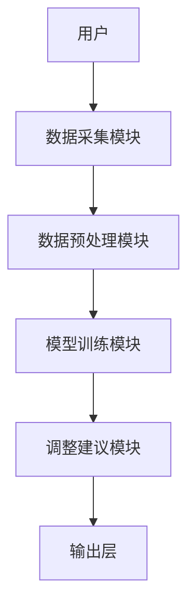
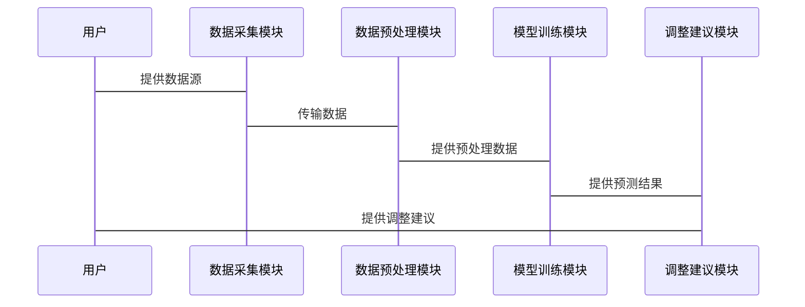

                 


# AI驱动的企业现金流季节性调整系统

## 关键词：AI，现金流，季节性调整，时间序列分析，机器学习，深度学习

## 摘要：  
随着企业经营规模的不断扩大，现金流管理变得越来越重要。季节性波动对企业现金流的影响显著，传统的管理方法往往难以准确预测和调整。本文提出了一种基于人工智能（AI）的企业现金流季节性调整系统，通过时间序列分析和机器学习算法，实现对现金流的精准预测和智能调整。文章详细介绍了系统的背景、核心概念、算法原理、系统架构、项目实战以及最佳实践，为企业提供了一套高效、可靠的现金流管理解决方案。

---

# 第一部分: 企业现金流季节性调整的背景与挑战

## 第1章: 企业现金流季节性调整的背景与挑战

### 1.1 企业现金流管理的重要性  
现金流是企业的生命线，直接关系到企业的生存与发展。良好的现金流管理可以帮助企业应对突发事件、抓住市场机会以及优化资源配置。然而，现金流的波动性使得管理变得复杂，尤其是在季节性需求变化显著的行业。

#### 1.1.1 企业现金流的定义与作用  
现金流是指企业在一定时期内通过经营、投资和筹资活动所获得或消耗的现金及其等价物。它包括经营活动、投资活动和筹资活动的现金流。现金流的作用主要体现在以下几个方面：  
- **流动性管理**：确保企业有足够的资金支付日常运营费用。  
- **投资决策**：为企业扩大生产、并购或其他投资活动提供资金支持。  
- **风险管理**：通过现金流预测，提前识别潜在的财务风险并制定应对策略。  

#### 1.1.2 季节性波动对企业现金流的影响  
季节性波动是指由于市场需求、供应链变化或节假日等因素导致的现金流周期性波动。例如，零售行业在节假日前通常会迎来销售高峰，导致现金流激增；而制造企业在生产旺季可能面临原材料需求增加，现金流压力增大。季节性波动对企业现金流的影响主要体现在以下方面：  
- **短期流动性风险**：季节性需求高峰可能导致企业临时性资金短缺。  
- **预测难度**：传统方法难以准确预测季节性波动带来的现金流变化。  
- **资源浪费**：如果现金流管理不善，可能导致资金闲置或过度投资。  

#### 1.1.3 现金流管理的核心目标  
现金流管理的核心目标是确保企业在不同时间段内拥有充足的现金流，同时优化资金使用效率。具体目标包括：  
- **预测准确性**：准确预测未来现金流的变化趋势。  
- **风险控制**：通过调整资金分配，降低现金流波动带来的风险。  
- **成本优化**：合理分配资金，避免资源浪费。  

---

### 1.2 现金流季节性调整的背景  

#### 1.2.1 现金流波动的周期性特征  
现金流的波动通常具有一定的周期性。例如，某些行业的现金流在每年的特定时期（如节假日、季度末）会出现显著变化。这种周期性特征可以通过时间序列分析来捕捉，从而为预测和调整提供依据。

#### 1.2.2 企业现金流管理的痛点  
传统的现金流管理方法通常依赖于历史数据和经验判断，这种方法在面对复杂多变的市场环境时显得力不从心。具体痛点包括：  
- **预测精度低**：传统方法难以准确预测季节性波动带来的影响。  
- **人工干预多**：需要大量人工调整预测结果，效率低下。  
- **缺乏实时性**：传统方法通常基于滞后数据，难以实现实时调整。  

#### 1.2.3 AI技术在现金流管理中的应用潜力  
人工智能技术的快速发展为企业现金流管理带来了新的可能性。AI可以通过以下方式提升现金流管理的效率和准确性：  
- **自动化预测**：利用机器学习算法，自动分析历史数据并预测未来现金流。  
- **实时调整**：AI系统可以根据实时数据动态调整预测结果，确保预测的准确性。  
- **智能决策**：AI可以基于预测结果，为企业提供优化的资金分配建议。  

---

### 1.3 本章小结  
本章从企业现金流管理的重要性入手，分析了季节性波动对企业现金流的影响，并指出了传统管理方法的局限性。同时，介绍了AI技术在现金流管理中的应用潜力，为后续章节的展开奠定了基础。

---

## 第2章: 现金流季节性调整的核心概念  

### 2.1 现金流预测与调整的基本原理  

#### 2.1.1 现金流预测的定义  
现金流预测是指基于历史数据和当前市场环境，预测未来一定时间内企业现金流的变化趋势。预测的准确性直接影响到企业的财务决策。

#### 2.1.2 现金流调整的定义  
现金流调整是指根据预测结果，对企业现金流进行优化分配，以应对季节性波动带来的挑战。调整的核心目标是确保企业在不同时间段内拥有合理的资金规模。

#### 2.1.3 预测与调整的关系  
现金流预测是调整的基础，调整是预测的结果。通过预测，企业可以提前了解未来现金流的变化趋势，并根据预测结果进行相应的调整，以实现现金流的平稳运行。

---

### 2.2 现金流季节性调整的模型框架  

#### 2.2.1 时间序列分析的基本概念  
时间序列分析是一种通过分析历史数据来预测未来趋势的方法。常用的时间序列模型包括ARIMA、Prophet和LSTM等。

#### 2.2.2 机器学习在现金流预测中的应用  
机器学习算法可以通过对历史数据的学习，识别数据中的模式和特征，从而提高预测的准确性。常用算法包括线性回归、支持向量回归和随机森林等。

#### 2.2.3 综合调整模型的构建  
综合调整模型通常结合时间序列分析和机器学习算法，通过多模型融合的方式，提高预测的准确性和稳定性。

---

### 2.3 现金流季节性调整的业务流程  

#### 2.3.1 数据采集与处理  
数据采集是现金流预测的第一步，主要包括企业内部数据（如销售数据、采购数据）和外部数据（如市场数据、宏观经济指标）的收集。

#### 2.3.2 模型训练与优化  
通过训练数据，模型可以学习到现金流的变化规律。训练过程中需要对模型进行调参和优化，以提高预测的准确性。

#### 2.3.3 结果输出与反馈  
模型预测结果需要输出，并根据实际现金流的变化进行反馈调整，以优化模型的性能。

---

### 2.4 本章小结  
本章详细介绍了现金流季节性调整的核心概念，包括预测与调整的基本原理、模型框架以及业务流程。通过对这些概念的分析，读者可以更好地理解AI驱动的现金流管理系统的构建逻辑。

---

## 第3章: 现金流季节性调整的核心算法原理  

### 3.1 时间序列分析算法  

#### 3.1.1 ARIMA模型的原理  
ARIMA（自回归积分滑动平均模型）是一种广泛应用于时间序列分析的经典算法。其核心思想是通过自回归和滑动平均的方式，对数据进行建模和预测。

#### 3.1.2 LSTM模型的原理  
LSTM（长短期记忆网络）是一种基于循环神经网络的时间序列预测模型。它通过引入记忆单元，可以更好地捕捉时间序列中的长期依赖关系。

#### 3.1.3 Prophet模型的原理  
Prophet是由Facebook开源的时间序列预测模型，适用于具有明确周期性特征的数据。它通过将时间序列分解为趋势和季节性成分，实现预测。

---

### 3.2 机器学习算法  

#### 3.2.1 线性回归模型  
线性回归是一种简单的时间序列预测方法，适用于线性关系较为明显的数据。

#### 3.2.2 支持向量回归模型  
支持向量回归是一种基于统计学习理论的回归算法，适用于非线性关系较为复杂的场景。

#### 3.2.3 随机森林模型  
随机森林是一种基于决策树的集成学习算法，适用于特征较多且复杂度较高的场景。

---

### 3.3 深度学习模型  

#### 3.3.1 卷积神经网络（CNN）的应用  
CNN通常用于图像处理，但在时间序列分析中也可以通过一维卷积层提取特征。

#### 3.3.2 循环神经网络（RNN）的应用  
RNN通过处理序列数据，可以捕捉时间序列中的时序关系。

#### 3.3.3 图神经网络（GNN）的应用  
GNN适用于具有复杂依赖关系的时间序列数据，可以通过图结构建模节点之间的关系。

---

### 3.4 算法对比与选择  

#### 3.4.1 不同算法的优缺点对比  
| 模型 | 优点 | 缺点 |  
|------|------|------|  
| ARIMA | 简单易用，适合线性数据 | 不适合非线性数据，对异常值敏感 |  
| LSTM | 能捕捉长期依赖关系 | 训练时间长，参数多 |  
| Prophet | 易用性强，适合周期性数据 | 对异常值敏感，适合单一时间序列 |  

#### 3.4.2 算法选择的依据  
- 数据特征：线性或非线性  
- 数据规模：小数据或大数据  
- 预测精度要求：高精度或可接受误差  

#### 3.4.3 混合模型的构建思路  
通过集成学习的方式，将多个模型的预测结果进行融合，可以提高预测的准确性和稳定性。

---

### 3.5 本章小结  
本章详细介绍了时间序列分析和机器学习算法的原理，并通过对比分析，帮助企业选择适合自身需求的算法。同时，提出了混合模型的构建思路，为后续章节的系统设计奠定了基础。

---

## 第4章: 现金流季节性调整系统的架构设计  

### 4.1 系统功能设计  

#### 4.1.1 数据采集模块  
数据采集模块负责从企业内部和外部数据源获取现金流相关数据，包括销售数据、采购数据、宏观经济指标等。

#### 4.1.2 数据预处理模块  
数据预处理模块对采集到的数据进行清洗、归一化和特征工程处理，确保数据质量。

#### 4.1.3 模型训练模块  
模型训练模块基于预处理后的数据，训练和优化预测模型，生成预测结果。

#### 4.1.4 调整建议模块  
调整建议模块根据预测结果，生成优化的资金分配建议，帮助企业应对季节性波动。

---

### 4.2 系统架构设计  

#### 4.2.1 系统架构图  


#### 4.2.2 系统接口设计  
系统接口主要包括数据接口和模型接口。数据接口负责与企业数据源对接，模型接口负责与预测模型交互。

#### 4.2.3 系统交互流程图  


---

### 4.3 本章小结  
本章详细介绍了现金流季节性调整系统的架构设计，包括功能模块划分和系统架构图。通过清晰的模块划分和流程设计，确保系统的高效运行和易于维护。

---

## 第5章: 项目实战：基于Python的现金流季节性调整系统实现  

### 5.1 环境安装与配置  

#### 5.1.1 安装Python环境  
推荐使用Anaconda作为Python环境管理工具，安装完成后配置虚拟环境。

#### 5.1.2 安装依赖库  
安装以下依赖库：numpy、pandas、scikit-learn、keras、prophet。

---

### 5.2 系统核心实现  

#### 5.2.1 数据采集与预处理  
```python
import pandas as pd
import numpy as np

# 数据采集
data = pd.read_csv('cash_flow.csv')

# 数据预处理
data['date'] = pd.to_datetime(data['date'])
data.set_index('date', inplace=True)
data = data['amount'].asfreq('D').ffill()
```

#### 5.2.2 模型训练与预测  
```python
from sklearn.ensemble import RandomForestRegressor
from sklearn.metrics import mean_absolute_error

# 训练数据
X_train = data.iloc[:-30].index.toordinal().reshape(-1, 1)
y_train = data.iloc[:-30].values

# 模型训练
model = RandomForestRegressor()
model.fit(X_train, y_train)

# 预测
X_test = data.iloc[-30:].index.toordinal().reshape(-1, 1)
y_pred = model.predict(X_test)
```

#### 5.2.3 调整建议生成  
```python
# 计算预测误差
mae = mean_absolute_error(y_train[-30:], model.predict(X_train[-30:]))
print(f'预测误差：{mae}')

# 提供调整建议
adjustment_ratio = mae / np.mean(y_train)
print(f'建议调整资金分配比例：{adjustment_ratio}%')
```

---

### 5.3 项目小结  
本章通过具体的Python代码实现，展示了如何构建一个现金流季节性调整系统。通过数据采集、预处理、模型训练和调整建议生成，读者可以掌握系统的实际操作流程。

---

## 第6章: 最佳实践与注意事项  

### 6.1 最佳实践  

#### 6.1.1 数据质量控制  
确保数据的完整性和准确性，可以通过数据清洗和特征工程来提升模型性能。

#### 6.1.2 模型优化策略  
通过交叉验证和超参数调优，可以提高模型的预测精度。

#### 6.1.3 系统维护与更新  
定期更新模型和数据，确保系统的预测结果与实际情况保持一致。

---

### 6.2 注意事项  

#### 6.2.1 数据隐私与安全  
确保数据的安全性，避免数据泄露和滥用。

#### 6.2.2 模型解释性  
选择具有较高解释性的模型，便于企业理解和调整。

#### 6.2.3 实时性要求  
根据企业的实际需求，选择合适的实时性解决方案，确保系统的高效运行。

---

### 6.3 拓展阅读  
- 《时间序列分析与应用》  
- 《机器学习实战》  
- 《深度学习：方法与应用》  

---

## 第7章: 总结与展望  

### 7.1 总结  
本文详细介绍了AI驱动的企业现金流季节性调整系统的构建过程，包括背景分析、核心概念、算法原理、系统架构和项目实战。通过理论与实践的结合，为企业提供了一套高效、可靠的现金流管理解决方案。

### 7.2 展望  
未来，随着AI技术的不断发展，现金流管理将更加智能化和自动化。企业可以通过引入更先进的算法和技术，进一步提升现金流预测和调整的准确性，优化资金使用效率。

---

## 结语  
现金流是企业的生命线，而AI技术的应用为企业现金流管理带来了新的可能性。通过本文的介绍，读者可以全面了解AI驱动的企业现金流季节性调整系统的构建与应用，为企业财务管理的优化提供有力支持。

