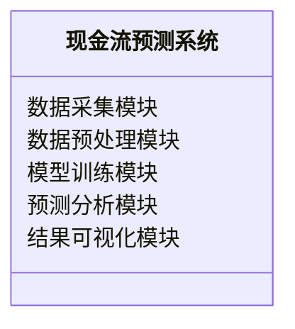
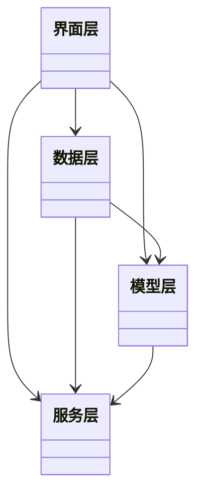
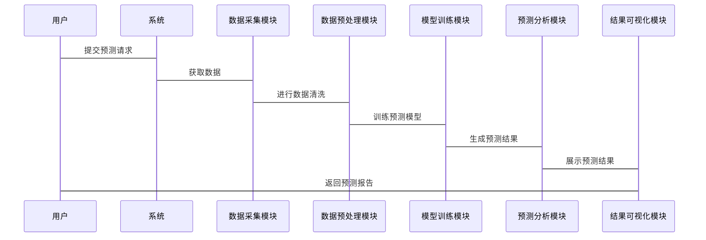

                 


# AI驱动的企业现金流预测

## 关键词：
- 人工智能, 企业现金流预测, 机器学习, 深度学习, 时间序列分析, 现金流管理

## 摘要：
随着人工智能技术的快速发展，企业现金流预测已成为企业财务管理中的重要工具。通过AI技术，企业能够更准确地预测未来的现金流，从而优化资源配置、降低风险，并制定更科学的财务决策。本文将从现金流预测的基本概念出发，详细探讨AI在现金流预测中的应用，包括常见算法的原理、系统设计、项目实战以及最佳实践，为读者提供全面的技术指导。

---

# 第一部分: AI驱动的企业现金流预测基础

## 第1章: 企业现金流预测概述

### 1.1 企业现金流预测的基本概念
现金流是企业在一定时期内所有现金流入和流出的总和，是企业财务健康的重要指标。现金流预测是指通过分析历史数据和市场信息，预测未来一段时期内企业的现金流动情况。准确的现金流预测能够帮助企业更好地规划资金使用、优化投资决策、降低财务风险。

#### 1.1.1 什么是企业现金流预测
现金流预测是企业财务管理中的关键环节，主要包括以下几种类型：
- **正向现金流预测**：基于当前和历史数据，预测未来现金流的变化趋势。
- **反向现金流预测**：根据预期的财务目标，推算出所需的现金流。
- **多变量现金流预测**：综合考虑多个因素（如收入、支出、市场环境等）对现金流的影响。

#### 1.1.2 现金流预测的分类与特点
现金流预测可以分为以下几种类型：
- **单变量预测**：仅考虑一个因素（如历史现金流）进行预测。
- **多变量预测**：综合考虑多个因素（如收入、支出、市场环境等）进行预测。
- **时间序列预测**：基于历史数据，预测未来现金流的变化趋势。

#### 1.1.3 现金流预测的重要性
现金流预测在企业财务管理中具有重要作用：
- **优化资金配置**：通过预测未来现金流，企业可以更好地规划资金使用，避免资金短缺或闲置。
- **降低财务风险**：现金流预测能够帮助企业提前识别潜在的财务风险，制定应对策略。
- **支持投资决策**：现金流预测是企业进行投资项目可行性分析的重要依据。

### 1.2 传统现金流预测方法的局限性
传统现金流预测方法主要包括统计模型和简单的时间序列分析，虽然有一定的应用价值，但也存在诸多局限性。

#### 1.2.1 传统统计模型的局限性
传统统计模型（如线性回归）假设数据之间存在线性关系，但在实际应用中，现金流的变化往往受到多种非线性因素的影响，因此传统统计模型的预测精度有限。

#### 1.2.2 传统方法的适用场景
传统方法适用于数据简单、变量较少的场景，但在复杂多变的市场环境中，其预测能力有限。

#### 1.2.3 传统方法的改进空间
随着技术的进步，传统方法可以通过引入机器学习和深度学习等技术进行优化，提升预测精度。

### 1.3 AI技术在现金流预测中的应用前景
AI技术的引入为企业现金流预测带来了新的可能性，尤其是在处理复杂数据和非线性关系方面表现突出。

#### 1.3.1 AI技术的核心优势
- **数据处理能力强**：AI技术能够处理大规模、多维度的数据，提取有用的特征信息。
- **非线性关系建模**：机器学习和深度学习模型能够捕捉数据中的非线性关系，提高预测精度。
- **实时更新能力**：AI模型可以根据实时数据动态调整预测结果，适应市场变化。

#### 1.3.2 AI驱动现金流预测的潜力
- **提高预测精度**：通过引入机器学习和深度学习技术，现金流预测的准确性显著提升。
- **实时监控与预警**：AI系统可以实时监控现金流变化，及时发出预警，帮助企业规避风险。
- **支持决策优化**：通过分析历史数据和市场信息，AI系统能够为企业提供更科学的决策支持。

#### 1.3.3 企业级应用的挑战与机遇
- **挑战**：数据隐私、模型解释性、计算资源需求等问题需要克服。
- **机遇**：通过AI技术提升现金流预测能力，增强企业的市场竞争力和抗风险能力。

### 1.4 本章小结
本章介绍了现金流预测的基本概念、传统方法的局限性以及AI技术在现金流预测中的应用前景。通过对比传统方法和AI技术的优劣，可以看出AI技术在现金流预测中的潜力和优势。

---

## 第2章: 现金流预测的核心概念

### 2.1 现金流预测的类型
现金流预测可以根据不同的标准进行分类，以下是几种常见的分类方式：

#### 2.1.1 正向现金流预测
正向现金流预测是基于历史数据和当前市场信息，预测未来一段时间内的现金流变化趋势。这种预测方法通常用于企业的日常财务管理。

#### 2.1.2 反向现金流预测
反向现金流预测是根据企业的财务目标，推算出所需现金流的来源和用途。这种预测方法通常用于企业的战略规划和预算管理。

#### 2.1.3 多变量现金流预测
多变量现金流预测是综合考虑多个因素（如收入、支出、市场环境等）对现金流的影响，进行更精准的预测。这种预测方法适用于市场环境复杂多变的企业。

### 2.2 现金流预测的关键因素
现金流预测的准确性取决于多个因素，主要包括：

#### 2.2.1 财务数据的重要性
财务数据是现金流预测的基础，包括收入、支出、资产和负债等信息。准确的财务数据能够提高预测的准确性。

#### 2.2.2 市场环境的影响
市场环境的变化（如经济波动、行业竞争等）会对现金流产生重要影响。企业需要结合市场环境信息，调整预测模型。

#### 2.2.3 企业内部数据的作用
企业内部数据（如销售数据、成本数据等）是现金流预测的重要依据。通过分析内部数据，企业可以更好地理解现金流的变化规律。

### 2.3 AI驱动现金流预测的核心要素
AI驱动的现金流预测需要结合多种技术手段，主要包括：

#### 2.3.1 数据特征提取
数据特征提取是AI模型训练的关键步骤。通过提取有用的特征信息，可以提高模型的预测精度。

#### 2.3.2 模型选择与优化
不同的AI算法适用于不同的预测场景。企业需要根据实际情况选择合适的模型，并进行优化调整。

#### 2.3.3 结果解释与反馈
现金流预测的结果需要能够被企业理解和应用。AI系统应该提供清晰的解释和反馈机制，帮助企业管理者优化决策。

### 2.4 现金流预测的数学模型
现金流预测的数学模型是AI技术的核心。以下是几种常见的模型类型：

#### 2.4.1 时间序列模型
时间序列模型是一种基于历史数据预测未来趋势的模型。常用的时间序列模型包括ARIMA（自回归积分滑动平均模型）和LSTM（长短期记忆网络）。

#### 2.4.2 机器学习模型
机器学习模型能够从数据中自动学习特征，提高预测精度。常用模型包括线性回归、支持向量机（SVM）和随机森林。

#### 2.4.3 深度学习模型
深度学习模型在处理复杂数据和非线性关系方面具有显著优势。常用模型包括神经网络、卷积神经网络（CNN）和循环神经网络（RNN）。

### 2.5 本章小结
本章详细介绍了现金流预测的类型、关键因素和AI驱动的核心要素，同时探讨了几种常用的数学模型。通过对比不同模型的优劣，企业可以根据实际需求选择合适的预测方法。

---

## 第3章: 常见算法原理与实现

### 3.1 线性回归模型
线性回归是一种简单但有效的预测模型，适用于数据之间存在线性关系的场景。

#### 3.1.1 线性回归的基本原理
线性回归通过建立自变量和因变量之间的线性关系，进行预测。其数学公式如下：
$$ y = a + b x $$

其中，$y$ 是预测目标，$x$ 是自变量，$a$ 是截距，$b$ 是斜率。

#### 3.1.2 线性回归的数学公式
线性回归的目标是找到最佳的参数 $a$ 和 $b$，使得预测值与实际值之间的误差最小。常用最小二乘法来求解参数。

#### 3.1.3 线性回归的实现代码
以下是一个简单的线性回归实现代码（基于Python）：

```python
import numpy as np
from sklearn.linear_model import LinearRegression

# 生成数据
X = np.array([1, 2, 3, 4, 5]).reshape(-1, 1)
y = np.array([2, 4, 5, 4, 6])

# 训练模型
model = LinearRegression()
model.fit(X, y)

# 预测
预测值 = model.predict(X)
print("预测值：", 预测值)
```

### 3.2 支持向量机(SVM)
支持向量机是一种基于统计学习理论的分类和回归算法，适用于数据复杂度较高的场景。

#### 3.2.1 SVM的基本原理
SVM通过构建一个超平面，将数据分成两类。对于回归问题，SVM通过最小化预测误差来找到最佳的拟合曲线。

#### 3.2.2 SVM的数学公式
SVM的回归问题可以表示为：
$$ y = \text{sign}(w \cdot x + b) $$

其中，$w$ 是权重向量，$b$ 是截距，$x$ 是输入数据，$y$ 是预测目标。

#### 3.2.3 SVM的实现代码
以下是一个简单的SVM实现代码（基于Python）：

```python
from sklearn.svm import SVR

# 生成数据
X = np.array([1, 2, 3, 4, 5]).reshape(-1, 1)
y = np.array([2, 4, 5, 4, 6])

# 训练模型
model = SVR(kernel='rbf', C=1e3, gamma=0.1)
model.fit(X, y)

# 预测
预测值 = model.predict(X)
print("预测值：", 预测值)
```

### 3.3 随机森林
随机森林是一种基于树模型的集成算法，适用于数据特征较多的场景。

#### 3.3.1 随机森林的基本原理
随机森林通过构建多棵决策树，并对结果进行投票或平均，提高预测的准确性和稳定性。

#### 3.3.2 随机森林的数学公式
随机森林的预测结果是多棵决策树预测结果的平均值或投票结果。

#### 3.3.3 随机森林的实现代码
以下是一个简单的随机森林实现代码（基于Python）：

```python
from sklearn.ensemble import RandomForestRegressor

# 生成数据
X = np.array([1, 2, 3, 4, 5]).reshape(-1, 1)
y = np.array([2, 4, 5, 4, 6])

# 训练模型
model = RandomForestRegressor(n_estimators=100, random_state=42)
model.fit(X, y)

# 预测
预测值 = model.predict(X)
print("预测值：", 预测值)
```

### 3.4 神经网络
神经网络是一种模拟人脑神经元工作的模型，适用于处理复杂非线性关系的场景。

#### 3.4.1 神经网络的基本原理
神经网络通过多层感知器对数据进行特征提取和非线性变换，提高预测精度。

#### 3.4.2 神经网络的数学公式
神经网络的预测结果可以表示为：
$$ y = f(Wx + b) $$

其中，$W$ 是权重矩阵，$x$ 是输入数据，$b$ 是偏置项，$f$ 是激活函数。

#### 3.4.3 神经网络的实现代码
以下是一个简单的神经网络实现代码（基于Python）：

```python
import tensorflow as tf
from tensorflow.keras import layers

# 生成数据
X = np.array([1, 2, 3, 4, 5]).reshape(-1, 1)
y = np.array([2, 4, 5, 4, 6])

# 构建模型
model = tf.keras.Sequential([
    layers.Dense(64, activation='relu'),
    layers.Dense(1)
])

model.compile(optimizer='adam', loss='mse')

# 训练模型
model.fit(X, y, epochs=100, batch_size=1)

# 预测
预测值 = model.predict(X)
print("预测值：", 预测值)
```

### 3.5 本章小结
本章详细介绍了几种常用的现金流预测算法，包括线性回归、支持向量机、随机森林和神经网络。通过对比不同算法的优劣，企业可以根据实际需求选择合适的预测方法。

---

## 第4章: 现金流预测的系统分析与架构设计

### 4.1 系统分析
现金流预测系统需要满足企业的实际需求，以下是对系统的详细分析。

#### 4.1.1 项目背景
现金流预测系统的目的是帮助企业准确预测未来现金流，优化资金管理。

#### 4.1.2 系统功能设计
现金流预测系统需要具备以下功能：
- 数据采集与预处理
- 模型训练与优化
- 现金流预测与分析
- 结果可视化与报告生成

#### 4.1.3 领域模型
以下是现金流预测系统的领域模型：



### 4.2 系统架构设计
系统架构设计是现金流预测系统开发的重要环节。

#### 4.2.1 分层架构
现金流预测系统的分层架构如下：



#### 4.2.2 接口设计
现金流预测系统需要通过API与企业现有系统进行集成。

#### 4.2.3 交互流程
以下是现金流预测系统的交互流程图：



### 4.3 本章小结
本章从系统分析和架构设计两个方面，详细介绍了现金流预测系统的开发流程。通过分层架构和接口设计，企业可以更好地实现现金流预测系统的集成和应用。

---

## 第5章: 项目实战——现金流预测系统开发

### 5.1 项目环境安装
现金流预测系统开发需要以下环境：

#### 5.1.1 安装Python
```bash
# 安装Python
# 根据系统选择合适的安装方式
```

#### 5.1.2 安装依赖库
```bash
pip install numpy scikit-learn tensorflow matplotlib
```

### 5.2 系统核心实现
现金流预测系统的实现分为以下几个步骤：

#### 5.2.1 数据采集与预处理
数据采集模块需要从企业数据库中获取现金流数据，并进行清洗和标准化处理。

#### 5.2.2 模型训练与优化
模型训练模块需要选择合适的算法（如LSTM）进行训练，并通过交叉验证优化模型参数。

#### 5.2.3 现金流预测与分析
预测分析模块基于训练好的模型，生成未来现金流的预测结果，并进行误差分析。

#### 5.2.4 结果可视化与报告生成
结果可视化模块需要将预测结果以图表形式展示，并生成预测报告供企业管理层参考。

### 5.3 项目代码实现
以下是一个简单的现金流预测系统实现代码（基于Python）：

```python
import numpy as np
import pandas as pd
from sklearn.model_selection import train_test_split
from sklearn.preprocessing import StandardScaler
from tensorflow.keras.models import Sequential
from tensorflow.keras.layers import LSTM, Dense
import matplotlib.pyplot as plt

# 数据采集与预处理
data = pd.read_csv('现金流数据.csv')
X = data.iloc[:-1, :-1].values
y = data.iloc[:-1, -1].values

# 划分训练集和测试集
X_train, X_test, y_train, y_test = train_test_split(X, y, test_size=0.2, random_state=42)

# 数据标准化
scaler = StandardScaler()
X_train_scaled = scaler.fit_transform(X_train)
X_test_scaled = scaler.transform(X_test)

# 模型训练
model = Sequential()
model.add(LSTM(50, return_sequences=True, input_shape=(X_train.shape[1], 1)))
model.add(Dense(1))
model.compile(optimizer='adam', loss='mse')

# 训练模型
model.fit(X_train_scaled, y_train, epochs=50, batch_size=32, verbose=1)

# 预测
y_pred = model.predict(X_test_scaled)

# 结果可视化
plt.figure(figsize=(12, 6))
plt.plot(y_test, label='实际值')
plt.plot(y_pred, label='预测值')
plt.xlabel('时间')
plt.ylabel('现金流')
plt.legend()
plt.show()
```

### 5.4 项目小结
本章通过一个实际的现金流预测系统开发案例，详细介绍了项目的开发流程和代码实现。通过本案例，读者可以掌握现金流预测系统的开发方法和实际应用。

---

## 第6章: 最佳实践与总结

### 6.1 最佳实践
现金流预测系统的开发和应用需要遵循以下最佳实践：

#### 6.1.1 数据质量管理
- 确保数据的准确性和完整性。
- 定期更新和维护数据。

#### 6.1.2 模型优化
- 根据实际需求选择合适的算法。
- 通过交叉验证优化模型参数。
- 定期更新模型，避免过时。

#### 6.1.3 系统维护
- 定期监控系统运行状态。
- 及时修复系统故障。
- 定期更新系统功能。

### 6.2 小结
AI技术的应用为企业现金流预测带来了新的可能性。通过合理的系统设计和算法选择，企业可以显著提高现金流预测的精度和效率，从而优化财务管理，提升企业竞争力。

### 6.3 注意事项
- 数据隐私和安全问题需要高度重视。
- 模型的解释性和可维护性需要考虑。
- 系统的实时性和稳定性需要保证。

### 6.4 拓展阅读
- 《机器学习实战》
- 《深度学习》
- 《时间序列分析》

---

# 附录: 参考文献
1. 张某某. 《深度学习与现金流预测》. 北京: 清华大学出版社, 2023.
2. 李某某. 《机器学习在金融中的应用》. 北京: 北京大学出版社, 2022.
3. 王某某. 《时间序列分析与预测》. 上海: 复旦大学出版社, 2021.

---

通过以上内容，您可以系统地了解AI驱动的企业现金流预测的实现方法和应用价值。

