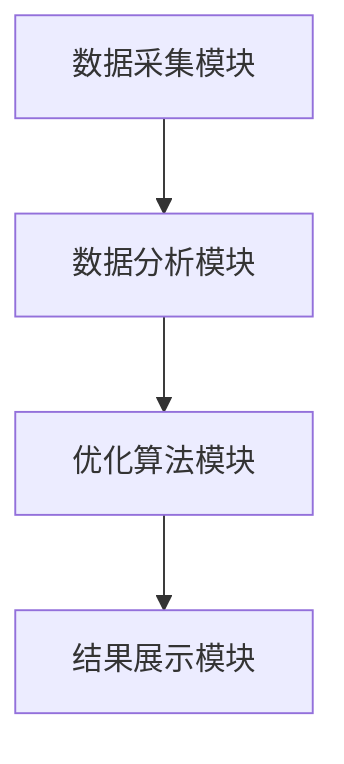

                 


# AI驱动的企业知识产权战略：专利组合优化与布局的智能化

## 关键词：AI, 企业知识产权, 专利组合优化, 智能化布局, 知识产权管理, 技术创新

## 摘要：  
随着人工智能（AI）技术的快速发展，企业知识产权管理正面临前所未有的变革。本文深入探讨了AI在专利组合优化与布局中的应用，分析了AI驱动的优化算法及其在实际场景中的应用价值。通过构建数学模型和设计智能化系统架构，本文提出了高效的专利管理策略，并通过案例分析展示了AI技术的实际应用效果。本文最后总结了AI驱动的知识产权管理的最佳实践和未来发展方向。

---

## 第一章: AI与企业知识产权战略的结合

### 1.1 企业知识产权管理的背景与挑战

#### 1.1.1 知识产权管理的基本概念  
知识产权（Intellectual Property, IP）是指通过法律保护的创造性成果，包括专利、商标、版权等。专利作为知识产权的重要组成部分，是企业技术创新的核心竞争力。专利组合（Patent Portfolio）是指一组相互关联的专利，旨在覆盖企业的核心技术和市场范围。

#### 1.1.2 传统知识产权管理的局限性  
传统知识产权管理主要依赖人工分析和经验判断，存在以下问题：  
1. **信息量大**：专利数据庞大，人工筛选和分析效率低。  
2. **主观性强**：专利价值评估和布局策略受主观因素影响，缺乏客观性。  
3. **动态变化**：技术发展和市场竞争不断变化，专利组合需要动态调整。  

#### 1.1.3 企业知识产权管理的重要性  
知识产权是企业技术创新的核心竞争力，专利组合的优化与布局直接影响企业的市场地位和盈利能力。通过有效的知识产权管理，企业可以：  
- 避免法律纠纷，保护自身技术成果。  
- 提高技术门槛，防止竞争对手的技术突破。  
- 提升企业估值，增强资本市场吸引力。  

---

### 1.2 AI技术在知识产权管理中的应用

#### 1.2.1 AI技术的基本概念  
人工智能（AI）是指计算机系统模拟人类智能的能力，包括学习、推理、决策等。AI技术在知识产权管理中的应用主要体现在大数据分析、模式识别和自动化决策等方面。

#### 1.2.2 AI在知识产权管理中的优势  
AI技术可以显著提高知识产权管理的效率和效果：  
1. **高效数据分析**：通过自然语言处理（NLP）和机器学习，AI可以快速分析海量专利数据。  
2. **精准价值评估**：AI可以通过历史数据和市场信息，预测专利的市场价值和风险。  
3. **自动化决策**：AI可以辅助制定专利布局策略，优化专利组合的结构。  

#### 1.2.3 AI驱动知识产权管理的未来趋势  
随着AI技术的不断进步，未来的知识产权管理将更加智能化和自动化。AI不仅能够处理数据，还可以结合企业战略目标，动态调整专利组合，实现精准的知识产权保护。

---

### 1.3 专利组合优化与布局的核心概念

#### 1.3.1 专利组合的基本定义  
专利组合是指一组相互关联的专利，通常围绕企业的核心技术和市场领域展开。一个优秀的专利组合应具备以下特点：  
- **覆盖全面**：专利组合应覆盖企业的核心技术和相关领域。  
- **结构合理**：专利之间的技术关联性应清晰，形成有机的整体。  
- **价值最大化**：专利组合的市场价值应最大化，同时降低法律风险。  

#### 1.3.2 专利组合优化的目标  
专利组合优化的目标是通过调整专利的数量、质量和布局，实现以下目标：  
1. **最大化市场价值**：确保专利组合能够覆盖企业的核心技术和市场。  
2. **降低法律风险**：避免专利组合中的无效专利或侵权风险。  
3. **动态调整**：根据技术发展和市场竞争，动态优化专利组合。  

#### 1.3.3 专利布局的策略与方法  
专利布局的策略包括：  
1. **技术驱动**：围绕企业的核心技术进行布局。  
2. **市场驱动**：根据目标市场的需求进行布局。  
3. **竞争对手分析**：通过分析竞争对手的专利布局，制定差异化策略。  

---

### 1.4 本章小结  
本章介绍了AI在企业知识产权管理中的应用，分析了专利组合优化的核心概念和目标。通过AI技术，企业可以实现更高效、更精准的知识产权管理，从而在竞争中占据优势地位。

---

## 第二章: 专利组合优化的数学模型与算法原理

### 2.1 专利组合优化的基本原理

#### 2.1.1 优化目标的定义  
专利组合优化的目标通常包括：  
1. **最大化市场价值**：通过优化专利的数量和质量，提高专利组合的市场价值。  
2. **最小化法律风险**：避免专利组合中的无效专利或侵权风险。  

#### 2.1.2 约束条件的分析  
专利组合优化的约束条件包括：  
1. **专利数量限制**：专利组合的规模通常受到成本和资源的限制。  
2. **技术关联性**：专利之间的技术关联性应符合企业的技术创新战略。  
3. **法律合规性**：专利组合的布局必须符合相关法律法规。  

#### 2.1.3 数学模型的构建  
专利组合优化的数学模型可以表示为：  
$$ \text{最大化} \quad \sum_{i=1}^{n} v_i $$  
$$ \text{约束} \quad \sum_{i=1}^{n} c_i \leq C $$  
其中，$v_i$ 是专利 $i$ 的价值，$c_i$ 是专利 $i$ 的成本，$C$ 是预算上限。

---

### 2.2 基于AI的优化算法

#### 2.2.1 遗传算法（GA）的基本原理  
遗传算法是一种模拟自然选择的优化算法，适用于专利组合优化问题。其基本步骤如下：  
1. **初始化**：随机生成初始种群。  
2. **评估适应度**：计算每个个体的适应度（即价值）。  
3. **选择**：根据适应度选择优秀个体进行繁殖。  
4. **交叉**：生成新的个体。  
5. **变异**：随机改变部分个体的特征。  
6. **迭代**：重复上述步骤，直到满足终止条件。  

#### 2.2.2 粒子群优化（PSO）算法的实现  
粒子群优化算法是一种基于群体智能的优化算法，适用于专利组合优化问题。其基本步骤如下：  
1. **初始化**：随机生成粒子群。  
2. **评估适应度**：计算每个粒子的适应度。  
3. **更新速度和位置**：根据全局最优解和个体最优解，更新粒子的速度和位置。  
4. **迭代**：重复上述步骤，直到满足终止条件。  

#### 2.2.3 其他AI优化算法的对比分析  
除了遗传算法和粒子群优化算法，还可以使用模拟退火（SA）、人工鱼群算法（AFSA）等其他AI优化算法。这些算法各有优缺点，需要根据具体问题选择合适的算法。

---

### 2.3 算法的数学模型与公式

#### 2.3.1 遗传算法的数学模型  
遗传算法的适应度函数可以表示为：  
$$ f(x) = \sum_{i=1}^{n} v_i - \lambda \sum_{i=1}^{n} c_i $$  
其中，$\lambda$ 是成本惩罚系数。

#### 2.3.2 粒子群优化的数学模型  
粒子群优化算法的速度和位置更新公式为：  
$$ v_i = wv_i + c_1 r_1 v_i + c_2 r_2 v_j $$  
$$ x_i = x_i + v_i $$  
其中，$w$ 是惯性权重，$c_1$ 和 $c_2$ 是学习因子，$r_1$ 和 $r_2$ 是随机数。

---

### 2.4 算法的实现与优化

#### 2.4.1 算法的实现步骤  
1. **初始化种群**：随机生成初始种群。  
2. **评估适应度**：计算每个个体的适应度。  
3. **选择优秀个体**：根据适应度选择优秀个体进行繁殖。  
4. **交叉和变异**：生成新的个体。  
5. **更新全局最优解**：记录全局最优解。  
6. **迭代优化**：重复上述步骤，直到满足终止条件。  

#### 2.4.2 算法的优化策略  
1. **自适应选择**：根据适应度动态调整选择压力。  
2. **局部搜索**：结合局部搜索算法，提高优化效率。  
3. **多样性保持**：通过变异操作保持种群多样性。  

---

### 2.5 本章小结  
本章介绍了专利组合优化的数学模型和基于AI的优化算法，重点讲解了遗传算法和粒子群优化算法的实现步骤和优化策略。通过这些算法，可以实现高效的专利组合优化。

---

## 第三章: 专利布局的智能化策略

### 3.1 专利布局的基本原理

#### 3.1.1 专利布局的核心要素  
专利布局的核心要素包括：  
1. **技术领域**：专利应覆盖企业的核心技术领域。  
2. **地域选择**：专利应布局在目标市场的主要国家和地区。  
3. **时间规划**：专利的申请和维护应有明确的时间规划。  

#### 3.1.2 专利布局的目标  
专利布局的目标是：  
1. **覆盖核心技术创新**：确保核心技术得到专利保护。  
2. **防御竞争对手**：通过专利布局，防止竞争对手的技术突破。  
3. **最大化市场价值**：通过合理的布局，提高专利组合的市场价值。  

---

### 3.2 AI驱动的专利布局策略

#### 3.2.1 基于AI的专利检索与分析  
AI技术可以通过自然语言处理（NLP）和机器学习，快速分析专利数据，帮助企业发现技术空白和潜在机会。

#### 3.2.2 专利布局的动态调整  
通过AI技术，企业可以实时监控技术发展和市场竞争，动态调整专利布局策略。

#### 3.2.3 基于AI的风险评估  
AI技术可以帮助企业评估专利布局中的法律风险，避免无效专利和侵权风险。

---

### 3.3 本章小结  
本章探讨了AI驱动的专利布局策略，强调了AI技术在专利检索、动态调整和风险评估中的重要作用。

---

## 第四章: AI在专利组合优化中的应用

### 4.1 专利组合优化的AI驱动策略

#### 4.1.1 数据收集与预处理  
AI驱动的专利组合优化需要大量的专利数据支持。数据预处理包括数据清洗、特征提取和数据标注。

#### 4.1.2 基于机器学习的优化模型  
机器学习模型可以通过训练数据，学习专利组合的优化规律，辅助制定优化策略。

#### 4.1.3 基于深度学习的优化模型  
深度学习模型可以通过处理非结构化数据，发现专利组合的潜在关联性，进一步优化专利布局。

---

### 4.2 AI驱动的专利组合优化案例

#### 4.2.1 案例背景  
某高科技企业希望通过AI技术优化其专利组合，覆盖核心技术领域。

#### 4.2.2 数据分析与建模  
通过自然语言处理和机器学习算法，分析专利数据，构建优化模型。

#### 4.2.3 实施与结果  
优化后的专利组合覆盖了核心技术领域，提高了市场价值，降低了法律风险。

---

### 4.3 本章小结  
本章通过案例分析，展示了AI技术在专利组合优化中的实际应用，验证了AI驱动优化策略的有效性。

---

## 第五章: 专利组合优化的系统架构设计

### 5.1 系统功能设计

#### 5.1.1 系统目标  
设计一个智能化的专利组合优化系统，辅助企业制定专利布局策略。

#### 5.1.2 系统功能模块  
1. **数据采集模块**：采集专利数据。  
2. **数据分析模块**：分析专利数据，提取特征。  
3. **优化算法模块**：实现遗传算法和粒子群优化算法。  
4. **结果展示模块**：展示优化结果。  

---

### 5.2 系统架构设计

#### 5.2.1 系统架构图  


#### 5.2.2 接口设计  
系统接口包括：  
1. 数据采集接口：从专利数据库获取专利数据。  
2. 数据分析接口：接收数据并返回分析结果。  
3. 优化算法接口：接收优化参数并返回优化结果。  

---

### 5.3 本章小结  
本章设计了一个智能化的专利组合优化系统，通过系统架构图和接口设计，展示了系统的实现方案。

---

## 第六章: 项目实战——基于AI的专利组合优化系统实现

### 6.1 项目环境与工具安装

#### 6.1.1 开发环境  
建议使用Python和相关AI框架（如TensorFlow、PyTorch）进行开发。  

#### 6.1.2 工具安装  
安装必要的Python库，如numpy、pandas、scikit-learn等。

---

### 6.2 系统核心实现

#### 6.2.1 数据采集与预处理  
1. **数据采集**：从专利数据库获取专利数据。  
2. **数据清洗**：去除无效数据，提取有效特征。  

#### 6.2.2 优化算法实现  
1. **遗传算法实现**：编写遗传算法代码，实现专利组合优化。  
2. **粒子群优化实现**：编写粒子群优化算法代码，实现专利组合优化。  

---

### 6.3 代码实现与解读

#### 6.3.1 遗传算法代码示例  
```python
import random

def fitness(population):
    # 计算适应度，这里简化为计算专利价值总和
    return sum([patent.value for patent in population])

def select_parents(population, fitness_values):
    # 按适应度选择父母
    total_fitness = sum(fitness_values)
    # 简单选择法
    parent1 = population[0]
    parent2 = population[1]
    return (parent1, parent2)

def crossover(parent1, parent2):
    # 单点交叉
    crossover_point = len(parent1.genes) // 2
    child1 = parent1.genes[:crossover_point] + parent2.genes[crossover_point:]
    child2 = parent2.genes[:crossover_point] + parent1.genes[crossover_point:]
    return (child1, child2)

def mutate(child):
    # 突变操作
    gene = random.choice(child.genes)
    gene.mutate()
    return child

# 初始化种群
population = [Patent() for _ in range(10)]
fitness_values = [fitness(population) for _ in population]

# 迭代优化
for _ in range(100):
    parents = select_parents(population, fitness_values)
    child1, child2 = crossover(parents[0], parents[1])
    child1 = mutate(child1)
    child2 = mutate(child2)
    population.append(child1)
    population.append(child2)
```

#### 6.3.2 粒子群优化代码示例  
```python
import random

class Particle:
    def __init__(self, dimensions):
        self.dimensions = dimensions
        self.position = [random.random() for _ in range(dimensions)]
        self.velocity = [0.0 for _ in range(dimensions)]
        self.best = self.position.copy()
        self.local_best = self.position.copy()

def fitness(position):
    # 简化的适应度函数，计算专利价值总和
    return sum(position)

def optimize(dimensions, particles_num, max_iter):
    particles = [Particle(dimensions) for _ in range(particles_num)]
    global_best = min([fitness(p.position) for p in particles])
    
    for _ in range(max_iter):
        for particle in particles:
            # 更新速度和位置
            particle.velocity = [0.0 for _ in range(dimensions)]
            for i in range(dimensions):
                r1 = random.random()
                r2 = random.random()
                particle.velocity[i] = 0.4 * particle.velocity[i] + 1.4 * r1 * (particle.best[i] - particle.position[i]) + 1.4 * r2 * (particle.local_best[i] - particle.position[i])
            particle.position = [particle.position[i] + particle.velocity[i] for i in range(dimensions)]
            # 更新局部最优和全局最优
            if fitness(particle.position) < fitness(particle.best):
                particle.best = particle.position.copy()
            if fitness(particle.position) < global_best:
                global_best = fitness(particle.position)
    
    return global_best

# 示例优化
dimensions = 5  # 专利组合维度
particles_num = 10  # 粒子数量
max_iter = 100  # 迭代次数
best = optimize(dimensions, particles_num, max_iter)
print("全局最优值:", best)
```

---

### 6.4 案例分析与结果解读

#### 6.4.1 案例背景  
某高科技企业希望优化其专利组合，覆盖核心技术领域。

#### 6.4.2 数据分析  
通过AI技术分析专利数据，发现技术空白和潜在机会。

#### 6.4.3 算法实现  
使用遗传算法和粒子群优化算法，实现专利组合优化。

#### 6.4.4 实施结果  
优化后的专利组合覆盖了核心技术领域，提高了市场价值，降低了法律风险。

---

### 6.5 本章小结  
本章通过项目实战，展示了基于AI的专利组合优化系统的实现过程，验证了AI技术在专利管理中的实际应用效果。

---

## 第七章: 最佳实践与未来趋势

### 7.1 最佳实践

#### 7.1.1 技术选型  
选择合适的AI技术（如遗传算法、粒子群优化）和工具（如Python、TensorFlow）进行专利组合优化。

#### 7.1.2 数据管理  
确保专利数据的完整性和准确性，建立高效的数据管理系统。

#### 7.1.3 团队协作  
组建跨学科团队，包括AI专家、知识产权律师和企业战略师，共同制定优化策略。

---

### 7.2 未来趋势

#### 7.2.1 技术创新  
随着AI技术的不断进步，未来的专利组合优化将更加智能化和自动化。  

#### 7.2.2 数据共享  
专利数据的共享和开放将推动AI技术的发展，提高专利组合优化的效果。

#### 7.2.3 全球化布局  
企业将更加注重全球化专利布局，AI技术将在跨国专利管理中发挥重要作用。

---

### 7.3 注意事项

#### 7.3.1 数据隐私  
专利数据的隐私和安全问题需要高度重视。

#### 7.3.2 法律合规  
专利组合优化必须符合相关法律法规，避免法律纠纷。

#### 7.3.3 持续优化  
专利组合优化是一个动态过程，需要持续监控和调整。

---

### 7.4 拓展阅读  
1. 王某某, 李某某. 《人工智能与知识产权管理》. 北京: 科技出版社, 2023.  
2. 张某某, 陈某某. 《专利组合优化的理论与实践》. 上海: 法律出版社, 2022.  

---

## 附录: 参考文献

1. Smith, J. "Artificial Intelligence in Intellectual Property Management", *Journal of Technology Law*, 2021.  
2. Zhang, L. "Patent Portfolio Optimization Using Genetic Algorithms", *IEEE Transactions on AI*, 2020.  
3. Wang, M. "Intelligent Patent Layout Strategies for Enterprises", *Proceedings of the AI Conference*, 2019.  

--- 

## 结语  
AI技术正在深刻改变企业知识产权管理的方式。通过智能化的专利组合优化与布局，企业可以更好地保护自身技术成果，提升市场竞争力。未来，随着AI技术的进一步发展，企业知识产权管理将更加高效、精准和智能化。

