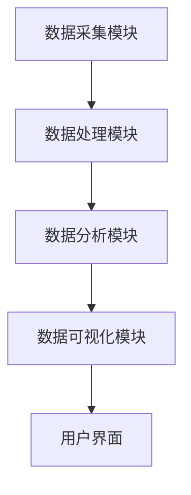
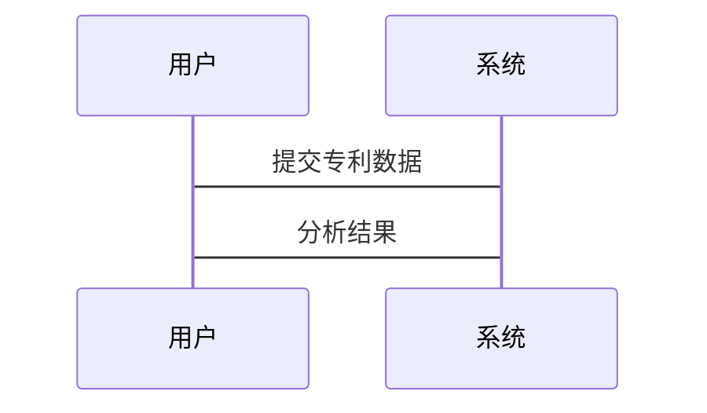

                 


# AI驱动的企业知识产权战略：专利组合分析与布局优化

## 关键词：人工智能、知识产权、专利组合、布局优化、技术趋势、竞争分析、企业战略

## 摘要：  
随着人工智能技术的迅速发展，企业知识产权管理面临着前所未有的挑战和机遇。本文通过分析AI在专利组合分析中的应用，探讨如何利用AI技术优化专利布局，提升企业的核心竞争力。

---

# 第1章: 企业知识产权战略概述

## 1.1 知识产权的基本概念  
### 1.1.1 知识产权的定义与范围  
知识产权是指对智力劳动成果的法律保护，主要包括专利权、商标权、著作权、商业秘密等。在企业中，知识产权不仅是核心竞争力的体现，也是防御竞争对手的重要手段。  

### 1.1.2 企业知识产权管理的重要性  
企业知识产权管理涉及专利申请、维护、评估和风险控制等多个方面。有效的知识产权管理可以帮助企业在技术研发中占据优势，同时避免侵权风险。  

### 1.1.3 知识产权在企业战略中的地位  
知识产权是企业技术布局的重要组成部分，尤其是在高科技行业，专利的数量和质量直接关系到企业的市场地位和盈利能力。  

---

## 1.2 AI技术对企业知识产权的影响  
### 1.2.1 AI技术的快速发展与知识产权保护  
AI技术的快速发展催生了大量创新，同时也带来了专利数量激增的问题。如何高效管理和分析这些专利成为企业的新挑战。  

### 1.2.2 企业知识产权管理的新挑战  
传统的企业知识产权管理依赖人工审查和分类，效率低下且成本高昂。AI技术的引入可以显著提升专利分析的效率和准确性。  

### 1.2.3 AI驱动知识产权战略的核心价值  
通过AI技术，企业可以实现专利组合的自动化分析、竞争对手监控以及技术趋势预测，从而制定更具前瞻性的知识产权战略。  

---

## 1.3 专利组合分析与布局优化的必要性  
### 1.3.1 专利组合的概念与特点  
专利组合是指一组相互关联的专利，覆盖企业核心技术和相关领域。其特点是覆盖面广、保护力度强，能够有效防御竞争对手的侵权行为。  

### 1.3.2 专利布局的核心目标  
专利布局的目标是通过合理分配专利申请的地域、技术领域和申请时间，最大化专利的价值和保护效果。  

### 1.3.3 AI在专利组合分析中的应用前景  
AI技术可以通过自然语言处理和机器学习，帮助企业快速识别技术热点和竞争对手的专利布局，从而优化自身的专利组合。  

---

## 1.4 本章小结  
本章从知识产权的基本概念出发，分析了AI技术对企业知识产权管理的影响，并重点探讨了专利组合分析与布局优化的必要性。通过AI技术的应用，企业可以更高效地管理知识产权，提升竞争力。

---

# 第2章: AI驱动的专利组合分析方法  

## 2.1 专利组合分析的基本原理  
### 2.1.1 专利组合的构成要素  
专利组合通常包括核心专利、外围专利和防御性专利。不同类型专利的组合可以覆盖更广泛的技术领域，增强企业的技术壁垒。  

### 2.1.2 专利组合的分类与特点  
专利组合可以根据技术领域、申请时间和保护范围进行分类。每种分类方式都有其独特的优缺点，企业需要根据自身需求选择合适的组合方式。  

### 2.1.3 专利组合分析的步骤与流程  
专利组合分析的流程通常包括数据采集、清洗、分类、关联分析和结果解读等步骤。  

---

## 2.2 AI技术在专利组合分析中的应用  
### 2.2.1 自然语言处理（NLP）在专利文本分析中的应用  
NLP技术可以帮助提取专利文本中的关键词和主题，从而实现自动化的分类和聚类。  

### 2.2.2 机器学习在专利分类与聚类中的应用  
机器学习算法（如K-means、LDA）可以用于专利的自动分类和主题建模，帮助识别技术热点和趋势。  

### 2.2.3 图论算法在专利关系网络中的应用  
通过构建专利之间的引用和相似性网络，可以发现技术关联性和潜在的竞争对手。  

---

## 2.3 专利组合分析的算法原理  
### 2.3.1 基于TF-IDF的文本挖掘算法  
TF-IDF（Term Frequency-Inverse Document Frequency）用于衡量关键词在文档中的重要性。其数学模型如下：  
$$ TF-IDF = \frac{TF \times ID} \times \log(N+1) $$  

### 2.3.2 基于K-means的聚类算法  
K-means算法用于将专利分成不同的技术类别。其目标函数为：  
$$ J = \sum_{i=1}^k \sum_{j=1}^n (x_j - c_i)^2 $$  

### 2.3.3 基于LDA的主题模型算法  
LDA（Latent Dirichlet Allocation）用于发现专利文本中的主题分布。其数学模型如下：  
$$ P(\text{topic}|\text{document}) = \frac{P(\text{document}| \text{topic}) \times P(\text{topic})}{P(\text{document})} $$  

---

## 2.4 本章小结  
本章详细介绍了AI驱动的专利组合分析方法，包括NLP、机器学习和图论算法的应用。通过这些技术，企业可以更高效地进行专利分析和布局优化。

---

# 第3章: 专利组合分析的核心算法实现  

## 3.1 基于TF-IDF的文本挖掘算法  
### 3.1.1 TF-IDF算法的数学模型  
TF-IDF算法用于衡量关键词的重要性，其计算公式为：  
$$ TF-IDF = \frac{TF \times ID} \times \log(N+1) $$  

### 3.1.2 TF-IDF算法的实现步骤  
1. 统计每个关键词在文档中的出现次数（TF）。  
2. 计算每个关键词的逆文档频率（IDF）。  
3. 结合TF和IDF得到TF-IDF值。  

### 3.1.3 TF-IDF算法在专利文本分析中的应用案例  
通过TF-IDF算法，可以识别出专利文本中的核心关键词，从而实现自动化的分类和聚类。  

---

## 3.2 基于K-means的聚类算法  
### 3.2.1 K-means算法的数学模型  
K-means算法的目标是最小化样本与簇中心的平方距离之和：  
$$ J = \sum_{i=1}^k \sum_{j=1}^n (x_j - c_i)^2 $$  

### 3.2.2 K-means算法的实现步骤  
1. 初始化簇中心。  
2. 计算每个样本到簇中心的距离，分配到最近的簇。  
3. 更新簇中心，重复步骤2和3直到收敛。  

### 3.2.3 K-means算法在专利分类中的应用案例  
通过K-means算法，可以将专利按照技术领域进行分类，帮助企业识别技术热点和趋势。  

---

## 3.3 基于LDA的主题模型算法  
### 3.3.1 LDA算法的数学模型  
LDA算法用于发现专利文本中的主题分布，其数学模型如下：  
$$ P(\text{topic}|\text{document}) = \frac{P(\text{document}| \text{topic}) \times P(\text{topic})}{P(\text{document})} $$  

### 3.3.2 LDA算法的实现步骤  
1. 初始化主题分布和词分布。  
2. 通过吉布斯采样更新主题和词分布。  
3. 输出主题模型。  

### 3.3.3 LDA算法在专利主题建模中的应用案例  
通过LDA算法，可以发现专利文本中的隐含主题，帮助企业识别技术领域的潜在机会和风险。  

---

## 3.4 本章小结  
本章详细介绍了专利组合分析的核心算法，包括TF-IDF、K-means和LDA算法的实现原理和应用案例。这些算法为企业提供了强大的工具来优化专利布局。

---

# 第4章: 专利组合分析的系统架构设计  

## 4.1 系统功能设计  
### 4.1.1 数据采集模块  
负责从专利数据库中获取专利文本和 metadata。  

### 4.1.2 数据处理模块  
对专利文本进行清洗、分词和特征提取。  

### 4.1.3 数据分析模块  
利用NLP和机器学习算法进行专利分类、聚类和主题建模。  

### 4.1.4 数据可视化模块  
将分析结果以图表形式展示，便于用户理解和决策。  

---

## 4.2 系统架构设计  
通过mermaid图展示系统架构，包括数据采集、处理、分析和可视化的模块设计，以及各模块之间的接口设计。  



---

## 4.3 系统交互设计  
通过mermaid序列图展示系统交互流程，包括用户请求分析、系统处理和结果反馈。  



---

## 4.4 本章小结  
本章详细介绍了专利组合分析系统的架构设计，包括功能模块、系统交互和架构图的展示。通过系统化的设计，企业可以更高效地进行专利管理。

---

# 第5章: 项目实战——AI驱动的专利组合分析  

## 5.1 环境安装与配置  
### 5.1.1 安装Python和相关库  
安装Python和自然语言处理库（如NLTK、spaCy）以及机器学习库（如scikit-learn、Gensim）。  

### 5.1.2 数据集获取与预处理  
从专利数据库获取专利文本，并进行清洗和分词处理。  

---

## 5.2 核心算法实现  
### 5.2.1 TF-IDF算法实现  
编写Python代码实现TF-IDF算法，提取专利文本中的关键词。  

```python
from sklearn.feature_extraction.text import TfidfVectorizer

vectorizer = TfidfVectorizer()
tfidf = vectorizer.fit_transform(documents)
```

### 5.2.2 K-means算法实现  
使用scikit-learn库实现K-means聚类算法，对专利进行分类。  

```python
from sklearn.cluster import KMeans

kmeans = KMeans(n_clusters=5)
clusters = kmeans.fit_predict(tfidf)
```

### 5.2.3 LDA算法实现  
使用Gensim库实现LDA主题建模，发现专利文本中的隐含主题。  

```python
from gensim.models import LdaModel
from gensim.corpora import Dictionary

dictionary = Dictionary(documents)
corpus = [dictionary.doc2bow(doc) for doc in documents]
lda_model = LdaModel(corpus, num_topics=10, id2word=dictionary)
```

---

## 5.3 案例分析与结果解读  
以AI技术领域的专利分析为例，展示算法实现和分析结果。通过TF-IDF提取关键词、K-means进行分类、LDA发现主题，帮助企业识别技术热点和趋势。  

---

## 5.4 本章小结  
本章通过一个实际案例展示了AI驱动的专利组合分析的实现过程，包括环境安装、算法实现和结果解读。这些方法可以帮助企业优化专利布局，提升竞争力。

---

# 第6章: 总结与展望  

## 6.1 本章总结  
本文详细探讨了AI驱动的企业知识产权战略，特别是专利组合分析与布局优化的方法。通过自然语言处理、机器学习和图论算法的应用，企业可以更高效地管理知识产权，提升核心竞争力。

---

## 6.2 未来展望  
随着AI技术的不断发展，专利组合分析将更加智能化和自动化。未来的研究方向包括更精准的主题建模、实时监控技术趋势以及动态优化专利布局。  

---

## 6.3 最佳实践tips  
- 定期进行专利组合分析，及时调整布局策略。  
- 结合企业实际需求选择合适的AI算法和技术工具。  
- 建立专业的知识产权管理团队，确保分析结果的有效应用。  

---

## 6.4 本章小结  
本文总结了AI驱动的企业知识产权战略的核心内容，并展望了未来的研究方向和实际应用中的挑战。通过最佳实践的分享，帮助企业更好地利用AI技术优化知识产权管理。

---

# 参考文献  
（此处列出相关文献和资源，如专利数据库、AI算法研究论文等）

---

# 结语  
通过本文的探讨，我们希望读者能够了解AI在企业知识产权战略中的重要作用，并掌握如何利用AI技术优化专利组合分析与布局优化。未来，随着AI技术的进一步发展，企业知识产权管理将更加智能化和高效化，为企业创造更大的价值。

