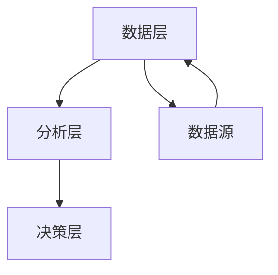

                 


# AI驱动的企业知识产权战略：专利组合分析与布局优化

---

## 关键词：人工智能、知识产权、专利组合分析、布局优化、企业战略

---

## 摘要：  
随着人工智能（AI）技术的快速发展，企业知识产权管理正面临前所未有的变革。AI不仅能够提高专利分析的效率，还能通过深度学习和大数据分析，为企业制定更科学的专利组合策略提供支持。本文将从AI驱动的专利组合分析与布局优化入手，探讨如何利用AI技术提升企业知识产权战略的竞争力。文章首先介绍专利组合分析的核心概念，然后分析AI在专利布局优化中的应用，最后结合实际案例，总结AI驱动的知识产权战略对企业创新的推动作用。

---

## 第1章：AI与知识产权的结合

### 1.1 知识产权在企业中的重要性  
知识产权是企业核心竞争力的体现，涵盖专利、商标、版权等多个领域。在数字化时代，技术的快速迭代和市场竞争的加剧，使得知识产权管理的重要性愈发凸显。  

#### 1.1.1 知识产权的核心概念  
知识产权是指对智力成果的法律保护，包括专利权、商标权、著作权等。其中，专利权是企业技术创新的核心载体，也是市场竞争的重要武器。  

#### 1.1.2 企业知识产权管理的关键环节  
企业知识产权管理通常包括专利申请、维护、检索、分析和布局优化等环节。这些环节需要结合技术、法律和商业目标进行综合考量。  

#### 1.1.3 AI技术在知识产权管理中的应用潜力  
AI技术可以通过自然语言处理（NLP）、机器学习和大数据分析，帮助企业在专利检索、分析和布局优化中提高效率和准确性。  

---

### 1.2 AI驱动的知识产权战略背景  
随着全球化的深入和技术的飞速发展，企业的知识产权管理面临新的挑战和机遇。AI技术的应用为企业提供了更高效、更精准的知识产权管理工具。  

#### 1.2.1 知识经济时代的企业竞争  
在知识经济时代，企业之间的竞争 increasingly revolves around技术积累和创新能力。知识产权已成为企业核心竞争力的重要组成部分。  

#### 1.2.2 AI技术对企业创新的推动  
AI技术不仅可以加速技术创新，还能通过数据分析和预测，帮助企业制定更科学的知识产权战略。  

#### 1.2.3 专利组合分析与布局优化的必要性  
专利组合分析是企业知识产权管理的重要环节，通过分析专利的技术分布、法律状态和市场价值，帮助企业优化专利布局，降低风险，提升竞争力。  

---

## 第2章：专利组合分析的核心概念

### 2.1 专利组合的基本定义  
专利组合是指一组相互关联的专利，通常围绕某一技术领域或产品线展开。专利组合的价值不仅体现在数量上，更体现在质量和技术覆盖范围上。  

#### 2.1.1 专利组合的概念与特点  
- **概念**：专利组合是企业在特定技术领域内布局的一组专利，旨在覆盖核心技术及其相关技术。  
- **特点**：技术关联性强、覆盖范围广、防御性强。  

#### 2.1.2 专利组合的分类与应用场景  
专利组合可以分为防御型、进攻型和平衡型三种类型，分别适用于不同的竞争环境和技术战略。  

#### 2.1.3 专利组合分析的必要性  
专利组合分析帮助企业识别核心专利、评估技术风险，并制定更有效的专利布局策略。  

---

### 2.2 专利组合分析的关键指标  
专利组合分析需要综合考虑多个指标，包括专利数量、质量、技术覆盖范围和法律状态等。  

#### 2.2.1 专利数量与质量的平衡  
专利数量多并不一定意味着价值高，关键在于专利的质量和技术关联性。  

#### 2.2.2 专利覆盖范围的评估  
通过技术分解和地图分析，可以评估专利组合在技术领域的覆盖范围和竞争对手的对比情况。  

#### 2.2.3 专利技术的关联性分析  
专利组合的技术关联性可以通过图论和网络分析方法进行评估，帮助企业识别技术核心和潜在风险。  

---

### 2.3 专利组合分析的流程与方法  
专利组合分析需要结合数据采集、技术分解和可视化等步骤，确保分析结果的准确性和可操作性。  

#### 2.3.1 数据收集与预处理  
- 数据来源：公开专利数据库、企业内部专利档案。  
- 数据清洗：去重、格式化、标注。  

#### 2.3.2 技术分解与分类  
- 技术分解：将专利技术分解为基本技术单元。  
- 分类方法：基于关键词、技术代码或相似度算法。  

#### 2.3.3 可视化与分析工具  
- 可视化工具：技术地图、网络图、矩阵图。  
- 分析工具：Python的网络分析库（如NetworkX）、机器学习算法（如聚类分析）。  

---

## 第3章：AI驱动的专利布局优化

### 3.1 专利布局的基本原理  
专利布局是指企业在特定技术领域内，通过合理分配专利资源，最大化专利的价值和防御能力。  

#### 3.1.1 专利布局的定义与目标  
- **定义**：专利布局是企业在技术领域内对专利资源的规划和配置。  
- **目标**：覆盖核心技术、防御竞争对手、提升市场地位。  

#### 3.1.2 专利布局的策略与方法  
- **进攻型布局**：主动申请核心专利，形成技术壁垒。  
- **防御型布局**：通过防御性专利减少被诉讼风险。  

#### 3.1.3 专利布局的动态调整  
专利布局需要根据技术发展和市场竞争的变化进行动态调整，以保持竞争优势。  

---

### 3.2 AI在专利布局优化中的应用  
AI技术可以通过数据分析和预测模型，优化专利布局的策略和效果。  

#### 3.2.1 数据挖掘与预测模型  
- 数据挖掘：从专利数据中提取技术趋势和竞争对手信息。  
- 预测模型：基于机器学习算法，预测技术发展方向和专利价值。  

#### 3.2.2 技术趋势分析与布局优化  
- 技术趋势分析：利用文本挖掘和主题模型，识别技术热点和未来趋势。  
- 布局优化：根据技术趋势调整专利布局策略，抢占技术制高点。  

#### 3.2.3 竞争对手分析与应对策略  
- 竞争对手分析：通过AI技术识别竞争对手的核心专利和布局策略。  
- 应对策略：制定差异化布局策略，避免与竞争对手直接冲突。  

---

### 3.3 专利布局优化的数学模型  
基于AI的专利布局优化模型可以通过数学建模和算法实现。  

#### 3.3.1 基于AI的优化模型构建  
- 模型目标：最大化专利布局的覆盖范围和防御能力。  
- 模型约束：资源限制、技术关联性、市场竞争环境。  

#### 3.3.2 优化算法的实现与应用  
- 算法选择：遗传算法、模拟退火、蚁群算法等。  
- 应用场景：技术领域选择、专利申请顺序优化、防御性专利配置。  

#### 3.3.3 案例分析与结果解读  
- 案例背景：某企业在人工智能领域的专利布局优化。  
- 分析结果：通过AI优化模型，企业成功识别了技术核心和潜在风险。  

---

## 第4章：AI驱动的专利组合分析与布局优化的系统架构

### 4.1 系统功能设计  
AI驱动的专利组合分析与布局优化系统通常包括数据采集、技术分析和优化布局三个模块。  

#### 4.1.1 数据采集与处理模块  
- 功能：从专利数据库中提取数据，清洗和标注。  
- 工具：Python的pandas库、SQL数据库。  

#### 4.1.2 技术分析与预测模块  
- 功能：利用NLP和机器学习技术，分析专利技术趋势和竞争对手策略。  
- 工具：spaCy、Gensim、Scikit-learn。  

#### 4.1.3 优化布局与决策支持模块  
- 功能：基于优化模型和算法，生成专利布局建议。  
- 工具：Mathematica、Python的优化库（如Cvxpy）。  

---

### 4.2 系统架构设计  
AI驱动的专利组合分析与布局优化系统通常采用分层架构，包括数据层、分析层和决策层。  

#### 4.2.1 系统架构图（Mermaid）  


---

### 4.3 系统接口设计  
系统接口通常包括数据输入、分析结果输出和用户交互界面。  

#### 4.3.1 数据接口  
- 数据输入：专利数据、技术关键词。  
- 数据输出：优化布局建议、技术趋势报告。  

#### 4.3.2 用户交互界面  
- 界面设计：可视化分析结果、布局优化建议、竞争对手分析。  

---

## 第5章：项目实战与案例分析

### 5.1 项目背景介绍  
以某人工智能企业在专利布局优化中的实际项目为例，介绍AI技术在专利组合分析与布局优化中的应用。  

#### 5.1.1 项目目标  
- 提高专利布局的效率和效果。  
- 降低专利布局的成本和风险。  

#### 5.1.2 项目实施步骤  
1. 数据采集与预处理。  
2. 技术分析与预测。  
3. 布局优化与决策支持。  

---

### 5.2 项目核心实现源代码  
以下是项目的核心实现代码示例：  

```python
import pandas as pd
from sklearn.feature_extraction.text import TfidfVectorizer
from sklearn.decomposition import NMF

# 数据预处理
 patents = pd.read_csv('patents.csv')
 patents['abstract'] = patents['abstract'].fillna('')

# TF-IDF提取关键词
vectorizer = TfidfVectorizer(max_features=100)
tfidf = vectorizer.fit_transform(patents['abstract'])

# NMF主题建模
nmf = NMF(n_components=5, random_state=42)
nmf.fit(tfidf)

# 输出主题关键词
for topic_idx, topic in enumerate(nmf.components_):
    print(f"主题 {topic_idx}:")
    print(" ".join([vectorizer.get_feature_names_out()[i] for i in topic.argsort()[-5:]]))
```

---

### 5.3 案例分析与结果解读  
通过实际案例分析，展示AI技术在专利组合分析与布局优化中的实际应用效果。  

#### 5.3.1 技术趋势分析  
通过主题建模和网络分析，识别技术热点和未来趋势。  

#### 5.3.2 布局优化建议  
根据优化模型的结果，制定差异化的专利布局策略。  

---

## 第6章：总结与展望

### 6.1 本章总结  
AI技术正在深刻改变企业知识产权管理的方式，专利组合分析与布局优化是其中的重要应用。通过AI技术，企业可以更高效地制定知识产权战略，提升核心竞争力。  

### 6.2 未来展望  
随着AI技术的不断发展，专利组合分析与布局优化将更加智能化和个性化。企业需要持续关注技术发展，充分利用AI工具，制定更具前瞻性的知识产权战略。

---

## 小结  
通过本文的分析，我们可以看到，AI技术为企业知识产权管理提供了强大的工具和方法。专利组合分析与布局优化的结合，不仅提高了管理效率，还为企业创新提供了有力支持。未来，随着AI技术的进一步发展，企业知识产权管理将更加智能化和数据化。

