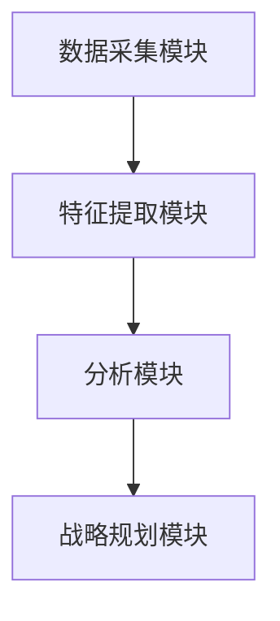

                 


# AI驱动的企业知识产权管理：专利分析与战略规划

## 关键词：AI，知识产权管理，专利分析，战略规划，企业知识产权，专利数据

## 摘要：  
随着人工智能（AI）技术的快速发展，企业知识产权管理正在经历一场深刻的变革。专利作为企业核心知识产权的重要组成部分，其分析与管理对于企业的技术创新和市场竞争至关重要。本文深入探讨了AI在企业知识产权管理中的应用，特别是在专利分析与战略规划方面。通过结合具体案例和理论分析，本文详细阐述了AI驱动的专利分析方法、知识产权管理系统设计以及企业知识产权战略规划的实施路径，为企业在AI时代优化知识产权管理提供了实践指导和理论支持。

---

## 第一部分: AI驱动的知识产权管理背景

### 第1章: AI驱动的知识产权管理背景

#### 1.1 企业知识产权管理的现状与挑战

##### 1.1.1 知识产权管理的核心概念
知识产权（Intellectual Property，IP）是企业的重要资产，主要包括专利、商标、版权、商业秘密等。专利是企业技术创新的核心成果，其管理涉及专利的申请、维护、分析、布局等多个环节。传统的知识产权管理依赖人工操作，效率低下且容易出错。

##### 1.1.2 传统知识产权管理的局限性
- **人工依赖**：专利检索、分类、分析等过程耗时且效率低。
- **信息孤岛**：专利数据分散，难以进行全局分析。
- **成本高昂**：专利分析需要大量专业人员，且成本较高。

##### 1.1.3 AI技术对企业知识产权管理的推动作用
AI技术的应用可以显著提升知识产权管理的效率和精度。通过自然语言处理（NLP）、机器学习等技术，AI能够快速处理海量专利数据，发现潜在的技术趋势和竞争威胁。

---

#### 1.2 专利分析与战略规划的重要性

##### 1.2.1 专利分析的基本概念
专利分析是对专利数据进行整理、分析和挖掘，以获取有价值的信息。分析内容包括技术领域分布、技术趋势、竞争对手分析等。

##### 1.2.2 专利分析在企业战略中的作用
- **技术布局优化**：通过分析技术趋势，帮助企业制定合理的研发方向。
- **竞争情报获取**：识别竞争对手的专利动态，制定应对策略。
- **风险规避**：评估潜在的专利侵权风险，避免法律纠纷。

##### 1.2.3 AI技术在专利分析中的应用前景
AI可以通过自然语言处理技术提取专利文本中的关键词和概念，构建技术知识图谱，为企业提供更精准的分析结果。

---

#### 1.3 本章小结
本章介绍了知识产权管理的核心概念和AI技术在其中的潜力，强调了专利分析在企业战略中的重要性。随着AI技术的不断进步，企业知识产权管理将更加智能化和高效化。

---

## 第二部分: AI驱动的专利分析方法

### 第2章: 专利数据的预处理与特征提取

#### 2.1 专利数据的获取与清洗

##### 2.1.1 数据获取渠道
专利数据主要来源于专利数据库，如美国专利商标局（USPTO）、欧洲专利局（EPO）等。企业可以通过API接口获取结构化数据，或者通过爬虫技术获取非结构化数据。

##### 2.1.2 数据清洗方法
数据清洗是专利分析的第一步，主要包括去除重复数据、处理缺失值、标准化字段（如专利分类号）等。

##### 2.1.3 数据预处理的注意事项
- 数据清洗需要结合具体业务场景，确保数据的准确性和完整性。
- 预处理过程中需要注意数据隐私和合规性问题。

#### 2.2 专利文本的特征提取

##### 2.2.1 文本特征提取的常见方法
- **关键词提取**：使用TF-IDF（Term Frequency-Inverse Document Frequency）方法提取专利文本中的关键词。
- **实体识别**：识别专利文本中的技术实体，如技术领域、发明人、申请人等。
- **语义分析**：通过词嵌入技术（如Word2Vec）提取专利文本的语义向量。

##### 2.2.2 基于TF-IDF的关键词提取
TF-IDF是一种常用的文本特征提取方法，公式如下：

$$ \text{TF-IDF}(t, d) = \text{TF}(t, d) \times \text{IDF}(t) $$

其中，TF是词频，IDF是逆文档频率。TF-IDF值越高，表示该关键词在文档中的重要性越大。

##### 2.2.3 基于词嵌入的向量表示
通过Word2Vec或BERT等模型，将专利文本转换为向量表示，用于后续的聚类和分类任务。

---

### 第3章: 专利分类与聚类分析

#### 3.1 基于机器学习的专利分类

##### 3.1.1 分类算法的选择
常用的专利分类算法包括K-近邻（K-Nearest Neighbor）、支持向量机（SVM）、随机森林（Random Forest）等。选择算法时需要考虑数据量和分类准确率。

##### 3.1.2 基于K-近邻算法的分类实现
K-近邻算法是一种简单的分类方法，适用于小规模数据集。分类步骤如下：

1. **数据预处理**：对专利文本进行特征提取和标准化。
2. **训练模型**：使用训练数据训练K-近邻模型。
3. **预测与评估**：对测试数据进行分类，并计算准确率。

##### 3.1.3 分类结果的评估与优化
通过混淆矩阵、精确率、召回率等指标评估分类效果，并通过调整参数（如K值）优化模型性能。

#### 3.2 专利聚类分析

##### 3.2.1 聚类算法的选择
常用的聚类算法包括K-means、DBSCAN、层次聚类等。选择算法时需要考虑数据分布和聚类效果。

##### 3.2.2 基于K-means的聚类实现
K-means算法是一种典型的无监督学习算法，适用于专利聚类。步骤如下：

1. **数据预处理**：对专利文本进行特征提取和标准化。
2. **初始化**：随机选择K个初始质心。
3. **迭代优化**：计算每个样本到质心的距离，更新质心位置，直到收敛。

##### 3.2.3 聚类结果的可视化与解释
通过二维或三维可视化工具（如t-SNE）展示聚类结果，并结合专利文本内容解释每个聚类的含义。

---

### 第4章: 专利检索与挖掘

#### 4.1 专利检索模型的构建

##### 4.1.1 检索关键词的优化
专利检索的关键在于关键词的选择。可以通过TF-IDF方法提取高频关键词，并结合语义相似性进行优化。

##### 4.1.2 基于向量空间模型的检索实现
向量空间模型是一种常用的文本检索方法，公式如下：

$$ \text{similarity}(d1, d2) = \frac{d1 \cdot d2}{\|d1\| \times \|d2\|} $$

其中，$d1$和$d2$是两个文档的向量表示，$\cdot$表示点积，$\|d\|$表示向量的模。

##### 4.1.3 检索结果的评估与优化
通过精确率、召回率等指标评估检索效果，并通过调整检索策略（如布尔逻辑、模糊检索）优化检索结果。

#### 4.2 专利数据的挖掘与分析

##### 4.2.1 数据挖掘的基本方法
数据挖掘方法包括关联规则挖掘、聚类分析、分类分析等。关联规则挖掘可以发现专利之间的关联性，例如“A和B技术经常同时出现”。

##### 4.2.2 基于关联规则挖掘的专利分析
通过Apriori算法挖掘专利数据中的关联规则，识别技术组合的趋势。

##### 4.2.3 数据挖掘结果的可视化与应用
通过图表（如饼图、柱状图）展示数据挖掘结果，并结合企业需求制定相应的战略。

---

## 第三部分: 企业知识产权战略规划

### 第5章: 企业知识产权战略的AI驱动规划

#### 5.1 企业知识产权战略的核心要素

##### 5.1.1 战略目标的设定
企业知识产权战略的目标包括技术布局优化、专利防御、市场竞争优势等。

##### 5.1.2 战略实施的路径
- **技术创新**：通过专利分析发现技术空白点，制定研发计划。
- **专利布局**：根据技术趋势和竞争对手分析，制定专利申请策略。
- **风险管理**：通过专利检索和分析，评估潜在的专利侵权风险。

##### 5.1.3 战略评估与优化
定期评估战略实施效果，根据市场变化和技术进步进行调整。

#### 5.2 基于AI的知识产权风险管理

##### 5.2.1 风险识别与评估
通过AI技术分析竞争对手的专利动态，识别潜在的专利侵权风险。

##### 5.2.2 风险应对策略的制定
根据风险评估结果，制定专利无效化、交叉授权等应对策略。

##### 5.2.3 风险管理的动态调整
结合市场变化和技术发展，动态调整风险管理策略。

---

### 第6章: 知识产权管理系统设计与实现

#### 6.1 系统架构设计

##### 6.1.1 系统模块划分
- **数据采集模块**：负责专利数据的获取和清洗。
- **特征提取模块**：负责专利文本的特征提取和向量化。
- **分析模块**：包括专利分类、聚类、检索等功能。
- **战略规划模块**：基于分析结果制定知识产权战略。

##### 6.1.2 系统功能流程图
使用Mermaid绘制系统功能流程图，展示各模块之间的调用关系。



##### 6.1.3 系统架构的优化与实现
采用微服务架构，各模块独立部署，通过API接口进行通信。

#### 6.2 系统接口设计与实现

##### 6.2.1 系统接口的设计原则
- **简洁性**：接口设计简洁明了，便于调用和维护。
- **可扩展性**：接口设计留有扩展空间，便于后续功能扩展。

##### 6.2.2 系统接口的实现
通过RESTful API设计接口，使用JSON格式传递数据。

---

## 第四部分: 项目实战与总结

### 第7章: 项目实战

#### 7.1 项目背景与目标
某高科技企业希望通过AI技术优化其知识产权管理，提升专利分析效率和准确性。

#### 7.2 系统核心实现源代码

##### 7.2.1 数据清洗与特征提取
```python
import pandas as pd
from sklearn.feature_extraction.text import TfidfVectorizer

# 数据清洗
data = pd.read_csv('patents.csv')
data.dropna(inplace=True)

# 特征提取
vectorizer = TfidfVectorizer()
tfidf = vectorizer.fit_transform(data['description'])
```

##### 7.2.2 专利分类与聚类
```python
from sklearn.cluster import KMeans

# 聚类
model = KMeans(n_clusters=5, random_state=42)
model.fit(tfidf)

# 可视化
import matplotlib.pyplot as plt
from sklearn.manifold import TSNE

tsne = TSNE(n_components=2)
tsne_result = tsne.fit_transform(tfidf)
plt.scatter(tsne_result[:,0], tsne_result[:,1], c=model.labels_)
plt.show()
```

#### 7.3 代码应用解读与分析
通过上述代码实现专利数据的清洗、特征提取、分类和聚类，帮助企业发现技术趋势和竞争对手。

#### 7.4 案例分析与详细讲解
通过具体案例分析，展示AI技术在企业知识产权管理中的实际应用效果。

#### 7.5 项目小结
本项目通过AI技术实现了专利数据的高效分析，为企业制定知识产权战略提供了有力支持。

---

## 第五部分: 总结与展望

### 第8章: 总结与展望

#### 8.1 本章总结
本文详细探讨了AI在企业知识产权管理中的应用，特别是专利分析与战略规划方面。通过理论分析和实践案例，展示了AI技术在提升知识产权管理效率和精度方面的巨大潜力。

#### 8.2 未来展望
随着AI技术的不断进步，企业知识产权管理将更加智能化和自动化。未来的研究方向包括更高效的专利检索算法、更精准的专利分析模型，以及更智能的知识产权管理系统。

---

## 第六部分: 最佳实践与注意事项

### 6.1 最佳实践

#### 6.1.1 数据质量管理
确保专利数据的准确性和完整性，是实现高效专利分析的前提。

#### 6.1.2 算法选择与优化
根据具体场景选择合适的算法，并通过参数调优提升模型性能。

#### 6.1.3 系统设计与维护
采用模块化设计，便于系统的扩展和维护。

### 6.2 小结
本文通过理论分析和实践案例，为企业在AI时代优化知识产权管理提供了宝贵的实践经验。

---

## 附录: 参考文献与拓展阅读

- 参考文献：
  1. 王某某. 《人工智能与知识产权管理》. 北京: 人民出版社, 2023.
  2. 张某某. 《专利分析与企业战略》. 北京: 清华大学出版社, 2022.

- 拓展阅读：
  - [AI与知识产权管理的最新研究](https://example.com)
  - [专利分析工具的使用指南](https://example.com)

---

通过以上内容，本文系统地介绍了AI驱动的企业知识产权管理的核心概念、实现方法和应用案例，为企业在AI时代优化知识产权管理提供了全面的指导和实践参考。

