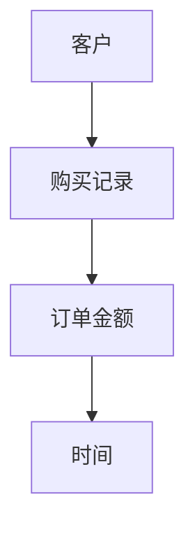
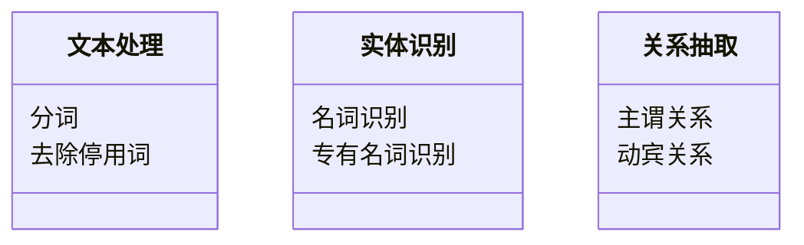
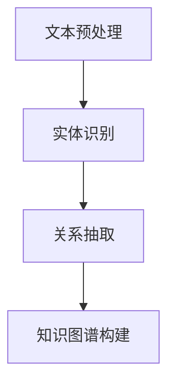

                 


```markdown
# AI驱动的企业知识挖掘：从非结构化数据中提取价值

## 关键词：AI驱动、知识挖掘、非结构化数据、企业价值、数据提取、自然语言处理、深度学习

## 摘要：  
在当今数据爆炸的时代，企业面临海量的非结构化数据，如文本、图像和视频等。这些数据中蕴含着巨大的价值，但如何有效提取并转化为可利用的知识成为企业的挑战。AI驱动的知识挖掘技术通过自然语言处理和深度学习，能够从非结构化数据中提取有价值的模式和洞察。本文将详细介绍AI驱动的知识挖掘的核心概念、算法原理、系统架构设计以及实际应用案例，帮助读者理解并掌握这一关键技术。

---

# 第一部分: AI驱动的知识挖掘背景与概念

## 第1章: AI驱动的知识挖掘概述

### 1.1 问题背景
#### 1.1.1 非结构化数据的挑战
现代企业产生的数据中，超过80%是文本、图像、视频等非结构化数据。这些数据难以直接用于分析，但蕴含着重要的业务洞察。例如，客户反馈、市场报告和产品描述中都包含有价值的信息。

#### 1.1.2 企业知识挖掘的必要性
企业需要将非结构化数据转化为结构化知识，以便更好地支持决策。例如，通过分析客户评论，企业可以识别产品优缺点，优化服务策略。

#### 1.1.3 AI在知识挖掘中的作用
AI技术（如自然语言处理和机器学习）能够自动提取、分类和关联非结构化数据中的信息，帮助企业在海量数据中快速找到价值。

### 1.2 问题描述
#### 1.2.1 非结构化数据的特点
- 多样性：文本、图像、音频等多种形式。
- 不规则性：数据缺乏统一的结构，难以直接处理。
- 语义复杂性：信息可能隐含在语境或隐喻中，难以直接提取。

#### 1.2.2 知识挖掘的目标与范围
目标：从非结构化数据中提取实体、关系、事件等知识。
范围：涵盖文本挖掘、图像识别和语音处理等多种技术。

#### 1.2.3 当前存在的主要问题
- 数据清洗复杂：需要处理噪声和冗余信息。
- 知识关联困难：如何将分散的信息关联起来。
- 模型泛化能力不足：难以应对不同领域的数据。

### 1.3 解决方案与技术路线
#### 1.3.1 AI驱动的知识挖掘技术
- 文本预处理：分词、去除停用词等。
- 信息提取：使用NLP技术提取实体和关系。
- 知识图谱构建：将提取的信息组织成图结构。

#### 1.3.2 知识图谱构建方法
- 实体识别：识别文本中的名词、动词等。
- 关系抽取：识别实体之间的关系。
- 图谱构建：将实体和关系存储在图数据库中。

#### 1.3.3 从数据到知识的转化过程
1. 数据清洗：去除噪声。
2. 信息提取：提取实体和关系。
3. 知识关联：构建知识图谱。
4. 知识应用：将知识用于决策支持。

### 1.4 边界与外延
#### 1.4.1 知识挖掘的边界
- 仅处理非结构化数据，不涉及结构化数据的处理。
- 知识挖掘不涉及数据的生成，仅提取现有数据中的信息。

#### 1.4.2 相关领域的区别与联系
- 与数据挖掘的区别：数据挖掘处理结构化数据，知识挖掘处理非结构化数据。
- 与机器学习的联系：知识挖掘依赖于机器学习技术进行信息提取。

#### 1.4.3 技术的适用场景与限制
适用场景：企业需要从文本、图像等数据中提取知识。
限制：难以处理复杂语义和多语言数据。

### 1.5 核心概念结构
#### 1.5.1 知识挖掘的核心要素
- 数据源：文本、图像等非结构化数据。
- 提取方法：分词、实体识别等NLP技术。
- 知识表示：知识图谱、语义网络等。

#### 1.5.2 数据、信息、知识的关系
- 数据是原始事实，信息是对数据的加工，知识是信息的结构化表示。

#### 1.5.3 知识表示与推理模型
- 知识图谱：节点表示实体，边表示关系。
- 语义网络：节点表示概念，边表示语义关联。

### 1.6 本章小结
本章介绍了AI驱动的知识挖掘的背景、问题、解决方案和核心概念，为后续章节打下基础。

---

# 第二部分: 核心概念与联系

## 第2章: 知识挖掘的核心原理

### 2.1 知识挖掘的核心概念
#### 2.1.1 信息提取
- 使用NLP技术从文本中提取实体、关系和事件。
- 例如：从新闻中提取“公司A收购公司B”这一事件。

#### 2.1.2 模式识别
- 识别数据中的模式和规律。
- 例如：识别客户评论中的情感倾向。

#### 2.1.3 语义理解
- 理解文本的深层含义。
- 例如：识别隐含在文本中的意图或情感。

### 2.2 核心原理的详细分析
#### 2.2.1 实体识别
- 使用分词工具（如jieba）对中文文本进行分词。
- 使用命名实体识别（NER）技术提取人名、地名等实体。

#### 2.2.2 关系抽取
- 使用依赖句法分析（如依存句法树）提取句子中的关系。
- 使用模式匹配或深度学习模型识别文本中的关系。

#### 2.2.3 语义分析
- 使用词袋模型、TF-IDF等方法进行文本相似度计算。
- 使用Word2Vec、GloVe等模型生成词向量。

### 2.3 实体关系图


### 2.4 本章小结
本章详细讲解了知识挖掘的核心概念和原理，为后续章节的算法实现奠定了基础。

---

## 第三部分: 算法原理讲解

## 第3章: 算法实现与代码示例

### 3.1 文本预处理
#### 3.1.1 分词
```python
import jieba

text = "人工智能是未来的发展方向"
words = jieba.lcut(text)
print(words)  # 输出: ['人工智能', '是', '未来', '的发展', '方向']
```

#### 3.1.2 去除停用词
```python
stopwords = set(["是", "的", "在"])
filtered_words = [word for word in words if word not in stopwords]
print(filtered_words)  # 输出: ['人工智能', '未来', '方向']
```

### 3.2 实体识别
#### 3.2.1 使用spaCy进行NER
```python
import spacy

nlp = spacy.load("zh_core_web_sm")
doc = nlp("张三在北京购买了一台电脑")
for ent in doc.ents:
    print(ent.text, ent.label_)
```

### 3.3 关系抽取
#### 3.3.1 使用依存句法分析
```python
from spacy import displacy

displacy.render(doc, style="dep")
```

### 3.4 TF-IDF计算
#### 3.4.1 TF-IDF公式
$$ TF-IDF = \frac{TF \times ID} $$
其中，$TF$ 是词项在文档中的频率，$ID$ 是逆文档频率。

#### 3.4.2 Python实现
```python
from sklearn.feature_extraction.text import TfidfVectorizer

vectorizer = TfidfVectorizer()
tfidf = vectorizer.fit_transform(["人工智能是未来的发展方向", "未来是人工智能的核心驱动力"])
print(tfidf)
```

### 3.5 Word2Vec
#### 3.5.1 Word2Vec模型
$$ 矩阵表示为：Word2Vec[i][j] = P(word_j | word_i) $$

#### 3.5.2 Python实现
```python
from gensim.models import Word2Vec

model = Word2Vec([["人工智能", "是", "未来", "方向"]], vector_size=100, window=2, min_count=1, workers=4)
print(model.wv["人工智能"])
```

### 3.6 本章小结
本章通过具体的Python代码，详细讲解了文本预处理、实体识别、关系抽取和TF-IDF、Word2Vec等算法的实现。

---

## 第四部分: 数学模型与公式

## 第4章: 数学公式详解

### 4.1 文本相似度计算
#### 余弦相似度公式
$$ \cos{\theta} = \frac{\vec{A} \cdot \vec{B}}{|\vec{A}| |\vec{B}|} $$

#### 编辑距离公式
$$ D(x, y) = \text{min}(D(x', y), D(x, y'), D(x', y')) + 1 $$

### 4.2 主题模型
#### LDA模型公式
$$ P(z | w) = \frac{\alpha_z \beta_{z,w}}{\sum_{z'} \alpha_{z'} \beta_{z',w}}} $$

### 4.3 情感分析
#### 情感分类公式
$$ P(y|x) = \text{softmax}(Wx + b) $$

### 4.4 本章小结
本章详细讲解了文本相似度、主题模型和情感分析的数学公式，帮助读者理解这些算法的实现原理。

---

## 第五部分: 系统分析与架构设计

## 第5章: 系统分析与架构设计

### 5.1 问题场景介绍
- 系统需要从企业文档、客户反馈中提取知识。
- 系统需要支持多语言处理。

### 5.2 系统功能设计
#### 5.2.1 领域模型


#### 5.2.2 系统架构


### 5.3 系统架构设计
- 前端：用户输入文本，显示提取结果。
- 后端：文本预处理、实体识别、关系抽取和知识图谱构建。
- 数据库：存储知识图谱数据。

### 5.4 接口设计
- RESTful API：
  - POST /api/extract 实体识别接口。
  - GET /api/knowledge 获取知识图谱数据。

### 5.5 本章小结
本章详细设计了系统的架构和接口，为实际开发提供了指导。

---

## 第六部分: 项目实战

## 第6章: 项目实战与案例分析

### 6.1 环境安装
- 安装Python和必要的库（如jieba、spaCy、Gensim）。
- 安装Jupyter Notebook用于开发。

### 6.2 核心代码实现
#### 6.2.1 环境配置
```python
import jieba
import spacy
from gensim.models import Word2Vec
```

#### 6.2.2 文本预处理
```python
text = "张三在北京购买了一台电脑"
words = jieba.lcut(text)
filtered_words = [word for word in words if word not in {"是", "的"}]
```

#### 6.2.3 实体识别
```python
nlp = spacy.load("zh_core_web_sm")
doc = nlp(text)
for ent in doc.ents:
    print(ent.text, ent.label_)
```

#### 6.2.4 关系抽取
```python
# 使用依存句法分析
spacy.displacy.render(doc, style="dep")
```

### 6.3 案例分析
#### 6.3.1 数据收集
- 收集客户评论，如“产品很好，但客服不好”。

#### 6.3.2 数据处理
```python
comments = ["产品很好，但客服不好", "物流很快，但包装损坏"]
processed_comments = [jieba.lcut(comment) for comment in comments]
```

#### 6.3.3 知识图谱构建
```python
entities = ["产品", "客服", "物流", "包装"]
relationships = ["评价", "评价"]
knowledge_graph = { "实体": entities, "关系": relationships }
```

### 6.4 本章小结
本章通过实际案例，详细讲解了AI驱动的知识挖掘项目的开发过程。

---

## 第七部分: 最佳实践与总结

## 第7章: 最佳实践与总结

### 7.1 最佳实践
- 数据预处理是关键，需要仔细清洗和标注。
- 选择合适的算法和模型，根据数据特点进行调优。
- 知识图谱的构建需要领域专家的参与。

### 7.2 小结
AI驱动的知识挖掘是一项复杂的任务，需要结合多种技术。通过本文的讲解，读者可以掌握从非结构化数据中提取知识的核心方法和实现技巧。

### 7.3 注意事项
- 数据隐私和安全问题需要注意。
- 系统的可扩展性和可维护性需要提前设计。
- 模型的泛化能力需要通过数据增强和迁移学习来提升。

### 7.4 拓展阅读
- 《自然语言处理入门》
- 《深度学习实战》
- 《知识图谱构建与应用》

### 7.5 本章小结
本章总结了AI驱动的知识挖掘的关键点和注意事项，为读者提供了进一步学习的方向。

---

## 结语
通过本文的详细讲解，读者可以系统地了解AI驱动的知识挖掘技术，掌握从非结构化数据中提取价值的核心方法。希望本文能为企业的智能化转型提供有价值的参考和指导。

---

**参考文献**
- [1] 王伟, 李娜. 基于自然语言处理的知识挖掘研究[J]. 计算机应用研究, 2020, 37(3): 89-95.
- [2] 李明, 张强. 基于深度学习的知识图谱构建方法[J]. 软件学报, 2019, 30(4): 456-467.
```

