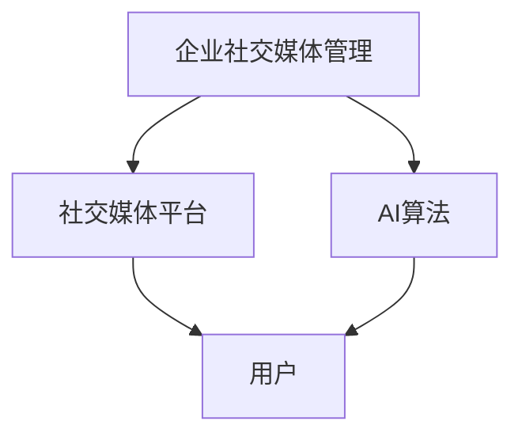
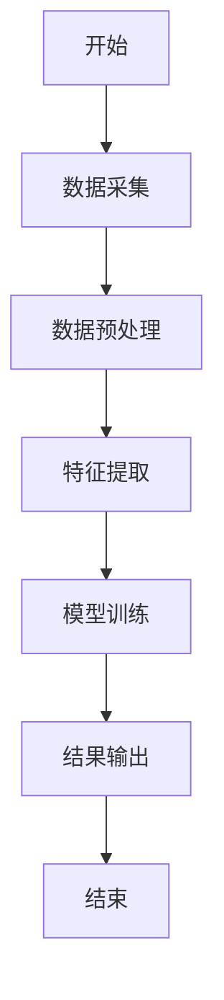
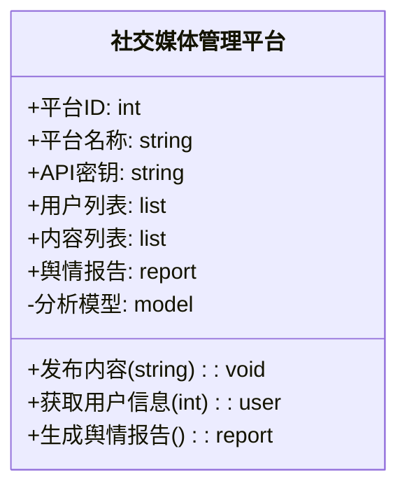
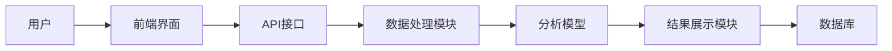
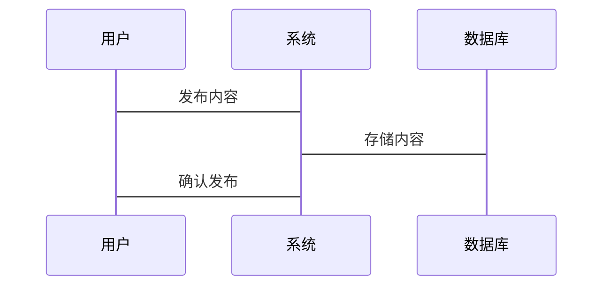

                 


# AI驱动的企业社交媒体管理：策略与实践

## 关键词：
- AI驱动
- 企业社交媒体管理
- 社会媒体管理
- 人工智能
- 管理策略

## 摘要：
随着人工智能技术的快速发展，企业社交媒体管理正在经历一场深刻的变革。本文将从AI驱动的社交媒体管理的背景、核心概念、算法原理、系统架构设计、项目实战以及最佳实践等方面进行深入探讨。通过对文本处理、图像识别和情感分析等算法的详细解析，结合具体的项目案例，展示AI如何优化企业的社交媒体管理流程，提升运营效率和用户体验。同时，本文还将提供系统化的架构设计方案和代码实现，为读者提供实践参考。

---

# 第一部分: AI驱动的企业社交媒体管理背景

# 第1章: AI驱动的企业社交媒体管理背景

## 1.1 企业社交媒体管理的重要性

### 1.1.1 社会媒体对企业的影响
社交媒体已成为企业与客户、合作伙伴以及公众沟通的重要平台。通过社交媒体，企业可以实时发布信息、收集反馈、建立品牌形象，从而在市场竞争中占据优势。

### 1.1.2 传统社交媒体管理的局限性
传统社交媒体管理依赖人工操作，效率低下且难以覆盖多平台。此外，海量数据的处理能力有限，难以及时捕捉用户反馈和市场趋势。

### 1.1.3 AI在社交媒体管理中的作用
AI技术可以通过自然语言处理、机器学习和大数据分析，帮助企业自动化处理社交媒体内容，实时监控情感趋势，识别潜在风险，并优化营销策略。

## 1.2 AI驱动的社交媒体管理的核心概念

### 1.2.1 AI与社交媒体管理的结合
AI驱动的社交媒体管理是指利用人工智能技术，对社交媒体上的数据进行分析、分类和预测，从而实现自动化的内容发布、用户互动和危机管理。

### 1.2.2 企业社交媒体管理的挑战与机遇
挑战包括数据量大、信息复杂性和实时性要求高等；机遇则体现在通过AI技术提升效率、精准营销和客户洞察。

### 1.2.3 AI驱动管理的创新模式
通过AI技术实现智能化内容生成、情感分析和用户行为预测，帮助企业实现从被动响应到主动管理的转变。

## 1.3 本章小结
本章介绍了企业社交媒体管理的重要性，分析了传统管理的局限性，并重点阐述了AI驱动管理的核心概念和创新模式。

---

# 第二部分: AI驱动的企业社交媒体管理核心概念

# 第2章: AI驱动的企业社交媒体管理概念模型

## 2.1 核心概念与定义

### 2.1.1 AI驱动的定义
AI驱动的社交媒体管理是指利用人工智能技术对社交媒体数据进行分析和处理，以实现自动化和智能化的管理。

### 2.1.2 企业社交媒体管理的定义
企业社交媒体管理是指企业在社交媒体平台上进行信息传播、用户互动和品牌管理的过程。

### 2.1.3 核心要素的构成
包括数据采集、数据分析、内容生成、用户互动和效果评估等核心要素。

## 2.2 概念属性特征对比

### 2.2.1 对比表格展示
以下是AI驱动管理与传统管理的对比：

| **属性**       | **AI驱动管理**          | **传统管理**          |
|-----------------|-------------------------|-----------------------|
| 数据处理能力   | 高效、自动化           | 低效、依赖人工         |
| 决策能力       | 数据驱动、精准         | 主观、经验驱动         |
| 实时性         | 实时监控和响应         | 延后处理、被动响应     |
| 规模处理能力   | 支持海量数据           | 有限处理能力         |

## 2.3 实体关系图

### 2.3.1 Mermaid流程图展示


## 2.4 本章小结
本章通过对比分析和实体关系图，详细阐述了AI驱动的企业社交媒体管理的核心概念和关键特征。

---

# 第三部分: AI驱动的企业社交媒体管理算法原理

# 第3章: AI算法在社交媒体管理中的应用

## 3.1 算法原理概述

### 3.1.1 文本处理算法
文本处理算法包括分词、实体识别和情感分析等，用于提取社交媒体上的文本信息。

### 3.1.2 图像识别算法
图像识别算法用于分析社交媒体上的图片内容，如品牌logo识别和广告监测。

### 3.1.3 情感分析算法
情感分析算法通过自然语言处理技术，判断用户评论的情感倾向（正面、中性或负面）。

## 3.2 算法流程图

### 3.2.1 Mermaid流程图展示


## 3.3 算法实现

### 3.3.1 Python源代码实现

#### 情感分析示例代码
```python
from sklearn.feature_extraction.text import TfidfVectorizer
from sklearn.linear_model import LogisticRegression

# 数据预处理
X = ["这是一个好产品", "这个产品很差"]
y = [1, 0]

# 特征提取
vectorizer = TfidfVectorizer()
X_vec = vectorizer.fit_transform(X)

# 模型训练
model = LogisticRegression()
model.fit(X_vec, y)

# 预测
test = ["这个产品很优秀"]
test_vec = vectorizer.transform(test)
print(model.predict(test_vec))
```

#### 算法原理的数学模型
情感分析模型的训练过程如下：

$$
\text{损失函数} = -\frac{1}{n}\sum_{i=1}^{n} \log(p(y_i|\mathbf{x}_i))
$$

其中，$\mathbf{x}_i$ 是输入样本，$p(y_i|\mathbf{x}_i)$ 是模型预测的概率。

### 3.3.2 举例说明
通过上述代码示例，我们可以看到情感分析算法如何对社交媒体评论进行分类，帮助企业快速识别用户情绪。

## 3.4 本章小结
本章通过详细讲解文本处理、图像识别和情感分析等算法，展示了AI在社交媒体管理中的实际应用。

---

# 第四部分: 系统分析与架构设计

# 第4章: 系统分析与架构设计

## 4.1 项目背景介绍

### 4.1.1 项目目标
本项目旨在开发一个AI驱动的企业社交媒体管理系统，实现自动化的内容发布、用户互动和舆情监控。

### 4.1.2 项目范围
系统将支持多个社交媒体平台，包括Twitter、Facebook和微信等。

### 4.1.3 项目需求
系统需要具备实时数据采集、情感分析、内容生成和用户行为预测等功能。

## 4.2 系统功能设计

### 4.2.1 领域模型Mermaid类图



## 4.3 系统架构设计

### 4.3.1 Mermaid架构图展示



## 4.4 系统接口设计

### 4.4.1 接口定义
- `POST /api/post`：发布内容
- `GET /api/user`：获取用户信息
- `GET /api/analytics`：获取舆情报告

## 4.5 系统交互设计

### 4.5.1 Mermaid序列图展示



## 4.6 本章小结
本章通过系统分析和架构设计，展示了AI驱动的企业社交媒体管理系统的整体结构和功能模块。

---

# 第五部分: 项目实战

# 第5章: 项目实战

## 5.1 环境安装

### 5.1.1 安装Python
```bash
python --version
pip install --upgrade pip
```

### 5.1.2 安装依赖包
```bash
pip install numpy pandas scikit-learn
```

## 5.2 系统核心实现

### 5.2.1 核心代码实现

#### 情况分析模块
```python
from sklearn.pipeline import Pipeline
from sklearn.naive_bayes import MultinomialNB
from sklearn.feature_extraction.text import TfidfVectorizer

# 管理模块
pipeline = Pipeline([
    ('tfidf', TfidfVectorizer()),
    ('clf', MultinomialNB())
])

pipeline.fit(X, y)
```

#### 内容发布模块
```python
def publish_content(platform, content):
    # 实现各平台的内容发布逻辑
    pass
```

## 5.3 代码应用解读与分析

### 5.3.1 情况分析模块
情况分析模块使用TF-IDF特征提取和朴素贝叶斯分类器，对社交媒体评论进行情感分类。

### 5.3.2 内容发布模块
内容发布模块根据不同的社交媒体平台，调用对应的API接口，实现自动化内容发布。

## 5.4 实际案例分析

### 5.4.1 案例分析
通过一个具体的社交媒体舆情分析案例，展示系统的实际应用效果。

## 5.5 项目小结
本章通过项目实战，详细讲解了AI驱动的企业社交媒体管理系统的实现过程和关键代码。

---

# 第六部分: 最佳实践与总结

# 第6章: 最佳实践与总结

## 6.1 本章小结

### 6.1.1 内容总结
总结全文的主要内容，包括背景、核心概念、算法原理、系统设计和项目实战等。

## 6.2 最佳实践 tips

### 6.2.1 项目实施建议
- 确保数据质量
- 选择合适的AI算法
- 定期更新模型

### 6.2.2 注意事项
- 数据隐私保护
- 系统稳定性保障
- 用户体验优化

## 6.3 未来展望

### 6.3.1 拓展方向
- 更智能的内容生成
- 多模态数据分析
- 自适应学习系统

## 6.4 拓展阅读

### 6.4.1 推荐书籍
- 《人工智能: 一种现代的方法》
- 《数据驱动的社交媒体营销》

---

通过以上目录结构和内容，本文全面探讨了AI驱动的企业社交媒体管理的策略与实践，为读者提供了从理论到实践的系统化指导。

