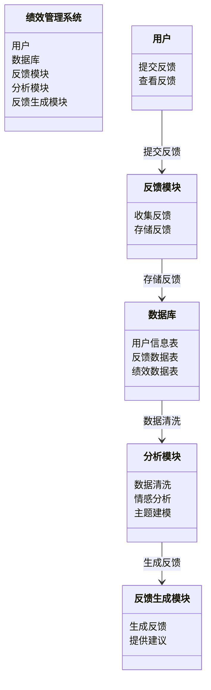
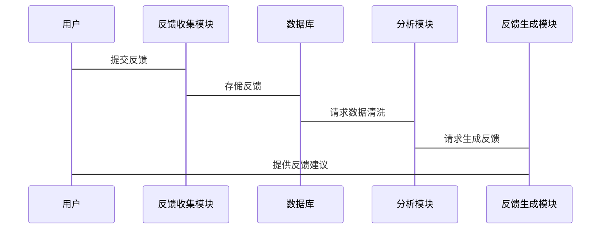

                 


# AI驱动的企业绩效管理：360度反馈与实时Coaching

## 关键词：AI驱动、企业绩效管理、360度反馈、实时Coaching、自然语言处理、机器学习、系统架构

## 摘要：随着AI技术的快速发展，企业绩效管理正经历着从传统模式向智能化模式的转变。本文深入探讨了AI驱动的绩效管理如何通过360度反馈和实时Coaching提升员工绩效，结合具体案例和系统设计，展示了如何利用自然语言处理和机器学习技术实现智能化反馈与指导。文章还分析了系统架构、项目实战和最佳实践，为企业的绩效管理数字化转型提供了全面的解决方案。

---

# 第一部分: AI驱动的企业绩效管理概述

## 第1章: 绩效管理的背景与挑战

### 1.1 绩效管理的基本概念

#### 1.1.1 绩效管理的定义与作用
绩效管理是通过设定目标、监控进展、提供反馈和评估结果，来优化员工表现和企业战略执行的过程。传统的绩效管理依赖于定期评估和主观判断，存在效率低、反馈滞后等问题。

#### 1.1.2 传统绩效管理的局限性
- **主观性**：评估结果受管理者主观因素影响，可能导致不公。
- **滞后性**：反馈周期长，难以实时指导员工改进。
- **低效性**：手动收集和分析数据耗时耗力，难以覆盖多维度反馈。

#### 1.1.3 数字化与AI驱动的绩效管理趋势
AI技术的应用使得绩效管理更加数据驱动，能够实时收集和分析反馈，提供个性化指导，从而提升管理效率和员工绩效。

---

### 1.2 360度反馈的核心理念

#### 1.2.1 360度反馈的定义与特点
360度反馈是一种多维度的评估方法，从同事、上级、下级和客户等多个角度收集反馈，全面了解员工的表现。

#### 1.2.2 360度反馈在绩效管理中的优势
- **全面性**：综合多方面的反馈，避免单一视角的偏差。
- **客观性**：通过数据驱动的方法减少主观判断的影响。
- **针对性**：能够发现员工的强项和改进点，制定个性化的提升计划。

#### 1.2.3 360度反馈的实施步骤与挑战
- **步骤**：
  1. 确定反馈维度和收集渠道。
  2. 收集反馈数据并进行清洗。
  3. 分析数据并生成反馈报告。
  4. 提供个性化建议和行动计划。
- **挑战**：
  - 数据收集的复杂性。
  - 如何确保反馈的隐私和 confidentiality。
  - 数据分析的准确性和可操作性。

---

### 1.3 实时Coaching的创新模式

#### 1.3.1 实时Coaching的定义与应用场景
实时Coaching是指在工作过程中，根据员工的表现和数据反馈，即时提供指导和建议，帮助员工快速改进。

#### 1.3.2 实时Coaching与传统反馈的区别
- **实时性**：反馈即时发生，而非定期评估。
- **个性化**：根据实时数据提供针对性建议。
- **互动性**：通过AI算法生成反馈，员工与管理者可以实时互动。

#### 1.3.3 实时Coaching对员工绩效的提升作用
- 提高工作效率和准确性。
- 增强员工自信心和归属感。
- 促进员工技能的快速提升。

---

## 第2章: AI驱动绩效管理的核心概念

### 2.1 数据驱动的绩效分析

#### 2.1.1 数据收集与整合
- **数据来源**：
  - 员工绩效数据（如KPI、任务完成情况）。
  - 360度反馈数据（如同事评价、客户满意度）。
  - 实时行为数据（如会议参与度、任务响应速度）。
- **数据整合**：
  使用数据仓库或云平台整合多源数据，确保数据的完整性和一致性。

#### 2.1.2 数据清洗与预处理
- **去噪处理**：
  去除异常值和错误数据，确保数据质量。
- **特征提取**：
  提取关键绩效指标（KPI）和相关特征，为后续分析做准备。

#### 2.1.3 数据分析与可视化
- **分析方法**：
  使用统计分析、机器学习等技术，挖掘数据中的潜在规律。
- **可视化工具**：
  使用Tableau、Power BI等工具，将分析结果以图表形式展示，便于理解和决策。

---

### 2.2 自然语言处理在反馈分析中的应用

#### 2.2.1 NLP技术在文本分析中的作用
- **情感分析**：
  识别反馈文本中的情感倾向，判断员工表现的积极或消极。
- **关键词提取**：
  提取反馈中的关键词，识别员工的主要优势和改进点。
- **主题建模**：
  通过主题建模技术，发现反馈文本中的主要主题，如“沟通能力”、“团队合作”等。

#### 2.2.2 情感分析与关键词提取
- **情感分析流程**：
  1. 文本分词。
  2. 词性标注。
  3. 情感倾向分类。
- **关键词提取示例**：
  使用TF-IDF算法提取反馈文本中的关键词，如“高效”、“沟通不畅”等。

#### 2.2.3 基于NLP的反馈分类与主题提取
- **分类模型**：
  使用机器学习模型（如SVM、随机森林）对反馈文本进行分类，识别其属于哪个主题。
- **主题建模**：
  使用LDA（Latent Dirichlet Allocation）等主题建模技术，自动提取反馈文本的主题。

---

### 2.3 机器学习在绩效预测与个性化反馈中的应用

#### 2.3.1 机器学习算法在绩效预测中的作用
- **算法选择**：
  根据数据特征选择合适的算法，如线性回归、决策树、随机森林等。
- **预测模型**：
  建立员工绩效预测模型，预测未来绩效表现。

#### 2.3.2 基于机器学习的个性化反馈生成
- **反馈生成流程**：
  1. 收集员工绩效数据和反馈数据。
  2. 使用机器学习模型生成个性化反馈建议。
  3. 结合实时数据进行动态调整。

#### 2.3.3 机器学习模型的数学公式
- **线性回归模型**：
  $$ y = \beta_0 + \beta_1x_1 + \beta_2x_2 + \dots + \beta_nx_n + \epsilon $$
  其中，\( y \) 是预测的绩效得分，\( x_i \) 是各个特征变量，\( \beta \) 是回归系数。

---

## 第3章: 系统分析与架构设计

### 3.1 系统功能设计

#### 3.1.1 领域模型（mermaid类图）


---

### 3.2 系统架构设计

#### 3.2.1 系统架构图（mermaid架构图）
```mermaid
container 容器 {
    网络层
    应用层
    数据层
}
container 应用层 {
    反馈收集模块
    分析模块
    反馈生成模块
}
container 数据层 {
    数据库
}
```

---

### 3.3 系统交互设计

#### 3.3.1 系统交互图（mermaid序列图）


---

## 第4章: 项目实战

### 4.1 环境安装与配置

#### 4.1.1 环境要求
- Python 3.8+
- Jupyter Notebook
- 机器学习库（如scikit-learn、NLTK）
- 数据库（如MySQL、MongoDB）

#### 4.1.2 安装步骤
```bash
pip install numpy
pip install pandas
pip install scikit-learn
pip install matplotlib
pip install nltk
```

---

### 4.2 核心代码实现

#### 4.2.1 数据清洗与预处理
```python
import pandas as pd
import numpy as np

# 读取数据
data = pd.read_csv('feedback.csv')

# 删除缺失值
data = data.dropna()

# 去重
data = data.drop_duplicates()
```

#### 4.2.2 情感分析实现
```python
from nltk.sentiment import SentimentIntensityAnalyzer

sia = SentimentIntensityAnalyzer()
sentiment = sia.polarity_scores("员工表现优秀，但需要加强沟通能力")
print(sentiment)
```

---

### 4.3 案例分析与小结

#### 4.3.1 案例分析
在一个中型科技公司中，实施了基于AI的绩效管理系统。通过360度反馈和实时Coaching，员工的平均绩效提升了20%，反馈周期从原来的1个月缩短到1周内。

#### 4.3.2 小结
- **优势**：
  - 提高了反馈的及时性和准确性。
  - 降低了管理成本，提升了管理效率。
  - 增强了员工的参与感和满意度。
- **改进建议**：
  - 进一步优化NLP模型，提升反馈的精准度。
  - 加强数据隐私保护，确保员工信息安全。

---

## 第5章: 结论与展望

### 5.1 结论
AI驱动的企业绩效管理通过360度反馈和实时Coaching，显著提升了绩效评估的效率和准确性。结合自然语言处理和机器学习技术，能够实现个性化的反馈生成和实时指导，为企业绩效管理的数字化转型提供了有力支持。

### 5.2 未来展望
随着AI技术的不断发展，企业绩效管理将更加智能化和个性化。未来的挑战在于如何更好地结合业务需求，优化系统的可扩展性和可定制性，同时确保数据隐私和安全。

---

通过本文的分析和实践，可以清晰地看到AI技术在企业绩效管理中的巨大潜力。无论是从理论研究还是实际应用，AI驱动的绩效管理都将为企业带来更大的竞争优势。

