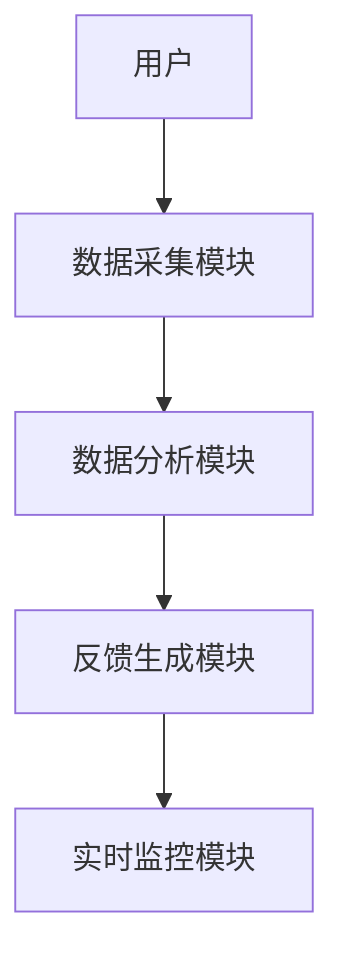
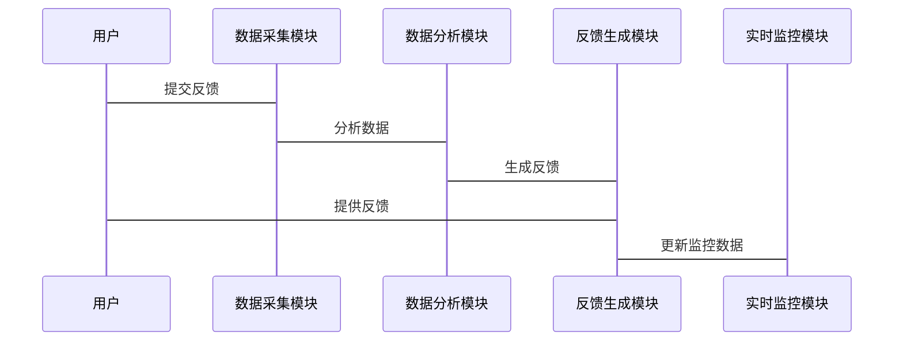

                 


# AI驱动的企业绩效管理：360度反馈与实时coaching的智能化

## 关键词
AI驱动，企业绩效管理，360度反馈，实时Coaching，智能化

## 摘要
本文深入探讨了AI技术在企业绩效管理中的应用，特别是360度反馈和实时Coaching的智能化。通过分析AI如何优化传统绩效管理流程，本文展示了如何利用数据分析、自然语言处理和机器学习等技术提升绩效管理的效率和效果。文章还详细介绍了系统架构设计、项目实战和最佳实践，为读者提供了全面的技术视角和实际应用指导。

---

## 第1章: AI驱动的企业绩效管理概述

### 1.1 企业绩效管理的背景与挑战

#### 1.1.1 传统企业绩效管理的局限性
传统的企业绩效管理（Performance Management，PM）主要依赖于定期的评估和反馈，这种方式存在以下局限性：
- **滞后性**：传统的评估周期较长，反馈往往无法及时指导员工改进。
- **主观性**：评估结果可能受到评估者主观因素的影响，导致结果不够客观。
- **缺乏个性化**：统一的评估标准难以满足不同岗位和员工的个性化需求。
- **效率低下**：手动收集和分析数据的过程耗时且效率低。

#### 1.1.2 数字化转型对企业绩效管理的新要求
随着企业数字化转型的推进，企业绩效管理也面临新的挑战和机遇：
- **实时性要求**：现代企业需要实时了解员工表现，以便快速调整策略。
- **数据驱动决策**：企业希望利用大数据分析员工绩效，提供更精准的反馈和建议。
- **智能化工具需求**：员工和管理者都需要智能化的工具来辅助绩效管理。

#### 1.1.3 AI技术在企业绩效管理中的作用
AI技术能够通过以下方式提升企业绩效管理的效果：
- **自动化数据处理**：AI可以快速收集、整理和分析大量数据，提高效率。
- **个性化反馈**：通过机器学习，AI可以根据员工的特点提供个性化的反馈和建议。
- **预测性分析**：AI可以通过历史数据预测员工未来的表现，帮助企业提前制定计划。

### 1.2 AI驱动的企业绩效管理的定义与特点

#### 1.2.1 定义：AI驱动的企业绩效管理
AI驱动的企业绩效管理是指利用人工智能技术，如机器学习、自然语言处理和数据分析等，来优化企业绩效管理的各个环节，包括目标设定、绩效评估、反馈与改进等。

#### 1.2.2 核心特点：实时性、数据驱动、智能化
- **实时性**：AI能够实时监控员工的表现，及时提供反馈和建议。
- **数据驱动**：AI通过分析大量数据，提供更精准的评估结果和建议。
- **智能化**：AI可以根据员工的特点和表现，自动调整评估标准和反馈内容。

#### 1.2.3 与传统绩效管理的对比分析
| 对比维度         | 传统绩效管理                 | AI驱动的绩效管理             |
|------------------|-----------------------------|-----------------------------|
| 数据处理方式     | 手动收集和分析               | 自动化数据处理               |
| 反馈周期         | 定期反馈                     | 实时反馈                     |
| 评估结果         | 主观性较高                   | 更客观、精准                 |
| 个性化支持       | 较低                        | 高                          |

### 1.3 360度反馈与实时Coaching的智能化

#### 1.3.1 360度反馈的定义与优势
360度反馈是一种多维度的评估方法，从员工的上级、同事、下属以及客户等多个角度收集反馈，全面评估员工的表现。其优势包括：
- **全面性**：综合多个来源的反馈，更全面地了解员工的表现。
- **客观性**：减少单一来源反馈的主观性。

#### 1.3.2 实时Coaching的定义与应用场景
实时Coaching是指在员工工作的过程中，管理者或系统实时提供指导和反馈，帮助员工快速改进表现。应用场景包括：
- **销售团队**：实时指导销售人员的客户沟通技巧。
- **客服团队**：实时帮助客服人员解决客户问题。

#### 1.3.3 智能化如何提升反馈与Coaching的效果
AI可以通过以下方式提升反馈与Coaching的效果：
- **自动化反馈生成**：AI可以根据员工的表现自动生成反馈内容。
- **个性化建议**：AI可以根据员工的特点提供个性化的Coaching建议。
- **实时监控**：AI可以实时监控员工的表现，及时提供反馈。

## 第2章: AI技术在企业绩效管理中的应用

### 2.1 数据分析与挖掘

#### 2.1.1 数据分析在绩效管理中的作用
数据分析可以帮助企业：
- **识别高绩效员工**：通过分析数据，找出表现优秀的员工。
- **发现绩效问题**：通过分析数据，找出员工绩效中的问题所在。

#### 2.1.2 数据挖掘技术在绩效管理中的应用
数据挖掘技术可以用于：
- **预测员工未来表现**：通过分析历史数据，预测员工未来的表现。
- **识别关键绩效指标（KPI）**：通过数据挖掘，找出影响绩效的关键因素。

#### 2.1.3 数据可视化在绩效管理中的应用
数据可视化可以帮助企业：
- **直观展示员工表现**：通过图表等形式，直观展示员工的绩效数据。
- **便于管理者决策**：数据可视化可以帮助管理者快速理解数据，做出决策。

### 2.2 自然语言处理（NLP）在反馈分析中的应用

#### 2.2.1 NLP在员工反馈分析中的作用
NLP可以用于分析员工的反馈文本，提取关键信息，帮助管理者更好地理解员工的需求和问题。

#### 2.2.2 基于NLP的反馈分析流程
1. **文本预处理**：对反馈文本进行分词、去停用词等处理。
2. **情感分析**：分析反馈文本的情感倾向，判断反馈是正面、负面还是中性。
3. **主题提取**：提取反馈文本中的主要主题，如“沟通能力”、“团队合作”等。
4. **关键词提取**：提取与绩效相关的关键词，帮助管理者快速定位问题。

### 2.3 机器学习模型在绩效预测中的应用

#### 2.3.1 基于机器学习的绩效预测模型
- **输入数据**：员工的历史绩效数据、行为数据、反馈数据等。
- **输出结果**：预测员工未来的绩效表现。

#### 2.3.2 机器学习模型的训练与优化
1. **数据清洗与特征提取**：对数据进行清洗，提取有用的特征。
2. **模型选择与训练**：选择合适的模型（如随机森林、支持向量机等），并对模型进行训练。
3. **模型评估与优化**：通过交叉验证等方法评估模型性能，并进行优化。

### 2.4 系统架构与设计

#### 2.4.1 系统功能模块
- **数据采集模块**：负责收集员工的绩效数据、反馈数据等。
- **数据分析模块**：对数据进行分析，提取关键信息。
- **反馈生成模块**：根据分析结果生成个性化的反馈。
- **实时监控模块**：实时监控员工的表现，提供实时反馈。

#### 2.4.2 系统架构图


#### 2.4.3 接口设计
- **数据接口**：与企业现有的数据系统对接，获取员工数据。
- **反馈接口**：将生成的反馈发送给员工和管理者。

#### 2.4.4 交互流程


## 第3章: 项目实战

### 3.1 环境搭建

#### 3.1.1 安装Python环境
- 安装Python 3.x
- 安装Jupyter Notebook

#### 3.1.2 安装依赖库
```bash
pip install numpy pandas scikit-learn nltk
```

### 3.2 核心代码实现

#### 3.2.1 数据预处理代码
```python
import pandas as pd
import numpy as np

# 加载数据
data = pd.read_csv('performance.csv')

# 去除缺失值
data = data.dropna()

# 标准化处理
from sklearn.preprocessing import StandardScaler
scaler = StandardScaler()
data_scaled = scaler.fit_transform(data)
```

#### 3.2.2 基于机器学习的绩效预测代码
```python
from sklearn.model import SVC
from sklearn.metrics import accuracy_score

# 训练模型
model = SVC()
model.fit(X_train, y_train)

# 预测
y_pred = model.predict(X_test)

# 计算准确率
print(accuracy_score(y_test, y_pred))
```

#### 3.2.3 NLP反馈分析代码
```python
from sklearn.feature_extraction.text import TfidfVectorizer
from sklearn.decomposition import NMF

# 向量化
vectorizer = TfidfVectorizer()
X = vectorizer.fit_transform(feedbacks)

# 主题提取
nmf = NMF(n_components=3)
nmf.fit_transform(X)

# 提取主题
components = nmf.components_
vocab = vectorizer.get_feature_names()
```

### 3.3 实际案例分析

#### 3.3.1 案例背景
某公司希望利用AI技术优化员工绩效管理，提升员工表现。

#### 3.3.2 数据分析结果
- **关键绩效指标**：发现沟通能力是影响绩效的主要因素。
- **员工反馈**：员工普遍认为反馈不够及时。

#### 3.3.3 系统实现效果
- **实时反馈**：员工在工作中可以实时收到反馈，及时调整表现。
- **个性化反馈**：根据员工的特点提供个性化的反馈和建议。

### 3.4 项目小结
通过本项目的实施，企业绩效管理的效率和效果都得到了显著提升。AI技术的应用不仅提高了反馈的及时性和准确性，还为企业提供了更精准的决策支持。

## 第4章: 最佳实践与小结

### 4.1 最佳实践
- **数据质量管理**：确保数据的准确性和完整性。
- **模型优化**：根据实际需求不断优化机器学习模型。
- **用户隐私保护**：在处理员工数据时，必须保护员工的隐私。

### 4.2 小结
AI驱动的企业绩效管理通过智能化的360度反馈和实时Coaching，显著提升了企业绩效管理的效率和效果。未来，随着AI技术的不断发展，企业绩效管理将更加智能化和个性化。

### 4.3 注意事项
- **数据隐私**：在使用AI技术时，必须遵守相关数据隐私法规。
- **模型解释性**：确保模型的解释性，以便管理者理解结果。
- **持续优化**：根据实际效果不断优化系统和模型。

### 4.4 拓展阅读
- 推荐阅读《机器学习实战》和《数据挖掘导论》等书籍，深入了解机器学习和数据挖掘技术。

---

通过本文的详细讲解，读者可以全面了解AI驱动的企业绩效管理，特别是360度反馈和实时Coaching的智能化应用。希望本文能够为企业的绩效管理提供新的思路和实践指导。

