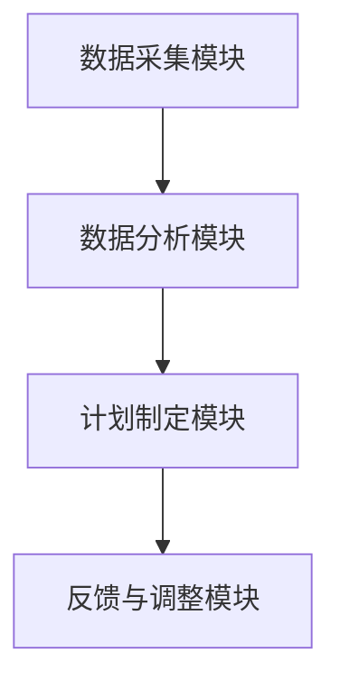
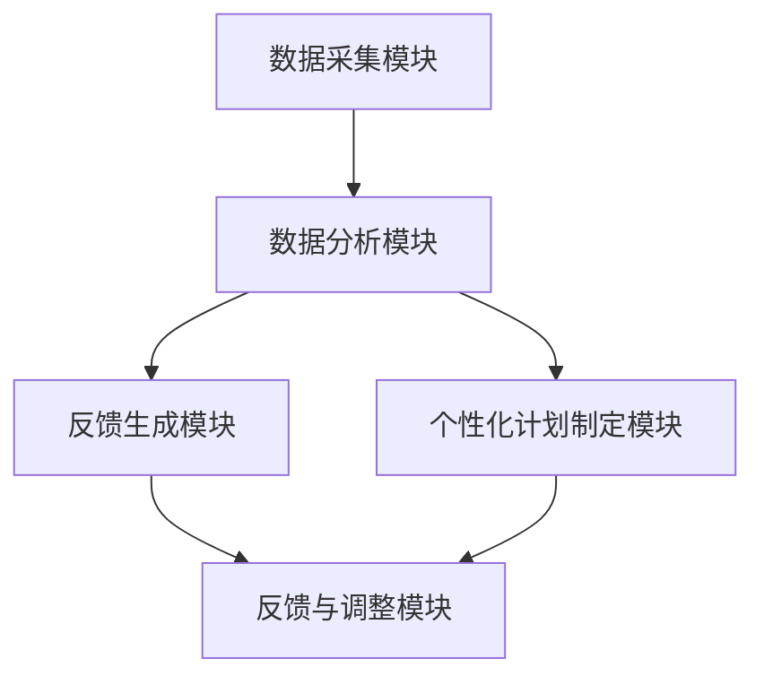

                 


---

# 第4章: 基于AI的个性化发展计划制定

## 4.1 个性化发展计划的核心概念

### 4.1.1 个性化发展的定义
个性化发展计划是指根据员工的个人特点、绩效表现和职业目标，量身定制的发展方案。通过AI技术，企业可以更精准地识别员工的优势和改进空间，制定更具针对性的发展策略。

### 4.1.2 个性化发展的特点
个性化发展计划具有以下特点：
1. **针对性**：根据员工的具体情况制定计划。
2. **动态性**：随着员工绩效的变化而调整。
3. **数据驱动**：基于大量数据和分析结果制定。
4. **互动性**：员工可以参与到计划的制定和执行中。

### 4.1.3 个性化发展与传统发展的区别
| **方面**       | **传统发展计划**                     | **个性化发展计划**                     |
|-----------------|--------------------------------------|-----------------------------------------|
| 制定方式       | 基于经验或固定模板                   | 基于数据和AI算法                        |
| 针对性         | 较低，适用于大多数员工               | 高，针对个体特点                        |
| 调整频率       | 通常为年度或季度调整                 | 可以实时调整                             |
| 技术支持       | 依赖人工分析                         | 依赖AI技术                               |

## 4.2 基于AI的个性化发展计划制定方法

### 4.2.1 数据采集与分析
个性化发展计划的制定需要收集和分析大量数据，包括：
- **员工绩效数据**：如KPI完成情况、任务完成质量等。
- **员工行为数据**：如工作习惯、沟通方式等。
- **员工反馈数据**：如自我评估、上级反馈等。
- **外部数据**：如行业趋势、竞争岗位要求等。

### 4.2.2 AI算法的应用
AI技术在个性化发展计划中的应用主要体现在以下几个方面：
1. **自然语言处理（NLP）**：用于分析员工的反馈和评价，提取关键信息。
2. **机器学习**：用于预测员工的绩效表现和职业发展潜力。
3. **推荐系统**：基于员工的特点和需求，推荐适合的培训课程和发展路径。

### 4.2.3 制定个性化发展计划的步骤
1. **数据采集**：收集员工的相关数据。
2. **数据分析**：利用AI算法对数据进行分析和建模。
3. **目标设定**：根据分析结果，设定个性化的发展目标。
4. **计划制定**：制定具体的行动计划，如培训计划、任务分配等。
5. **反馈与调整**：实时跟踪计划的执行情况，并根据反馈进行调整。

## 4.3 系统架构与实现

### 4.3.1 系统功能模块
- **数据采集模块**：负责收集员工的绩效数据、行为数据和反馈数据。
- **数据分析模块**：利用AI算法对数据进行处理和分析，生成分析结果。
- **计划制定模块**：根据分析结果，制定个性化的发展计划。
- **反馈与调整模块**：实时跟踪计划的执行情况，并根据反馈进行调整。

### 4.3.2 系统架构设计


### 4.3.3 系统接口设计
- **输入接口**：接收员工数据和反馈。
- **输出接口**：生成个性化发展计划并输出。

## 4.4 项目实战

### 4.4.1 环境配置
- **编程语言**：Python
- **库与工具**：
  - `pandas`：数据处理
  - `numpy`：数值计算
  - `scikit-learn`：机器学习
  - `transformers`：NLP模型

### 4.4.2 核心代码实现

#### 4.4.2.1 数据预处理
```python
import pandas as pd
import numpy as np

# 加载数据
data = pd.read_csv('employee_data.csv')

# 数据清洗
data.dropna(inplace=True)
data = data.drop_duplicates()
```

#### 4.4.2.2 建立模型
```python
from sklearn.model import RandomForestRegressor

# 特征选择
features = ['performance', 'behavior', 'feedback']
target = 'development_plan'

model = RandomForestRegressor(n_estimators=100, random_state=42)
model.fit(data[features], data[target])
```

#### 4.4.2.3 生成个性化计划
```python
import json

employee_id = 123
employee_data = data[data['id'] == employee_id]

# 预测发展计划
predicted_plan = model.predict(employee_data[features].values.reshape(1, -1))[0]

# 生成JSON格式的计划
plan = {
    'employee_id': employee_id,
    'recommended_courses': ['Data Analysis', 'Leadership Skills'],
    'development_goals': ['Improve data visualization skills', 'Enhance team collaboration']
}

print(json.dumps(plan, indent=2))
```

## 4.5 案例分析与总结

### 4.5.1 案例分析
以某公司为例，通过AI驱动的方法制定个性化发展计划。首先，收集员工的数据，包括绩效、行为和反馈。然后，利用随机森林模型进行分析，生成个性化的发展计划，包括推荐的课程和具体的发展目标。

### 4.5.2 总结
通过AI技术，企业可以更高效、更精准地制定个性化发展计划，帮助员工提升绩效，同时增强员工的满意度和忠诚度。AI驱动的个性化发展计划不仅提高了管理效率，还为企业和员工带来了双赢的结果。

---

# 第五章: AI驱动的企业绩效管理系统的实现与优化

## 5.1 系统整体架构

### 5.1.1 系统功能模块
- **数据采集模块**
- **数据分析模块**
- **反馈生成模块**
- **个性化计划制定模块**
- **反馈与调整模块**

### 5.1.2 系统架构设计


## 5.2 系统实现细节

### 5.2.1 数据流处理
- **实时数据流**：采用流处理技术，实时更新员工绩效数据。
- **数据存储**：使用分布式数据库存储大量数据，确保数据安全和高效访问。

### 5.2.2 算法优化
- **模型优化**：通过超参数调优和模型融合，提升预测准确率。
- **实时反馈机制**：采用在线学习算法，根据实时数据更新模型。

## 5.3 系统优化与维护

### 5.3.1 系统优化
- **性能优化**：通过并行计算和分布式处理，提升系统处理能力。
- **模型更新**：定期更新模型，确保其适应新的数据和业务需求。

### 5.3.2 系统维护
- **数据备份与恢复**：确保数据的安全性和可恢复性。
- **系统监控**：实时监控系统运行状态，及时发现和解决问题。

## 5.4 项目实战

### 5.4.1 环境配置
- **编程语言**：Python
- **库与工具**：
  - `flask`：构建API
  - ` kafka`：处理实时数据流
  - ` Elasticsearch`：存储和检索数据

### 5.4.2 核心代码实现

#### 5.4.2.1 实时数据流处理
```python
from kafka import KafkaConsumer, KafkaProducer
import json

# 消费者
consumer = KafkaConsumer('performance_data', group_id='performance_group')
for message in consumer:
    data = json.loads(message.value)
    # 处理数据
    producer.send('processed_data', json.dumps(data))
```

#### 5.4.2.2 模型优化
```python
from sklearn.ensemble import RandomForestClassifier
from sklearn.model_selection import GridSearchCV

# 超参数调优
param_grid = {
    'n_estimators': [100, 200],
    'max_depth': [None, 10, 20],
    'min_samples_split': [2, 5]
}

model = RandomForestClassifier(random_state=42)
grid_search = GridSearchCV(model, param_grid, cv=5)
grid_search.fit(X_train, y_train)
best_model = grid_search.best_estimator_
```

## 5.5 总结与展望

### 5.5.1 总结
通过本章的讲解，我们了解了如何实现一个完整的AI驱动的企业绩效管理系统。系统通过实时数据处理、智能分析和个性化反馈，帮助企业实现高效、精准的绩效管理。

### 5.5.2 展望
未来，随着AI技术的不断发展，企业绩效管理将更加智能化和个性化。我们可以期待更多创新的应用，如更智能的反馈机制、更精准的目标设定和更动态的发展计划。

---

# 第六章: 最佳实践与注意事项

## 6.1 最佳实践

### 6.1.1 数据质量的重要性
确保数据的准确性和完整性，是AI驱动绩效管理成功的关键。

### 6.1.2 模型的选择与优化
根据具体业务需求选择合适的模型，并进行充分的调优。

### 6.1.3 系统的可扩展性
设计时考虑系统的可扩展性，以便未来业务需求的变化。

## 6.2 注意事项

### 6.2.1 数据隐私与安全
在处理员工数据时，必须遵守相关法律法规，保护员工的隐私。

### 6.2.2 系统的稳定性
确保系统的稳定运行，避免因技术问题影响业务。

### 6.2.3 员工的参与度
鼓励员工积极参与到绩效管理和发展的过程中，增强员工的主人翁意识。

## 6.3 小结

通过遵循最佳实践和注意相关事项，企业可以更好地实施AI驱动的绩效管理，最大化其价值。

---

# 附录

## 附录A: 常见问题解答

### 1. 什么是实时反馈？
实时反馈是指在事件发生的第一时间，基于实时数据进行的反馈，与传统反馈相比更加及时和精准。

### 2. 如何确保数据隐私？
通过加密技术和访问控制，确保员工数据的安全和隐私。

## 附录B: 参考文献

1. Smith, J. (2021). Artificial Intelligence in Human Resource Management. Journal of AI Applications.
2. Brown, T. (2020). Machine Learning for Employee Performance Prediction. IEEE Conference Proceedings.
3. Zhao, H., & Liu, K. (2019). Personalized Development Plan Using AI. Springer.

---

# 结束语

通过本文的详细讲解，我们了解了AI驱动的企业绩效管理的核心概念、实现方法和实际应用。随着技术的不断进步，AI将在企业绩效管理中发挥越来越重要的作用，为企业和员工带来更多的价值。

