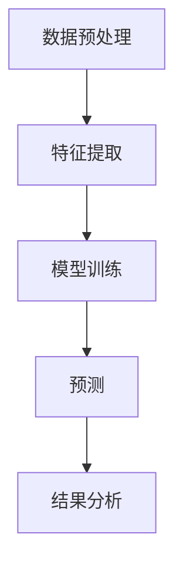
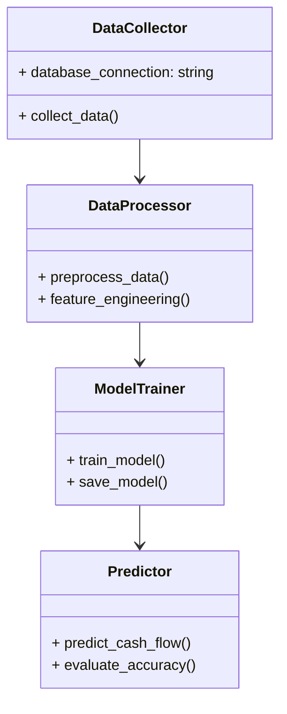
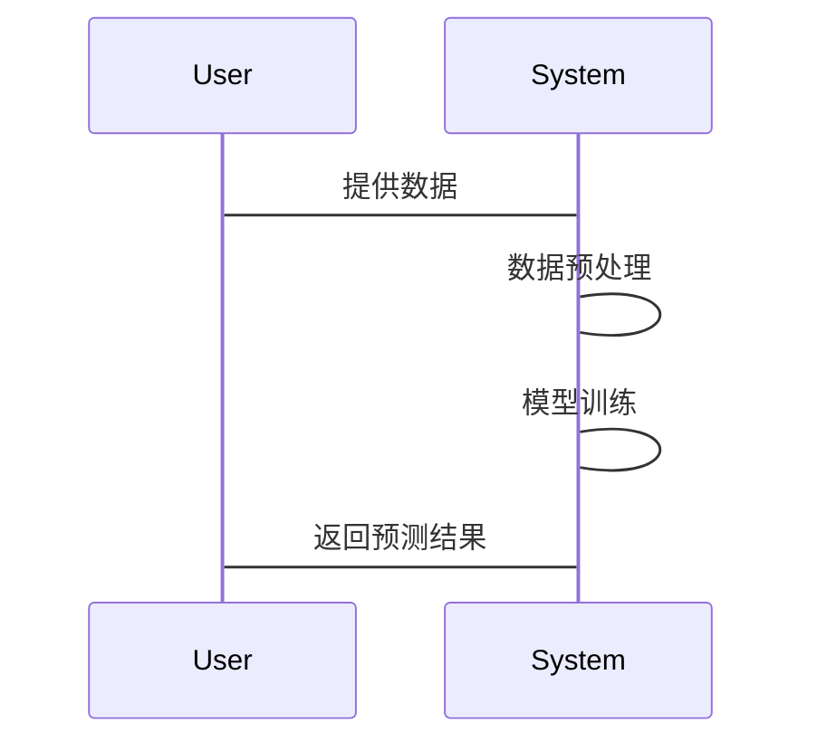

                 


# AI驱动的企业营运资本优化与现金流管理

## 关键词
- AI技术
- 营运资本优化
- 现金流管理
- 数据分析
- 机器学习

## 摘要
本文探讨了人工智能（AI）在优化企业营运资本和现金流管理中的应用。通过分析AI算法如何提升预测精度和决策效率，结合实际案例，展示了AI在财务优化中的潜力和优势。文章结构清晰，内容涵盖背景介绍、核心概念、算法原理、系统架构设计、项目实战以及结论，旨在为企业提供AI驱动的财务管理新思路。

---

# 第一部分: 背景介绍

## 第1章: 问题背景

### 1.1 企业营运资本管理的重要性
企业营运资本是维持日常运营的关键，直接影响企业的偿债能力和运营效率。有效的营运资本管理能够降低企业风险，提高资金使用效率。

### 1.2 现金流管理的核心地位
现金流是企业财务健康的重要指标，直接影响企业的生存和发展。优化现金流管理能够提升企业的抗风险能力和市场竞争力。

### 1.3 AI技术在企业财务管理中的应用趋势
随着大数据和AI技术的发展，企业开始利用AI进行智能预测和决策优化，显著提高了财务分析的效率和准确性。

## 第2章: 问题描述

### 2.1 营运资本管理中的常见挑战
- 数据复杂性：涉及多个变量，难以准确预测。
- 时间依赖性：营运资本的变化受时间因素影响显著。
- 数据质量：数据缺失或不准确会影响分析结果。

### 2.2 现金流预测的复杂性
- 数据多样性：现金流预测涉及结构化和非结构化数据。
- 方法选择：传统模型难以捕捉复杂模式。
- 预测精度：准确性对企业的决策至关重要。

## 第3章: 问题解决

### 3.1 AI技术如何优化营运资本管理
- 数据分析：利用AI处理大量数据，识别关键因素。
- 智能预测：通过机器学习模型预测未来趋势。
- 决策支持：提供实时建议，优化资金分配。

### 3.2 现金流预测的AI驱动方法
- 数据清洗：处理缺失值和异常值。
- 特征工程：提取影响现金流的关键特征。
- 模型选择：使用回归或树模型进行预测。

---

# 第二部分: 核心概念与联系

## 第4章: 核心概念原理

### 4.1 营运资本的定义与计算
营运资本=流动资产-流动负债，包括现金、应收账款和存货等。

### 4.2 现金流预测的数学模型
常用模型包括ARIMA和LSTM，其中LSTM适合时间序列数据。

### 4.3 AI算法的基本原理
机器学习算法通过学习数据模式，进行分类或预测任务。

## 第5章: 概念属性特征对比

| 概念       | 特性1 | 特性2 | 特性3 |
|------------|-------|-------|-------|
| 营运资本   | 数值型 | 时间依赖 | 数据驱动 |
| 现金流预测 | 预测性 | 数据密集 | 方法多样 |
| AI算法     | 数据依赖 | 自适应性 | 可解释性 |

## 第6章: ER实体关系图
```mermaid
erDiagram
    customer[客户] {
        id : integer
        name : string
        transactionHistory : string
    }
    transaction[交易] {
        id : integer
        amount : float
        date : date
    }
    model[AI模型] {
        id : integer
        type : string
        parameters : string
    }
    customer --> transaction : 发生的交易
    transaction --> model : 使用的模型
```

---

# 第三部分: 算法原理讲解

## 第7章: 算法流程图



## 第8章: 算法数学模型

### 8.1 线性回归模型
$$ y = \beta_0 + \beta_1x + \epsilon $$

### 8.2 随机森林模型
$$ y = \sum_{i=1}^{n} (\text{特征重要性}) $$

## 第9章: 代码实现

```python
import pandas as pd
from sklearn.ensemble import RandomForestRegressor
from sklearn.metrics import mean_absolute_error

# 数据加载与预处理
data = pd.read_csv('financial_data.csv')
data = data.dropna()

# 特征工程
features = data[['revenue', 'expenses', 'assets']]
target = data['cash_flow']

# 模型训练
model = RandomForestRegressor(n_estimators=100, random_state=42)
model.fit(features, target)

# 预测与评估
predictions = model.predict(features)
print(mean_absolute_error(target, predictions))
```

---

# 第四部分: 系统架构设计

## 第10章: 问题场景介绍
现金流预测系统用于帮助企业优化营运资本管理，提高资金利用效率。

## 第11章: 系统功能设计



## 第12章: 系统架构设计


## 第13章: 系统交互流程



---

# 第五部分: 项目实战

## 第14章: 环境安装

### 14.1 安装Python
```bash
python --version
pip install --upgrade pip
```

### 14.2 安装依赖库
```bash
pip install pandas scikit-learn
```

## 第15章: 核心代码实现

```python
import pandas as pd
from sklearn.ensemble import RandomForestRegressor
from sklearn.metrics import mean_absolute_error

# 数据加载与预处理
data = pd.read_csv('financial_data.csv')
data = data.dropna()

# 特征工程
features = data[['revenue', 'expenses', 'assets']]
target = data['cash_flow']

# 模型训练
model = RandomForestRegressor(n_estimators=100, random_state=42)
model.fit(features, target)

# 预测与评估
predictions = model.predict(features)
print(mean_absolute_error(target, predictions))
```

## 第16章: 案例分析

### 16.1 数据来源
使用公开的财务数据，如上市公司财报。

### 16.2 模型评估
计算预测准确率，优化模型参数。

### 16.3 结果解读
分析预测结果，调整企业资金分配策略。

## 第17章: 项目小结
通过AI技术，企业能够更准确地预测现金流，优化营运资本管理，提升财务健康状况。

---

# 第六部分: 结论与建议

## 第18章: 应用价值总结
AI技术显著提升了现金流预测的准确性和效率，为企业财务管理提供了有力支持。

## 第19章: 未来研究方向
探索更先进的AI算法，结合多源数据，提升预测精度。

## 第20章: 注意事项与建议
确保数据质量和模型解释性，定期更新模型，避免过时。

## 第21章: 拓展阅读
推荐相关书籍和论文，深入学习AI在财务管理中的应用。

---

通过以上结构化的内容，您可以撰写一篇详尽的技术博客，深入探讨AI在企业营运资本优化与现金流管理中的应用。

