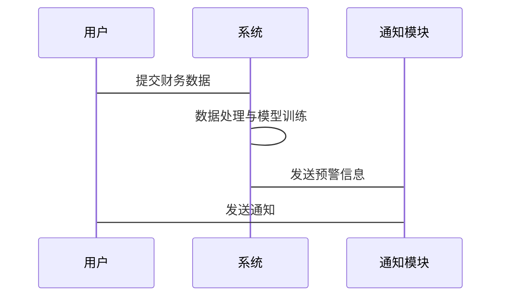

                 


# AI驱动的企业财务困境预测系统

> 关键词：AI驱动、企业财务困境、预测系统、机器学习、深度学习

> 摘要：本文详细探讨了如何利用人工智能技术构建企业财务困境预测系统。从企业财务困境的背景与挑战出发，结合财务数据分析与机器学习算法，系统阐述了预测系统的构建过程，包括数据处理、特征工程、模型选择与优化，以及系统架构设计。通过实际案例分析，展示了AI在企业财务风险管理中的巨大潜力，并展望了未来的发展方向。

---

# 第一部分: 企业财务困境预测的背景与挑战

## 第1章: 企业财务困境的现状与问题

### 1.1 企业财务困境的定义与表现

#### 1.1.1 企业财务困境的定义
企业财务困境（Financial Distress）是指企业在经营过程中由于财务状况恶化，无法偿还债务或继续维持正常运营的状态。这种状态可能包括现金流枯竭、资产负债表恶化、信用评级下降等。

#### 1.1.2 企业财务困境的表现形式
企业财务困境的表现形式多种多样，常见的包括：
- 资产负债表恶化：资产不足以偿还债务，负债比率过高。
- 现金流危机：经营活动现金流为负，无法支付到期债务。
- 信用评级下降：评级机构下调企业信用评级，导致融资成本上升。
- 法律诉讼：因债务问题面临诉讼或资产被查封。

#### 1.1.3 财务困境对企业及利益相关者的影响
- 对企业的直接影响：可能导致企业破产、裁员、业务收缩。
- 对债权人的影响：无法收回债务，造成经济损失。
- 对股东的影响：股东权益大幅缩水，甚至可能血本无归。
- 对员工的影响：可能面临失业或工作不稳定的风险。

---

### 1.2 财务困境预测的必要性

#### 1.2.1 企业风险管理的重要性
企业在经营过程中面临各种风险，包括市场风险、信用风险、流动性风险等。财务困境预测是企业风险管理的重要组成部分，可以帮助企业在问题发生前采取预防措施。

#### 1.2.2 财务困境预测在企业决策中的价值
- 帮助企业提前识别潜在的财务危机。
- 为管理层提供决策支持，优化资源配置。
- 为投资者提供风险评估依据，降低投资风险。

#### 1.2.3 传统财务分析方法的局限性
传统的财务分析方法主要依赖于财务报表数据，存在以下局限性：
- 数据滞后性：财务报表通常按季度或年度发布，无法及时反映企业的最新财务状况。
- 数据片面性：仅依赖财务数据，忽略了非财务因素（如市场环境、管理能力等）的影响。
- 分析复杂性：需要专业人员进行复杂的手工分析，效率较低。

---

### 1.3 AI技术在财务困境预测中的应用前景

#### 1.3.1 AI技术在财务分析中的优势
- 数据处理能力强：AI可以快速处理海量数据，包括财务数据和非财务数据。
- 预测准确性高：通过机器学习算法，可以发现传统方法难以察觉的模式和规律。
- 实时性：AI系统可以实时监控企业的财务状况，提供实时预警。

#### 1.3.2 当前AI驱动财务预测的研究现状
目前，AI在财务困境预测中的研究主要集中在以下方面：
- 基于机器学习的预测模型：如逻辑回归、支持向量机（SVM）、随机森林等。
- 基于深度学习的预测模型：如LSTM、CNN等。
- 组合模型：将多种算法结合起来，提高预测准确性。

#### 1.3.3 未来AI在企业财务管理中的潜力
- 智能化财务管理：通过AI实现财务数据的自动分析和预测。
- 实时监控与预警：利用实时数据和AI算法，提供实时的财务健康评估。
- 自动化决策支持：AI可以辅助管理层做出更科学的决策。

---

## 第2章: 企业财务数据与AI模型的结合

### 2.1 企业财务数据的特征与分类

#### 2.1.1 财务报表数据的构成
企业财务报表主要包括资产负债表、利润表和现金流量表。这些报表提供了企业的财务状况、经营成果和现金流信息。

#### 2.1.2 非财务数据在预测中的作用
除了财务数据，企业内部的管理数据（如销售数据、生产数据）和外部市场数据（如行业趋势、宏观经济指标）也对财务困境预测有重要影响。

#### 2.1.3 数据清洗与预处理的重要性
在进行AI模型训练之前，需要对数据进行清洗和预处理，包括：
- 数据清洗：去除异常值、填补缺失值。
- 数据标准化：将不同量纲的数据进行标准化处理。
- 数据分割：将数据分为训练集、验证集和测试集。

---

### 2.2 AI模型在财务预测中的核心作用

#### 2.2.1 机器学习在财务分析中的应用领域
- 预测企业违约风险。
- 评估企业信用等级。
- 分析企业财务健康状况。

#### 2.2.2 深度学习在复杂财务问题中的优势
深度学习模型（如LSTM、Transformer）在处理时间序列数据和复杂模式识别方面具有显著优势。

#### 2.2.3 组合模型在财务预测中的潜力
通过将不同算法结合起来，可以提高模型的稳定性和准确性。

---

### 2.3 数据与模型结合的案例分析

#### 2.3.1 简单的财务指标分析案例
假设我们有某企业的财务数据，包括资产负债率、流动比率、速动比率等。我们可以计算这些指标，判断企业是否存在财务困境的风险。

#### 2.3.2 基于机器学习的财务预测案例
以逻辑回归为例，我们可以通过对企业财务数据进行特征提取和模型训练，预测企业是否会出现财务困境。

#### 2.3.3 组合模型的实际应用案例
将逻辑回归和随机森林结合起来，利用投票法或加权平均的方式，提高预测的准确性。

---

# 第二部分: AI驱动财务困境预测的核心概念与算法

## 第3章: 财务困境预测的核心指标与模型

### 3.1 财务指标分析

#### 3.1.1 常见财务指标的分类与计算
- 资产负债率：$\text{资产负债率} = \frac{\text{总负债}}{\text{总资产}}$
- 流动比率：$\text{流动比率} = \frac{\text{流动资产}}{\text{流动负债}}$
- 速动比率：$\text{速动比率} = \frac{\text{速动资产}}{\text{流动负债}}$
- 净利润率：$\text{净利润率} = \frac{\text{净利润}}{\text{营业收入}}$

#### 3.1.2 财务指标在预测中的权重分配
不同财务指标在预测中的重要性不同，需要根据具体情况进行加权。

#### 3.1.3 指标之间的相互关系与影响
例如，高资产负债率和低流动比率可能共同指向企业存在较高的财务困境风险。

---

### 3.2 机器学习模型的选择与优化

#### 3.2.1 常见机器学习模型的优缺点对比
| 模型         | 优点                          | 缺点                          |
|--------------|-------------------------------|-------------------------------|
| 逻辑回归     | 简单易懂，适合线性关系         | 不能处理非线性关系             |
| 支持向量机（SVM） | 适合高维数据，性能稳定         | 计算复杂，不适合大数据          |
| 随机森林     | 鲁棒性强，适合复杂数据         | 对特征重要性解释较难           |

#### 3.2.2 模型选择的依据与标准
- 数据类型：分类、回归、聚类等问题。
- 数据量：样本数量和特征数量。
- 模型性能：准确率、召回率、F1值等。

#### 3.2.3 模型调优与评估指标
- 调参方法：交叉验证、网格搜索。
- 评估指标：准确率、精确率、召回率、F1值、AUC-ROC曲线。

---

### 3.3 深度学习模型在财务预测中的应用

#### 3.3.1 RNN与LSTM在时间序列预测中的优势
- RNN：适合处理时间序列数据，但存在梯度消失问题。
- LSTM：通过门控机制，可以有效捕捉长期依赖关系。

#### 3.3.2 CNN在财务数据分析中的潜在应用
- CNN可以提取局部特征，适合处理图像数据，但在时间序列数据上效果有限。

#### 3.3.3 深度学习模型的训练与优化
- 模型选择：LSTM、Transformer等。
- 超参数调优：学习率、批量大小、层数等。

---

## 第4章: 财务困境预测的算法原理与实现

### 4.1 传统机器学习算法

#### 4.1.1 线性回归模型
- 线性回归用于预测连续型变量，但在分类问题中效果有限。
- 例如，预测企业的违约概率。

#### 4.1.2 支持向量机（SVM）
- SVM适用于小样本、高维数据分类问题。
- 例如，将企业分为财务健康与财务困境两类。

#### 4.1.3 随机森林与梯度提升树
- 随机森林通过集成学习提高模型鲁棒性。
- 梯度提升树（如XGBoost、LightGBM）在分类和回归问题中表现优异。

---

### 4.2 深度学习算法

#### 4.2.1 基于LSTM的时序预测模型
- LSTM可以有效捕捉时间序列数据中的模式。
- 例如，预测企业的季度财务状况变化。

#### 4.2.2 基于CNN的特征提取模型
- CNN适合处理图像数据，但在时间序列数据上表现一般。

#### 4.2.3 Transformer架构在财务预测中
- Transformer通过自注意力机制，可以捕捉全局特征。
- 例如，用于分析企业的财务报表数据。

---

### 4.3 算法实现与代码示例

#### 4.3.1 线性回归模型代码示例
```python
from sklearn.linear_model import LinearRegression
import numpy as np

# 生成训练数据
X = np.array([[1], [2], [3], [4], [5]])
y = np.array([2, 4, 6, 8, 10])

# 训练模型
model = LinearRegression()
model.fit(X, y)

# 预测
print(model.predict([[6]]))  # 输出：[[12]]
```

#### 4.3.2 支持向量机（SVM）代码示例
```python
from sklearn import svm
from sklearn.datasets import make_classification

# 生成分类数据
X, y = make_classification(n_samples=100, n_features=2, n_classes=2, random_state=42)

# 训练模型
model = svm.SVC()
model.fit(X, y)

# 预测
print(model.predict([[0, 0]]))  # 输出：[1]
```

#### 4.3.3 随机森林与梯度提升树代码示例
```python
from sklearn.ensemble import RandomForestClassifier
from sklearn.datasets import make_classification

# 生成分类数据
X, y = make_classification(n_samples=100, n_features=2, n_classes=2, random_state=42)

# 训练模型
model = RandomForestClassifier()
model.fit(X, y)

# 预测
print(model.predict([[0, 0]]))  # 输出：[1]
```

---

# 第三部分: 系统架构设计与项目实战

## 第5章: 系统架构设计与实现

### 5.1 问题场景介绍
企业财务困境预测系统需要解决以下问题：
- 如何实时监控企业的财务状况。
- 如何快速预测企业是否存在财务困境风险。
- 如何为管理层提供决策支持。

### 5.2 系统功能设计

#### 5.2.1 领域模型设计


#### 5.2.2 系统架构设计
```mermaid
--- 

**系统架构设计**

```mermaid
graph TD
    A[用户] --> B[前端界面]
    B --> C[数据采集模块]
    C --> D[数据处理模块]
    D --> E[模型训练模块]
    E --> F[预测结果]
    F --> G[预警模块]
    G --> H[通知模块]
```

#### 5.2.3 系统接口设计
- 数据接口：与企业财务系统对接，获取实时数据。
- 预测接口：提供API，供其他系统调用预测结果。
- 通知接口：将预警信息发送给相关人员。

#### 5.2.4 系统交互设计


---

## 第6章: 项目实战与案例分析

### 6.1 环境配置与数据准备

#### 6.1.1 环境安装
- 安装Python和相关库（如scikit-learn、XGBoost、TensorFlow）。
- 安装Jupyter Notebook用于数据探索和模型开发。

#### 6.1.2 数据获取
- 从企业财务报表中获取数据。
- 数据清洗与预处理。

### 6.2 系统核心实现

#### 6.2.1 数据处理模块
```python
import pandas as pd
import numpy as np

# 示例数据
data = {
    '公司': ['A', 'B', 'C', 'D'],
    '资产负债率': [0.6, 0.5, 0.7, 0.4],
    '流动比率': [1.5, 2.0, 1.2, 3.0],
    '财务困境': [1, 0, 1, 0]
}

df = pd.DataFrame(data)
```

#### 6.2.2 模型训练模块
```python
from sklearn.ensemble import RandomForestClassifier
from sklearn.model_selection import train_test_split

# 数据分割
X = df[['资产负债率', '流动比率']]
y = df['财务困境']
X_train, X_test, y_train, y_test = train_test_split(X, y, test_size=0.2, random_state=42)

# 训练模型
model = RandomForestClassifier()
model.fit(X_train, y_train)

# 预测
y_pred = model.predict(X_test)
print('准确率:', model.accuracy_score(y_test, y_pred))
```

#### 6.2.3 预警模块
```python
# 示例预警逻辑
threshold = 0.5
predicted_proba = model.predict_proba(X_test)[:, 1]
warnings = predicted_proba > threshold

print('预警数量:', sum(warnings))
```

---

## 第7章: 总结与展望

### 7.1 总结
本文详细探讨了AI驱动的企业财务困境预测系统的构建过程，从数据处理到模型选择，再到系统架构设计，逐一进行了深入分析。通过实际案例分析，验证了AI技术在财务预测中的有效性。

### 7.2 未来展望
未来，随着AI技术的不断发展，企业财务困境预测系统将更加智能化和自动化。可能的发展方向包括：
- 引入时间序列分析，提高预测的实时性。
- 结合NLP技术，分析企业文本数据（如新闻、财报）。
- 建立全球企业财务风险数据库，提升模型的泛化能力。

---

# 参考文献
（此处列出相关文献和参考资料）

---

# 致谢
感谢读者的耐心阅读，感谢同行的无私分享，感谢技术发展的无限可能。

---

# END

