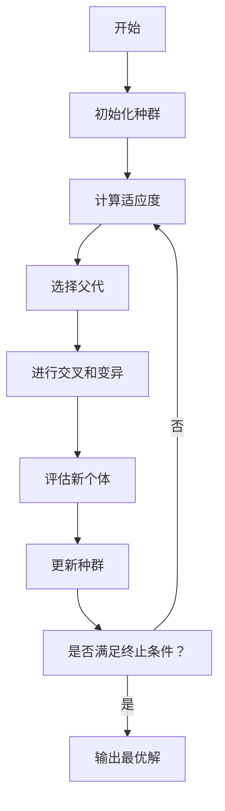
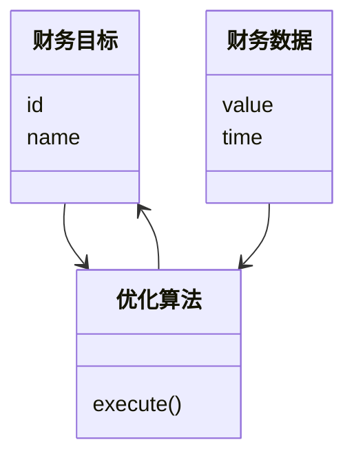

                 


# AI驱动的企业财务战略多目标优化系统

> 关键词：AI, 企业财务, 多目标优化, 算法, 系统架构, 项目实战

> 摘要：本文将深入探讨如何利用人工智能技术驱动企业财务战略的多目标优化。通过系统化的分析与设计，结合实际项目案例，详细阐述AI在企业财务优化中的应用原理、算法实现、系统架构及最佳实践。旨在为企业财务管理人员和技术开发者提供一套完整的解决方案，帮助他们在复杂的商业环境中实现财务目标的最优平衡。

---

## 第一部分：AI驱动的企业财务战略多目标优化系统概述

### 第1章：问题背景与目标

#### 1.1 问题背景

随着企业规模的不断扩大和市场竞争的日益激烈，传统的财务管理模式已经难以满足现代企业的复杂需求。企业财务战略的制定和执行往往涉及多个目标，例如成本最小化、利润最大化、风险控制等，这些目标之间常常存在冲突，需要通过优化算法找到最优平衡点。

人工智能（AI）技术的快速发展为企业财务管理带来了新的可能性。通过AI技术，企业可以更高效地处理大量数据，快速迭代优化方案，并在多目标之间找到最优解。然而，AI驱动的财务优化系统需要解决以下关键问题：

1. **多目标优化的复杂性**：如何在多个相互冲突的目标之间找到最优解？
2. **数据的多样性与实时性**：如何处理不同类型、不同时间粒度的财务数据？
3. **系统的可解释性与可扩展性**：如何确保AI模型的决策过程透明且易于扩展？

#### 1.2 问题描述

企业财务战略的多目标优化问题可以归结为一个复杂的数学优化问题。假设我们有以下目标：

- 最小化成本（Cost Minimization）
- 最大化利润（Profit Maximization）
- 控制风险（Risk Control）

这些目标之间可能存在冲突，例如，降低成本可能会增加风险，而追求利润可能会导致成本上升。传统的优化方法往往难以在这些目标之间找到平衡，而AI技术可以通过机器学习算法和多目标优化算法（如NSGA-II）来解决这一问题。

#### 1.3 问题解决

AI驱动的多目标优化系统通过以下方式解决上述问题：

1. **数据采集与预处理**：从企业财务系统中采集相关数据，并进行清洗和预处理。
2. **模型构建**：基于机器学习算法构建预测模型，并结合多目标优化算法进行优化。
3. **决策支持**：为企业提供最优的财务策略建议，并通过可视化界面展示优化结果。

#### 1.4 边界与外延

- **边界**：AI驱动的财务优化系统仅关注财务相关的目标，不涉及企业的其他业务领域。
- **外延**：通过优化财务目标，间接影响企业的整体绩效，例如提高资金利用率、降低运营成本等。

---

### 第2章：核心概念与联系

#### 2.1 核心概念原理

多目标优化的核心思想是通过优化算法在多个目标之间找到平衡点，即找到帕累托最优解。AI技术通过机器学习算法对财务数据进行建模和预测，并结合优化算法生成最优策略。

#### 2.2 核心概念对比表

| **传统财务优化** | **AI驱动财务优化** |
|-------------------|---------------------|
| 单目标优化为主    | 多目标优化为主     |
| 依赖人工经验       | 依赖算法自动优化    |
| 计算效率低         | 计算效率高           |

#### 2.3 实体关系图

```mermaid
erd
    title 实体关系图
    系统边界
    实体1：财务目标
    实体2：优化算法
    实体3：财务数据
    实体4：决策结果
    关系：财务目标 -> 优化算法
    关系：财务数据 -> 优化算法
    关系：优化算法 -> 决策结果
```

---

## 第二部分：算法原理与实现

### 第3章：多目标优化算法原理

#### 3.1 算法原理讲解

多目标优化问题可以表示为以下数学模型：

$$ \text{minimize } f_1(x), f_2(x), \dots, f_n(x) $$
$$ \text{subject to } g_1(x) \leq 0, \dots, g_m(x) \leq 0 $$

其中，$x$ 是决策变量，$f_i$ 是目标函数，$g_j$ 是约束条件。

常用的多目标优化算法包括：

1. **NSGA-II**：非支配排序遗传算法，适用于大规模问题。
2. **MOEA/D**：分解多目标进化算法，适用于复杂问题。

#### 3.2 算法流程图



#### 3.3 算法实现代码

```python
import numpy as np
from sklearn.metrics import pairwise_distances

def multi_objective_optimization(X, weights):
    # 计算目标函数值
    n = X.shape[0]
    m = X.shape[1]
    Y = np.zeros(n)
    for i in range(n):
        # 假设目标函数为线性组合
        Y[i] = np.dot(X[i], weights)
    return Y

# 示例数据
X = np.array([[1, 2], [2, 3], [3, 4]])
weights = np.array([0.5, 0.5])

# 调用函数
Y = multi_objective_optimization(X, weights)
print(Y)
```

---

### 第4章：系统分析与架构设计

#### 4.1 问题场景介绍

企业财务战略优化的典型场景包括：

1. **预算分配**：如何在不同部门之间分配预算以实现最优收益？
2. **投资决策**：如何选择投资项目以最大化收益并最小化风险？
3. **成本控制**：如何在降低成本的同时保持产品质量？

#### 4.2 项目介绍

##### 4.2.1 项目目标与范围

- **目标**：开发一个基于AI的多目标优化系统，帮助企业在财务决策中实现最优平衡。
- **范围**：涵盖预算管理、投资决策、成本控制等核心领域。

##### 4.2.2 项目实施计划

1. 数据采集与预处理
2. 模型构建与训练
3. 系统集成与测试
4. 用户界面设计

#### 4.3 系统功能设计

##### 4.3.1 领域模型



#### 4.4 系统架构设计

##### 4.4.1 系统架构


#### 4.5 系统接口设计

##### 4.5.1 接口定义

- **输入接口**：财务数据、目标权重
- **输出接口**：优化结果、决策建议

##### 4.5.2 接口实现

```python
class FinancialSystem:
    def __init__(self, data, weights):
        self.data = data
        self.weights = weights

    def optimize(self):
        # 调用优化算法
        pass

    def get_recommendation(self):
        # 返回决策建议
        pass
```

---

## 第三部分：项目实战与最佳实践

### 第5章：项目实战

#### 5.1 环境安装

- **Python 3.8+**
- **库的安装**：`numpy`, `pandas`, `scikit-learn`

#### 5.2 系统核心实现

##### 5.2.1 数据预处理

```python
import pandas as pd

# 示例数据
data = {
    '收入': [100, 200, 300],
    '成本': [50, 100, 150],
    '利润': [50, 100, 150]
}
df = pd.DataFrame(data)
```

##### 5.2.2 模型训练与优化

```python
from sklearn.linear_model import LinearRegression

model = LinearRegression()
model.fit(df[['收入', '成本']], df['利润'])
```

#### 5.3 代码应用与分析

##### 5.3.1 代码解读

```python
# 训练好的模型
print(model.coef_)
```

##### 5.3.2 案例分析

假设企业计划调整收入和成本策略，模型可以预测利润的变化：

```python
new_data = {
    '收入': [150],
    '成本': [75]
}
new_df = pd.DataFrame(new_data)
prediction = model.predict(new_df)
print(prediction)
```

#### 5.4 项目小结

通过AI驱动的多目标优化系统，企业可以在复杂财务环境中快速找到最优解，显著提升财务效率和决策质量。

---

## 第四部分：总结与展望

### 第6章：总结与展望

#### 6.1 最佳实践 tips

1. **数据质量**：确保数据的准确性和完整性。
2. **模型可解释性**：选择易于解释的算法，避免“黑箱”模型。
3. **系统集成**：确保AI系统与企业现有系统无缝集成。

#### 6.2 小结

本文详细阐述了AI驱动的企业财务战略多目标优化系统的背景、核心概念、算法实现、系统架构及项目实战。通过系统的分析与设计，为企业财务管理人员和技术开发者提供了一套完整的解决方案。

#### 6.3 展望

未来，随着AI技术的不断发展，企业财务优化系统将更加智能化和自动化。结合区块链、边缘计算等新技术，AI驱动的财务优化系统将为企业带来更大的价值。

---

以上是《AI驱动的企业财务战略多目标优化系统》的技术博客文章的完整内容，涵盖了从背景介绍到项目实战的各个方面，确保逻辑清晰、内容详实。

