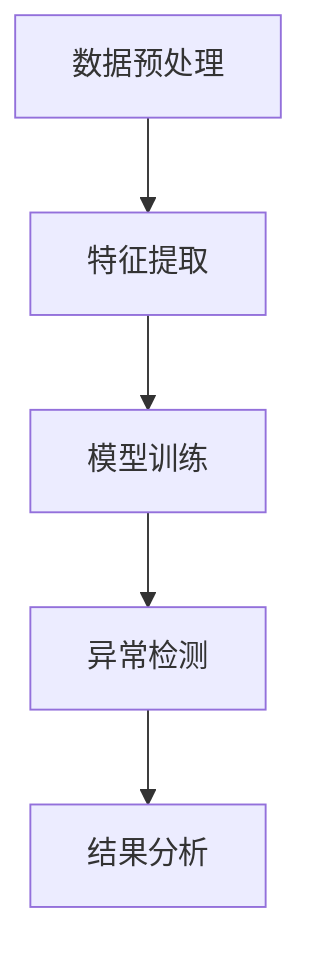
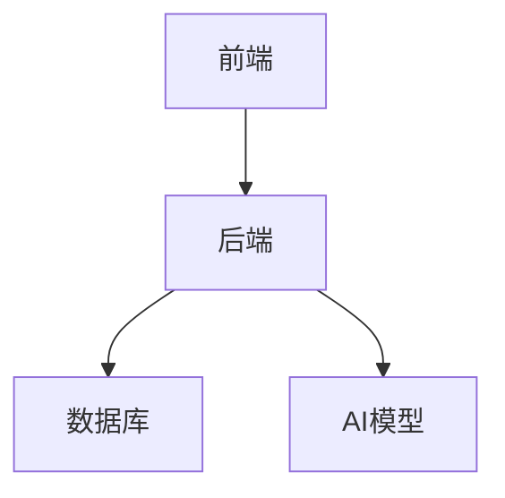
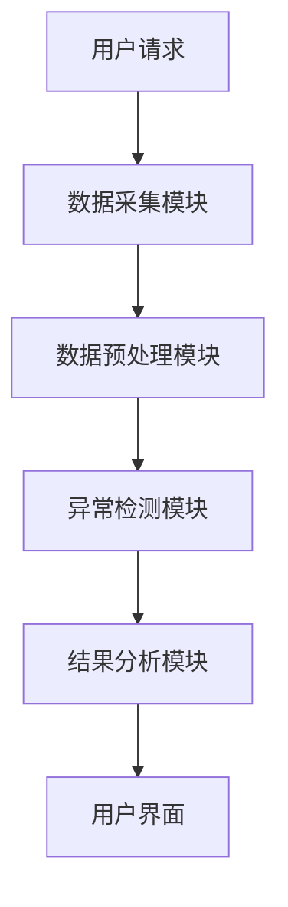
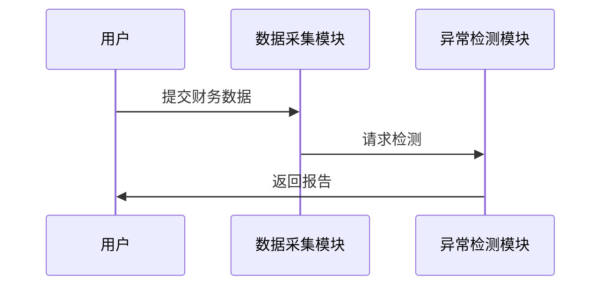

                 


# AI驱动的企业财务报表异常模式识别系统

## 关键词：
- 人工智能（AI）
- 财务报表
- 异常模式识别
- 系统架构设计
- 项目实战

## 摘要：
本文详细探讨了如何利用人工智能技术，特别是机器学习和深度学习，来识别企业财务报表中的异常模式。首先，我们介绍了财务报表异常识别的重要性及其应用场景，然后从技术原理的角度分析了基于AI的异常检测算法，包括聚类分析和神经网络等方法。接下来，我们详细设计了系统的架构，包括数据采集、预处理、异常检测和结果分析模块，并通过Mermaid图展示了系统的整体结构。最后，我们通过实际案例展示了系统的实现过程，并总结了最佳实践和未来的发展方向。

---

# 第1章: 企业财务报表异常模式识别的背景与挑战

## 1.1 问题背景介绍
### 1.1.1 企业财务报表的重要性
企业财务报表是反映企业财务状况、经营成果和现金流量的重要文件，是投资者、债权人和管理层决策的重要依据。

### 1.1.2 财务报表异常模式的定义
财务报表异常模式是指在财务数据中出现的异常值或模式，可能是由于错误记录、欺诈行为或特殊业务活动导致的。

### 1.1.3 异常模式识别的现实意义
- 提高财务数据的准确性
- 预防财务欺诈
- 支持企业决策

## 1.2 问题描述与目标
### 1.2.1 异常模式识别的核心问题
如何从大量的财务数据中发现隐藏的异常模式。

### 1.2.2 识别系统的建设目标
构建一个基于AI的财务报表异常模式识别系统，能够自动发现并预警财务数据中的异常。

### 1.2.3 边界与外延
- 仅关注财务数据，不涉及业务逻辑
- 不处理非财务数据

## 1.3 问题解决思路
### 1.3.1 数据驱动的解决方案
通过分析历史财务数据，训练模型识别异常模式。

### 1.3.2 AI技术在异常识别中的作用
利用机器学习和深度学习算法，提高异常检测的准确性和效率。

### 1.3.3 系统实现的关键步骤
- 数据采集
- 数据预处理
- 模型训练
- 异常检测
- 结果分析

## 1.4 核心概念与联系
### 1.4.1 核心概念原理
使用Mermaid图展示实体关系。

```mermaid
erDiagram
    customer[客户] {
        id : integer
        name : string
        email : string
    }
    transaction[交易] {
        id : integer
        amount : decimal
        date : date
        customer_id : integer
    }
   异常[异常记录]{
        id : integer
        transaction_id : integer
        type : string
        score : decimal
    }
    customer --> transaction : 发起了
    transaction --> 异常 : 导致
```

### 1.4.2 概念属性特征对比表格
| 概念 | 属性 | 特征 |
|------|------|------|
| 数据 | 类型 | 数值型数据 |
| 异常 | 检测 | 聚类分析、神经网络 |

### 1.4.3 ER实体关系图架构
如上图所示，客户发起交易，交易可能导致异常记录。

---

# 第2章: AI驱动的财务异常模式识别原理

## 2.1 算法原理讲解
### 2.1.1 基于聚类分析的异常检测
聚类分析通过将数据分成簇，识别偏离簇中心的异常点。

### 2.1.2 基于神经网络的模式识别
神经网络通过学习数据的特征，识别复杂的异常模式。

### 2.1.3 异常检测的数学模型



## 2.2 数学模型与公式
### 2.2.1 聚类分析公式
$$
\text{距离} = \sqrt{(x_i - x_j)^2 + (y_i - y_j)^2}
$$

### 2.2.2 神经网络模型
$$
y = \sigma(wx + b)
$$
其中，$\sigma$ 是激活函数，$w$ 是权重，$x$ 是输入，$b$ 是偏置。

### 2.2.3 异常评分公式
$$
\text{异常评分} = 1 - \frac{\text{最大似然}}{\text{平均似然}}
$$

## 2.3 算法实现与代码示例
### 2.3.1 聚类算法实现
```python
from sklearn.cluster import KMeans
from sklearn.preprocessing import StandardScaler

# 数据预处理
scaler = StandardScaler()
X_scaled = scaler.fit_transform(X)

# 聚类模型
kmeans = KMeans(n_clusters=2)
kmeans.fit(X_scaled)
```

### 2.3.2 神经网络模型训练
```python
import tensorflow as tf
from tensorflow.keras import layers

model = tf.keras.Sequential([
    layers.Dense(64, activation='relu'),
    layers.Dense(1, activation='sigmoid')
])

model.compile(optimizer='adam', loss='binary_crossentropy', metrics=['accuracy'])
model.fit(X_train, y_train, epochs=10, batch_size=32)
```

### 2.3.3 异常检测代码示例
```python
def detect_anomaly(data):
    # 使用聚类模型预测异常
    predict = kmeans.predict(data_scaled)
    # 计算异常评分
    scores = [1 - kmeans.score(data_scaled[i]) for i in range(len(data_scaled))]
    return scores
```

---

# 第3章: 系统分析与架构设计

## 3.1 系统功能设计
### 3.1.1 数据采集模块
从企业数据库中采集财务数据。

### 3.1.2 数据预处理模块
清洗数据，处理缺失值和异常值。

### 3.1.3 异常检测模块
使用AI算法检测异常模式。

### 3.1.4 结果分析模块
对检测结果进行分析，生成报告。

## 3.2 系统架构设计
### 3.2.1 分层架构图


### 3.2.2 模块交互流程图


### 3.2.3 系统接口设计
- 数据接口：REST API
- 模型接口：TensorFlow Serving

## 3.3 系统交互设计
### 3.3.1 用户界面设计
- 输入：财务数据
- 输出：异常报告

### 3.3.2 系统调用流程


---

# 第4章: 项目实战与案例分析

## 4.1 环境安装与配置
### 4.1.1 开发环境搭建
- Python 3.8+
- Jupyter Notebook
- TensorFlow 2.0+

### 4.1.2 数据集准备
从企业财务数据库中获取数据。

### 4.1.3 工具安装
安装必要的库，如scikit-learn、TensorFlow等。

## 4.2 系统核心实现
### 4.2.1 数据预处理代码
```python
import pandas as pd
from sklearn.impute import SimpleImputer

# 填充缺失值
imputer = SimpleImputer(missing_values=np.nan, strategy='mean')
X_imputed = imputer.fit_transform(df)
```

### 4.2.2 模型训练代码
```python
model.compile(optimizer='adam', loss='binary_crossentropy', metrics=['accuracy'])
model.fit(X_train, y_train, epochs=10, batch_size=32)
```

### 4.2.3 异常检测代码
```python
def detect_anomaly(data):
    predict = kmeans.predict(data_scaled)
    scores = [1 - kmeans.score(data_scaled[i]) for i in range(len(data_scaled))]
    return scores
```

## 4.3 案例分析
### 4.3.1 数据分析
分析某企业的财务数据，发现销售额异常。

### 4.3.2 检测结果
系统检测到销售额异常，生成报告。

### 4.3.3 结果解读
销售额异常可能是由于欺诈行为或业务调整导致的。

## 4.4 项目总结
### 4.4.1 项目成果
成功实现了一个基于AI的财务报表异常模式识别系统。

### 4.4.2 经验总结
- 数据预处理是关键
- 模型选择影响检测效果

---

# 第5章: 最佳实践与未来展望

## 5.1 最佳实践
### 5.1.1 系统优化建议
- 使用分布式计算提高效率
- 定期更新模型

### 5.1.2 使用注意事项
- 确保数据隐私
- 定期验证模型准确性

## 5.2 小结
AI技术在财务报表异常模式识别中的应用前景广阔，能够显著提高财务管理的效率和准确性。

## 5.3 未来展望
随着AI技术的发展，财务异常模式识别将更加智能化和自动化。

---

# 总结
本文全面介绍了AI驱动的企业财务报表异常模式识别系统的构建过程，从理论到实践，为读者提供了一个完整的解决方案。通过实际案例分析和系统设计，展示了AI技术在财务管理中的强大潜力。

