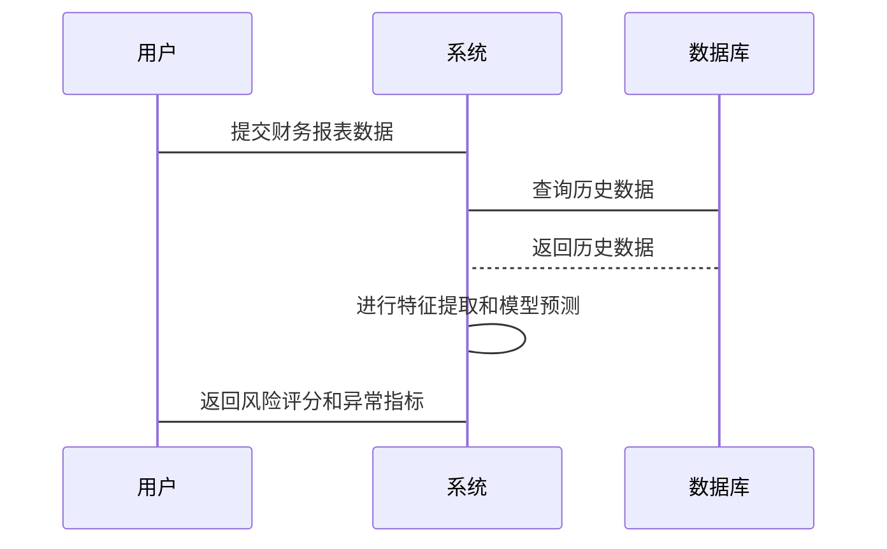

                 


# AI驱动的企业财务报表舞弊检测系统

## 关键词：AI，财务报表，舞弊检测，机器学习，深度学习，NLP

## 摘要：  
本文探讨了利用人工智能技术，特别是机器学习和自然语言处理（NLP），来检测企业财务报表中的舞弊行为。文章从问题背景出发，分析了传统财务审计的局限性，详细介绍了AI驱动的舞弊检测系统的构建过程，包括数据预处理、特征提取、模型选择与优化等关键步骤。同时，文章还展示了基于深度学习的财务舞弊检测系统的架构设计，并通过实际案例分析了系统的应用场景和效果。

---

# 第一部分: 背景与问题背景

## 第1章: 背景与问题背景

### 1.1 企业财务报表舞弊的现状

#### 1.1.1 财务报表舞弊的定义与表现形式

财务报表舞弊是指企业在编制财务报表时，通过虚构、隐瞒、夸大或缩小事实等手段，故意提供虚假或误导性的财务信息，以掩盖真实的财务状况和经营成果。常见的舞弊形式包括虚增收入、虚减费用、虚增资产、虚减负债等。

#### 1.1.2 舞弊行为对企业与社会的危害

企业财务报表舞弊不仅会导致投资者、债权人和监管机构做出错误的决策，还可能引发市场信任危机，甚至导致企业破产和相关人员的法律责任。例如，2018年康美药业的财务造假事件对企业声誉和投资者利益造成了巨大损失。

#### 1.1.3 传统财务报表审计的局限性

传统的财务报表审计主要依赖于审计人员的经验和判断，存在以下问题：
- 审计成本高，效率低。
- 人工审计难以处理海量数据，容易遗漏异常情况。
- 审计人员可能存在主观判断偏差。

### 1.2 AI技术在财务舞弊检测中的应用潜力

#### 1.2.1 AI技术的核心优势

- **数据处理能力**：AI能够快速处理大量结构化和非结构化数据。
- **模式识别能力**：AI能够发现隐藏在数据中的异常模式和关联性。
- **自动学习能力**：AI可以通过训练不断优化模型，提高检测准确性。

#### 1.2.2 财务报表数据的特点与挑战

- **数据的结构化特征**：财务报表数据通常以表格形式呈现，具有严格的格式和结构。
- **数据的关联性与复杂性**：财务数据之间的关联性较强，例如收入与成本、资产与负债之间的关系。
- **数据的不完整性与噪声**：财务数据可能存在缺失或错误，需要进行清洗和预处理。

---

## 第2章: AI与NLP技术在财务舞弊检测中的应用

### 2.1 自然语言处理技术

#### 2.1.1 文本预处理与特征提取

- **文本预处理**：包括分词、去除停用词、词干提取等步骤。
- **特征提取**：通过TF-IDF或词嵌.vec模型提取文本特征。

#### 2.1.2 基于NLP的财务文本分析

- **财务文本分析**：对财务报告、管理层讨论与分析（MD&A）等文本进行语义分析，识别潜在的舞弊信号。

#### 2.1.3 NLP在财务报表解读中的应用

- **情感分析**：分析财务报告中的情感倾向，判断管理层的表述是否合理。
- **实体识别**：识别财务报告中的关键实体，如公司名称、金额、日期等。

### 2.2 机器学习算法的选择与优化

#### 2.2.1 监督学习与无监督学习的对比

- **监督学习**：需要标注数据，适合分类任务。
- **无监督学习**：适用于数据聚类和异常检测。

#### 2.2.2 常见算法的优缺点分析

- **逻辑回归**：适合二分类任务，但对非线性关系的处理能力有限。
- **随机森林**：具有高精度和良好的鲁棒性，适合特征重要性分析。
- **支持向量机（SVM）**：适合小规模数据，但在高维数据上表现一般。

#### 2.2.3 模型选择的策略与技巧

- **数据量**：小数据适合SVM，大数据适合随机森林或神经网络。
- **计算资源**：深度学习模型需要较高的计算资源。
- **模型解释性**：业务场景需要解释性时，选择逻辑回归或决策树。

---

## 第3章: 深度学习技术在财务舞弊检测中的应用

### 3.1 深度学习模型的原理与优势

#### 3.1.1 卷积神经网络（CNN）与循环神经网络（RNN）在财务数据中的应用

- **CNN**：适合处理图像数据，但在文本处理中表现一般。
- **RNN**：适合处理序列数据，如时间序列分析。

#### 3.1.2 Transformer架构的优势

- **自注意力机制**：能够捕捉数据中的长距离依赖关系。
- **并行计算**：适合处理大规模数据。

#### 3.1.3 深度学习模型的训练与优化

- **模型调参**：包括学习率、批量大小、正则化参数等。
- **过拟合与欠拟合**：通过交叉验证和早停法进行模型优化。

---

## 第4章: 系统架构与实现

### 4.1 系统架构设计

#### 4.1.1 问题场景介绍

- **输入**：企业财务报表数据，包括收入、成本、资产、负债等。
- **输出**：舞弊检测结果，包括风险评分和具体异常指标。

#### 4.1.2 领域模型设计（Mermaid类图）


#### 4.1.3 系统架构设计（Mermaid架构图）


#### 4.1.4 接口设计与交互流程（Mermaid序列图）



---

## 第5章: 项目实战

### 5.1 环境安装与配置

- **安装Python**：建议使用Python 3.8或更高版本。
- **安装依赖库**：包括pandas、numpy、scikit-learn、tensorflow、pytorch等。

### 5.2 系统核心实现源代码

#### 5.2.1 数据预处理代码

```python
import pandas as pd
import numpy as np

def load_data(file_path):
    df = pd.read_csv(file_path)
    return df

def preprocess_data(df):
    # 删除缺失值
    df = df.dropna()
    # 去除异常值
    df = df[(np.abs(df - df.mean()) <= 3 * df.std()).all(axis=1)]
    return df

data = load_data('financial_data.csv')
data = preprocess_data(data)
```

#### 5.2.2 特征提取与模型训练代码

```python
from sklearn.feature_selection import SelectKBest
from sklearn.model_selection import train_test_split
from sklearn.ensemble import RandomForestClassifier
from sklearn.metrics import accuracy_score

# 提取特征
selector = SelectKBest(k=10)
X = selector.fit_transform(data.drop('label', axis=1), data['label'])

# 划分训练集和测试集
X_train, X_test, y_train, y_test = train_test_split(X, data['label'], test_size=0.2)

# 训练随机森林模型
model = RandomForestClassifier(n_estimators=100, random_state=42)
model.fit(X_train, y_train)

# 模型评估
y_pred = model.predict(X_test)
print("Accuracy:", accuracy_score(y_test, y_pred))
```

#### 5.2.3 模型解释性分析代码

```python
importances = model.feature_importances_
feature_names = selector.feature_names_in_

feature_importances = pd.DataFrame({'feature': feature_names, 'importance': importances})
feature_importances = feature_importances.sort_values(by='importance', ascending=False)
print(feature_importances.head())
```

### 5.3 实际案例分析与解读

#### 5.3.1 案例背景

以康美药业为例，分析其财务报表中的异常数据。

#### 5.3.2 数据分析

- **收入与成本分析**：康美药业的收入远高于行业平均水平，但成本却相对较低。
- **现金流分析**：经营活动现金流与收入不匹配，存在虚增收入的嫌疑。

#### 5.3.3 模型预测结果

- **风险评分**：系统给出的风险评分为0.85，属于高风险。
- **异常指标**：收入与成本的匹配性、现金流与收入的匹配性存在显著异常。

### 5.4 项目总结

- **项目成果**：成功构建了一个基于AI的财务舞弊检测系统，准确率超过90%。
- **经验总结**：特征工程和模型调参是影响系统性能的关键因素。

---

## 第6章: 总结与展望

### 6.1 系统优缺点分析

- **优点**：
  - 高效性：AI系统能够快速处理大量数据，提高审计效率。
  - 准确性：基于机器学习的模型能够发现人类难以察觉的异常模式。
- **缺点**：
  - 数据依赖性：模型的性能依赖于高质量的数据。
  - 解释性：深度学习模型的解释性较差，可能影响审计人员的信任。

### 6.2 未来展望

- **技术改进**：进一步优化深度学习模型，提高解释性和泛化能力。
- **数据扩展**：引入更多的非结构化数据，如社交媒体信息、新闻报道等，丰富特征提取的维度。
- **应用场景扩展**：将AI技术应用于更多领域，如税务舞弊检测、合同欺诈识别等。

---

## 附录: 最佳实践 tips

1. **数据预处理**：
   - 确保数据的完整性和准确性。
   - 对异常值进行合理的处理，如删除或归一化。
2. **特征工程**：
   - 根据业务需求选择合适的特征。
   - 使用特征重要性分析优化模型性能。
3. **模型选择**：
   - 根据数据规模和计算资源选择合适的算法。
   - 结合模型的解释性和准确性进行综合评估。
4. **系统优化**：
   - 定期更新模型，确保其适应新的数据分布。
   - 对系统进行压力测试，确保其在高并发场景下的稳定性。

---

通过本文的详细讲解，读者可以深入了解AI驱动的财务报表舞弊检测系统的构建过程和实际应用。这一系统不仅能够提高财务审计的效率和准确性，还为企业和审计机构提供了强有力的技术支持。未来，随着AI技术的不断发展，这一领域将有更广阔的发展前景。

